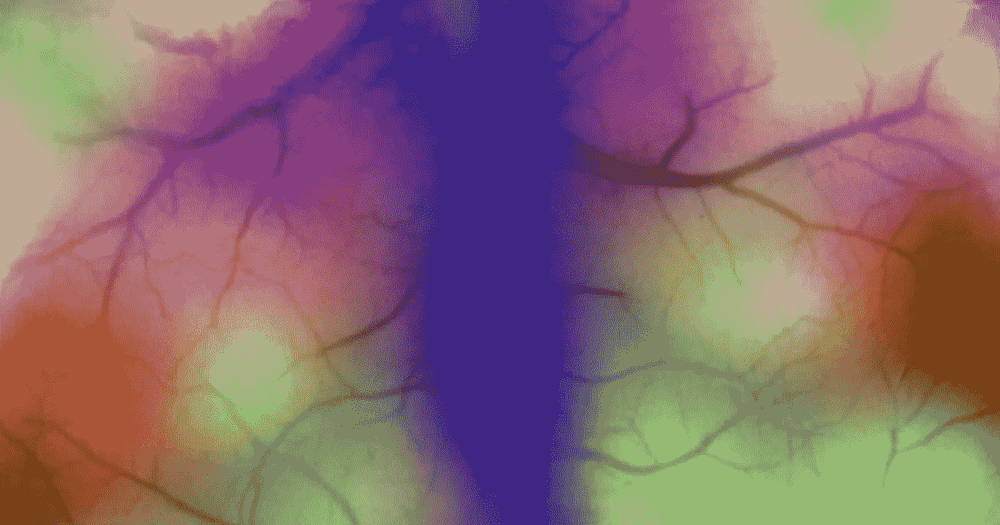

# 音乐作为精准医学:音乐能代替药物吗？

> 原文：<https://medium.com/hackernoon/music-as-precision-medicine-could-music-take-the-place-of-drugs-d6678631fd33>

研究表明，音乐可以减轻疼痛；在一项对手术后患者的特别研究中，一半的人在手术后听了一个小时的音乐，而另一半人在没有音乐的情况下接受了标准治疗。

结果令人着迷:与另一组相比，听音乐的一组只自我注射了⅓吗啡。这些结果已经在许多研究中得到重复，鼓励研究人员和音乐家继续探索声音和健康之间的关系。

我在与马克·阿赫蒂萨里的交谈中了解到这一点，他是同步项目的首席执行官和联合创始人，该项目由科学家、音乐家、技术专家和病人组成，致力于开发功能性的 T2 音乐。这包括回应每个个体身体的声音，其目标是实现某种存在状态，并作为精确药物。

> ***马尔科认为，音乐、电子游戏或灯光等非药物疗法将在十年时间内完全或部分取代药物疗法。***

数据和人工智能的力量将在这方面发挥作用，使我们的设备能够了解我们的需求和个人生理状况，并实施适当的“治疗”以达到特定的结果。该小组于今年 3 月推出了 Unwind.ai 一项通过结合关于你的心率、机器学习和人类音乐才能的数据来帮助放松的实验。

Marko 在新的播客中谈到了这个项目和创意产业中人机合作的[未来](https://hackernoon.com/tagged/future)，你可以在这里收听:

**在我的每周简讯中关注最紧迫的技术问题。** [**报名指数查看此处**](http://bit.ly/exponentialview) **。我们对** [**推特**](http://www.twitter.com/exponentialview)**[**脸书**](http://facebook.com/exponentialview)**[**领英**](http://www.linkedin.com/exponential-view) **也是如此！******

************************

> ****[黑客中午](http://bit.ly/Hackernoon)是黑客如何开始他们的下午。我们是 [@AMI](http://bit.ly/atAMIatAMI) 家庭的一员。我们现在[接受投稿](http://bit.ly/hackernoonsubmission)，并乐意[讨论广告&赞助](mailto:partners@amipublications.com)机会。****
> 
> ****如果你喜欢这个故事，我们推荐你阅读我们的[最新科技故事](http://bit.ly/hackernoonlatestt)和[趋势科技故事](https://hackernoon.com/trending)。直到下一次，不要把世界的现实想当然！****

********