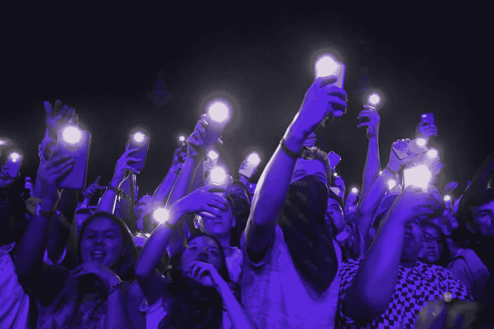

# 音乐节依靠科技来构建“完美”的阵容

> 原文：<https://medium.com/hackernoon/music-festivals-are-leaning-on-tech-to-build-the-perfect-lineups-29c6e0c73da4>

随着科切拉 2017 的第一和第二个周末载入史册，[音乐节季](https://goo.gl/w8fLgi)正式开始。在过去的十年里，这些多日体验经历了令人难以置信的增长，这在很大程度上是因为千禧一代更喜欢将他们辛苦赚来的钱花在体验上。 [Billboard 估计每年有 3200 万人在美国至少参加一场活动。这些参与者中大约有一半是千禧一代，你可以打赌他们严重依赖他们的智能手机来浏览节日。根据哈里斯互动公司(Harris Interactive)的一项研究，31%的千禧一代报告称，他们在节日期间有一半以上的时间都在使用手机，只有 15%的人说他们在那里时从来不碰手机。](https://www.eventbrite.com/blog/4-statistics-defining-the-2016-music-festival-season-ds00/)

# 技术渗透

音乐会组织者、推广者和专注于活动的科技公司利用了活动上座率上升和移动技术扩散的平行趋势，推出了衡量和货币化观众的新方法。2017 年几乎每个节日都将有一个官方应用程序，供与会者查看阵容，个性化他们的日程安排，访问地图等。随着超过一半的大型(超过 100，000 名与会者)节日的所有与会者下载这些应用程序，这是一个大数据游戏的巨大机会，该领域的一些创新者，如 [Aloompa，已经在利用](/aloompa-insights/aloompa-insight-leveraging-festival-app-data-to-understand-artist-demand-e13dbbc8eaf0)。组织者正在使用不同形式的技术从与会者那里收集有价值的数据，这些数据可用于改善粉丝体验，并为未来的活动做出数据驱动的决策。

# 它是如何工作的

## 该应用程序

数据收集的主要方法是官方节日应用程序。不要试图在节日期间抓住一张纸或记住特定的时间和阶段，而是鼓励用户下载该应用程序，作为他们访问的免费补充。标准节日应用程序的核心功能集允许用户浏览时间表，选择他们最喜欢的艺术家，以创建个性化的阵容，并查看场地地图。在某些情况下，节日应用程序允许用户通过流媒体服务集成建立播放列表，查找吃喝的地方，并在社交网络上与其他用户互动。有些甚至具有 VR/AR 功能，例如官方的 Coachella 应用程序，该应用程序在 2016 年发出的售票箱中包含了谷歌纸板浏览器。当与会者使用这些功能时，特别是日程生成器，应用程序会收集用户操作的粒度数据。

## 灯塔

当用户下载应用程序并启用正确的权限时，他们就可以与节日场地周围战略性放置的蓝牙低能耗(BLE)信标进行交互。Beacons 可以连接到应用程序，收集关于节日期间人们活动的非常准确的数据，包括任何一场演出有多少人。信标还可以用于向特定区域的用户推送微目标推送通知，以宣布促销活动。Coachella 应用程序允许用户链接他们的 Spotify 帐户，通过记住他们互动的信标来建立基于他们访问的艺术家的播放列表，以记住他们在活动中的时间。

## RFID 腕带

腕带几乎是无处不在的门票替代品，多年来在所有重大节日中都是如此。它们有助于加快登记过程，因为不需要人工扫描每个走进来的人。通常，用户被鼓励将腕带连接到应用程序，然后连接到他们的脸书账户，这允许组织者建立参与者的详细资料，他们的音乐品味，以及他们在音乐节上的旅程。最近的一项创新将无现金支付添加到 RFID 芯片中，这使得购买 10 美元的啤酒更加容易，而不会感觉到从钱包中取出现金的刺痛，从而增加了收入。

# 影响

显然，在音乐节上，大量关于我们的数据正在被收集，除非你在被允许进入后切断腕带(这绝不是一个好主意)，否则几乎不可能避免。所以问题是:节日如何利用这些信息，这对参与者来说是一件好事吗？

对于组织者来说，最重要的数据点是从 app schedule builder 和 beacons 中收集的。当人们在应用程序中建立他们的时间表时，它会显示哪些艺术家最受欢迎，以及人们最想看到谁。一些应用程序甚至实现了一个排行榜，显示添加最多的艺术家。时间表生成器显示人们希望 T1 去看谁，从信标和地理围栏区域收集的数据显示哪些艺术家的粉丝 T2 实际上去看了 T3，甚至可以显示他们在一场演出上花了多少时间。这些分析还可以用来查看粉丝在整个音乐节期间的旅程，以建立某个访问者所看到的艺术家的个人资料。

这些数据有助于为未来的活动提供信息，以做出预订和安排决策。组织者可以看到单个用户可能希望看到哪些艺术家以避免日程安排冲突，以及哪些艺术家可以在不同的阶段重叠。他们可以根据更多的数据来决定向艺术家支付多少报酬，因为在独奏音乐会中有价值的乐队可能在节日环境中不太受欢迎。这些数据点可以提供不同于传统指标(如专辑销量、歌曲流、社交聊天甚至音乐会上座率)的节日习惯视角。

虽然这些数据在很大程度上是在参与者没有完全理解其范围的情况下收集的，但可以说各方都受益。在技术供应商向组织者提供统计数据之前，所有数据都是匿名和去识别的，用户数据不会出售给第三方用于侵入式营销策略。数据收集的主要目的是增强粉丝的节日体验，即使有人在兼职赚钱。

# 结论

随着音乐节越来越受欢迎，毫无疑问，技术将继续产生巨大影响。从盒子上的[增强现实体验](http://vrscout.com/news/coachella-augmented-reality-welcome-app/)到演出期间的[无人机杂技](https://www.instagram.com/p/BS-fS1lF1-1/)到[多普勒实验室增强现实听觉设备](http://www.theverge.com/2016/5/10/11652086/doppler-labs-here-active-listening-earbuds-experience-coachella)，节日为新兴科技公司提供了完美的游乐场，让年轻且懂技术的观众尝试新想法，他们愿意尝试几乎任何事情。

> [黑客中午](http://bit.ly/Hackernoon)是黑客如何开始他们的下午。我们是 [@AMI](http://bit.ly/atAMIatAMI) 家庭的一员。我们现在[接受投稿](http://bit.ly/hackernoonsubmission)并乐意[讨论广告&赞助](mailto:partners@amipublications.com)机会。
> 
> 如果你喜欢这个故事，我们推荐你阅读我们的[最新科技故事](http://bit.ly/hackernoonlatestt)和[趋势科技故事](https://hackernoon.com/trending)。直到下一次，不要把世界的现实想当然！

