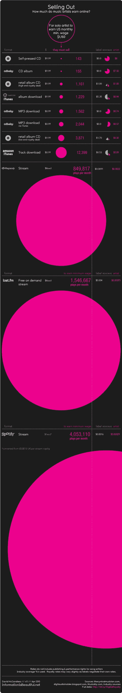

# 音乐家:一些关于流媒体和如何赚钱的信息。

> 原文：<https://medium.com/hackernoon/musicians-some-info-about-streaming-and-how-to-make-the-most-money-4468b8808672>

如今，对音乐人来说，最大的问题不一定是写一首关于什么的歌，而是试图找到一种不会让你怀疑你是否会为你的音乐付费的流媒体服务。

作为一名音乐人，我知道这个行业是如何变化的，但我们离一个可行的解决方案还有很长的路要走，这样艺术家才能从流媒体服务中获得他们应得的报酬。

为此， [Spotify](https://hackernoon.com/tagged/spotify) 被起诉没有支付他们声称不知道的版税。报道此事的《滚石》杂志([点击这里](http://www.rollingstone.com/music/news/meet-the-disruptor-trying-to-get-artists-paid-for-streaming-music-20160115))谈论流媒体服务如何为他们的歌曲支付版税，否则将面临高达 150 亿美元的赔偿。

所有这一切的最大问题是，Spotify 将音乐人的许可外包给了第三方，而第三方没有能力处理如此大量的数据。Spotify 的借口是[音乐产业](https://goo.gl/w8fLgi)没有提供足够的关于谁写了哪首歌的信息。一般来说，喜欢从他们的艺术中获得报酬的艺术家通常知道哪首歌是他们的，他们能得到多少，因为这样他们就能吃饭了。因此，这种争论似乎是无声的，无论如何，Spotify、Apple music 和其他公司需要扭转局面，或者支付即将到来的巨额账单。

一个音乐人希望从一个月的音乐流中获得的东西的分解是非常糟糕的。这张图表将其与月收入 1160 美元进行了比较，这大约是一个人在美国拿最低工资时的收入

我得到的信息是美点网的图。Spotify 再次获得最低工资所需的最多流的称号，超过 400 万个流。如果你是泰勒·斯威夫特，你会印象深刻，但如果你是其他人，就不一样了。显然，Spotify 不适合独立艺术家，因此其他选择必须成为焦点。

帕特里翁是把球完全掌握在艺术家手中的人之一。建立你的页面后，你的粉丝可以每月注册订阅，以获得你发布的最新歌曲。你也可以给他们独家交易和使用权，这取决于他们想花多少钱。

Soundcloud 也是让你的音乐进入流媒体世界的好方法。它是免费的，所以它更多的是一种推广你的音乐和发现新音乐的方式。Soundcloud 最近推出了每月 10 美元的流媒体服务，看看这是否会提高他们的销售价值将会很有趣。

所有这些都会随着时间的推移而增加，但重要的是要不断与你的观众交谈，他们会告诉你他们喜欢什么，什么适合他们。

我是

约瑟

> [黑客中午](http://bit.ly/Hackernoon)是黑客如何开始他们的下午。我们是 [@AMI](http://bit.ly/atAMIatAMI) 家庭的一员。我们现在[接受投稿](http://bit.ly/hackernoonsubmission)并乐意[讨论广告&赞助](mailto:partners@amipublications.com)机会。
> 
> 如果你喜欢这个故事，我们推荐你阅读我们的[最新科技故事](http://bit.ly/hackernoonlatestt)和[趋势科技故事](https://hackernoon.com/trending)。直到下一次，不要把世界的现实想当然！

