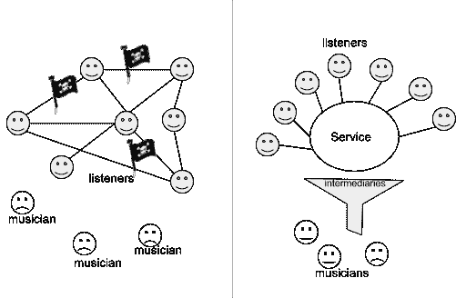
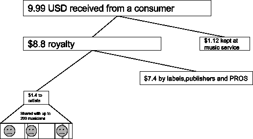
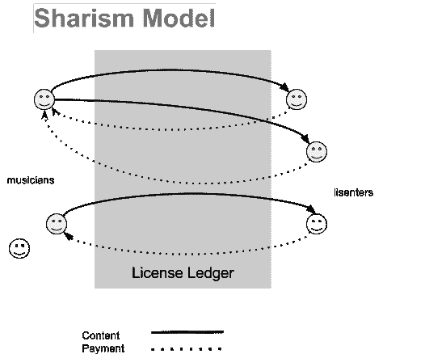
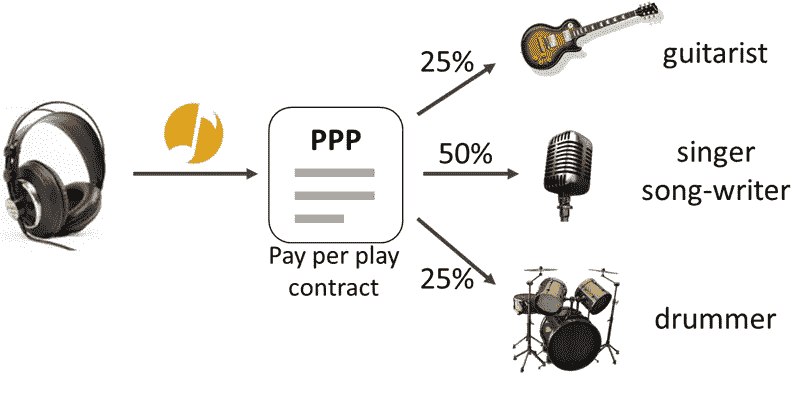

# 音乐币:免费创作，同时奖励创作者(0.8 版)

> 原文：<https://medium.com/hackernoon/musicoin-free-creations-while-rewarding-creators-2832f7d2bd33>

> **(v0.9 已经发布** [**此处**](/@musicoin/musicoin-white-paper-free-creations-while-rewarding-creators-v-0-9-b14b334a8843) **)**
> 
> **摘要**。本文描述了 Musicoin，这是一个用于音乐发布和消费的去中心化系统，它将一种尖端的加密货币结合到了一个点对点的文件共享网络中。Musicoin 允许音乐人将他们的内容作为“编码合同”直接授权给一个叫做“区块链”的分散数据库。这些合同自动收取和分配版税，并由艺术家自己控制。听众可以访问存储在点对点网络上的全球音乐目录，并根据艺术家的使用情况，直接使用数字货币向他们付款。易于使用的工具可以设计为允许听众和音乐家的无缝体验，开放的协议将允许第三方建立一个丰富的增值软件和服务的生态系统。通过提供一个直接连接音乐家和听众的分布式和高度透明的平台，Musicoin 为一个可持续、无国界和对所有利益相关者公平的音乐新时代奠定了基础。

音乐产业的数字化始于 20 世纪 80 年代，事后看来，这是不可避免的。到了 20 世纪 90 年代末，随着 Napster 的崛起，数字化正式成为一股颠覆性的力量，这也是音乐行业今天仍在努力应对的一股力量。这场斗争的核心是一个可追溯到一个多世纪前的许可、分配和推广体系。随着技术超越(在某些情况下甚至绕过)传统体系，人们越来越担心和一致认为，经过近 20 年的衰落，百年音乐产业可能会在自身的重压下崩溃。

此外，虽然向数字音乐的过渡在很大程度上给听众带来了好处，他们现在可以通过 Spotify 和 iTunes 等服务获得不断扩大的音乐目录，但对音乐家来说却很难。这个行业仍然保持着大部分的收入，而且给音乐人开支票的速度慢得令人痛苦，这使得音乐人越来越难以谋生。

然而，同样的技术进步在过去 20 年里给音乐行业带来了巨大的破坏，也给我们提供了一个重新定义音乐家和听众之间关系的绝佳机会。特别是数字货币(或“加密货币”)将允许以最小的交易成本进行近乎即时的支付。“编码合同”将允许音乐人保持对许可证的控制，而不是依赖第三方。

本文的其余部分简要概述了两个相对较新的和戏剧性的改变人们与音乐互动的方式，这两个都最终未能产生一个可持续和公平的系统。最后，给出了前进道路的详细建议。

# 两个失败的模型

Napster 是第一个被广泛采用的点对点(P2P)文件共享网络，它标志着传统音乐分发和消费方式的终结。在很多人眼里，它被视为音乐产业的刺客。在这种模式(我们称之为“种子模式”)中，内容被随意地分享到 P2P 网络上，并被其他用户下载，而没有得到音乐人的许可，也没有支付任何形式的报酬。这种模式是注定要失败的，不仅因为它违反了法律，还因为它是不可持续的，因为音乐人的利益完全消失了。

**Torrent Model** (left), where musicians are entirely disregarded. The **Subscription Model** (right), which retains all of the complexity and inefficiency of the legacy music industry, and ultimately pays musicians a small fraction of total revenue.

最近，“订阅模式”变得流行起来(见图 1)。在这种模式下，服务基于集中目录提供流媒体内容，并向用户收取一定水平的订阅费(通常为 9.99 美元/月)，这通常定价过高。反过来，这些流媒体服务(如 Spotify)向唱片公司和出版商支付很大一部分收入来获得许可证。

这种模式是对 Torrent 模式的改进，因为收入实际上是从听众那里收取的，然而，音乐人获得的那部分收入非常少，因为有太多的中间商拿走了大部分。最终，超过 80% 的特许权使用费被中间商占有。这主要是历史原因。在数字时代之前，音乐家需要这些中介来帮助他们组织、计划、录制、制作和发行他们的音乐。这催生了音乐产业中的许多代理机构，如音乐标签、专业人员、经销商、零售商、工作室、公关机构和营销机构。《数字千年版权法》(DMCA)颁布后，更多的代理机构成立了，所有这些机构都分享了收入。如果我们看看收入分配结构，我们会很惊讶我们付给音乐人的报酬是如此之少。

Figure 2\. The current industry myth on distribution

一个著名的案例是歌手詹姆斯·布朗特的抱怨，“*我每流得到 0.0004499368】”。在 Spotify 上播放 100 万次，詹姆斯·布朗特只收到 450 次！这实际上还不是最糟糕的情况，许多艺术家甚至不能讨价还价这样的比率，并支付少得多。正因如此，很多音乐人仍然无法谋生，这迫使他们只能兼职或者干脆转行。鉴于如今无处不在的技术和社交媒体，有一个问题值得一问:*所有这些组织还能增加价值吗？*如今的大多数音乐人都忙于营销自己，自己创作和录制音乐，并直接在网上分享内容。*

# 新范式

我们需要一种新的模式来重构整个过程，从创造到消费，再到补偿。我们在这里提出的模型是基于分享主义的理论，它强调分享和回报之间的紧密耦合。

Figure 3\. Sharism Model creates a closed circuit between musician and listener.

在分享主义模式中，每一次回放都代表了音乐家和听众之间的一次交流。听众向音乐家支付费用，作为交换，他被授权访问特定的作品。这种模式需要一种快速、低交易成本、跨境运作的支付机制。幸运的是，随着数字货币和区块链技术的兴起，这样的系统已经成为可能。

# 音乐币:音乐的数字货币

为了支持分享主义模式，我们创造了一种新的数字货币，专门与音乐消费挂钩，称为 Musicoin。每次播放，一个数字硬币会直接从听众的账户发送到区块链上的“编码合同”(称为“按播放付费”许可证，或 PPP 许可证)。然后，这种 PPP 许可在几秒钟内将款项分配给受益人。例如，一个乐队可以发布一个许可证，支付 50%给歌曲作者，25%给歌手，25%给吉他手。至关重要的是，资金的分配方式完全由音乐人控制，除了区块链之外，不需要任何中间人来促成支付。

用于创建、部署和维护 PPP 许可证的工具由平台提供，使用简单。事实上，音乐人一旦有了准备上传的媒体文件，整个过程大约 5 分钟就可以完成。

Illustration of the payment flow, in which a user sends payment along with a request to play a particular work and in return is granted access. Specifically, granting access means providing a key that can decrypt an encrypted audio file that is stored on a distributed file system.

# 让音乐成为现实

我们认识到，提出这样一个系统是相当简单的，而实际构建、测试和改进它是另一回事。我们也认识到，新的区块链项目往往承诺过多，筹集 ICO 资金，并向创作者分配大量资金，但却无法产生任何切实的成果。因此，我们采取了以下步骤来赢得信任:

1.  将已经建立了提议系统的全功能实现，目前正在测试 alpha 版本。如果音乐家和用户愿意贡献他们的反馈或努力，可以根据请求向他们发出邀请。
2.  我们**不会在区块链起源时分配任何硬币**给任何人。这意味着将不会有所谓的 ICO(“初始硬币发行”)，也不会有硬币被分配给创造者。
3.  我们将**尽可能降低音乐家和听众的准入门槛**，以避免成为又一个只与其他区块链爱好者互动的区块链爱好者回音室的风险。我们的目标是从第一天起就对普通大众有用并容易接近。

为了这些目的，将会有一个全球音乐目录，使音乐家能够创建和发布他们的许可证，并从它自己的帐户中资助播放(只要我们能够足够快地挖掘它们)，这样听众就可以测试这个系统，而不需要购买硬币。

# 开放的机会

Musicoin 也为更大的利益相关群体提供了一个很好的机会。大的厂牌可能要适应，但他们可以从这个平台中受益，因为整个市场规模可以放大，他们可以工作一次，收获永远和全世界。他们可以把他们有版权的内容放到区块链的音乐上，继续享受升级的消费。

有了 Musicoin，今天的流媒体音乐服务不需要处理忙乱的纸质工作来准备报告和支付音乐人，相反，所有的信息都是开放的，世界上任何人都可以立即访问。Musicoin 是为音乐家和听众设计的，但最终将惠及整个行业——甚至是传统播放器。

营销人员、推广人员、DJ 和社会管理者也可以从这个系统中受益，它可以为听众创造新的价值，从而为他们带来回报。

创业公司可以在 Musicoin 系统上建立更多的创新技术和服务，以满足网络的多样化需求；硬件制造商可以创造有形和可穿戴的智能设备，以延续音乐设备在我们文化遗产中的荣耀。想象一下，你的家庭扬声器有一天可以聪明得多，不仅可以在你不在家的时候缓存音乐，还可以在你演奏的时候帮你挖掘硬币支付给音乐家，这是数字化世界中最美好的事情。

区块链 Musicoin 的大规模开放数据也可以带来更智能的音乐推荐。基于 Musicoin 系统，人工智能可以发挥越来越重要的作用，帮助用户根据他们的口味发现音乐，这是机器学习的。它可以非常个性化，因为每一次播放历史都将成为下一次更准确推荐的基础。这是人工智能研究人员的金矿。

# 结论

“有人正在赚取巨额利润，”一位在网上分享版税支票的音乐家 Krukowski 说，“但不是音乐家。”这是过去许多音乐人的抱怨。今天，有了音乐币，我们一定可以改变这一切。音乐人会赚钱，100%的收入会进自己的钱包。

在这个动荡的时代，我们也可以期待范式的转变。变革依赖于每个人的参与。我们呼吁所有的音乐家和他们的欣赏者加入这个伟大的转变，让音乐对我们的生活更有意义！

*   加入我们的**懈怠**:拜访 http://slack.musicoin.org[见证并参与这场革命。](http://musicoin.org)
*   关注推特:【http://twitter.com/musicoins】T4 获得更多关于这一运动的更新。
*   访问网站:[http://musicoin.org](http://musicoin.org)看看音乐人是如何被这项尖端的新技术赋予力量的

> [黑客中午](http://bit.ly/Hackernoon)是黑客如何开始他们的下午。我们是 [@AMI](http://bit.ly/atAMIatAMI) 家庭的一员。我们现在[接受投稿](http://bit.ly/hackernoonsubmission)并乐意[讨论广告&赞助](mailto:partners@amipublications.com)机会。
> 
> 如果你喜欢这个故事，我们推荐你阅读我们的[最新科技故事](http://bit.ly/hackernoonlatestt)和[趋势科技故事](https://hackernoon.com/trending)。直到下一次，不要把世界的现实想当然！

