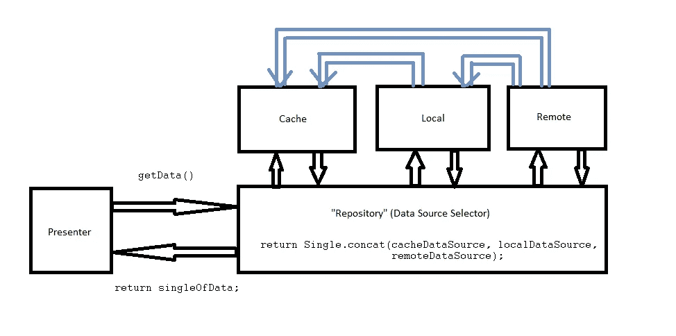
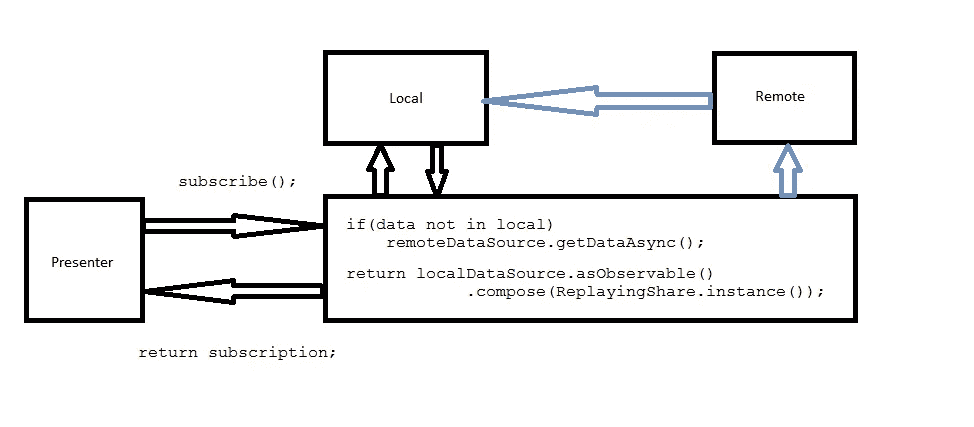
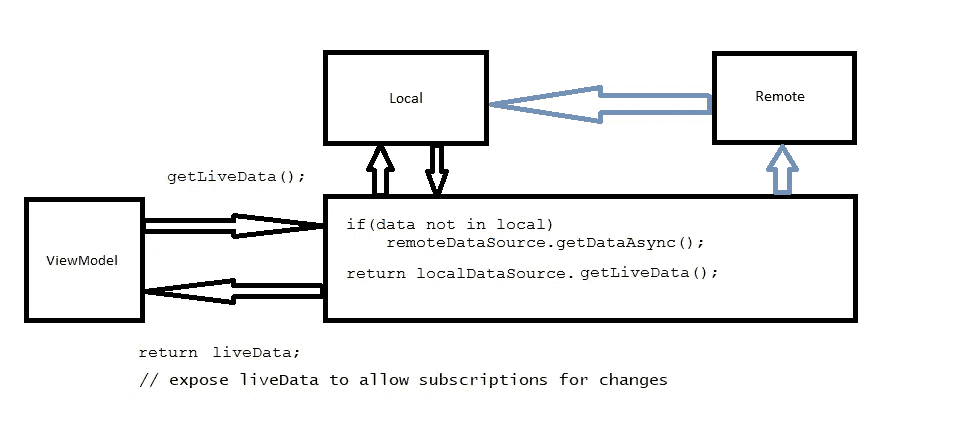

# 思考建筑组件、领域和空间，并查看干净建筑中的反应数据层

> 原文：<https://medium.com/hackernoon/musing-on-architectural-components-and-realm-and-room-and-a-look-at-reactive-clean-architecture-880c8df55abf>


[谷歌](https://hackernoon.com/tagged/google) I/O 2017。Android 的发展前景已经发生了变化。

随着新推出的**“架构组件”**，Android 应用程序的设计方式将发生巨大变化。

如果我一直使用装载机，我会感到困惑。“如何将 ***ViewModels*** 和***LiveData****融入我的应用程序？”*

*但是我很幸运。我有机会用*境界*代替。我可以通过[*监听数据库*中的变化来简化我的大部分问题，而且一切都是最新的](/@Zhuinden/how-to-use-realm-for-android-like-a-champ-and-how-to-tell-if-youre-doing-it-wrong-ac4f66b7f149)。任何线程对 Realm 所做的任何更改都会反映在 UI 线程上，除了保持对一个`RealmResults`的引用并向其添加一个`RealmChangeListener`之外，没有其他工作。*

*随着 **Room** 的引入，我认为 Realm 的许多优势现在对其他人都可用了——但是是在 SQLite 之上。*

# *DAOs 和观察数据库*

*对于 Room，典型的反应式数据访问层如下所示:*

*Room DAO*

*正如您所看到的，所有的 DAO 方法都返回一个`LiveData<T>`,您可以订阅它进行更改。*

*订阅变更根本不是一个新概念。Realm 因为“遍布代码库”而受到了很多批评，但实际上，没有人会阻止任何人创建他们自己的基于 Realm 的 Dao 来在一个地方收集查询。*

*事实上，它看起来像这样:*

*Realm DAO*

*— — — — — — — — — — — — — — — — — — —*

*一旦我们有了这些，我们可以观察到这样的变化:*

*Observing LiveData (from [here](https://github.com/googlesamples/android-architecture-components/blob/178fe541643adb122d2a8925cf61a21950a4611c/BasicSample/app/src/main/java/com/example/android/persistence/ProductListFragment.java))*

*虽然传统上，您可以让`RealmResults`(甚至可能是`Realm`实例)由活动/片段的生命周期回调直接管理，但这部分是`ViewModel`负责的(另一半是活动和片段的*作用域*数据容器——例如，它可以存储订阅的 Dagger 组件)。*

*如果我们利用新的生命周期集成并将领域包装在视图模型中，我们甚至可以重用上面的代码，而只使用这个视图模型:*

*Realm-based ViewModel, based on [***this sample***](https://github.com/googlesamples/android-architecture-components/blob/178fe541643adb122d2a8925cf61a21950a4611c/BasicSample/app/src/main/java/com/example/android/persistence/viewmodel/ProductListViewModel.java)*

*基于这个例子，这里有一件有趣的事情需要注意。*

> *概念上，`MutableLiveData<List<T>>`和`RealmResults<T>`是一回事。*

*事实上，即使以前有人问，我也告诉他们:如果他们使用干净的架构和 Realm，并且他们的数据层返回一个`List<T>`而不是类似于`MutableLiveList<T>`的东西，这种东西会在适当的位置发生变化，并提供添加/删除更改监听器的方法，那么他们使用 Realm 是错误的，*和*使他们的生活变得更加复杂。*

*尽管如此，一个关键的区别是 SQLite 会急切地评估您的查询结果，而 Realm 提供的是延迟加载的结果。由于 Realm 的结果是延迟加载的，ViewModel 提供的这种“范围缓存”甚至没有必要，但是很高兴看到一个代码*提供了反应性*并且可以从片段本身适当地抽象 Realm*，不是吗？:)**

# **将数据层变为反应层，而不仅仅是连接单个数据层**

**现在，有一个非常普遍的建筑决策，我随处可见，但我从未真正理解。**

**人们经常创建一个`Repository`类，负责“从内存缓存、本地数据源或远程数据源中选择数据”——我认为这来自 [*费尔南多·切哈斯的《架构 Android:进化》*](https://fernandocejas.com/2015/07/18/architecting-android-the-evolution/) *，*，但它甚至可能源自 [*丹·卢的《从多个来源加载数据》*](http://blog.danlew.net/2015/06/22/loading-data-from-multiple-sources-with-rxjava/) *。***

**通常，这会导致一个`concat`操作，它有一种代数美:**

```
**// from Dan Lew's article
Single<Data> memory = ...;  
Single<Data> disk = ...;  
Single<Data> network = ...;

Single<Data> source = Single  
  .concat(memory, disk, network)
  .first();    // <-- return only 1!**
```

**在新的世界中，您可以观察数据库中的变化，您不仅仅需要 **1** 元素。你要求一个*可观察的*。可以是**1……***元素。**

****如果您只是从数据源中检索一个*单个*元素，否则*不会监听*对数据库所做的更改，那么*的反应性*在哪里？您基于 Rx 的解决方案的反应能力在哪里？****

**因此，我不明白这个数据层的设计。我用油漆画了一个图来说明这一点(也可以在这里[找到](https://stackoverflow.com/questions/43192015/realm-working-with-clean-architecture-and-rxjava2/43202425#43202425)):**

****

**Traditional “cold” repository implementation with multiple data sources**

**如您所见，演示者没有为的变更*订阅。任何改变数据集的后台操作将如何反映在演示者中？没办法听。***

**相反，一种可能的方法是启动一次性操作，必要时从远程*检索数据*，否则只监听本地数据源的变化。**

****

**Repository listens to local datasource as “hot” event source**

**以前，您的缓存可以通过 [Jake Wharton 的**rxpreplayingshare**](https://github.com/JakeWharton/RxReplayingShare)来完成，它会在订阅时返回最新的值(它已经取代了内存缓存作为数据源)。**

**现在这由 **ViewModel** (数据范围)和 **LiveData** (保存以前的值，并允许订阅——类似于`BehaviorRelay`)处理，因此缓存不再是可观察链的责任:**

****

**通过这种方式，我们创建了限定范围的数据，并使用架构组件监听更改，同时我们在数据层中保持了反应性(而不是只请求一次数据，然后在数据发生更改时无法更新)。**

# **结论**

**我个人很欢迎使用 *ViewModel* 和 *LiveData* 给 Android 应用带来的新变化。在使用 Realm 一年多之后，reactivity 带来的这种简单感觉就像家一样——无论是 Realm*还是 T21*房间。:)**

**概念是相同的，谢天谢地，它比加载器或串联单个要好得多，容易得多，也稳定得多。**

**[](http://bit.ly/HackernoonFB)****[](https://goo.gl/k7XYbx)****[](https://goo.gl/4ofytp)**

> **[黑客中午](http://bit.ly/Hackernoon)是黑客如何开始他们的下午。我们是这个大家庭的一员。我们现在[接受投稿](http://bit.ly/hackernoonsubmission)并乐意[讨论广告&赞助](mailto:partners@amipublications.com)机会。**
> 
> **如果你喜欢这个故事，我们推荐你阅读我们的[最新科技故事](http://bit.ly/hackernoonlatestt)和[趋势科技故事](https://hackernoon.com/trending)。直到下一次，不要把世界的现实想当然！**