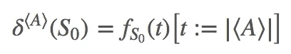
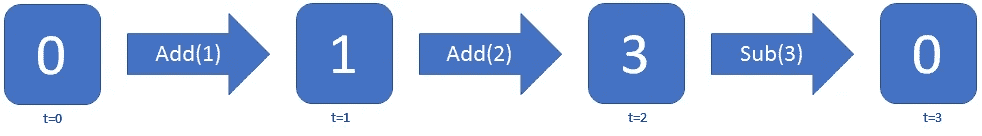
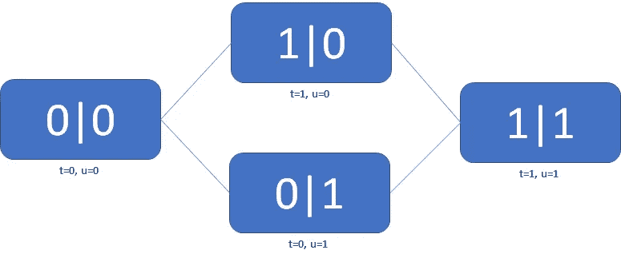
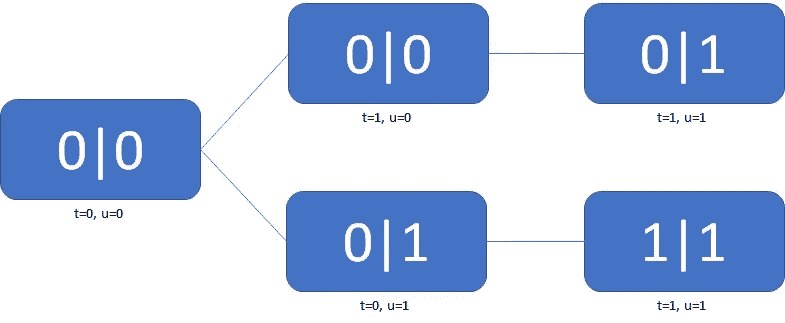
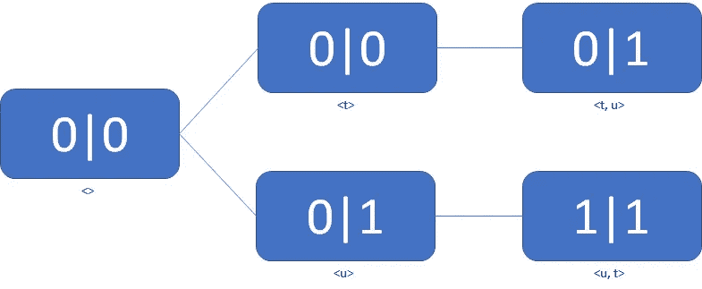

# 易变导致痛苦

> 原文：<https://medium.com/hackernoon/mutability-leads-to-suffering-23671a0def6a>

你可能已经阅读了十几篇关于代码可变性为何不好的清晰、合理的论证。这不是其中之一。相反，我写了一个不清楚的，粗制滥造的论点来解释为什么它不好。

可变性是不好的。要理解为什么，我们得说说时间。

# 谈论时间

对于我们构建的任何系统，我们通常希望它做两件事。首先，它应该有属性:“客户 X 买了多少个部件？”其次，它应该采取行动:“给 X 发一封关于小部件销售的电子邮件。”我们将以一种更迟钝的方式开始重述这一点。

让我们想象一个极其简单的系统，由一个保存整数的计数器组成。计数器的值组成了系统的*状态*，这是对该系统的完美描述。一个动作做了一件事，一定有可衡量的效果。这意味着所有的行为都必须以某种方式改变状态。否则，没有变化的动作和没有动作没有区别。


Some actions

(现在您可能已经猜到了，属性是不可变的操作，而动作是可变的。)

通过这样做，我们现在引入了时间。动作前的状态不同于动作后的状态。相反，如果一个系统没有任何动作，那么状态永远不会改变，时间与系统完全无关。这意味着对于任何一种系统来说，**可变性等同于时间依赖性**。

这可能听起来像是“那又怎样”的陈述，但是这是所有与可变性相关的头痛和痛苦的根源。要理解为什么，我们必须谈谈时间依赖。

# 谈论时间依赖性

如果系统是时间相关的，这意味着对于任何给定的初始状态和所采取的行动列表，我们都知道系统在任何给定时间 t 的确切状态，这里有一些关于这个的“数学”。



This doesn’t actually mean anything, I just wanted to play with [asciimath](http://asciimath.org/)

我们如何做到这一点？想象你将计数器增加 10 次——也就是 10 次突变。在任何两次突变之间，总有一段时间系统是稳定的，无论是两微秒还是两年。这就产生了 11 个不同的时间段。我们可以将第一个，即初始状态，标记为从 t=0 开始，然后随着每一个突变或步骤将 t 增加 1。



f(2) = 3

对于这样一个简单的系统，时间依赖不会引起任何麻烦。每个状态对应一个时间跨度，也就是一个时间值。如果我们运行这个系统，它只会有一个可能的路径。那就好分析了。

然后我们到达并行系统，一切都崩溃了。

# 谈论并发性

现在想象我们有两个这样的计数器，独立运行。虽然每个都有自己的状态，但我们可以在一个全局状态[C1 | C2]中将它们表示为两个值。我们每增加一次。在 t=2 时，很明显状态是[1|1]。但是 t=1 时的值是多少呢？在一个增量和另一个增量之间会有一段时间，所以每个案例代表它自己的一步。但是它可能是[1|0]或[0|1]，所以 t=1 不是明确定义的。


f(1) = wtf

简单的解决办法是增加第二个时间(姑且称之为 u ),并且在给定的步骤中只增加 t 和 u 中的一个。不是 t=2 对应[1 1]，而是 t=1 u=1 对应。那么 f(1，0) = [1|0]和 f(0，1) = [0|1]，我们又有一个明确定义的时间依赖关系。



f(0, 1) = [0|1]

现在让我们给系统添加一个新的操作:复制。复制操作将该值设置为等于另一个系统的计数器。如果 t 计数器复制，而 u 计数器增加 1，那么系统在 f(1，1)的值是多少？



f(1, 1) = #ERR UNDEFINED

因为 f(1，1)有两个同样有效的值，所以它根本没有定义！状态不再纯粹是 t 和 u 的值的函数。现在，步骤的顺序很重要，因为 f( <t u="">)可能不是与 f( )相同的状态。</t>



f(<t, u>) = [0|1]

这让一切都变得很糟糕。

假设你有两个系统。t 系统变异四次，u 系统变异三次。还有(3+4)！这些突变的可能排列，因子为 3！和 4！变得多余。总共有(3+4)！/(3!4!)= 35 种可能的结束状态。它们中的每一个都可能具有完全不同的行为和完全不同的错误，您需要检查它们。如果有两种可能的开始状态，那就是另外 35 种准备伤害你的行为。

这就是易变性可怕的原因。可变性导致时间依赖，导致并发系统，导致非数值时间，导致状态空间爆炸，导致痛苦。

# 避免可变性

对不起，你不能。

一个完全不变的系统是独立于时间的。这对某些系统来说是可行的，但是我们关心的大多数事情**都是依赖于时间的。例如，我想在死前的某个时候收到我的小部件。**

也就是说，你可以**减少**可变性，让它在你的系统中不那么成问题。这里有一些方法可以做到这一点。

## 完全消除并发性

归根结底，可变性只是并发系统中的一个问题。否则，你只有一种可能的行为，这意味着系统是确定性的，你可以很容易地分析它。

这就是*同步* [*编程*](https://hackernoon.com/tagged/programming) *语言*背后的想法。一切都与一个单一的全球时钟联系在一起，每一秒钟都在同步变化。构建一个完全同步的系统通常是困难和低效的，但是它们实际上是没有错误的，所以对于关键任务系统来说这是一个好主意。

## 纯函数

有时我们不需要突变，但还是要突变。例如，这里有一种测试文件在 bash 中是否可写的方法:

```
function file_writeable() {
  touch file
}
```

它可以工作，但是 1)如果文件不存在，将创建它，2)如果文件存在，将更新访问和修改时间。相反，我们可以做

```
function file_writeable() {
  test -w file
}
```

也就是说不会产生突变。我们称之为纯函数。如果我们调用前十次，那就是十个时态步骤。如果我们调用后者十次，那就是零时间步长。显然，我们不能让一切都变得纯粹(时间是个混蛋)，但我们可以去除不必要的变异，这让事情变得更简单。它还使得事务性变异更容易编写，这通常是纯函数的主要好处

## 交易性突变

以下面的伪代码为例:

```
def add_to_cart(cart, items):
    for item in items:
       cart.add(item)
```

根据实现的不同，每个项目最多有一个变异。另一方面，我们可以通过不同的方式将突变的数量减少到一个:

```
def add_to_cart(cart, items):
    newcart = cart.clone
    for item in items:
       newcart.add(item)
    cart = newcart
```

这里，购物车只在最后用所有新数据更新一次。我非正式地称这种突变为事务性突变，在这种突变中，你想发生的一切都发生在一个步骤中。这是因为其中最普遍的例子是数据库事务。当你在一个交易中做了一堆突变，要么全部发生，要么一个都不发生。没有并发系统会看到任何中间状态。

事务性突变是原子性突变的一个子集，但是我不想深入研究它们，因为我很懒。

## 排他性突变

到目前为止，我们一直假设动作何时运行是有限制的。如果我们有两个系统，每个系统有一个动作，和**都是可能的。然而，在某些情况下，我们可以设计一切，以便强制排序。作为伪代码示例:**

```
def update:
    set_status("updating")
    # bunch of mutations
    set_status("ready")def alert:
    wait_until_status("ready")
    # alerting code
```

即使更新是两步，我们唯一的行为是<u1 u2="" a="">和。因为我们有一个锁，所以我们把三种可能的行为减少到两种。</u1>

# 处理可变性

你已经把你的三个四步流程减少到三个两步流程。太好了！你没有 35000 种可能的行为，而是只有 90 种。这就是进步！不过，还有 90 种行为需要检查。你如何确保他们都是安全的？

同样，我们使用了一些不同的技术。第一种是非正式推理，你让团队中的其他人相信这不是问题。在某些情况下，这很简单:如果两个系统互不影响，您可以放心地忽略它们突变的相对顺序。其他情况涉及现实世界的考虑:如果两个系统在非常不同的时间尺度上运行，你可以假设突变的顺序是固定的。问题是，作为人类，我们经常犯错误，所以很容易把危险的情况误认为是安全的，反之亦然。

另一个工具是测试和模拟，我们运行代码并确认没有错误。这没有非正式推理那么多人为错误，但是创建适当的并发条件是困难的。测试可以发现很多 bug，但是用它覆盖所有东西太贵了。

我们还有一个中间地带，叫做*建模*。建模包括创建整个系统的抽象表示，并声明所有行为必须遵循的属性。然后，该模型彻底检查状态空间，并确认所有属性都成立。它不像推理那样灵活，也不像好的测试那样真实，但它也比前者更万无一失，比后者更全面。另外，一个好的模型也是文档的一部分——不像实际的文档那样清晰，但是有助于快速浏览。

理想情况下，我们会使用所有三个。在实践中，我们广泛使用非正式推理和测试，但我们并不真正使用建模。我认为这与其说是一个技术问题，不如说是一个社会问题，因为那里有[许多](http://alloy.mit.edu/alloy/) [奇妙的](http://spinroot.com/spin/Man/Manual.html) [建模](http://lamport.azurewebsites.net/tla/tla.html) [工具](http://www.spark-2014.org/about)。这只是让他们更容易接近的问题。

# TL；博士；医生

*   突变本质上不是坏事，但它意味着你的系统是时间相关的。
*   依赖于时间的并发系统将时间视为一个序列，而不是一个数字，这显然更难分析。
*   虽然消除可变性通常是不可能的，但我们可以通过事务、纯函数和其他技术来减少突变的数量。
*   [造型很酷，你应该学学。](http://www.learntla.com)

*你可以* [*在 Twitter 上关注我*](http://twitter.com/hillelogram) *但大多是些无意义的笑话和美食图片。*

[](http://bit.ly/HackernoonFB)[](https://goo.gl/k7XYbx)[](https://goo.gl/4ofytp)

> 黑客中午是黑客如何开始他们的下午。我们是这个家庭的一员。我们现在[接受投稿](http://bit.ly/hackernoonsubmission)并乐意[讨论广告&赞助](mailto:partners@amipublications.com)机会。
> 
> 如果你喜欢这个故事，我们推荐你阅读我们的[最新科技故事](http://bit.ly/hackernoonlatestt)和[趋势科技故事](https://hackernoon.com/trending)。直到下一次，不要把世界的现实想当然！

