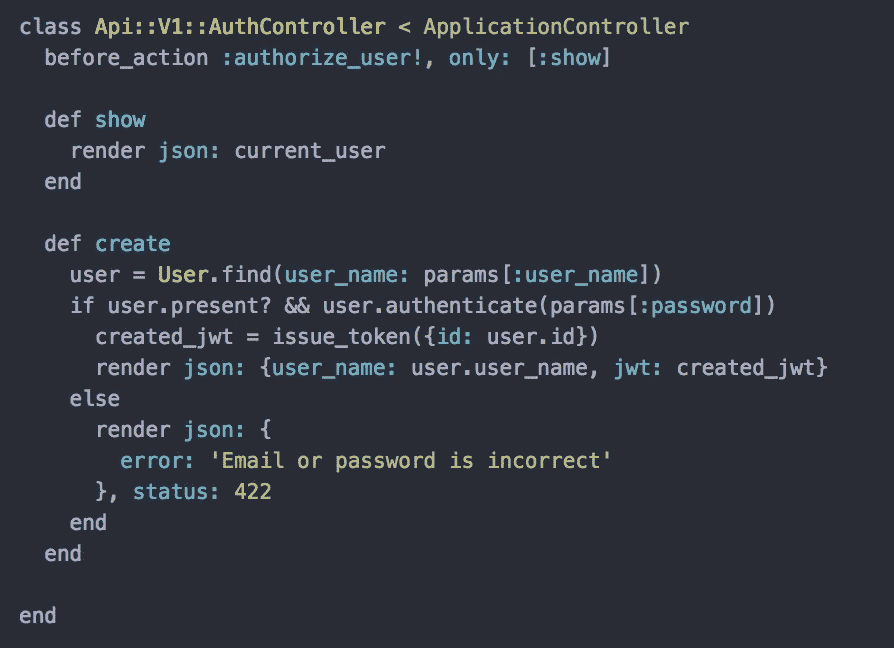
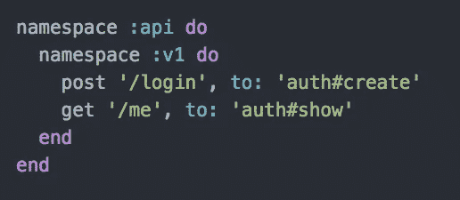
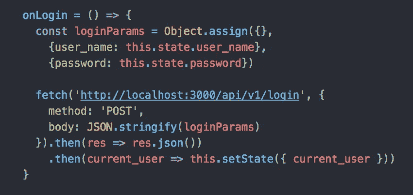
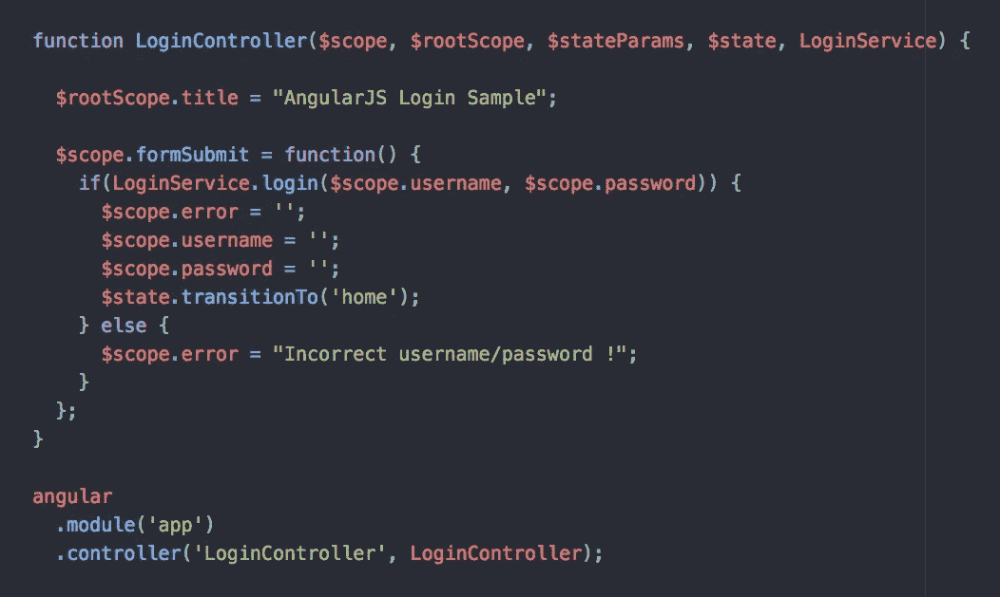

# MVC 与 MVVM:网站如何与其数据模型沟通

> 原文：<https://medium.com/hackernoon/mvc-vs-mvvm-how-a-website-communicates-with-its-data-models-18553877bf7d>

网站的构建没有单一的方式。网站设计模式的变化和网站本身的变化一样多。看一看脸书。从表面上看，脸书肯定是人们经常使用的最复杂的网站之一。用户一登陆他们的主页，网站就会发出至少六个[数据](https://hackernoon.com/tagged/data)请求，用大量组件填充一个页面。这些组件中的每一个都被设计为异步呈现，因此一个组件的失败不会对页面的其余部分产生影响。现在把它与像[谷歌](https://hackernoon.com/tagged/google)这样的网站相比。对谷歌来说，最大的吸引力之一是他们的主网站拥有全网最著名的简单用户界面。但实际上，google.com 是人们能想到的逻辑上最复杂的网络应用之一。每当用户在其搜索栏中键入一个字符，谷歌就会利用之前搜索过的短语集合来生成自动完成的答案，估计这些答案与用户最相关。

现在，人们可以很容易地想象，运行像脸书这样的应用程序所需的逻辑将与运行像谷歌这样的应用程序所需的逻辑截然不同。从本质上讲，任何网站的功能都只是一种方式，前端或**视图**可以到达适当的**模型**来检索数据。无论如何，总会有模式，总会有观点。真正改变的是模型和视图的连接方式。

在 web 开发的世界里，有两种主要的方法可以让网站的视图操纵网站的模型，要么用**控制器**要么用**视图模型**。正如你将看到的，每种交流方式都有自己的优点和缺点。

# MVC:模型-视图-控制器

数据模型连接到应用程序视图的最标准方式很可能是通过一个叫做**控制器**的接口。在 MVC 模式中，控制器作为一个工具，直接操作给定模型中的数据。

A standard authentication controller written in Ruby on Rails.

如今，网站的前端和后端被设置为彼此完全解耦。网站的用户界面已经变得非常复杂，MVC 模式的视图组件无法像数据模型一样存储在同一个文件中。前端和后端仅通过 get/post 请求和 JSON 字符串连接，这些请求和字符串通过控制器和路由器进行组织。

Router for the same auth controller shown above.

这是在视图中通过获取请求来完成的，这些请求命中与控制器动作相关联的 API 上的特定路由。

What a typical login fetch request looks like in React.

每个控制器被设计成既接收数据又基于接收的数据发回适当的信息。

MVC 模式是特别设计的，视图和模型不需要知道彼此的任何事情。因此，MVC 模式允许开发人员同时处理 web 应用程序的不同组件，而不会相互影响。

然而，MVC 设计模式有许多缺点。首先，使用控制器来操纵数据模型会在后端造成混乱。标准情况下，数据库中的每个模型都有自己的控制器，因此当应用程序的规模变得更大，并演变成具有许多相关模型的操作时，所使用的控制器数量必须同步增长。这与大多数框架带来的新抽象层的自然引入相结合，创建了一个变得非常难以浏览的代码库。

至少这些错误中的一部分可以通过使用视图模型来解决。

# MVVM:模型-视图-视图模型

MVC 格式的流行在很大程度上可以归因于这样一个事实:与其他设计模式相比，它非常容易理解。从表面上看，连接分离的模型和视图的最简单方法是创建一个控制器，允许视图操作数据模型。然而，这种允许视图与后端通信的间接方法并不适合每个应用程序。具体来说，控制器方法不能很好地用于**单页面应用**。

另一种将视图和模型连接起来的流行方法是通过一个不太有创意的叫做**视图模型**的东西。与控制器方法不同，ViewModel 方法非常依赖于应用程序的前端。

AngularJS is a popular framework that prefers the MVVM pattern over MVC.

与 MVC 方法不同，ViewModel 不是控制器。相反，它作为一个绑定器，在视图和模型之间绑定数据。MVC 格式是专门设计来在模型和视图之间创建关注点分离的，而具有数据绑定的 MVVM 格式是专门设计来允许视图和模型直接相互通信的。

这就是为什么单页应用程序可以很好地处理视图模型的原因。它很简单，允许视图直接与后端通信。正因为如此，MVVM 的单页应用程序可以快速流畅地将信息保存到数据库中(谷歌文档就是一个完美的例子)。

然而，MVVM 格式也有其自身的缺陷。因为它依赖于数据绑定，所以与它的控制对应方相比，ViewModel 消耗了大量的内存。MVVM 模式的创造者 John Gossman 说，实现 MVVM 的开销对于简单的 UI 操作来说是“多余的”。经常使用 ViewModel 方法的大型应用程序变得难以运行。因此，MVVM 设计模式主要用于 web 上的单页面/功能应用程序。

# 论网站的功能性

在过去的二十年里，我们看到网站的种类急剧增加。在过去的几年中，编程语言的激增和计算能力的稳步增长使得人们能够通过点击鼠标找到任何问题的解决方案。伴随这些创新而来的是组织我们代码库的新方法，以及网页连接到所需数据的新方法。

网站的构建没有单一的方式。在这篇博文中，我们谈到了两个问题。前面提到的脸书的构建方式非常有利于 MVC 模式，而 Google 创建的许多单页面应用程序通常更有利于 MVVM 模式。

有了这些知识，我鼓励你走出去，用不同的眼光看待网站。下次你在浏览器中打开网页时，我希望你能深入思考它是如何制作的。

## **资源:**

 [## Angular JS 教程- MVC 和 MVVM 设计模式- DZone Mobile

### 在 Angular JS 教程系列的第一部分中，作者介绍了一些设计模式。

dzone.com](https://dzone.com/articles/angularjs-tutorial-lesson-1)  [## M-V-VM 的优缺点

### 相对于其他方法，我有几个关于何时以及为什么使用 M-V-VM 的问题。明显的目的是抽象…

blogs.msdn.microsoft.com](https://blogs.msdn.microsoft.com/johngossman/2006/03/04/advantages-and-disadvantages-of-m-v-vm/)  [## 模型-视图-控制器-维基百科

### 模型-视图-控制器(MVC)是一种在计算机上实现用户界面的软件架构模式。它…

en.wikipedia.org](https://en.wikipedia.org/wiki/Model%E2%80%93view%E2%80%93controller)  [## 模型-视图-视图模型-维基百科

### MVVM 促进了图形用户界面开发的分离——不管是通过标记语言还是 GUI 代码……

en.wikipedia.org](https://en.wikipedia.org/wiki/Model%E2%80%93view%E2%80%93viewmodel)  [## Android 架构模式第 3 部分:模型-视图-视图模型

### 在开发 upday 应用程序的前六个月中，经过四种不同的设计，我们了解到一个重要的…

medium.com](/upday-devs/android-architecture-patterns-part-3-model-view-viewmodel-e7eeee76b73b)