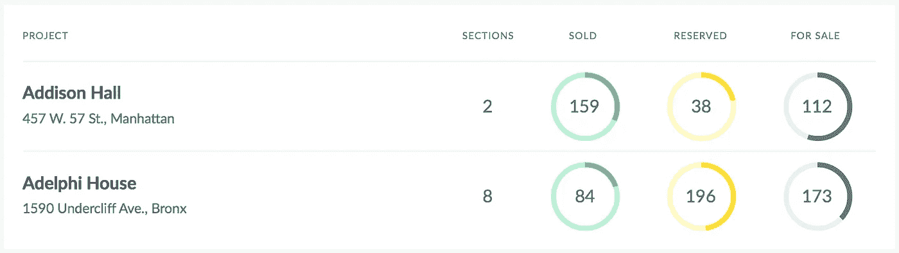

# 开始 CRM 开发时需要知道的事情

> 原文：<https://medium.com/hackernoon/mvp-for-crm-how-to-avoid-unnecessary-functions-72f80681225a>

很难想象不使用客户关系管理系统如何有效地管理一家大公司。现代市场提供了许多适合不同行业和企业规模的 CRM 解决方案。为什么要选择一个专门为贵公司设计的 CRM？

# 为什么更喜欢定制 CRM？

高质量的现成 CRM 解决方案是昂贵的，而通常情况下，您的公司并不需要整套提供的功能。定制 CRM 开发的成本也不是芯片，但是，在个人开发的情况下，您需要为公司特别需要的功能付费。另外，员工不会花很多时间去探索新产品，因为 CRM 最初是在公司已经建立的工作流下创建的。

例如，在为一家建筑公司设计 [CRM 系统](http://bit.ly/stfalcon_realestatecrm)时，我们开发了一个解决方案，其中功能、颜色、标题甚至排版都根据客户的具体情况进行了调整。我们考虑到在服务接口中经常使用数字和小签名，因此字体类型由良好的数字显示和小文本可读性决定。

*Typography of a CRM system for a construction company*

# 开发 CRM 系统时需要考虑的事情

# 1.便利

时间就是金钱——员工不应该浪费时间搜索必要的主题或信息，重要的文档也应该放在手边。此外，CRM 用户应该有各种机会轻松生成报告，在系统中相互交流以及与客户直接交流。

完美的基于云的 crm 软件非常灵活，可从任何设备访问，用户友好，并提供有意义的报告功能。— *苏珊·康纳，SquareBlue 咨询公司的总裁兼首席 CRM 策略师*

# 2.复杂性

根据规模和业务细节，将改变 CRM 系统的功能和 CRM 开发时使用的技术。在为一家建筑公司创建 CRM 时，我们选择了现代、可靠的框架 [Symfony2](http://bit.ly/stfalcon_symfony2) 。此外，我们使用 RESTful API 实现简单的可伸缩性，并使用 ember . js——该框架上的应用程序易于扩展和维护。CRM 项目是根据单页应用程序的原理创建的。这允许我们创建一个丰富的用户界面，并大大减少了等待响应的时间浪费。SPA 应用程序在更新数据时不需要重新加载所有页面，而且它们可以在离线模式下使用实时元素。

# 3.灵活性

您未来的 CRM 系统应该足够灵活，能够提供在特定流程下更改设置的可能性。此外，考虑基于 web 的 crm 解决方案的可伸缩性也很重要，这样它就可以与您的公司一起成长，而不需要新的解决方案。

完美的在线 crm 解决方案既直观又灵活，因此您可以轻松管理潜在客户，并根据客户细分自动采取行动。— *Kenny Kline，JAKK Solutions 的合伙人。*

# 4.和睦相处

除了线上的分析型 CRM 工具，还应该考虑与第三方资源的连接。例如，与电话、消息服务、会计软件、电子邮件等的集成。

# 5.可靠性

在客户关系管理系统中，您将存储重要的数据:客户数据库、交易、报告、员工生产力等。CRM 系统的设计应该能够保护数据免受第三方的干扰。此外，对于不同的员工群体，应该有相应的访问级别。

# CRM 系统的目标和目的

也许，CRM 实施的主要目标是吸引新客户和优化公司内部的工作流程。目标可能因行业的具体情况而异。我们列出了最常见的问题:

*   潜在客户及其活动跟踪；
*   维护客户数据库；
*   客户经营改善；
*   业务运营组织；
*   团队内部的关系管理；
*   优化不同部门的联合工作；
*   劳动生产率的提高。

对目标和目的及其优先级的彻底分析将帮助你[设计](https://hackernoon.com/tagged/design)具有最佳功能集的 CRM 系统。

# 为什么开发 CRM 的移动应用程序很重要？

该服务的网络版本可能仍足以满足团队内部的互动，但当与客户合作时，CRM 的移动应用程序就像空气一样必不可少。在商务旅行中，在运输途中，甚至在谈判中，访问 CRM 系统将提供随叫随到的能力，手头有必要的信息，并迅速将变化输入系统。

至关重要的是，应用程序正常工作，没有让失败在一个重要的时刻，所以我们不建议使用跨平台开发。尽管为 T4 的 Android T5 或 iOS 开发一个原生应用会花费更多，但它将是网络版 CRM 的坚实补充，并有助于提高业务自动化的效率。

# 为 CRM 定义 MVP

CRM 系统的应用领域可以分为两个方面:

**1。与客户的互动**

主要包括电话、电子邮件、时事通讯和会议。前三个行动应该自动化，以形成客户关系的历史。该区域的最小功能集:

*   集成电话、电子邮件和短信服务；
*   数据库的客户，地址，电话与方便的过滤器
*   客户关系跟踪能力；
*   生成报告的能力
*   带有内置通知的日历，用于输入未来会议的信息

**员工之间的互动**

CRM 系统应该为员工提供分配工作时间的机会，并帮助规划未来的工作量。还有，CEO 要有能力控制下属的工作量和效率。因此，该区域的最小功能集:

*   不同类别工作人员的访问级别；
*   带有内置通知的日历，以便经理能够将消息通知下属；
*   任务设置和监控的可能性；
*   将文件附加到任务的能力；
*   任务内的交流；
*   任务状态及其优先级的标签；
*   工作量报告的生成。

根据您的业务特点和规模，您可能需要许多其他功能。创建一个 CRM 系统，这将有助于自动化公司的过程，并带来业务到一个新的水平，将需要大量的财政和时间成本。然而，结果在相当短的时间内就收回来了——统计报告表明，CRM 的实施将销售生产率提高了 [29%](http://guidesforcrm.com/blog/2016/02/18/10-must-know-crm-statistics-and-trends/) 。

【stfalcon.com】最初发表于**。**