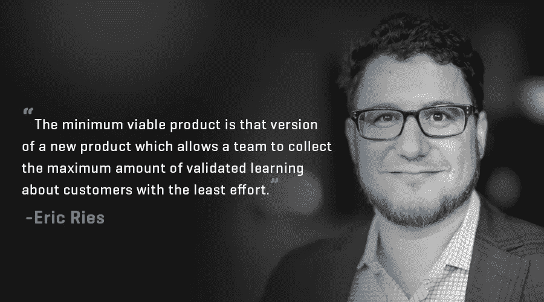
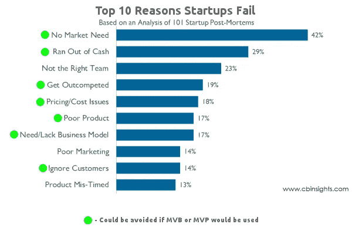
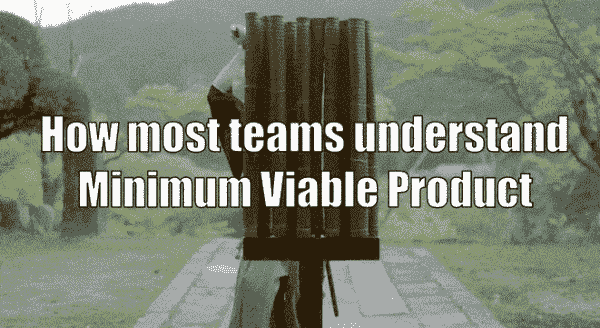
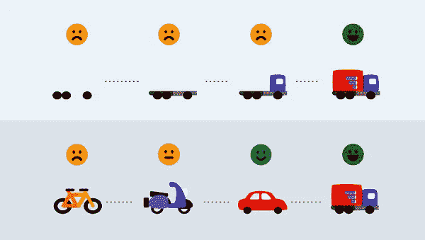
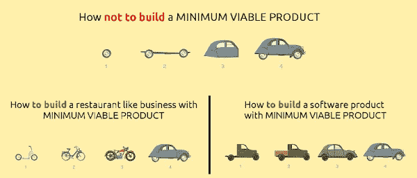
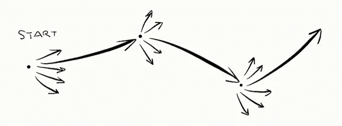
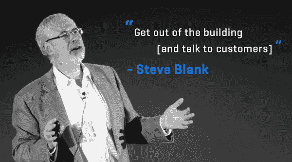

# MVP 悖论，以下是如何在为时已晚之前修复你的 MVP！

> 原文：<https://medium.com/hackernoon/mvp-paradox-and-what-most-founders-need-to-be-aware-of-3a5f8c3acb76>

我们是精益创业运动的超级粉丝。我们虔诚地向我们所有的客户拥护它，因为它帮助他们使用构建-测量-学习的哲学迭代地构建产品。但是最近许多创始人对 T2 MVP 的概念产生了很多困惑。

[最小可行产品](https://en.wikipedia.org/wiki/Minimum_viable_product) (MVP)是精益运动的核心理念之一。

MVP 的目的是客户驱动，而不是产品驱动。它从关注向客户学习开始，以验证[业务](https://hackernoon.com/tagged/business)假设。通过把客户放在第一位，弄清楚客户想要什么或不想要什么，你可以验证你的商业想法。

MVP 的主要目标是通过了解业务价值来验证的。因此，这是一个实验性的业务流程，而不仅仅是一个最小的产品开发流程。

MVP 对创始人来说是一种现实检查，这样他们就不会浪费大量的时间和金钱去做一些没人需要或愿意花钱的事情。

***Source:*** [***www.cbinsights.com***](http://www.cbinsights.com)

## **非常常见的 MVP 陷阱，我们会看到创始人陷入其中**

许多创始人带着他们想要开发的产品想法和商业目标来找我们。但是每当我们问他们关于客户问题、需求和支持他们假设的用户研究的更深层次的问题时(这样我们就可以设计正确的产品并瞄准正确的需求)。你猜怎么着？

他们无法回答或者没有做过任何客户/市场研究来验证他们的想法。我们坚信，如果没有通过用户访谈或与潜在客户交谈来验证，任何规范文档或特性列表都不应该存在。

这种验证的缺乏导致了最常见的 MVP 陷阱——创建东西。新的创始人认为快速构建一些东西并快速迭代将有助于他们取得成功。他们开发出半生不熟、考虑不周的原型。他们变得极其懒惰，甚至不考虑客户的需求和价值。

以这种方式过度追求你的 MVP 可能是你的公司“破产省钱”的最快方式。

## **MVP 有“快速致富”的成分，这影响了人们的判断**

像许多流行的运动一样，精益方法已经成为人们盲目追随的运动，而没有正确理解其最佳工作的原因和背景。

我认为它受欢迎的原因之一是因为它潜意识里带有懒惰和“快速致富”的成分。当创始人听到 Dropbox 仅仅通过构建一个[登录页面](https://techcrunch.com/2011/10/19/dropbox-minimal-viable-product/)就获得成功的例子时，他们会想“如果他们能做到，我们也能做到”。

## **最低限度的出色产品，而不仅仅是最低限度的可行性**

MVP 概念之所以被如此误解，很可能是名字(MVP)本身的问题。如果 MVP 被称为最低限度的令人敬畏的产品(或者甚至是[最低限度的令人愉快的产品)](http://www.startupblender.com/minimum-viable-product-vs-minimum-delightful-product/)而不是最低限度的可行产品，那么许多创始人可能会停止将其误解为最低限度的功能、用户研究中的懒惰或者粗糙的体验。

这是 Spotify 用来解释 MVP 概念的流行图表。下图显示了运输或汽车行业的五种不同的产品迭代。然而，当然，它们实际上并不是同一事物的五个不同版本——它们是五个独立的产品，每一个都针对不同的人口统计数据，并需要不同的业务验证。

毕竟，如果你想制造一辆汽车，那么向专注的滑板爱好者学习不会对你有很大帮助。

***Source:*** [***www.expressiveproductdesign.com***](http://www.expressiveproductdesign.com)

我们更喜欢上面的类比，因为这意味着你正在构建一个汽车的最小版本，但具有核心的差异化功能，并验证业务和产品假设。

当完美的产品可以很容易地组装在一起并快速发布时，你不应该发布半成品，因为客户会根据质量和用户体验来评判它们。在 1995 年，伟大的设计是一个像这样的网站，但今天你可能正在与脸书、Instagram 和苹果这样的公司对抗质量认知偏见。

当进入一个有很多高质量产品的饱和市场时，未经打磨的产品对你的生意来说更加危险。

即使理解 MVP 的人也不会[计划迭代](https://blog.intercom.com/launch-mode-vs-iterate-mode/)

***Source: hbr.org***

许多精益忠诚者理解并构建了正确的 MVP，但是他们没有为迭代做计划。毕竟，一次构建一个东西，并没有留下多少学习的空间。

你必须假设最初的几次迭代会失败，你必须从观众的反馈中学习。

构建-测量-学习应该深入整合到您的开发过程中。围绕迭代的计划和预算将增加获得正确产品的机会。

因此，创始人最终会白白浪费时间和金钱，因为他们要么不明白自己在测试什么假设，要么不明白自己的目标客户是什么。

用埃里克·里斯的话说:

> 尽管名为 MVP，但它并不是关于创造最小的产品。如果你的目标只是简单地抓挠一个清晰的痒处，或者构建一个快速翻转的东西，你真的不需要 MVP。事实上，MVP 是相当讨厌的，因为它强加了额外的开销。我们必须设法从我们的第一次产品迭代中学到一些东西。在很多情况下，这需要投入大量精力与客户交谈或衡量和分析。

## **那么如何避开 MVP 陷阱呢？**

1.  **当你的商业想法没有被证实，你想快速验证一个假设:**

[史蒂夫·布兰克](https://hackernoon.com/@sgblank)在他的客户开发方法中提倡创始人走出去与客户交谈。这简单的第一步会让你面对现实，让你零投资测试最基本的假设。

如果对产品感兴趣，那么您可以了解更多关于构建什么功能和不构建什么功能的信息。

您还可以尝试 Concierge 最小可行产品。这是一个 MVP，您手动向客户提供产品的功能，以测试产品的想法。你指导你的用户解决问题。

门房 MVP 方法更简单，更少浪费，并且更有效地了解客户想要什么。

appos 是礼宾 MVP 的经典例子。Zappos 的创始人尼克喜欢鞋子。他有一个理论，其他人可能和他一样喜欢鞋子。他还有一个理论，认为人们可能愿意在网上买鞋。

但他不是 100%确定。他做的第一件事是走进旧金山的一家鞋店。他向店主询问了目前的库存情况。然后他达成了一笔交易，说每次有人在他的网站上买鞋，他都会过来从店主那里买鞋。

店主同意了这笔交易。尼克回家后建立了一个非常简单的网站，列出鞋店的库存。

通过追求门房 MVP，尼克验证了他的理论，即人们会在网上买鞋。对于早期采用者来说，其价值主张非常明确:搜索鞋子库存并在线购买非常方便。

只有在尼克通过他的礼宾 MVP 验证了他的商业模式后，他才向谢家华寻求资金。

同样，著名企业家[比尔·格罗斯](https://en.wikipedia.org/wiki/Bill_Gross)在 1999 年创造了一个[MVP](https://pando.com/2012/05/10/bill-gross-the-best-advice-i-ever-received/)，证实了汽车购买者愿意在网上购买汽车而不用亲自去见他们。客户将在他的网站上选择一辆汽车，描述所需的选项，然后支付购车款。然后，Bill 会从经销商那里购买汽车(在此过程中赔钱),并将汽车交付给客户。

那个 MVP 成长为 CarsDirect.com。后来，他们申请首次公开募股，筹集 1.72 亿美元。

**2。当想法得到验证，并希望构建一些东西来进一步验证时:**

https://mobile-patterns.com

假设你已经做了客户研究和/或你正在解决的问题来自你个人的行业经验。下一步是建立第一个版本来测试你的假设。

MVP 应该是测试你的假设的最简单的方法，但是这并不意味着建立一个 MVP 是容易的。一个常见的错误是拒绝解决创造革命性产品的棘手技术问题。正如 Ries 所写的，一些企业家将“最小可行”的产品称为“可以想象的最小”的产品。

这种对 MVP 的误解会带来昂贵的后果。有时，企业家通过将 MVP 的“最低”组成部分解释为“半生不熟或未经打磨”，错过了建立市场差异化的关键机会。

那么，如何构建这个 MVP 并选择包含哪些特性呢？

我们发现的一个最佳实践是始终问自己:具有挑战性的特性对你的价值主张是否至关重要？对这些特性的投资会带来革命性的产品，或者有价值的差异化功能吗？

[Square](https://squareup.com/) 面对这些，出道了一个真正革命性的 MVP。另一方面， [Dollar Shave](https://www.dollarshaveclub.com/) Club 通过登录页面和视频测试了他们的产品创意。然而，他们保持了少量的库存，以验证愿意以每月定期付款的方式加入俱乐部的人数。

YouTube 视频迅速走红(1900 万次观看)，一天之内就有 1000 人注册。

Dropbox 和 [Buffer](https://www.agileplannerapp.com/blog/building-agile-planner/buffer-lessons-learned) 是 MVP 爱好者引用的创建 MVP 登陆页面并获得成功的典型例子。但人们没有谈到的是，Dropbox 从一开始就在解决技术和 UX 挑战方面表现如何。事实上，从一开始 Dropbox 产品就被描述为“它就是好用”，而且使用起来非常简单。

如果你只是构建一个最小版本，并希望客户能忍受几个月，你就无法实现 Dropbox 的成就。你必须建立一个最低限度的令人敬畏的产品，不妥协的经验和价值。

《我的世界》和四方都是这类 MVP 的例子。他们推出时功能较少，但他们提供的最初体验和价值非常棒，而且经过深思熟虑。

《我的世界》是游戏发展史上最成功的游戏之一。在第一个版本中，你不能做太多事情——它基本上是一个丑陋的块状 3D 景观，你可以挖掘石块并把它们放在其他地方建造简陋的结构。但它推出的核心体验是粘性的，并经过深思熟虑，以测试他们游戏主题的假设。

同样，Foursquare 推出了**单一特色 MVP** ，以签到和[游戏化](http://www.bunchball.com/gamification)奖励开始。这有助于他们检验他们的假设。

**3。当你正在开发一个产品，并且有大量的竞争:**

这是最昂贵的 MVP 方法。

在现有业务或 B2B 业务中创新的公司发现自己处于一场功能战争中，因此他们必须建立比最低要求更多的功能。换句话说:为了生存，他们的最低要求必须足以与现有的玩家竞争，再加上某种差异化。

在这种 MVP 中，您针对客户面临的核心问题构建产品，并确保该解决方案比该领域的任何其他解决方案都要好十倍。

我们都见过许多杰出的玩家，他们试图扰乱市场，用最低限度的可行产品来衡量需求，或者我们说"**最低限度的可爱产品。**

比如你不能否认 [**理查德·布兰森**爵士](https://www.forbes.com/profile/richard-branson/)的贡献。他的[维珍集团](https://www.virgin.com/)已经在全球每个可能的市场进行了产品创意验证。每当他们遇到一个颠覆性的想法，他们提供的革命性的特点，根本不能被忽视。

维珍航空开始时只有一架飞机在两个地点之间飞行，以测试他们的概念，而不损害他们的价值主张。他们兑现了自己的承诺，然后进一步扩充了他们的舰队。

所以再一次，我们给创始人的建议是:请不要以 MVP 的名义偷懒。MVP 不是一个更便宜的产品，也不是一个具有尽可能少的功能集的产品的最小版本。把 MVP 想象成一系列的实验和研究活动，唯一的目标是帮助你学习。

当苹果想出它的零售体验时，他们做了原型。他们建了一个真人大小的商店。是 MVP 吗？我们猜测史蒂夫·乔布斯和罗恩·约翰逊(商店的设计师)并没有试图在最低限度和生存能力之间找到平衡。

他们没有根据最初的设计理念和假设在全国范围内铺开商店。他们做了一个完整的零售商店实验，先建后拆，然后再建！原型说服董事会继续进行四个商店的试运行。

当苹果首次发布 iPhone 时，它缺乏竞争对手的手机(主要是诺基亚手机)所提供的许多功能。但是这种体验和新的界面在任何方面都不是最低限度的或者不完美的。

# 结论

你不能通过简单地积累正确的特征来获得成功的商业。它来自于正确的元素协同工作，因此用户不再考虑技术，而是简单地实现他们的目标。

MVP 主要是关于寻找可重复和可扩展的商业模式。这是一个确定企业生存能力的过程。不过有一点需要注意:即使你在初始阶段就验证了想法，在产品制造出来并赢得更多客户后，你可能会意识到最初的验证是基于错误的假设。这就是为什么它必须是一个根深蒂固的过程。

有故事/想法可以分享，请在评论区留言。如果你喜欢这篇文章，你会喜欢- [**创业公司和预算团队的实用 UX 设计技巧**](https://mobile-patterns.com/blog/ux-design-tips-for-startups/) **。**