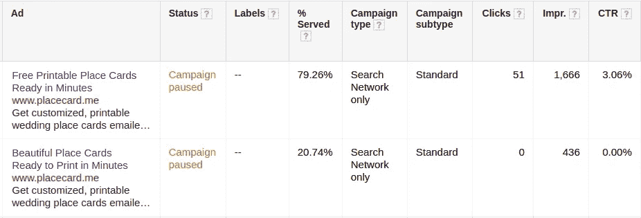
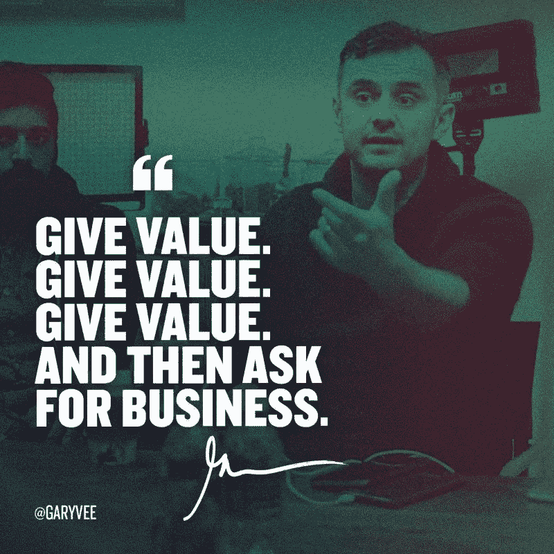
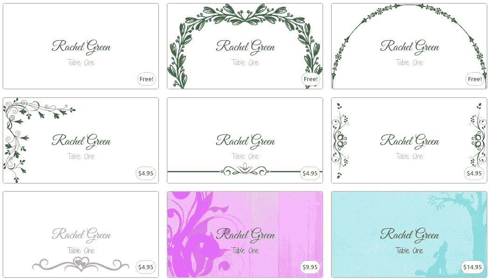
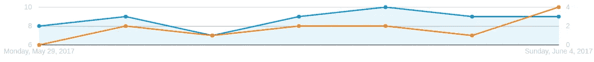
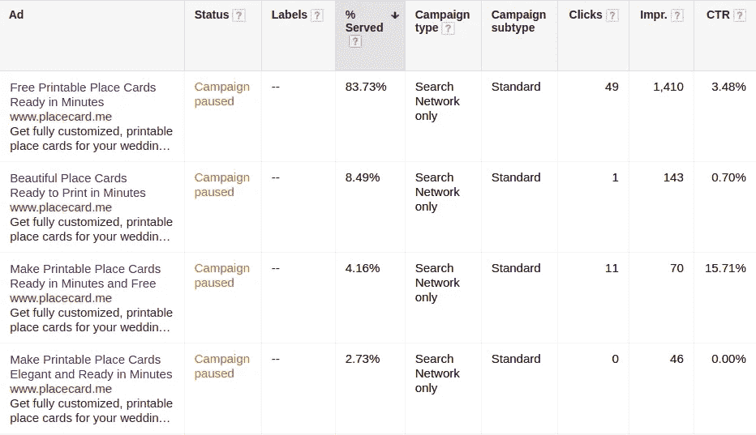
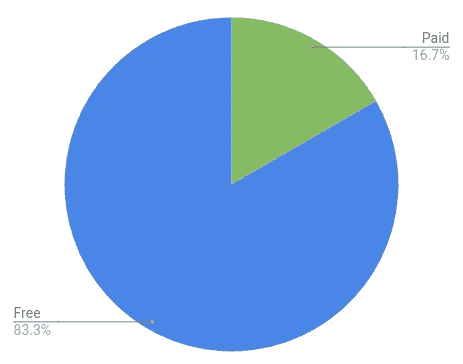
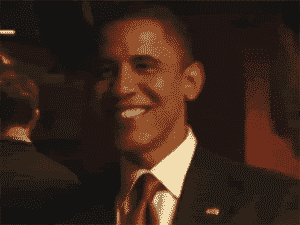
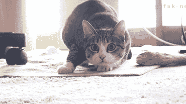

# MVP 定价

> 原文：<https://medium.com/hackernoon/mvp-pricing-80ebad5414fe>

## 以最简单的方式测试定价和支付意愿。

几周前，我写了一篇关于我如何用谷歌广告测试我的 MVP 的文章，目的是尽可能快地扼杀我推出一个有利可图的产品的梦想——一个 T2 的可打印名片制作机。这个测试的基本前提是:*我能让人们给我他们的电子邮件地址来使用我的产品吗？*

幸运的是，测试是成功的——我能够从通过谷歌广告发送到我网站的大约 20%的人那里收集到电子邮件地址。这回答了使用该网站是否值得放弃电子邮件地址的问题。但是它真的值那么多钱吗？

这是我接下来要回答的问题。

像上次一样，我从哲学上探讨这个问题，试图做尽可能少的工作，尽可能快地扼杀梦想。这篇文章描述了这个过程，以及迄今为止我从结果中学到的东西。

# 早期悲观主义

我承认，我带着相当悲观的情绪参加了这次测试。原因如下。

在我上次的测试中，还有一个实验我没有展示出来。除了看看能否收到邮件，我还想开始收集“支付意愿”的信息。

为此，我运行了两个略有不同的谷歌广告，并比较了它们的效果。除了一个小细节，这两个广告几乎完全相同——其中一个用了“免费”一个用了“漂亮”一个。

看看两个版本之间的点击量:

Fun fact: 51–0 is also the score of the worst loss in Pittsburgh Steelers history

是的，没错——51 次点击 100%来自广告的“免费”版本。

谷歌确实发现“免费”广告做得更好，并开始更频繁地展示它(测试结束时大约 80%的时间)，但这仍然是很有说服力的数据。在体育界，我相信这将被称为“惨败”。

抛开悲观不谈，我仍然想进行一次“真正的”测试，而不仅仅是基于广告点击率的测试。

# 选择定价模式

我要做的第一件事就是弄清楚我到底要收多少钱。在我的案例中，我有三个主要的定价标准:

1.  它应该提供一个**自由层**
2.  它应该提供**物有所值**
3.  应该**容易实现**

我想要一个免费层是因为上面的广告数字——他们向我展示了一个免费层可能是流量的最佳驱动力。

物有所值是显而易见的，也是每个产品都应该努力追求的。如果你不提供价值，你在做什么？

最后，我希望它很容易符合我的 MVP 思维模式“尽可能少地做测试工作。”我可以花很多时间来设计和制定可能的最佳价格，但我宁愿花 10%的时间在足够好的 T2 价格上。考虑到我对这次测试成功的悲观情绪，这一点尤其正确。

Gary Vee understands giving value

基于上述标准，我决定对我的“足够好”的定价非常简单:*我会对网站上的某些设计收费，并保留一些免费的。*

我从之前的市场调查中了解到，很多人在 Etsy 这样的网站上为定制的座位卡设计付费，所以人们愿意为“更好”的设计付费。我还决定将它限制在设计上比我考虑过的其他更复杂的选择更容易实现，比如对定制收费。在 MVP 阶段，越简单越好。

因此，我在之前拥有的三个模板的基础上又创建了六个模板，将我最不喜欢的三个模板免费，并为剩下的六个模板指定 5 美元到 15 美元之间的价格(基于我在 Etsy 上找到的类似价格范围)。完成了。

Final set of templates and prices

# 监督测试

我最初打算在产品中建立一个完整的支付流程，并从人们那里收钱。然而，沿着这条路走下去让我陷入了几个牦牛毛的兔子洞，最终我决定选择更简单的方法:

**我决定彻底造假。**

因此，当你进入[place card maker 页面](https://www.placecard.me/try/)时，你会看到一堆付费模板，看起来你肯定要为它们付费，但在漏斗的最末端，你会看到以下信息:

第二行是付费卡和免费卡的唯一区别。

一旦我做了这个决定，整个事情花了我大约 10 分钟来编码。比弄清楚如何设置 [Stripe](https://stripe.com/) 并构建一个完整的支付流程要简单得多。

因此，我没有测试收钱的能力，而是测试是否有人会注册使用付费模板制作座位卡——大概是带着花钱的意图。

它并不完美，但它很简单，我确实喜欢简单。

# 运行测试

好了，设置完毕——开始实际测试！

像上次一样，我用谷歌广告给网站发送流量。我选择了每天 4 美元的预算，并决定让它运行一周。不知何故，我最终总共花了 31.41 美元——比我预期的要多一点，但仍然是一笔相当划算的交易。

考虑这种广告支出的关键是将其视为一种测试，而不是一种收入模式。我的计划是看看这个东西是否与广告一起工作，然后找出如何在没有广告的情况下获得流量，只要它看起来有希望。

也就是说，在运行了这个测试之后，我现在意识到一个测试运行的越晚，它就越昂贵。如果我想要一个 50 人的样本规模来测试我收集电子邮件地址的能力，那么我只需要产生 50 次点击，但是如果我想要收集 50 个数据点关于支付意愿，我需要这个数字的五倍(因为只有五分之一的点击给我数据)。每次点击 0.50 美元，这些数字加起来！

不管怎样，看看结果。

## 强化第一次测试的结果

运行另一个测试的第一件有用的事情是，我能够从第一个测试中巩固一些经验。具体来说，我对电子邮件地址的转化率保持在 20%，我的广告转化成本也保持在 2.50 美元左右。很高兴知道这些数字并不完全是偶然的。

Clicks (blue, left axis) and conversions (orange, right axis) per day, and overall stats on the ad performance for the week.

另一件并非偶然的事情是对“免费”的偏好。我又尝试了几个广告变体，但结果仍然是压倒性地支持广告中任何带有“免费”字样的内容:

If my ads were one-minute spots, less than one minute an hour would be spent on the non-free versions

## 最新的结果

很好，所以我们已经知道人们愿意放弃他们的电子邮件，他们喜欢广告中的免费内容。*美元呢？有人真的选择了付费模板吗？*

令人惊奇的是，**是的**。

实际上，12 个皈依者中有两个人。两人都选择了 5 美元的模板。

Caveat: this chart is not even close to statistically significant

当我第一次收到有人选择了付费模板的邮件时，我简直是挥舞着拳头，开始在我站立的办公桌前跳舞。人们准备给我钱！

I’d rather not admit how much time I spent looking at celebration gifs before landing on these three

当然，现在我面临着我的方法的缺点。具体来说，这实际上并没有运行一个真正的“支付意愿”测试——我运行了一个“愿意考虑支付”测试。

我想我最终还是要解决付款的问题。

*原载于*[*www.coryzue.com*](http://www.coryzue.com/writing/pricing-test/)*。*

*如果您喜欢这篇文章，请点击绿色小心脏，帮助他人找到它！*

> [黑客中午](http://bit.ly/Hackernoon)是黑客如何开始他们的下午。我们是 AMI 家庭的一员。我们现在[接受投稿](http://bit.ly/hackernoonsubmission)并乐意[讨论广告&赞助](mailto:partners@amipublications.com)机会。
> 
> 如果你喜欢这个故事，我们推荐你阅读我们的[最新科技故事](http://bit.ly/hackernoonlatestt)和[趋势科技故事](https://hackernoon.com/trending)。直到下一次，不要把世界的现实想当然！

