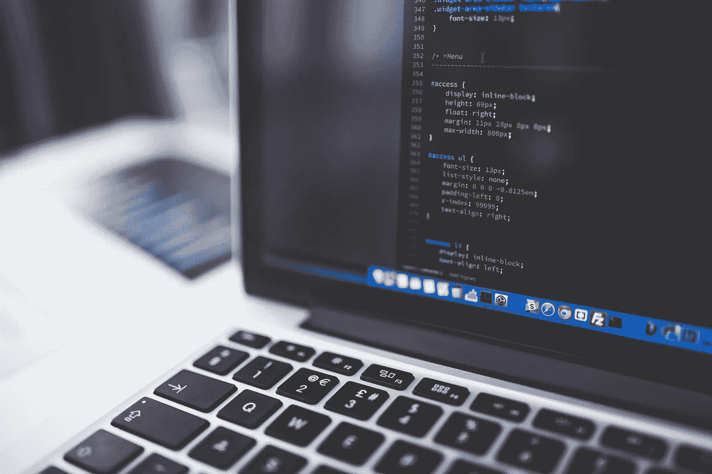
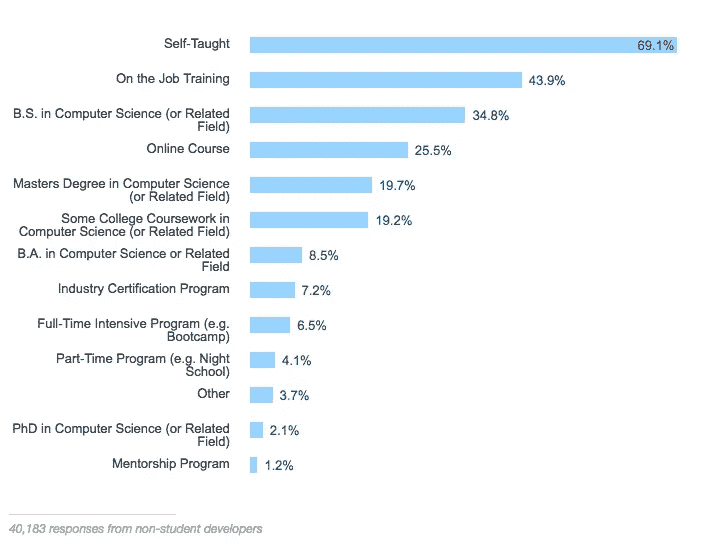
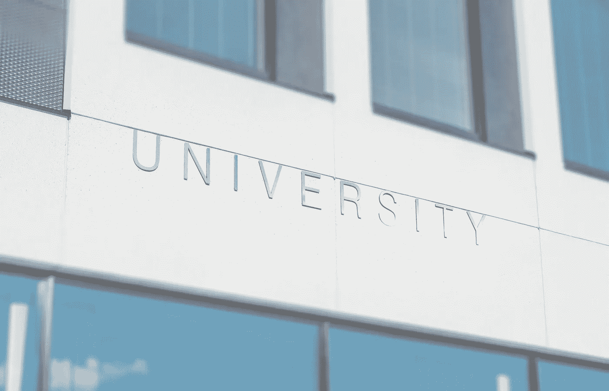
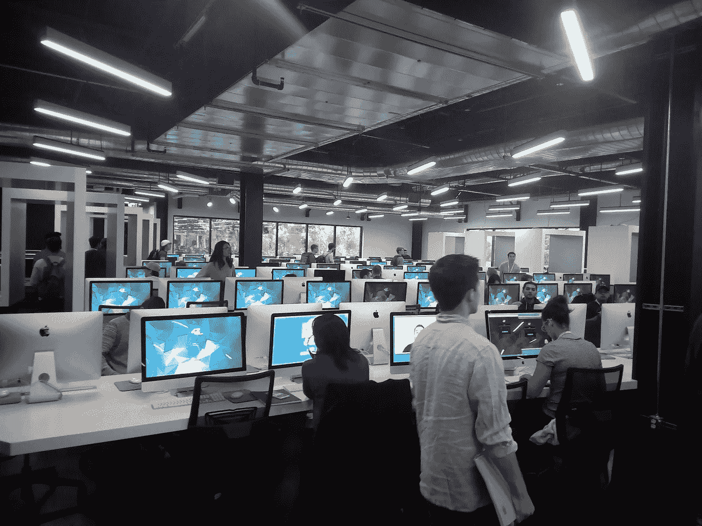

# 我是如何入侵大学系统的

> 原文：<https://medium.com/hackernoon/my-0-cost-college-plan-fdbe4fc67052>

## 我的零成本大学计划

几个月前，我决定放弃攻读计算机科学(CS)学士学位。

首先，让我澄清一下——我绝对不是说你也应该这样做。这只是我的零成本大学计划背后的故事，我对此相当自豪。

在一次又一次的大学拒绝信之后，2015 年冬天，在一所社区大学，我开始寻求回归正轨。如果一切按计划进行，我将能够在 2-3 年后转学，然后攻读学士学位。就这样，我开始了在传统教育体系中的艰难跋涉。

5 个季度慢慢过去了。我让自己经历了大约一年半的教育带来的痛苦。澄清一下，我和其他人一样热爱学习，但是我从来不喜欢传统的教育体系。对我来说，它总是太死板，太压抑创造力。

2017 年夏天，人们很快就松了一口气，也很兴奋。离开学校的自由！因此，我在 Eventbrite 和 Meetup 上尽可能多地安排了与我的兴趣和职业相关的活动。我建议几乎任何领域的任何人都这样做，尤其是如果你住在大城市附近。

整个夏天，我认识了几十个新的人，和其他走着相似道路的人混在一起。让自己接触到如此多独特的视角导致我自己的观点发生了转变，所以我开始问自己一些非常重要的问题…

我想继续强调我的平均绩点吗？

我想继续厌恶需求类吗？

我真的想继续忍受高等教育的繁文缛节吗？

我觉得科技学士学位值得我花时间和金钱投资吗？根据极端保守的估计，在加州大学要花 2 年时间和每年 15，000 美元。

…我怎么会认为我唯一的选择就是获得计算机科学学位呢？

## 没有计算机科学学位就开始计算机科学职业生涯的计划

除了允许参与大学的计算机科学研究，在我看来，计算机科学学位还有另外一个用途。当被列在简历上的*教育*部分时，通过申请筛选程序进入面试阶段的机会就会增加。

简单来说，对于像我这样进入 CS 的人来说，学位所能帮助的就是获得面试机会。有没有想过那还有什么作用？

一位员工的推荐让我直接坐上了面试的位子(或者至少是电话面试；因公司而异)。

如果技术关系可以做技术学位试图做的事情，但更可靠，更少的金融投资，那么努力获得 CS 学位的动机是什么？就我个人而言，我一个也没找到。

大多数人似乎都认为，计算机科学学位——如果真的考虑过的话——只对获得第一份技术工作有影响。后来的雇主倾向于看投资组合和 GitHubs，以及学位不能保证的其他品质。

StackOverflow 2016 Developer Survey that everyone likes to link when arguing that a CS degree is not mandatory

另一方面，支持获得计算机科学学位的人沉迷于上大学的好处和统计相关性。我可以看到他们从哪里来，我很快就会谈到这一点。

## 真正的大学计划

这是有趣的部分。

尽管我讨厌传统的教育体系，但不可否认在大学里忍受计算机科学课程的好处:

*   基本面。与一些新兴的湾区编码训练营不同，这些训练营只专注于培养了解某些框架的人，一个好的大学 CS 课程提供了一个良好的基础理解，这可以为未来的技术更好地准备一个软件工程师。
*   人脉。教室里的大多数学生都将有相似的年龄，相似的兴趣，朝着相同的目标努力，并且很可能在大约相同的时间进入相同的行业。招聘和社交活动也经常在校园里发生。所有这些都有助于未来的程序员和软件工程师获得稳固的行业人脉。
*   校园生活。在校园活动、活动俱乐部和兄弟会聚会之间，大学校园是许多美好(和不那么美好)的终生记忆的家园。

关于这些好处是否值得 4 年多和 5 位数的金融投资，一直存在争议。我当然不这样认为，但他们是公认的好，我想要他们。

我想享受大学教育的基础、人脉和校园生活，不用担心平均绩点、必修课、大学申请或学费。

我决定去上学，而不是真的去上学。字面上。

没有被大学正式录取并没有阻止我去上课。不管这门课是 800 名学生的讲座，还是 20 人的实验室。有时课堂材料可以在网上公开获得。其他时候，同学们会把所有的课程资料发给我。

你猜我还有什么没被禁止的？参加俱乐部、参加学校活动、在聚会上玩得开心、出现在讨论小组、访问办公时间等等。普通的学生用品。有时我需要朋友的帮助才能进入钥匙卡后面的区域。其他时候，我只是等着有人来开门。

到目前为止还没有人给我添麻烦。有几次我不得不说我是一个准学生，但通常，人们有比我的存在更重要的事情要担心。我还没有撒谎说我不是学生。

我的大学计划的有效性在不同的大学之间有所不同。最简单的开始方式是跟踪一个实际去那里一天的朋友，然后要求参观学校和时间表。如果有足够的信任，登录也可以共享课程材料访问。或者，寻找一个研究援助的机会，并从那里开始。

有些人告诉我，这些方法在他们的学校是行不通的，但是验证和选择你的战斗不会有什么坏处。

## 更符合我的大学计划

2017 年 5 月，我参加了 Silicon Hacks，这是我最初的几次黑客马拉松体验之一。它是在一个名为硅谷 42 号的免费编码学校举办的。

Courtesy of Jose

我仍然很难相信这样的事情会在美国发生。

无教师点对点弹性学习课程？超赞的机房？所有这些都是免费的，没有收入分成或其他需要担心的诡计？

最棒的是，它满足了我的大部分需求:

> 我想享受大学教育的基础、人脉和校园生活，不用担心平均绩点、必修课、大学申请或学费。

有一个申请过程，但是没有大学申请费用、论文、推荐信或者[任何关于你个人](https://www.insidehighered.com/admissions/article/2017/08/07/look-data-and-arguments-about-asian-americans-and-admissions-elite)[背景](https://www.npr.org/sections/ed/2017/08/17/542575305/high-achieving-low-income-students-where-elite-colleges-are-falling-short)的事情影响你的申请机会(查看链接；他们是相当荒谬的)。42 录取学生的时候根本不在乎这些。他们只关心学生不是一个混蛋，并通过他们所谓的 *Piscine* (游泳池的法语单词)；这 42 个术语表示连续 28 天每天编码 14 小时。这并不像听起来那么糟糕。

他们的课程首先使用 C 编程语言，然后学生能够在 C 中选择图形、文件系统和算法。一旦学生达到一定水平，他们就能够选择更适用的重点，如 Python web dev、Unity、C++、RSA 加密等。

物理的点对点协作游戏化学习环境是 42 对[布鲁姆的两个西格玛问题](https://en.wikipedia.org/wiki/Bloom%27s_2_Sigma_Problem)的回答，即如果学生获得个性化的学习体验，学习效率基本上会翻倍，但社会还不能为每个人提供这样的体验。

42 经常有演讲者来访。黑客马拉松和招聘活动经常在网站上发生。学生群体是最棒的共事群体之一——积极、健谈、友好、能干。校园里也有学生组织的活动俱乐部。即兴俱乐部是我个人最喜欢的。

因为 42 没有固定的时间表，我只是在完成我的学校时间表和在大学玩得开心的时候去那里。

我一直觉得美国教育体系宁愿让我申请学生贷款(并购买比我需要的更多的大学课本)，也不愿让我探索自我，提高个人水平。这个零成本大学计划是我个人*去你的*的回应。

希望你觉得这个博客有点意思或有用。我无意对学术界表现出居高临下的态度，然而，逃离这种范式*的喜悦可能让我有点兴奋和沾沾自喜。*

*- A*

2021 年编辑:作为一个从旧金山的自由网络开发者，到日本一家加密初创公司的软件工程师，再到香港一家数字营销机构的创始人，迄今为止，这条道路上没有一件事需要大学学位。我想知道是否有一天我会停下来想:我本应该完成大学学业。