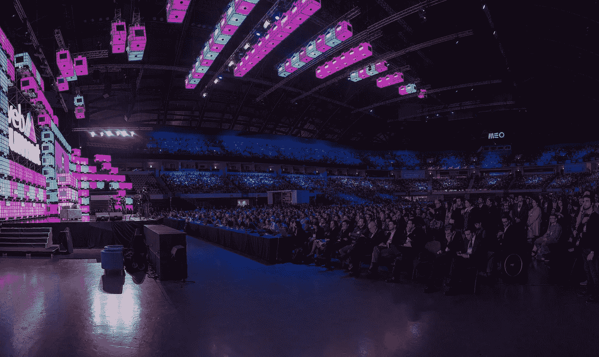

# 我的 5 个网络峰会 2016 最喜欢的演讲

> 原文：<https://medium.com/hackernoon/my-5-web-summit-2016-favourite-talks-62f24d1d8f9e>

Web Summit Facebook

## 加里·维纳查克

加里是我的偶像之一，他没有让我失望。如果你经常看他的视频，你不会发现任何关于这个演讲的新信息，但是哇，看到他在舞台上表演是多么不可思议。我想我从未见过他如此兴奋。能量是疯狂的！会场里有 12000 人，他完全毁了这个房间！人们欢呼着，叫喊着，我前面的一个女人激动地从椅子上跳了起来。对我来说，我最喜欢的 Web Summit 2016 时刻。

[害怕因为别人的看法而失败？](https://www.facebook.com/WebSummitHQ/videos/1203367773062598/)

## 框架存储

我真的很喜欢这个演讲。我一直没有关注[虚拟现实](https://hackernoon.com/tagged/virtual-reality)，但这为我做了。Framestore 是一家为《地心引力》和《神奇动物在哪里》等电影做 CGI 和视觉特效的公司。他们已经开发了一个虚拟现实游戏，在这个游戏中，你可以置身于哈利波特中。看到你手里真的拿着魔杖变魔术，真是太棒了。首席执行官威廉·萨金特(William Sargent)展示了一段令人难以置信的“火星实地考察”视频。Framestore 用虚拟现实屏幕取代了校车上的所有窗户，并带着一群孩子去火星旅行。如果校车在现实中加速了，那它在火星也会加速。对环境完全敏感。厉害！此外，他展示了使用虚拟现实对截瘫患者进行治疗的图像。相当强大和鼓舞人心的东西！

[电影将以我们无法想象的形式存在](https://www.facebook.com/WebSummitHQ/videos/1202497909816251/)

## 超回路一号

这也是令人敬畏的。联合创始人 Josh Giegel 向我们展示了他对 Hyperloop 的愿景，它看起来非常棒！他们认为，未来没有人会拥有汽车，他们将能够从沿海地区移除所有的集装箱港口，因为 Hyperloop 将成为主要的货物运输工具。未来看起来棒极了！

[moon shots 和 Hyperloop One 的时代](https://www.facebook.com/WebSummitHQ/videos/1205529439513098/)

## 脸书的首席技术官

迈克·斯科洛普夫就 facebook 的未来做了一次演讲。这与马克·扎克伯格几周前展示的信息相同，但看起来也很令人兴奋。他们正在解决连接性(试图将互联网带给更多人)、人工智能和虚拟现实问题。

[十年后…](https://www.facebook.com/WebSummitHQ/videos/1201598533239522/)

## 脸书的信息产品副总裁

我真的很喜欢这个演讲，因为除了脸书在人工智能方面的工作，我们可以看到脸书在不久的将来的计划:他们想占领应用程序市场。信使计划越来越多地押注于信使机器人。

机器人:它们有什么用？

你可以在这里[阅读我是如何克服害羞并在峰会上与数百人交谈的](/@baptista/how-i-conquered-shyness-and-talked-to-hundreds-of-people-at-web-summit-2016-dc17fb1deebf#.uqcwtlyjz)

你可以在这里阅读我给帕迪·科斯格拉夫[的公开信](/@baptista/dear-paddy-cosgrave-78df101c447#.x2os1fao8)

欢迎在 [linkedin](https://pt.linkedin.com/in/francisbaptista) 或 [instagram](http://www.instagram.com/franciscobaptista/) 上给我发消息

> [黑客中午](http://bit.ly/Hackernoon)是黑客如何开始他们的下午。我们是阿妹家庭的一员。我们现在[接受投稿](http://bit.ly/hackernoonsubmission)并乐意[讨论广告&赞助](mailto:partners@amipublications.com)机会。
> 
> 如果你喜欢这个故事，我们推荐你阅读我们的[最新科技故事](http://bit.ly/hackernoonlatestt)和[趋势科技故事](https://hackernoon.com/trending)。直到下一次，不要把世界的现实想当然！

