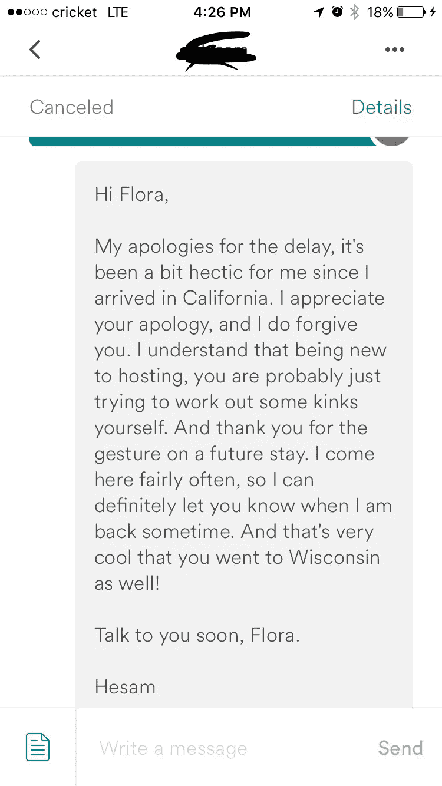

# 我的 airbnb 故事——危机管理和沟通

> 原文：<https://medium.com/hackernoon/my-airbnb-story-crisis-management-and-communication-15f41f62b05b>

Photo by [Patrick Perkins](https://unsplash.com/photos/iRiVzALa4pI?utm_source=unsplash&utm_medium=referral&utm_content=creditCopyText) on [Unsplash](https://unsplash.com/?utm_source=unsplash&utm_medium=referral&utm_content=creditCopyText)

我做了 5 年多的 airbnb 房东。遇到了很多有趣的人，交了很多朋友，帮助了很多人，看到了很多人从人生的低谷中爬了回来。但是最近发生的事情真的帮助我成长了，我真的很感谢 airbnb 的员工帮助我度过了这一切。

5 年前，我家里就有了 airbnb。但是后来停了很久，今年又回到了主机 tab。

当我回来的时候，很多事情都变了，他们的政策，界面等等。这是完全不同的。所以很长一段时间我都不知道该怎么处理。然后它给了我一些负面的评论。如果你曾经主持过 airbnb，你就知道评论有多重要。我无法向 airbnb 解释这些是如何发生的，也不允许删除负面评论。

在某些时候，我在想:Airbnb 不再爱我们的主机了。只关心客人。

但是直到有一天，发生了一件比上面那些更糟糕的事情，但是我对 airbnb 的印象真的改变了。他们仍然爱我们主持人。

有一次这位客人的航班延误了，他来的时候已经过了午夜。我真的拿着我的手机在车上睡了一夜…..

那天我工作了一整天，从旧金山出发，然后去南湾，再回来。所以我真的很累。当我在凌晨 1:30 醒来，意识到我错过了客人的电话，我尖叫起来。然后 airbnb 发来几封警告信，说因为我没有回复我客人，我会成为 Q$#%#^%$#！。反正坏事……

第二天是灾难性的，因为自责、家庭压力和害怕被迫暂停上市。我的家人也对我不满意，因为不负责任不是我们家的传统。

但当我的案件经理打电话给我时，事情发生了变化。

当我第一次接到案件经理约翰尼的电话时，我非常难过。我想这可能是对我的最后通知，我在 airbnb 上的房间将被删除。

所以我对他大喊大叫，我几乎要哭了。“Airbnb 已经不爱我们了！你只怪我！我甚至没地方告诉你发生了什么！$%$^%@$#@$#%#%#."我喊了很多次。

与我恶劣的态度形成对比的是，案件经理保持了非常冷静的态度。(我那样吼了他之后不知道他是怎么做到的。)他说:“弗洛拉，冷静点，如果我们不再爱你这个主持人了，你以为我在这里干什么？现在告诉我发生了什么！”然后我真的冷静下来，开始跟他说那天发生的事情。

他只是施了些魔法。我感觉好多了！！那一天，我觉得自己像个傻瓜。

约翰尼在得知我正在遭受痛苦后，还做了额外的努力。“弗洛拉，这都是关于[沟通](https://hackernoon.com/tagged/communication)，”他教我如何回到客人身边，解释情况，并提供更多东西。然后根据他的建议，我给那位客人发了信息，解释了我的情况，并再次道歉，最后，如果他再来，我会给他很大的折扣。

大约一个月后，客人回复说他愿意再次光临，并接受我的道歉。形势扭转了！那是我在 airbnb 的时间里最快乐的时光之一。

我从这件事中学到了一件重要的事情:沟通是任何冲突的关键！良好的沟通可以将许多危机转化为新的机遇。

沟通不仅仅是表达我们自己的观点，还需要耐心倾听他人的意见。帮助他们解决问题。

危机可能不是一件坏事，它实际上给了一个更多交流的机会，这可能意味着更深的联系或对他人更好的理解。从长远来看，这实际上会带来更好的结果。

我很高兴我在 airbnb 主持节目，如果真的有机会，我想看看这个 Johnny，感谢他教会我这些。