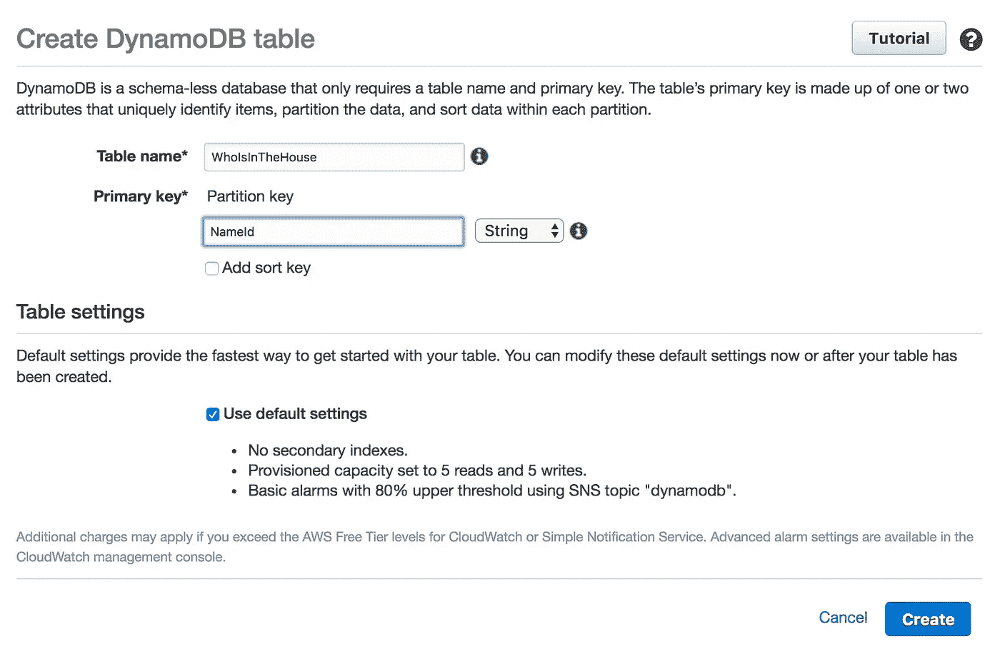
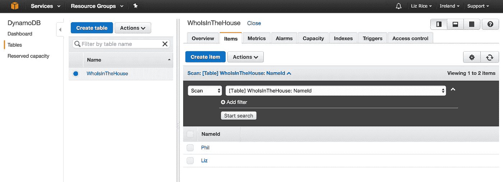
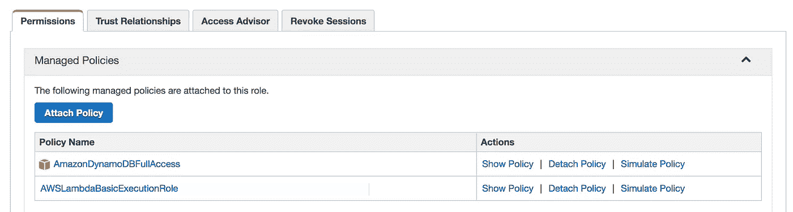
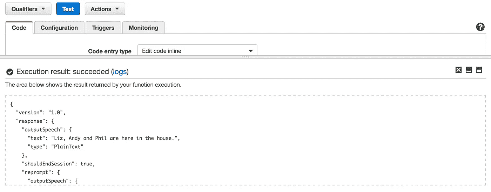
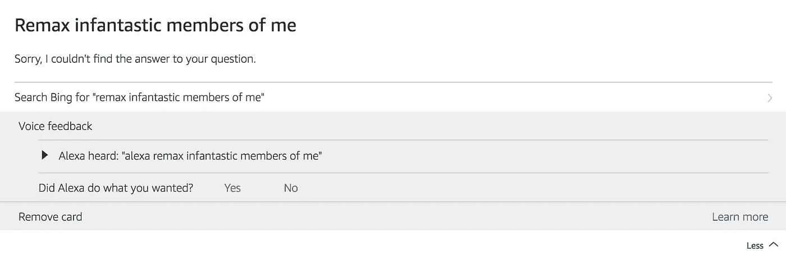

# 我的 Alexa 存储技能

> 原文：<https://medium.com/hackernoon/my-alexa-skill-with-storage-5adb1d097b88>

我最近写了关于我第一次尝试编写 Alexa 自定义技能的文章。我的下一步是扩展我非常简单的技能，以获得一些存储。

目前，我的自定义技能只是读取当前在房子里的人的列表——并且这个列表是硬编码的。我想更新它，这样它就可以从数据库中读取人名列表。

# 什么储藏室？

我自然倾向于将我的信息存储在 RDS 下运行的 PostgreSQL 数据库中。但是我很确定我已经过了 AWS 的免费年，所以我被 DynamoDB 吸引了，因为少量的使用是无限期免费的。我以前从未使用过迪纳摩，但现在似乎是一个学习的好时机！

# 创建表格

设置我的姓名表并添加几个条目非常简单。



# 从表中读取名称的 Python 代码

我在亚马逊文档中找到了一些使用 DynamoDB 和 Python 的[样本代码](http://docs.aws.amazon.com/amazondynamodb/latest/gettingstartedguide/GettingStarted.Python.04.html)。以此为起点，我编写了以下代码，从我的 DynamoDB 表中读取姓名列表，并将其作为字符串返回。

```
def get_names():
    names = "" dynamodb = boto3.resource('dynamodb', region_name='eu-west-1')
    table = dynamodb.Table('WhoIsInTheHouse') response = table.scan() nameCount == len(response['Items'])
    for idx, item in enumerate(response['Items']):
        names += item['NameId']
        if idx == nameCount - 2:
            names += " and "
        else if idx != nameCount - 1:
            names += ", " return names
```

示例代码将 localhost 上的一个端点指定为 *boto3.resource* 调用中的一个参数，因为它使用了本地运行的 Dynamo 实例，但是如果您在 AWS 上运行 DynamoDB，您可以简单地忽略这个端点。您确实需要获得正确的 region_name 参数。

我想让我说出的名字听起来自然一些，所以我用逗号将它们分开，并用单词“and”将最后两个分开。我更新了几天前写的λ函数[来使用这个名字列表，而不是之前的硬编码版本。](https://hackernoon.com/my-first-alexa-custom-skill-6a198d385c84#.pnqpr7eyk)

```
def get_welcome_response():
    session_attributes = {}
    card_title = "Welcome"
    speech_output = get_names() + " are here in the house."
    should_end_session = True
    return build_response(session_attributes, build_speechlet_response(
        card_title, speech_output, None, should_end_session))
```

# 许可

我的 Lambda 函数需要被允许访问 Dynamo 表。为了实现这一点，我将 AmazonDynamoDBFullAccess 策略添加到我的 Lambda 函数正在使用的 IAM 角色的托管策略集中(我之前创建了这个角色，并将其命名为 *myAlexaRole* )。



# **测试 lambda 函数**

和以前一样，您可以简单地点击 Test 按钮来查看函数是否如预期的那样运行。



# 连接到 Alexa

我之前撒了谎——或者至少我没有提到我创建了一个名为 *myStorageLambda* 的新 Lambda 函数，而不是编辑原始版本。发布同一个 Lambda 函数的新版本是可能的，但我现在将跳过它。

我不需要从我的 Alexa 技能中获得任何新的东西，但我只需要通过配置它使用 ARN 来更新它以指向 *myStorageLambda* 。

# 有用！

# 当我写这篇文章的时候…

…我们开着电视作为背景，Alexa 第一次把他们说的话误认为是对她的指示。我不知道他们到底说了什么，但我很确定她听到的不是那样…



# 下一步是什么？

接下来，我想改变 lambda 函数并添加一些更多的意图，以便我们可以让 Alexa 知道人们何时进入或离开房子，而不用直接修改 Dynamo 表。

我打算把代码发布到 GitHub 上，但是我还没有找到时间。你会觉得有用吗？请在回复中告诉我。

如果你喜欢这篇文章，请点击推荐按钮，这样其他人可能会更容易找到它，并编写自己的 Alexa 技能或将 DynamoDB 整合到他们的 Lambda 函数中。

**接下来——这是我的 Alexa 之旅的第三部分**[](https://hackernoon.com/alexa-skills-and-intents-be8886645ff#.abjipg9j6)****，我在这里添加了对话意图****

**[](http://bit.ly/HackernoonFB)****[](https://goo.gl/k7XYbx)****[](https://goo.gl/4ofytp)**

> **[黑客中午](http://bit.ly/Hackernoon)是黑客如何开始他们的下午。我们是阿妹家庭的一员。我们现在[接受投稿](http://bit.ly/hackernoonsubmission)并乐意[讨论广告&赞助](mailto:partners@amipublications.com)机会。**
> 
> **如果你喜欢这个故事，我们推荐你阅读我们的[最新科技故事](http://bit.ly/hackernoonlatestt)和[趋势科技故事](https://hackernoon.com/trending)。直到下一次，不要把世界的现实想当然！**

****