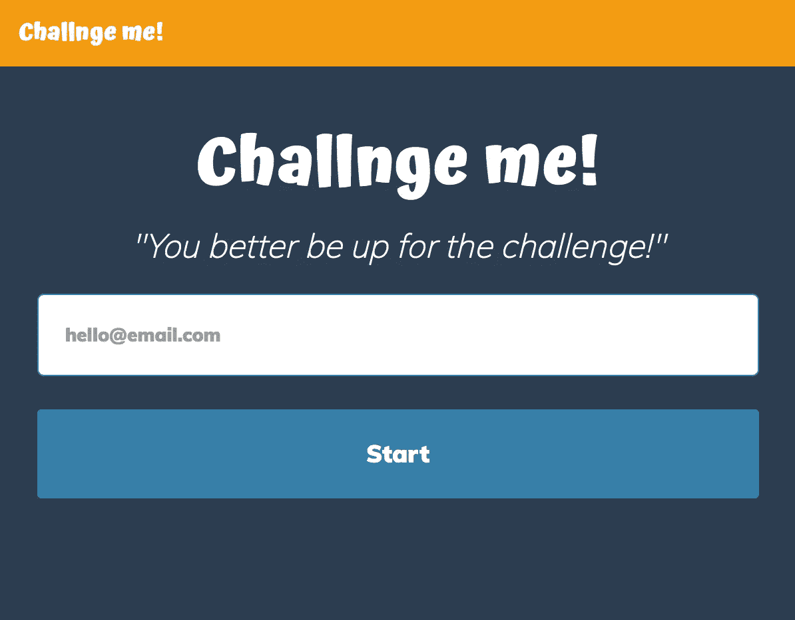

# 我对 React 的挑战

> 原文：<https://medium.com/hackernoon/my-challenge-with-react-426b678a4b76>

我在选择 JS UI 库时遇到了很多麻烦，因为有太多的选项 Angular、React、Ember、VueJS 和其他许多选项，但我必须选择一个，所以我的第一选择是当时最受欢迎的……Angular，但它不适合我。

然后我开始关注我的 Twitter feed，发现 React，每个人都在发表很多好的评论，我想这可能是新的热潮。然后 2016 年 11 月的[思想工作雷达出来了，它就在那里……在采纳部分做出反应……那是从杯子里掉出来的一滴水。我马上开始疯狂阅读](https://www.thoughtworks.com/radar/languages-and-frameworks/react-js) [React 官方文档](https://facebook.github.io/react/docs/hello-world.html)，并开始了一个小项目…不喜欢它…没有完成它。

在那之后，我开始为副业寻找新的想法，发现[是一个收集了很多想法的推特](http://www.ideamachine.io)的网站，这个吸引了我的注意:

My inspirational tweet (Thanks, @HiEmbee. I like your idea.)

因为我想学习反应，所以我编码挑战我！。是...名字少了一个 e，我想有一些不同的东西。这很简单。你注册，选择你最喜欢的类别，它会挑战你。完成挑战后，你可以在 Twitter 上分享它，并保留你完成的每个挑战的美好记忆。

Challnge me! Landing page

对我来说，嗯，我有我的挑战要完成来与你分享我的经验，那就是学习反应，至少是最基本的。

Challenge Accepted!

> 在 React 中创建一个挑战用户的项目

这是我的挑战，但我不能就此止步，最后一件事是写一篇关于它的帖子…这篇帖子。

我觉得这是一次冒险。首先，我必须学习 React，对我来说，理论是不够的，我必须亲自动手，所以在阅读文档后，我将它钉在一个 Chrome 标签上，并使用 React.js 推荐的技术创建了这个项目: [ES6](http://es6-features.org/#Constants) 、 [JSX](https://facebook.github.io/react/docs/introducing-jsx.html) 和 [Webpack](https://webpack.js.org/) 。我还使用了 [React 路由器](https://css-tricks.com/learning-react-router/)进行网站导航。

除了 Webpack，一切都相对容易。我必须承认，它给我的配置和理解带来了一些麻烦，但在 Webpack 文档和各种媒体帖子的帮助下，我可以毫无问题地使用 webpack.config.js。

这个项目也为我提供了一个实践设计的机会，这是我最大的弱点之一。有了 Youtube 上的各种视频和许多第二意见，我能够选择排版并稍微组织一下布局，我对设计的眼光也提高了。

我知道这并不完美，但这是一个开始，还有很多东西要学，Javascript 世界总是在成长、变化和进化，我们永远不应该停止学习。

如果你想挑战 React，我找到了一些有用的资源:

*   [React.js 正式文档](https://facebook.github.io/react/docs/hello-world.html)
*   [丹·阿布拉莫夫的《表象与容器组件》](/@dan_abramov/smart-and-dumb-components-7ca2f9a7c7d0)
*   [Webpack 官方文档](https://webpack.js.org/guides/get-started/)
*   [用 React 升级:React 路由器](https://css-tricks.com/learning-react-router/)
*   [ES6 特性](http://es6-features.org/#Constants)
*   [2017 年要学习的顶级 JavaScript 框架&主题，作者 Eric Elliot](/javascript-scene/top-javascript-frameworks-topics-to-learn-in-2017-700a397b711)
*   [如何利用上课和晚上睡觉](/@dan_abramov/how-to-use-classes-and-sleep-at-night-9af8de78ccb4)

基本平面设计视频:

*   [开始平面设计](https://www.youtube.com/playlist?list=PLpQQipWcxwt8vVzFpoJS5TtCh8Ktke9TH)
*   [排版教程—帮助你规则排版的 10 条规则](https://www.youtube.com/watch?v=QrNi9FmdlxY&t=108s)

如果你想看代码和/或给我一些建议来不断提高我的技能:[挑战我！Github](https://github.com/Jalissa/challngeme) 。

> [黑客中午](http://bit.ly/Hackernoon)是黑客如何开始他们的下午。我们是 [@AMI](http://bit.ly/atAMIatAMI) 家庭的一员。我们现在[接受投稿](http://bit.ly/hackernoonsubmission)，并乐意[讨论广告&赞助](mailto:partners@amipublications.com)机会。
> 
> 如果你喜欢这个故事，我们推荐你阅读我们的[最新科技故事](http://bit.ly/hackernoonlatestt)和[趋势科技故事](https://hackernoon.com/trending)。直到下一次，不要把世界的现实想当然！

