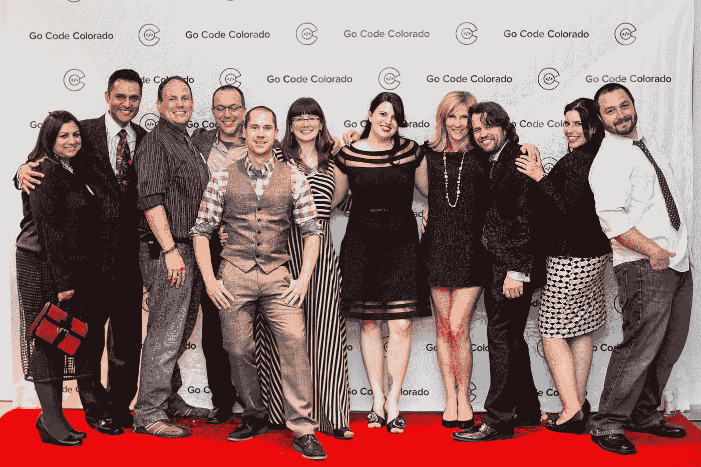
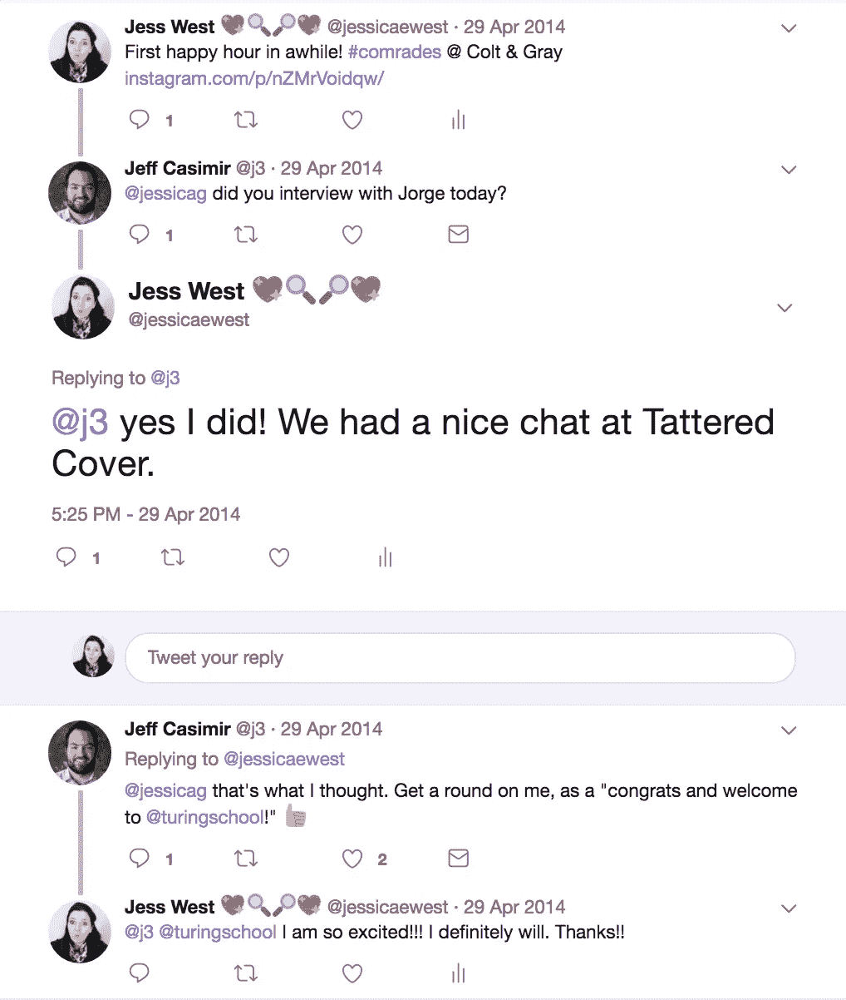
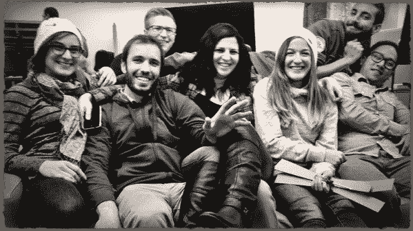
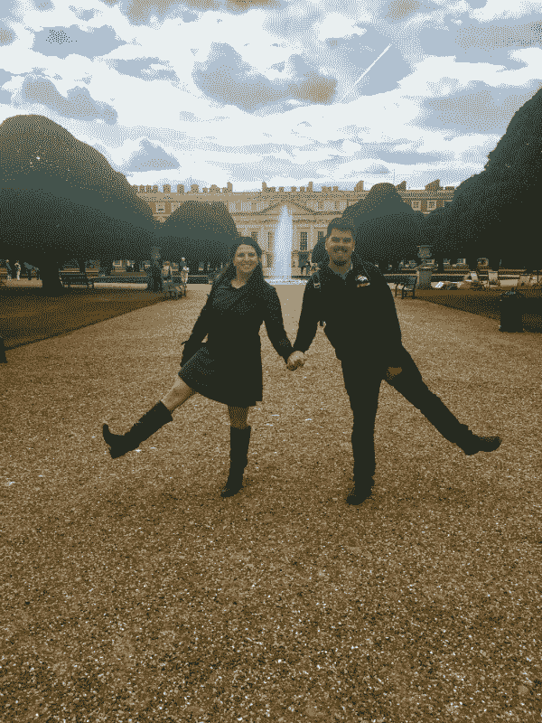

# 我对软件开发的追求

> 原文：<https://medium.com/hackernoon/my-climb-into-software-development-adf11cb91414>

我经常被问到“那么，你是如何进入[软件开发](https://hackernoon.com/tagged/software-development)的？”对此，我的回答是笑着说“想要快速和肮脏的版本还是完整的故事？”

TLDR 版本:我感觉营销停滞不前，对网络开发很好奇；尝试了两年的自学路线和实习，然后在图灵软件和设计学院结束并直接进入。快进到今天，瞧，软件工程师。

尽管 TLDR 并没有真正告诉你旅程。所以如果你想要真实的故事，继续读下去。

让我们回到 2009 年。我是 5 个度假村的营销主管，管理所有的营销和销售工作。经济不景气，他们正在削减部门。我的选择是要么跳槽，因为我目前的职位正在被淘汰，要么离开公司。最终，我留在了科罗拉多州，并在一家新公司担任电子商务营销总监。

在我的第一天，新老板说“所以，我们需要重做我们的网站，你是做营销的，你能做好吗？”我信心满满地回答道:“当然，让我准备一份行动计划，明天我们再来看。”那天晚上，我回到家，在谷歌上搜索“如何建立网站……”，找到了许多选项，包括 Dreamweaver(唉，不)和一些内容管理系统。最好的解决方案是使用 Drupal 和 WordPress，同时仍然维护该公司现有的超级过时的 php 网站，直到另行通知。

我学到了很多东西，打破了很多东西，包括当我意识到我删除了生产的那一天。我永远也忘不了午餐前那令人心跳停止、惊慌失措的时刻，以及我意识到的事情:删除一个文件夹，以为它是重复的，检查网址，然后意识到，天哪，网站不见了。不见了。

疯狂地，带着前所未有的焦虑，我花了一个下午的时间重建网站，将 PPC(点击付费)活动转移到另一个网站，一边对着纸袋呼吸一边疯狂地打字，直到我的老板发现有些不对劲。

这是一个幸运的教训:我是我们部门唯一的人，我控制了我 8X12 办公室的所有恐慌。然而，我学到了一些关于发展的宝贵经验:

1.  从不在生产中编辑，
2.  保留备份，
3.  并且——稍后——使用源代码控制。

那天晚上在一杯酒后，在回顾了所有出了问题和可能变得更糟的事情之后；我想通了什么会有所不同。我认识到了知识。

> 知识使粗心的错误和天真的错误有所不同。

我知道我需要一个更好的学习和训练环境。

一年后，我离开了，花了一年时间为需要网站的小公司做自由职业者，主要是通过口碑来迎合商业，阅读所有我能阅读的关于 WordPress 的最佳 SEO 实践和代码标准，并构建定制的小部件。起初，这感觉很棒，掌控自己的事业，经营自己的事业，一切都朝着好的方向发展。然而，有一种挥之不去的感觉，好像我可以做得更多。“还有其他什么语言吗？谁是创建 WordPress 的幕后推手…我能学着这么做吗？”这引发了对话和研究，街上的传言是，如果你想进入“[初创企业](https://hackernoon.com/tagged/startup)”行业，磨练你的技能，博尔德是个好地方。

下一站，博尔德！我担任了运营职位，为营销和开发部门的大公司创建定制的社交媒体报告。这个机会是为了进入创业现场，与技术团队近距离接触，了解他们在做什么。幸运的是，这个职位让我可以两者兼顾，在我工作的前两周，我和开发团队成为了朋友，我的一个队友[内森](https://twitter.com/aniero)，以 Rails 的形式为僵尸提供了鼓励。紧随其后的是发现 git 和 GitHub，我被吸引住了。

与此同时，蒂姆走进了我的生活。他创办了 Boulder Beta，我喜欢他为社区所做的事情，所以我开始参加更多的活动，结识更多的人。就在这个时候，2011 年秋天，我决定在丹佛的创业周末做志愿者。在参加了几次聚会和经营那个创业周末之后，我也迷上了建立社区。

2012 年初，我一直在自学 Rails，并开始编写一些 JavaScript，这时我在一次聚会上遇到了 Jessica。她被指给我看，是房间里仅有的几个女人之一，她的名字也叫杰西卡。因此我们必须互相交谈，对吗？以一种可能是最尴尬的方式接近她，我开始了关于她最近纹身的谈话，这些纹身碰巧是超级新的和脱皮的。我们对此一笑置之，然后很快就成了朋友。就在那一刻，我能够想象自己实际上成为了一名开发人员。刚刚遇到这个正在学习软件开发的坏家伙，他从八岁起就不再学习软件开发了，那天晚上，我的灵感如潮水般涌来。

在工作日，我在寻找不同的方法，用我所学的软件技能让我的工作更有效率。这有多种方式，但我最喜欢的是开发一种工具，通过 Klout API 调用在几分钟内挖掘数据，减少了通常需要营销部门 8-10 小时才能完成的任务。不久之后，工程系有一个实习机会，这是我争取的机会！

在与我的部门主管和其他几个开发人员讨论了可能的转变后，他们都为我的转变感到非常兴奋。在做了准备工作并清理了我制作的奇特工具后，我准备好了，会议开始了！工程主管和我坐在一起，我介绍了他们为什么会雇用我的原因，我之前在 WordPress 网站、服务器和我为这个团队开发的工具上所做的工作。我感觉这是一个很好的机会，因为我在公司也有领域知识，我被告知时完全没有表情

> 我不喜欢让女性加入我的工程团队，她们太让人分心了。

又是一个心跳漏拍的瞬间，感觉自己被火车撞了。这是我第一次体验到科技领域真正的性别歧视。我惊呆了。*“等等，什么。这是个东西吗？这怎么可能呢？我说错或做错了什么？我穿的衣服不合适吗？”当我咕哝了一声谢谢就离开时，无数的问题和自我怀疑掠过我的脑海。那天晚上喝过酒后，我再次发现自己陷入了沉思，然后愤怒了。*“他怎么敢这么说。这太荒谬了，反正我也不想成为这个团队的一员。我会证明给他们看，我能胜任这份工作，还能做得更好。”**

不到一周，我就辞职了，给首席执行官发了一封长长的电子邮件，列举了公司所有的问题。我可以写更多关于我在旅途中经历的所有性别歧视，公开的和消极的(总有一天会)，但这需要另一篇博文。简单地说，这个评论推动了我在技术领域与女性的合作，并使我成为新软件开发人员的大力支持者。

第二个月，我申请了两个训练营和另一个实习机会，但被拒绝了。

> 我必须向每个人证明他们是错的，我可以进入软件开发的动力之火正在变暗，我感到不知所措。

在这段时间里，我做了很多瑜伽来平衡压力，有一天，当我躺在 Savasana 的时候，我想到了我生活中所有走进死胡同的事情；老师宣布瑜伽老师培训将在两周后开始。我的直觉反应是*“…可能会尝试一些完全不同的东西，看看我是否能成功。”*那年夏天，我全身心地投入到瑜伽中，过上了完整的瑜伽生活，获得了高温瑜伽、瑜伽流、雕塑有氧运动和力量课程的认证。

在那 4 个月里，我的生活非常幸福，我的状态非常好，但是我觉得我好像错过了什么。我没有感到完全满足，渴望更多的东西。在许多了不起的朋友的鼓励下，我选择再次尝试软件路线，并在丹佛创业周进入全面联网模式。我参加了一个招聘会，发现一家公司正在招聘 Rails 实习生，在那里谈了很长时间，面试了很长时间后，我得到了这份工作。在这里，我遇到了伊莲，我们决心以#伊莲的身份一起征服世界。

> 不幸的是，在我们开始实习的两周内，这两位打算指导我们 6 个月的学长退出了。

我们只剩下一个不了解 Rails 的高级开发人员，每周只有 30 分钟的时间来提问。与此同时，我们继续致力于解决产品缺陷和小功能。这是一个艰难的处境，但我们保持乐观，因为我们都想成为软件开发人员，而且公司非常好。然而，六个月后，我们都比彼此学到了更多的知识，但对于初级开发职位来说还不够。又一个失败了。

于是又到了夏天，我决定在欧洲度过；和我爸爸住在一起，舔舔我又一次失败的伤口，试着研究我得到了什么反馈，为什么我不够好。那年秋天，我回来了，一直在通过 galilen 处理我的 G-School 申请，这时 Elaine 找到我，和她一起研究 [Go Code Colorado](https://twitter.com/gocodecolorado) ，这是她和一个团队正在研究的概念。这不是一份软件开发的工作，但我不确定我是否能马上得到这份工作。它吸引了我喜欢的社区和软件的结合，似乎是寻找我的下一个角色和帮助建立一些新的和令人兴奋的东西的完美机会。那年我和团队一起工作到 2014 年 4 月，这是第一年的[巨大成功！](http://gocode.colorado.gov/2014-wrap-up/)

与此同时，在 2013 年初冬的科罗拉多 Go Code 期间，我在 DenverRB 的一次聚会上遇到了 Jorge T1，他告诉我他所在的学校即将成立，名为 T2 图灵 T3。这直到 2014 年 6 月才开始，但他向我保证等待是值得的。这促使我重新联系了我在 Rails 实习期间见过的[杰夫](https://twitter.com/j3)，就他创办的这所学校进行了一次非常坦率的交谈。就是这样:这是我最后一次去找软件开发的工作。我可以对我的时间进行另一项投资，并为我的未来做出一大块改变，如果不是这样，那就什么都不是了，我会回到市场营销或在其他地方找到我的职业。我焦急地等着申请表出来，申请，申请到一半就停下来，害怕再次被告知我不够好。*“我能再接受一次拒绝吗？这个越来越尴尬了"*。杰夫通过电子邮件联系我，鼓励我完成我的逻辑问题申请和一个视频(当然我有🍷事先)和神圣的狗屎，[我被接受了。](https://twitter.com/jessicaewest/status/461300359453884417)

游戏。改变者。

接下来的 7 个月很难熬。真的很难。然而，信息的洪流和我得到的令人惊奇的指导使我做了一百次值得的决定。图灵通过自学填补了我不懂的空白，消除了我养成的一些坏习惯，给了我对 TDD 的热爱，打开了我的世界为开源做贡献，最重要的是，我遇到了一些了不起的人，直到今天我仍然称他们为朋友。

图灵之后，我在两家公司工作过，一家很小的咨询公司和一家很忙的创业公司。两者都提供了一些很棒的经验，我很感激我在每个地方学到的东西。我想回报学校和社区，它们为我的人生转变提供了支点，所以我继续在图灵辅导个人，并通过琼·克拉克协会继续辅导。通过图灵，我也认识了[史蒂夫](https://twitter.com/stevekinney)，我最喜欢讽刺的人类之一。两年前，他找到我，说要做[恐龙](https://twitter.com/dinosaur_js)，所以我们一起做了，感觉棒极了。Go Code Colorado 一直令人惊叹，我有机会在它存在的整个过程中与他们一起工作，以科罗拉多技术创新的另一个巨大成功[结束了第四年。](http://gocode.colorado.gov/2017-go-code-winners/)

> 在过去的几年里，所有这些道路将我带到了我生命中的一个地方，在那里我意识到我在业余时间同时经营着一个社区赛道，在我朝九晚五的职业生涯中经营着一个工程赛道。

我很激动地宣布，我找到了一个能让我发挥我的代码技能和社区技能的角色:Algolia[的开发者倡导者。](https://twitter.com/algolia)

> 找到相信你的人，和他们站在一起，远离怀疑你的人。

在我的旅程中，有关键的拥护者，也有关键的反对者。如果我听了那些诋毁者的话，我就不会是@jessicag。通过倾听并与正确的人结盟，作为一名软件工程师，我精通多种语言，并且我每天都在继续学习并变得更好。我喜欢认为你的生活是由你自己创造的，的确如此，但也是你决定一路上听谁的话。如果你足够努力，你可以让你的梦想成真，并且像一个坏习惯一样抛弃那些讨厌的人。

在整个旅程中，我很幸运地得到了我的好丈夫布兰登·韦斯特的情感和经济支持，我意识到这并不是每个人都有的。从第一天到第三千天，他一直在那里，经历了冒险和起起落落。我觉得自己很幸运，在生活中有一个真正伟大的伴侣；一个真正理解并支持我事业的人。谢谢你的爱！

> [黑客中午](http://bit.ly/Hackernoon)是黑客如何开始他们的下午。我们是 [@AMI](http://bit.ly/atAMIatAMI) 家庭的一员。我们现在[接受投稿](http://bit.ly/hackernoonsubmission)，并乐意[讨论广告&赞助](mailto:partners@amipublications.com)机会。
> 
> 如果你喜欢这个故事，我们推荐你阅读我们的[最新科技故事](http://bit.ly/hackernoonlatestt)和[趋势科技故事](https://hackernoon.com/trending)。直到下一次，不要把世界的现实想当然！

