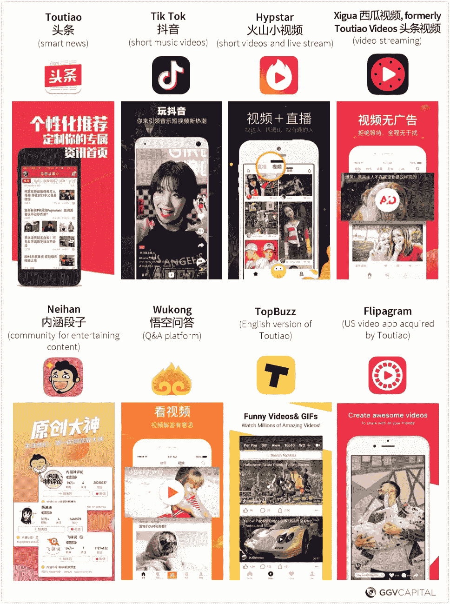
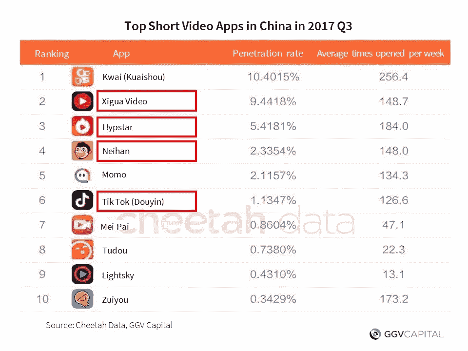

# 我与今日头条创始人张一鸣的对话

> 原文：<https://medium.com/hackernoon/my-conversation-with-zhang-yiming-founder-of-toutiao-807de7856520>

*作者，与 Zara Zhang 合作撰写*

我经常听到的一个问题是:中国哪些科技公司正在成为巨头——下一个“BAT”(百度、阿里巴巴、腾讯)？

在我看来，有四家公司很有可能成为下一代中国科技巨头:今日头条、美团点评、滴滴——这三家公司统称为“TMD”——以及小米。

(滴滴是 GGV 投资组合公司；我是小米的早期投资人和前董事会成员，也是大众点评网的个人投资人)。

中国以外的人可能不太熟悉今日头条，它拥有一些中国最受欢迎的内容和社交应用程序，据报道，现在[的估值超过 220 亿美元](http://technode.com/2017/08/21/toutiao-bat-alarm-bells/)(是三年前价值的 40 倍)。今日头条总用户超过 6 亿，[日活跃用户 1.2 亿](http://blog.ycombinator.com/the-hidden-forces-behind-toutiao-chinas-content-king/)。平均每个用户每天花 74 分钟在这个应用上。它的爆发式增长甚至[让腾讯大吃一惊](https://www.theinformation.com/how-a-news-startup-caught-chinas-tencent-by-surprise)。Y Combinator Continuity Fund 的合伙人 Anu Hariharan 最近写了一篇关于今日头条的深思熟虑的[产品分析](http://blog.ycombinator.com/the-hidden-forces-behind-toutiao-chinas-content-king/)，解释了该公司是如何实现这一目标的。

今日头条，中文意思是“头条”，自称是一家人工智能公司，使用算法向读者推荐新闻和其他内容。它由 SIG 中国发起，后来由尤里·米尔纳和红杉资本中国投资。红杉资本美国公司、通用大西洋公司和中国建设银行最近也成为新的投资者。

该公司一直在制造大量新闻——无论是字面上的还是象征性的。它开发了一个名为 Xiaomingbot 的人工智能机器人，在 2016 年奥运会期间使用机器学习自动生成新闻文章。它吸引了许多顶尖人才加入其团队，包括前微软亚洲研究院助理董事总经理马和前中国高管刘震。过去一年，它掀起了一场收购狂潮，收购了包括美国视频应用 Flipagram 和印度媒体聚合网站 DailyHunt 在内的公司。

But Toutiao’s ambitions go beyond news itself — it has recognized that the next big thing in content is short videos, and has launched three new apps — Tik Tok (Dou Yin, 抖音), Hipstar (火山小视频), and Xigua Video (西瓜视频, formerly called Toutiao Video 头条视频), which have become some of the most popular short video apps in China. In total, Toutiao owns at least six apps in China and two in the US that are together changing the way millions of people create, consume, and share content. Recently, Toutiao has also [reportedly](http://36kr.com/p/5089858.html) been testing a Snapchat-like app called Kuaipai, which may have similar functions as Snapchat and shares Snapchat’s Chinese name.

*Toutiao’s 8 apps are changing the way millions of users create, consume and share content.*

*Toutiao owns 4 out of the top 6 short video apps in China.*

*Jin Niu, a 26-year-old from a mountainous village in Sichuan province who makes a living by live streaming his rural life on Hypstar (火山小视频), one of Toutiao’s short video apps. He accumulated over 86,000 fans and earned RMB 80,000 ($12,000) on the platform within six months. The company has been encouraging good content by subsidizing virtual gifts to influencers like him.*

我们 GGV 的很多人已经认识今日头条的创始人——34 岁的张一鸣——很多年了。他是一个渴望成功、雄心勃勃的连续创业者，显然想走向全球，并在多个市场取得了成功，包括日本和东南亚。

10 月 10 日在北京举行的 GGV 进化生活方式会议期间，我在台上采访了益铭。以下是对话。

汉斯:我相信在座的很多观众都是头条和 Tik Tok 的粉丝。我们认识益铭有几年了。今天，我们想让你分享一下你从工程师到 CEO 的个人发展历程。

**益铭:**最近，我意识到许多人用 Tik Tok 展示他们的生活方式。自从做了创业者，接触的人和经历越来越多。当我还是一名工程师时，我的思维模式非常有限。但现在我必须开发一个产品，这让我有必要了解我们的用户以及他们的体验。

**汉斯:**你能分享一些故事吗？

益铭:很长一段时间，我只是在看 Tik Tok 的视频，而没有自己制作，因为这是一个主要面向年轻人的产品。但后来，我们强制要求所有管理团队成员制作自己的 Tik Tok 视频，他们必须获得一定数量的“赞”，否则他们必须做俯卧撑。对我来说这是一大步。

**汉斯:**为什么头条要进社交？

益铭:我们必须适应行业的变化。在内容行业，文字和图片已经演变为视频，内容越来越多地由用户产生。我们的许多改变都是为了满足当今用户的需求。

**Hans:** 鉴于你在中国国内市场表现良好，没有主要竞争对手，你为什么要向海外扩张？

益铭:因为我们今天的话题是生活方式，所以我会围绕它来回答。我最近和一位产品经理聊天，他说海外扩张让他的工作变得更加令人兴奋，因为他可以和各种各样的用户互动。我们有一个群聊，每天都能看到中国以外的用户制作的视频，他们来自巴西和越南等国家。它让你意识到世界是一个非常大的地方，它拓展了你的视野。它使我们的生活更加有趣。

汉斯:从我们的角度来看，我们认为只要中国公司能够克服文化障碍，拥有在中国得到验证的技术，他们就不会在海外面临重大竞争。中国队往往更努力。

益铭:我们必须更加努力，我们也必须更加完美。就像工业时代有国际分工一样，在今天的信息时代也有国际分工。中国企业家在走向世界的同时，也必须提高自身的能力。谷歌是一家无国界的公司。希望今日头条能像谷歌一样无国界。个人希望做一些对社会有意思有意义的事情。

***注册 996，由汉斯和扎拉策划的关于中国科技行业的每周电子邮件简讯，在***[***【996.ggvc.com】***](http://996.ggvc.com/)***。***

*童士豪是* [*GGV 资本*](http://www.ggvc.com/) *的管理合伙人。五次入选福布斯* [*迈达斯·李斯特*](https://www.forbes.com/profile/hans-tung/) *，十多年来一直是美中投资者。他是第一批全职进入中国的硅谷风投，押注于中国消费者互联网市场的崛起，他是小米等公司的早期投资者和董事会成员。他的投资组合包括 App Store 中排名前五的购物应用中的三个——Wish、Poshmark 和 offer up——ibo TTA 增长迅速，排名第 12。他的地域多元化投资组合中的其他公司包括:Airbnb、Bowery Farming、business、Dirty Lemon、Function of Beauty、Giphy、LimeBike、Lively、musical.ly、Peloton、Slack、Smartmi、小红书(又名 Red)、Yamibuy 等等。在* [*看他的博客 hans.vc*](http://www.hans.vc/) *。*

[*Zara 张*](https://www.linkedin.com/in/zarazhang/) *是资本的分析师。她为《信息》、《哈佛深红》、《哈佛杂志》以及其他出版物撰稿。在*【zarazhang.com】**看她的博客。**

**原载于 2017 年 10 月 23 日*[*Hans . VC*](https://hans.vc/toutiao/)*。**