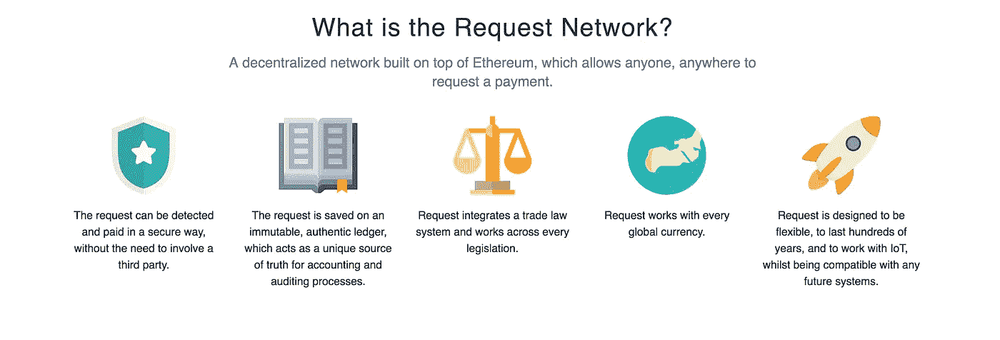
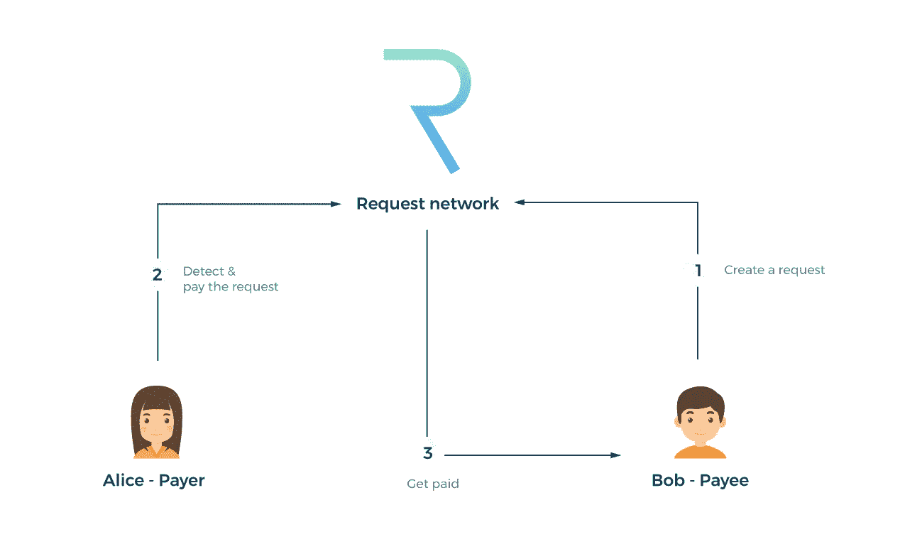
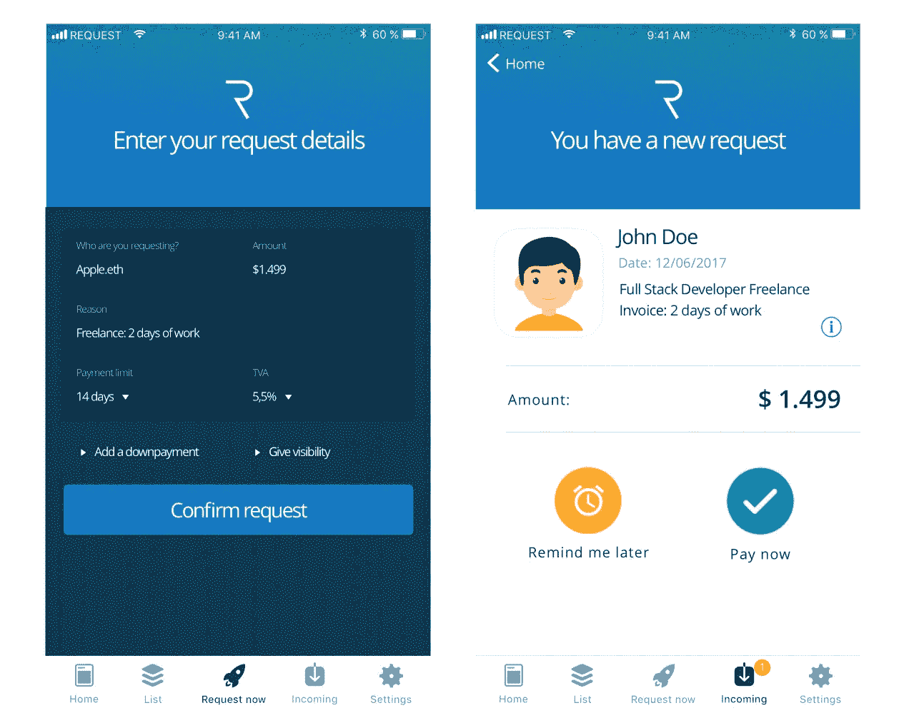
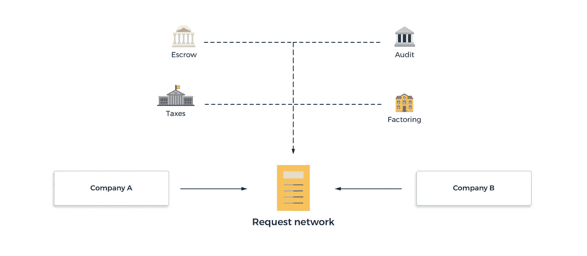
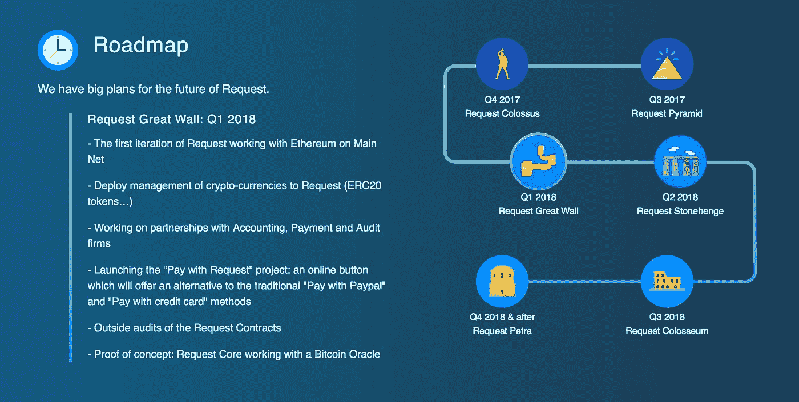
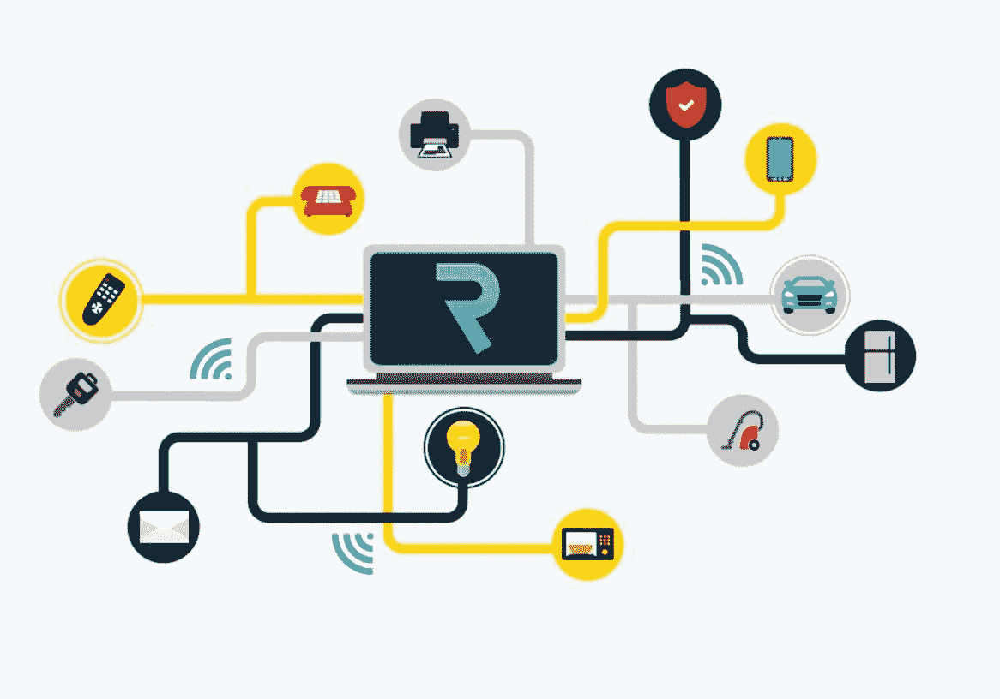
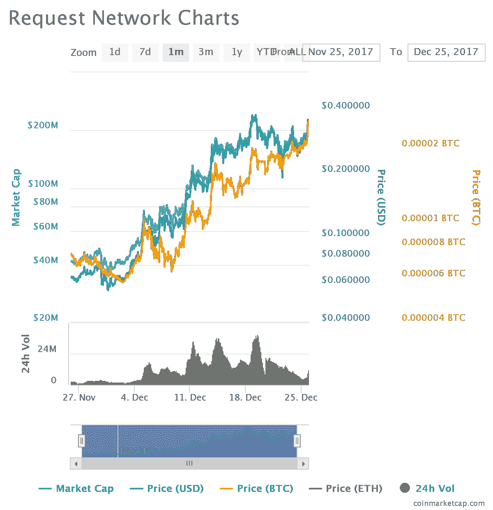
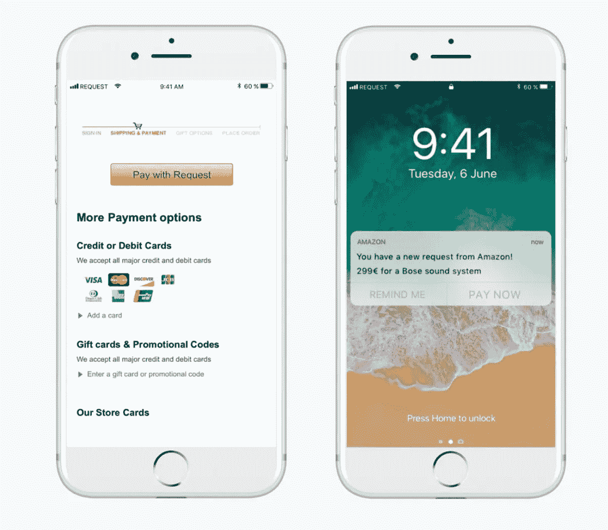

# 我的 2018 年加密货币精选:第二部分——请求网络——下一代的 PayPal？

> 原文：<https://medium.com/hackernoon/my-cryptocurrency-picks-for-2018-part-2-request-network-paypal-of-the-next-generation-bbe1016d1f7a>

## 在过去的两天里，意外的加密货币圣诞销售(或者像一些人所说的那样——下跌)发生了。然而——革命是安全的，不用担心！

这次拍卖来得快去得也快，所以现在似乎是了解另一枚有希望的硬币，为下一次拍卖做准备的绝佳时机。正如在系列的第一部分中提到的(可以在那里找到)，我的下一个选择是基于以太坊平台的硬币。让我们看看这种特殊的货币是关于什么的，以及团队想要传递什么。

2.[请求网](https://request.network/#/)

REQ Networks(REQ)final[白皮书](https://request.network/assets/pdf/request_whitepaper.pdf)于 2017 年 10 月 25 日问世，由 Moneytis 项目背后的团队创建，该项目是一项比较国际汇款转账费用的服务。

但是为什么钱很重要呢？我以为我们是来讨论加密货币，革命的！

Moneytis 项目在 2015 年赢得了创业投资[并得到了 Y Combinator](https://www.ing.com/Newsroom/All-news/ING-announces-winners-of-the-Innovation-Studio-startup-pitch.htm)[的支持，后者让 AirBnb 或 Stripe 等公司曝光。这两个事实表明了项目背后的团队是多么的有能力。](http://www.ycombinator.com/)

> YC 的商业策略极具侵略性。YC 不会玩弄他们的创业公司。他们会把要求强加给硅谷的正常人，他们会像瘾君子一样使用它。他们使 Airbnb，Dropbox，Twitch 等成为主流，他们将请求进入 Venmo/PayPal 2.0
> 
> ~某个随机的 Reddit/Slack 用户。

好消息是 Y Combinator 也决定支持 Request Network。仅此一点对我来说就足够了。不是给你的？好吧…让我们看看 REQ 是关于什么的！

[https://request.network/#/](https://request.network/#/)

请求网络是一个分散的网络，它允许用户创建所谓的*请求发票*——这只是付款请求。但是 REQ 令牌与这种努力有什么关系呢？为了进行交易，要烧掉少量的 REQ 令牌——交易越多，费用越低，最终将达到小额，如 0.001(目前为 0.00034 美元)的 REQ 币。这确保了在使用系统时请求令牌是必需。此外，想要使用 REQ[网络](https://hackernoon.com/tagged/network)支付的人不需要亲自拥有 REQ 币——他们需要的只是他们想要支付的货币。

由于使用了[区块链](https://hackernoon.com/tagged/blockchain)，该系统使用起来简单、安全且便宜。

[https://request.network/assets/pdf/request_whitepaper.pdf](https://request.network/assets/pdf/request_whitepaper.pdf)

*   简单——一切只需点击一个按钮，不像传统的 ETH 交易，其中包括一些新手不友好的事情，如提供正确的地址或气体量。
*   安全性——没有必要分享容易被滥用的信用卡信息，一切都发生在区块链，这确保了系统是不可改变的。在接收到由例如亚马逊生成的自动支付请求后，用户被要求确认——然后该过程继续。
*   便宜——交易所需的 REQ 令牌可以分成数千份——这意味着费用很低，不像 PayPal 或 Stripe 这样的服务需要将发送金额的 1%到 7%作为费用。请求平台预计收取交易金额的 0.05%-0.5%作为手续费。

How the REQ apps will eventually look like

另一件值得一提的事情是 REQ 的目标是与货币无关的。客户只需选择使用 Request Network 支付，然后系统会相应地兑换所有货币，以确保支付按计划进行。

> 假设爱丽丝想用比特币支付她的新笔记本电脑。她选择“按需付费”选项。该系统将 BTC 从她的账户中取出，然后使用合作系统为卖家将比特币兑换成美元。所有这一切只需点击一个按钮。

系统目的似乎很容易理解——为什么我们需要 REQ 令牌？不使用特定的硬币作为交易费用，难道我们不能这样做吗？

因为 REQ 使用的是区块链以太网，所以需要一个 [ERC20](https://theethereum.wiki/w/index.php/ERC20_Token_Standard) 令牌，REQ 就是其中之一。使用所述区块链使得 REQ 开发者能够关注于需要完成的其他任务，以使系统可行。正如在[第一部分](/@mik.umanski/my-cryptocurrency-picks-for-2018-part-1-ethereum-248b4eb64414)中提到的，ETH 开发者正在努力解决可扩展性问题——让 REQ 开发者解决与系统支付相关的问题。此外，在早期阶段，加密货币通常是关于强大的社区——单独的令牌使爱好者和投资者社区更容易走到一起。此外，使用与其他因素分离的令牌有助于最大限度地提高安全性。

通过请求网络处理支付还将有助于税收和审计——公司将不再需要对分散在所有可能的支付系统中的数据进行漫长而昂贵的分析。

Request roadmap

上面展示的是 Request Network 的路线图，它向我们展示了团队对具体日期的计划。最精彩的部分？我们已经提前了。最初为 2018 年 Q1 奥运会计划的事情(将 REQ 推向以太坊的测试网)已经发生了——一个有效的 MVP(最小可行产品)和一个领先于自己计划的团队——这在加密货币世界中并不常见。点击查看完整路线图[！](https://request.network/#roadmapSection)

更重要的是，团队每两周在周五发布一次进度更新，这些可以在那里找到。

> 这一切听起来可能太好了。REQ 是一个新的硬币，为什么以前没有人想到这个主意？这个项目没有任何障碍吗？

答案当然是存在障碍。有些人把 REQ 比作 OmiseGo，说他们在努力实现同样的目标。事实上，这两个项目是互补的:REQ 可以使用 OMG 作为电子钱包上法定货币结算的 oracle，而 OMG 可能需要 REQ 来执行分散的支付请求、发票、审计或会计。REQ 团队写了一个非常详细的用例对比，你可以在这里找到。

REQ 是一枚全新的硬币——它还没有得到更大的认可。如果别人看不到它的潜力，那么一个了不起的项目还有什么用呢？也有人担心团队不能提供承诺的功能——我们今天拥有的只是一个 MVP，而不是可以被世界各地的供应商使用的最终平台。然而，我相信进一步的进展不会是一个问题——不是一个团队，这是努力工作，并(如前所述数百次…)已经领先于时间表。尽管如此，年轻的 REQ 仍然值得我们铭记在心。

REQ price chart for the last month

如上图所示，那些在 ICO(价格约为 0.06 美元)暴跌后不久投资 REQ 的人已经获得了 500%的收益。这是一个健康的增长，由团队宣布的更新决定。我相信这说明了人们对这个项目的信心有多大。为什么不呢？到目前为止，REQ 团队完美地执行了所发生的事情。

[https://request.network/#/](https://request.network/#/)

该团队已经领先于路线图，并为 2018 年的 REQ 计划了许多令人兴奋的事情(主网络上的完全工作系统、托管和税收支付、法定货币管理等等)，我可以看到这肯定会是明年最成功的加密货币之一。