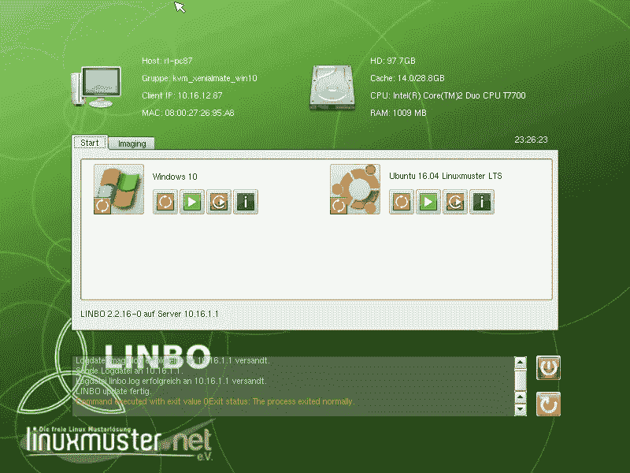
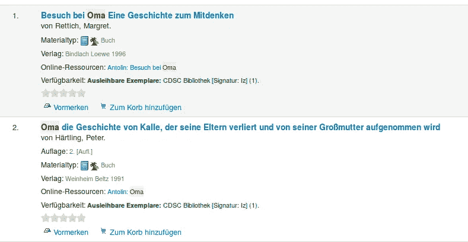

# 我们是如何在学校转用开源软件的

> 原文：<https://medium.com/hackernoon/my-experience-with-open-source-in-our-school-6085fdd1dca0>

Image by: [opensource.com](https://opensource.com/sites/default/files/styles/image-full-size/public/images/education/EDUCATION_tools.png?itok=ybxr0Qe9)

1 年前，我们从零开始建设学校的 IT 基础设施。我们的计划是在我们的服务器和客户机上安装更多的开源软件。成功了吗？这是正确的路吗？开源最后不是更贵吗？

# 形势

我是亚洲一所小型国际学校的老师。我们的 it 基础设施非常简单，由我们城市的一家 IT 公司建立和维护。我们有一台运行 ad 的旧 Windows 2003 服务器、一些交换机、接入点、一个强制网络门户，所有这些只有一个 IP 子网。还有一个小型计算机实验室，里面的计算机以 kiosk 模式运行 Windows XP。如果有人需要这台电脑上的新软件，或者你想安装更新，你必须从一台电脑到下一台电脑，因为没有中央配置管理。与 IT 公司的合同很快就要到期了，没有人愿意延长合同。所以我们制定了一个计划，设定了一些目标。以下是其中的一些:

*   将 LAN 流量与 WLAN 流量分开
*   中央用户管理(我们已经有了，但是需要更换 Windows Server 2003)
*   备份
*   集中配置管理(服务器、客户端)
*   降低许可成本
*   总而言之，这是一个可靠的网络(这里停电了)

学校董事会指示我这样做，因为我们的 IT 经理将在本学年结束时离职，几个月后将开始新的工作。当你想在一所学校进行如此大的改变时，你必须在假期(尤其是暑假)进行。

# 我们开始吧

当你开始使用 OSS 时，你会遇到一个问题，因为有许多选项可以用来解决问题。我应该为服务器或客户端使用哪种操作系统？然后是使用哪个发行版的问题…哪个软件用于用户管理？什么样的配置管理？虚拟化需要什么？诸如此类。那可不容易。大量的研究和测试是必要的。另一方面，有些人不得不解决非常相似的问题。因此，我询问了我们城市中从事 OSS 解决方案工作的其他 IT 经理，或者联系了互联网上的人，在论坛、博客和 reddit 上阅读了大量资料，测试了一些解决方案，并最终决定选择一个。查理·雷辛格和他对学校开放源码软件的热爱给了我很大的启发。

学校基础设施的主要部分是用户管理和用户认证。我的选择是 [freeIPA](http://freeipa.org/) 、 [OpenLDAP](http://www.openldap.org/) 、Windows Active Directory 和[Linux must](http://linuxmuster.net/)。我已经测试了 freeIPA，它看起来非常有前途，简单的 OpenLDAP 对于一个暑假来说工作量太大，我跳过了 Windows AD，因为我很好奇是否有可能完全用 OSS 来管理一所学校。

Linuxmuster 是一个德国的学校软件解决方案，已经存在了 15 年以上，由 16 个州中的一个州开发，为他们的公立学校提供一个易于使用的解决方案。在德国之外，人们对它知之甚少。大多数文档都是德语的(尽管也有相当一部分[是英语的](http://docs.linuxmuster.net/en/latest/))。他们也有一个[英语子论坛](https://ask.linuxmuster.net/c/english)，但是社区真的很棒。我从来没有见过这样一个有用的社区，在这里你可以问各种与学校 IT 相关的问题。

Linuxmuster 不仅仅是用户管理。他们开发了一个很棒的工具，叫做 LINBO(**LI**nux**N**network**BO**ot)，以一种非常简单方便的方式管理所有的工作站。基本上，你可以在工作站上设置你想要的东西，制作一个主映像，并将其部署到所有其他计算机上。完成了。这对 linux 映像来说非常有效，因为它们可以在各种不同的硬件上运行。目前，我们只有一个 Ubuntu 映像(大约 4GB ),用于我们所有的学校计算机。LINBO 也能够处理双引导系统，例如在我们的计算机实验室，我们现在同时运行 Ubuntu 和 Windows 10。部署 Windows 的工作方式是一样的，尽管映像要大得多，而且如果您有很多不同的硬件，您可能需要几个映像。还有一个很大的特点。它被称为“自我修复工作站”。将映像部署到计算机时，映像的副本存储在缓存分区中。因此，当一个学生搞乱了电脑或发生了其他事情时，你可以按下 LINBO 中的一个按钮，电脑就会恢复到预定义的状态。离线也可以。这在很多学生使用计算机实验室的学校里是一个非常重要的功能。

LINBO main screen

好的一面是，你可以自动化整个过程。如果实验室里的所有电脑都是“新”的，并且每天早上都处于你喜欢的状态，那不是很好吗？没问题，做一个 cron 作业，让他们每天早上醒来(WOL)，检查服务器上是否有新的镜像，然后同步他们。LINBO 实际上是我选择这个解决方案的主要原因。可悲的是，它在德国之外并不为人所知。

但是还有其他很棒的特性。他们有一个叫 postsync 的功能。在部署映像之后，您可以在那里对其进行更改。例如，您喜欢为实验室中的教师计算机或图书馆中的计算机设置另一个设置。您仍然可以使用相同的 linux 映像，但是在同步之后要更改一些其他文件(比如桌面快捷方式、配置文件等等)。他们还有一个网络界面，教师和管理员可以在那里管理整个产品。教师可以为他们的课程或特定的学生群体打开/关闭互联网或网络过滤器。他们可以分发和收集文件等等。

所以重要的部分完成了。我设置了一些其他有用的操作系统，让我和我们新的 IT 经理的生活更轻松。以下是我们在基础架构中使用的软件的简短列表:

**pfSense** (防火墙) **Linuxmuster** (用户和客户端配置管理，他们在幕后使用 SAMBA 和 OpenLDAP)**OS ticket**(help desk)**Dokuwiki**(Wiki)**OMD/Check _ MK**(监控) **Koha** (库) **Ubuntu** (主服务器和客户端 OS)**Xen server**(虚拟化)

# **一年后**

**当我回顾过去的时候，我不得不说，在很多方面，它都做得很好。我们现在有了一个易于管理、可靠且易于扩展的校园网络——无需支付许可费用。OSS 的伟大之处在于，你可以根据自己的需要修改和调整它。我们生活在一个每年都要与空气污染作斗争的国家。因此，我们的一位老师买了一个传感器，我们安装了一个树莓 pi 来测量污染，一名学生建立了一个漂亮的网站，在礼堂或幼儿园的监视器上显示数据。这太好了，我希望有更多这样的机会，因为在 OSS 的本质中有如此多的学习机会。开源和学校是最合适的。**

**再比如。我们的图书馆使用 Koha，对我来说这是最好的 OSS 项目之一。它功能强大，易于调整，易于使用。我们的员工喜欢它。在德国，学生们有一个在线平台，可以回答他们读过的书的问题([安托林](http://antolin.de/))。如果在 Antolin 上有这本书的小测验，我们的书后面会有一个小的乌鸦贴纸。不费吹灰之力，我就能把小乌鸦整合到 Koha 的《OPAC》中，这样学生和家长就能立即在网上看到这本书是否有测验(包括测验的链接)。**

****

**Antolin’s crow in search result**

# **但是…**

**…使用 OSS 没有缺点吗？对我来说，很难用简单的是或不是来回答这个问题，但肯定有一些事情要考虑。OSS 通常是免费的，这意味着你不必为许可证付费，你可以根据自己的需要调整软件。在我看来，OSS 的成本是隐藏的。例如，这些隐性成本是如何设置和配置每个组件的知识，这样一切都可以很好地配合，或者很难找到愿意学习新东西和处理命令行的合适的 it 人员。这在亚洲尤其困难，但幸运的是，我们找到了能够继续我们“开放之旅”的人。也有很多偏见来自那些习惯了 windows 并且不喜欢学习新东西的人。这对我们的学生来说没多大关系，因为他们所做的一切(大部分)只是需要一个浏览器。如今，操作系统已经不像多年前那么重要了。**

# **结论**

**把几乎 100%放在 OSS 上值得吗？对我来说，我可以用一个明确的“是”来回答这个问题！仅今年一年，我们就节省了几千美元，可以把这笔钱投资到好的硬件或其他我们以前买不到的东西上。在我看来，最大的问题是找到合适的充满热情的人来管理和进一步开发只使用 OSS 运行的学校基础设施。幸运的是我们找到了一个。**

****你的公司/学校在使用 OSS 吗？你有哪些经历？你认为使用 OSS 的主要优势(劣势)在哪里？****

***本文最初发表于***