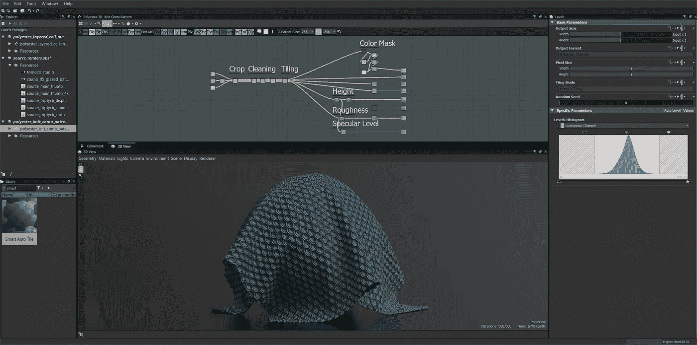
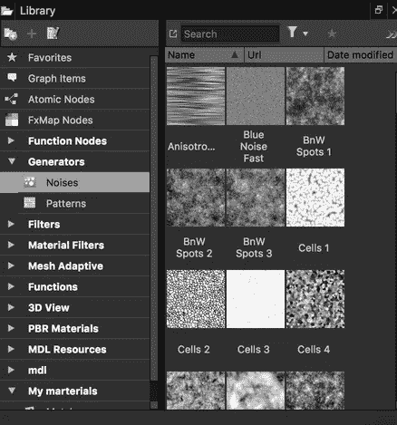
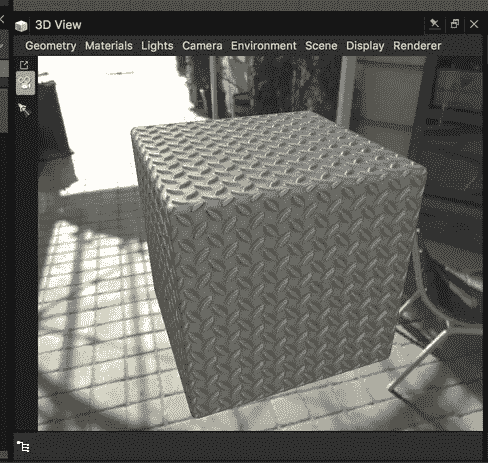

# 我在 web 3D 中使用 Substance Designer 的经验

> 原文：<https://medium.com/hackernoon/my-experience-with-substance-designer-in-web-3d-90af9c799f58>

## WebGL 中的程序纹理

**作者简介**:作为一个了解并使用过*glsl*着色器的人，我对那种允许我以程序化方式处理复杂结构的工具很感兴趣。

有一个来自 [GPU 技术大会](http://www.gputechconf.com/) 2016 的演示文稿叫做:[**《MDL 材质到 GLSL 着色器:理论与实践》**](http://on-demand.gputechconf.com/gtc/2016/presentation/s6311-andreas-suessenbach-mdl-materials-glsl-shaders.pdf)**——这个解释了导出的可能性。mdl 数据到 *glsl 着色器*代码中，稍后可以在自定义渲染器中使用。**

**对于 web，这样的渲染器可以是 [Three.js](https://threejs.org/) ，依赖于 glsl (webgl)。Substance Designer 作为一个纹理生成工具可以和 Three.js 一起使用，这一点在[这一期](https://github.com/mrdoob/three.js/issues/10691)中甚至有提到。**

> **那么，在 WebGL 中使用**物质设计师**怎么样呢？还是手动写 glsl 着色器**比较好？****

****嗯，视情况而定…让我们来强调一下在 WebGL 中使用 Substance Designer 的*的优点和 CONS。*****

******优点******

*   ****你可以使用基于节点的系统轻松构建复杂的材质****
*   ******材质实例化**允许您组合和混合多种材质****
*   ****图书馆有很多很酷的噪音(图 1。)****

********

****pic. 1: Library****

******CONS******

*   ****你**不能使用素材交互方式。**虽然 **glsl** 允许您使用*制服*(参数)，但在 Substance Designer 中，您不能将图形导出到 glsl 代码中(至少在撰写本文时)****

****你真正能做的是结合两种方式:使用物质设计器制作复杂的纹理和 GLSL 添加交互支持。****

## ****例子****

****比方说，我想做一个 3D 应用程序，让我在金属纹理上画画(图片。2)我们可以做到的方法是将 [glsl 交互](https://threejs.org/examples/webgl_decals.html)与来自 Substance designer 的现有静态金属材料相结合。添加交互需要取已有的 [MeshStandardMaterial 代码](https://github.com/mrdoob/three.js/blob/dev/src/renderers/shaders/ShaderLib/meshphysical_frag.glsl)，编辑(添加交互)并插入 [ShaderMaterial](https://threejs.org/docs/index.html#api/materials/ShaderMaterial) 。****

********

****pic. 2: Metal material****

## ****教程****

****有大量的 Substance Designer 教程，它们有很好的解释，深入到最新的工具和很酷的技巧中，帮助你创建复杂的材料。****

****[**入门**教程](https://tutorials.allegorithmic.com/courses/538aff9f48cd9442b6001a528682ffc6/youtube-NzKtubDsC9o)——substance designer 工具新手必备。如果你打算学习这个工具，你应该从那里开始。****

********

## ****结论****

****如果需要处理复杂的材料，请使用 Substance Designer。但是，它不支持任何来自 Three.js 端的交互，至少目前不支持。****

****在 Three.js 中，如果没有 GLSL，你就不能进行 Substance Designer 材质交互，但这并不意味着你完全不能这样做，这意味着你需要两者都使用。****