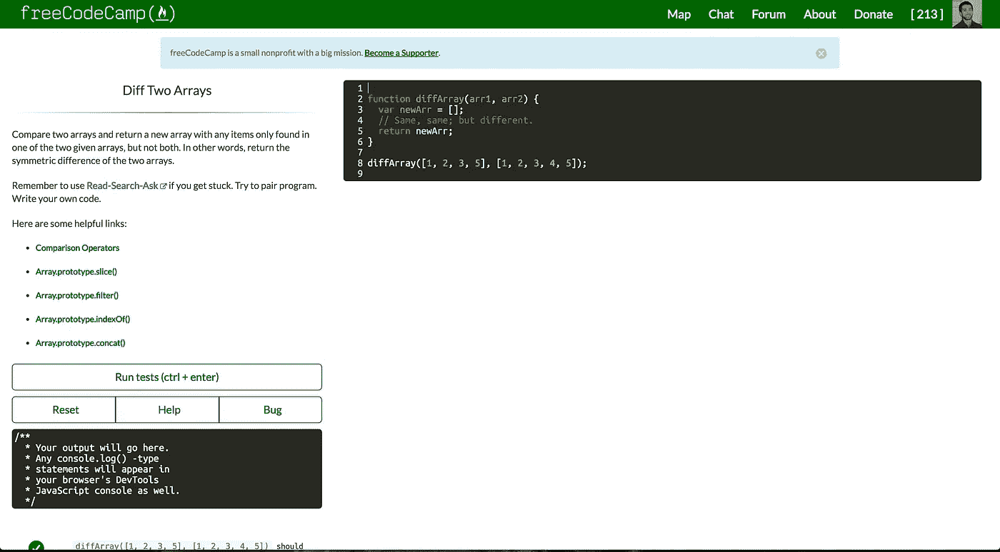
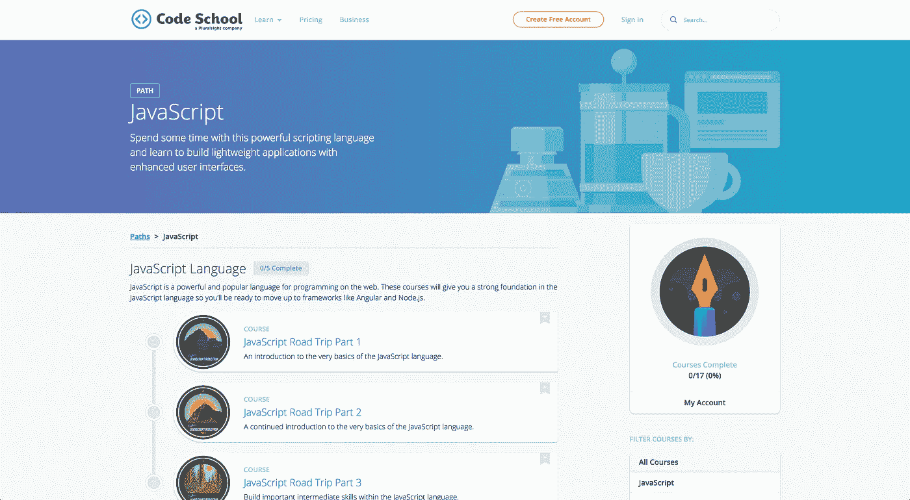
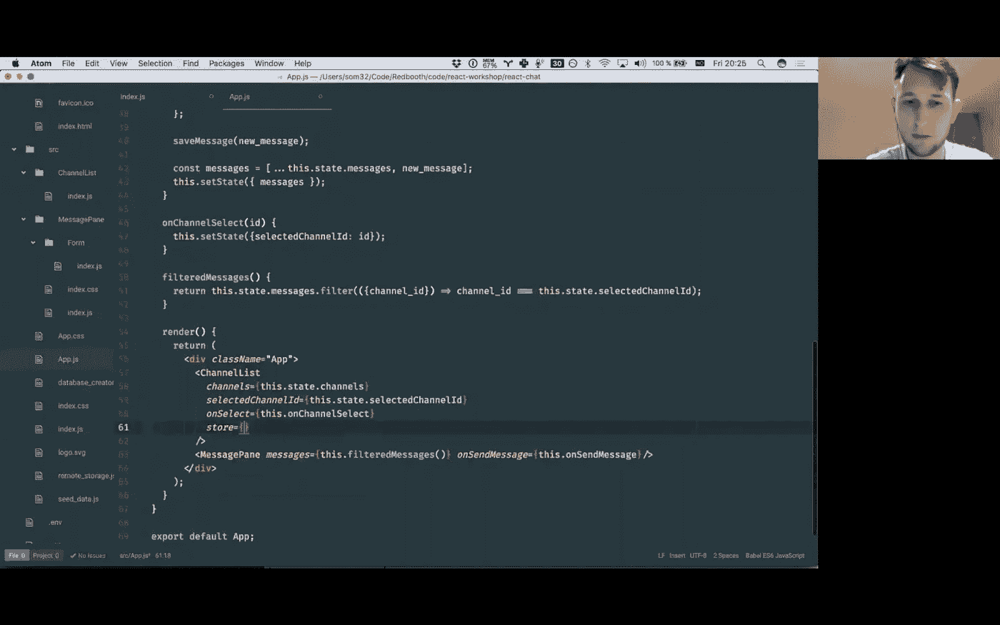

# 我最喜欢的学习 JavaScript 的免费资源

> 原文：<https://medium.com/hackernoon/my-favorite-free-resources-for-learning-javascript-3d3895ecc4c6>

## 在众多的学习选择中，我发现这些是最有效的

自学 web 开发并不容易，即使现在网上有成百上千的资源。我最大的问题是，我找不到一个地方可以让我以自己觉得舒服的速度从初学者到高级。我最终会从一个教程跳到另一个，当下一个教程不是太容易就是太难时，我会感到沮丧。

没有一站式解决方案是有道理的；首先，人们有不同的学习偏好和不同的学习目标。我的目标是能够构建 RESTful 应用程序，并足够熟练地参加黑客马拉松。我的目标不是找一份电脑程序员的工作。如果你的目标和我相似，我会推荐这些学习 web 开发的资源，特别是 [JavaScript](https://hackernoon.com/tagged/javascript) 。

# 当学习 JavaScript 的基础知识时

freeCodeCamp

学习 JavaScript 细节的最佳免费资源无疑是 [freeCodeCamp](https://www.freecodecamp.com) 。这是一个非营利网站，如果你努力完成挑战，它可以带你从初学者到工作就绪。昆西·拉森和他的团队已经建立了一个综合小练习和应用你的知识的大项目的发电站。一些基本的 JavaScript 挑战可能看起来很乏味，但回过头来看，我可以说它们都在实际应用中使用，值得了解。

课程也在不断扩展。当我第一次发现这个网站时，它主要关注 HTML、CSS 和 JavaScript。现在，它包括关于数据可视化、后端开发、版本控制和开发工具的课程。这可能是你需要的唯一资源，但至少它会向你展示 JavaScript 的基础。

# 学习前端框架或库时

Code School

[代码学校](https://www.codeschool.com/)使用视频教程和浏览器内活动的组合来帮助初学者学习各种技术。这些课程都有一个有趣的主题，每个视频都以一首俗气的歌曲开始:一切都在尖叫“初学者友好”。我发现在尝试学习 Angular 或 React 等特定 JavaScript 框架时，代码学校处于最佳状态。他们在分解常用工具和使用它们的优势方面做得很好。基于课程主题的迷你应用程序也强化了课程。尽管这些视频看起来像是为小学生设计的，但这些教程足以让你开始任何现实世界的应用。

当我推荐这个网站时，我是在延伸“免费”的定义。大多数课程需要订阅，但其中一些是免费的，代码学校在一年的特定时间免费开放所有课程。你也可以花 29 美元买一个月的知识炸弹。

# 当构建第一个应用程序时

至此，您已经了解了 JavaScript 是如何工作的，并接触了一些帮助构建 JavaScript 应用程序的工具。现在是时候实际制作自己的应用程序了。这一部分并不容易…当面对一个空白的文本编辑器时，就像你忘记了你所学的一切。你还会意识到你在应用程序中使用命令行和组织文件的知识上有差距。这就是代码跟踪的用武之地！

Codementor

代码跟踪基本上是你可以看到人们从零开始构建一个软件的地方。一个有经验的程序员会告诉你他或她在每个构建步骤和需要修复的 bug 背后的思考过程。YouTube 和 Twitch 上有很多人在做代码练习，你所要做的就是找到一个老师正在构建类似于你想要构建的应用程序的地方。

我个人喜欢由[的共同导师](https://www.youtube.com/channel/UC2YpBIUAbkMKuDn5oVwkVyg)和[的技术顾问](https://www.youtube.com/channel/UC3q_EhMMzZkC3Z8XE0MIf7g)在 YouTube 上发布的代码。它们非常适合初级/中级学习者，并且真的让你对使用 JavaScript 可以构建什么感到兴奋。这些是你可以观看的视频，但是我强烈建议你和老师一起制作来巩固你的学习。

就像我之前说的，这些资源并不适用于所有人。我只能代表我自己，希望这篇文章能帮助其他人学习 JavaScript。如果你有其他的资源可以推荐，我很乐意在回复中听到。

> [黑客中午](http://bit.ly/Hackernoon)是黑客如何开始他们的下午。我们是 [@AMI](http://bit.ly/atAMIatAMI) 家庭的一员。我们现在[接受投稿](http://bit.ly/hackernoonsubmission)，并乐意[讨论广告&赞助](mailto:partners@amipublications.com)机会。
> 
> 如果你喜欢这个故事，我们推荐你阅读我们的[最新科技故事](http://bit.ly/hackernoonlatestt)和[趋势科技故事](https://hackernoon.com/trending)。直到下一次，不要把世界的现实想当然！

