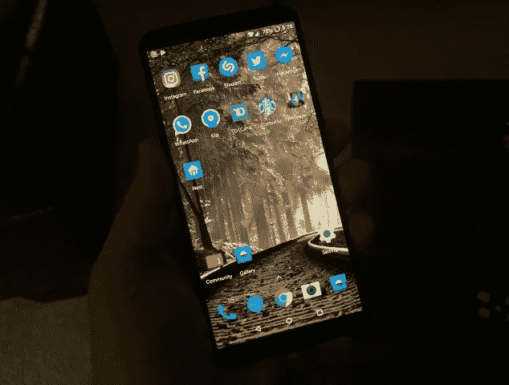
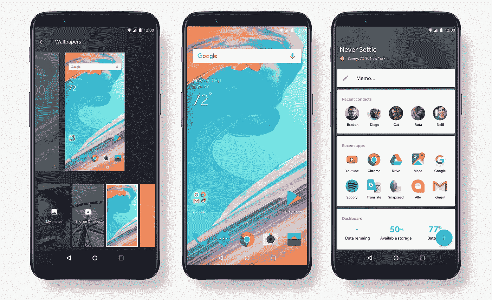

# 我使用 OnePlus 5T 的前 48 小时

> 原文：<https://medium.com/hackernoon/my-first-48-hours-with-the-oneplus-5t-15f03f5df12>

自从 iPhone 3G 首次发布以来，我一直是 iPhone 用户。每年，几乎就在这个时候，我都会追随我的同龄人，忠实地升级到苹果发布的任何最新最棒的设备。

很多时候，我对升级普遍感到满意。但通常情况下，尤其是对于一些最新的型号，我觉得新 iPhone 的价格不值得这些增量改进。苹果多年来引入手机的许多旗舰功能，如 Facetime，充其量只是半成品，从未真正得到修复。而且总的来说，我不禁觉得 iOS 的质量(还有题外话，一般的 macOS 我是 Root！)，这些年一直在稳步下降。

After nearly a decade of iPhones, my first Android phone: the OnePlus 5T

大约一周前，我的首选手机是苹果 iPhone 6S。它有点旧了，已经损坏了，但还能用。iPhone 7 出来的时候，我被短暂的诱惑升级，主要是为了双摄像头支持。但不幸的是，我很快意识到，优质的摄像头配置只配有 iPhone 7 Plus，当时我发现外形和成本都令人望而却步。

在苹果公司展示 iPhone 8 的时候，我和一个朋友坐在一起，我们大多数时候都在对自己笑，“就这样？”这似乎就是苹果这些天的典型创新曲线——更快的处理器，更大的玻璃，更多的钱，冲洗，重复。这些天来，大多数新发布的产品似乎都缺少真正的创新，可能是因为苹果的核心人物史蒂夫·乔布斯已经不在了。

正如预期的那样，在同一场发布会的晚些时候，苹果发布了 iPhone X，这是一款具有面部解锁功能的新手机(可以说是关键的销售功能)，显然还有一系列动画表情符号。虽然手机的外观肯定是一个进步，但扩展的功能集肯定不足以证明基础型号 1319 美元的高昂价格，至少对我来说是这样。

我的许多朋友立即升级到 iPhone X，这是我在过去也会做的事情。但自从我上次升级 iPhone 以来，我越来越难花钱买手机了。虽然当然可以说这些设备不仅仅是电话，但在我的职业生涯和生活中，将这些设备简单地视为电话是有吸引力的。

由于我的 iPhone 6S 确实显示出了它的年龄(已经维修了几次)，我决定开始在其他地方寻找手机升级。在我看到[一加](https://oneplus.net)发布的新款旗舰手机 OnePlus 5T 之后不久，我决定第一次一头扎进[安卓](https://hackernoon.com/tagged/android)生态系统。所以那天我以大约 650 加元的价格订购了 6GB 的 OnePlus 5T，这还不到在加拿大购买一部新 iPhone X 的一半。

让它沉淀下来，腌几分钟——不到一半的成本。

它花了大约一个星期的航运和海关导航到达这里，但它在本周早些时候到达，从那以后我一直在探索它。到目前为止我在想什么？

我绝对喜欢它。

这是我这么多年来第一部手机，我真的可以再次享受玩手机的乐趣。也许是对 Android 操作系统的不熟悉给了我这种享受感，或者是意识到没有一部被锁定在特定企业生态系统中的手机的可能性(iPhone 就是这种情况)。但不管怎样，我发现自己只是偶尔拿起它玩玩，再次拥有它的感觉太棒了。

实际上，我对 Android 操作系统的状态感到非常惊讶。我总是被引导去相信它是一个比 iOS 差很多的操作系统。我不怀疑几年前这种说法可能有些道理，但今天看来肯定不是这样。事实上，简单地跳来跳去和探索操作系统让我意识到 Android 似乎比苹果用更优雅或更精致的方式解决了多少事情。

例如，我记得试图将 OnePlus 5T 上的主页图标从一个页面移动到另一个页面，并惊讶地发现这是多么容易完成。任何一个拥有 iPhone 的人都知道，移动图标是非常挑剔的，通常包括试图将你的手指从设备边缘推开，让它知道你想要另一页上的图标。这是一个简单的功能，但自最初的 iOS 版本以来，苹果从未做对过，也从未试图去做对。

我喜欢你按几个键就可以查看详细的移动数据使用情况，甚至可以输入具体的计费日期。如果你超过某个阈值，你还可以强制手机暂停移动数据，这样你就不太可能超过数据上限。这似乎是一个如此显而易见的附加功能，以至于现在回想起来很难理解为什么 iOS 上没有类似的功能，因为移动数据使用可能是这些天账单超支的头号原因。

今天早上，我的马自达娱乐系统告诉我，我收到了一个朋友的新消息，并问我是否想读给我听。我的 iPhone 以前从未出现过这种情况，这让我很惊讶。显然，这项功能是蓝牙规范的一部分，我的新手机与娱乐系统的结合使它开始工作。我怀疑类似的 iOS 功能可能存在于他们的 CarPlay 实现中(我的马自达不支持)，但在拥有我的车辆两年后，我突然有了一个新的有用的功能，这是一个惊喜。

就从 iOS 到 Android 的过渡而言，我主要担心的是，如果没有 iMessage，与朋友交流会有多困难。我不会撒谎，在最初的几个小时里，这是一个小小的调整——我给朋友的第一条短信的回复最终被发送到了我的电脑上，而不是我的手机上，因为 iMessage 上就是这样设置的。因此，我最终不得不将我的电话号码从 iMessage 中完全删除，以使其始终如一地工作，正式将我的电话及其号码从苹果生态系统中切断。

对我的大多数朋友来说，通过短信交流很好——我们在加拿大都有无限制的短信计划，所以在那里没有问题。我爸爸目前在亚利桑那州，所以我和他现在已经改用 WhatsApp 了。现在许多人在这种情况下只是使用脸书信使代替，但我不太喜欢它。不管怎样，iMessage 的丢失基本上不是什么大事。

OnePlus 5T 让我立刻怀念的一个方面是，图标旁边没有通知气泡来显示我在每个应用程序中还有多少消息没有收到。我立即去寻找能帮我解决这个问题的网站或附加评论，最终发现安卓超级用户的响亮合唱相当明确地问，“你到底为什么想要那个？”

因此，与我最初的冲动相反，我让通知系统保持原样，这实际上要求我手动显示通知面板，以查看我的手机上发生了什么。奇怪的是，在使用 48 小时后，我想我同意这些用户的观点——不经常看到每个应用程序中有多少通知，这令人惊讶地令人耳目一新，压力也更小。

The OnePlus 5T

就 OnePlus 5T 本身而言，它真的是一款相当漂亮的设备。它由全铝机身制成，大小和重量拿在手中感觉都很完美。这款显示器是一款漂亮的 6 英寸 AMOLED 变体，长宽比为 18:9(因此它比大多数显示器更长更窄，更容易单手握持)，每英寸像素略高于 400 像素(ppi)。虽然这在技术上比市场上的一些高端智能手机的分辨率低，但我认为实际上这不是问题，因为我怀疑许多人缺乏足够好的视力来解决 400ppi 以上的问题。

一加系列手机区别于竞争对手的关键销售功能之一是其双 SIM 卡支持，这意味着一个人可以在手机中安装两张不同的 SIM 卡——对于以前在国外旅行时错过重要电话的人来说，这是一个非常有吸引力的功能，我也期待在下次旅行中测试这一功能。

OnePlus 5T 的电池寿命非常出色，这要归功于它的 3300mAh 电池。盒子里还包括一加专有的 Dash (20 瓦)充电系统，可以在大约一个小时内将手机充满电(从 0%到 100%)。我试过了，真的很快。作为一个以前手机电池几乎总是徘徊在 0%附近的人，这对我来说是一个杀手级功能——我实际上订购了第二个 Dash 充电器，现在在家里和办公室都有一个单独的 Dash 充电器。

一加的电池和 Dash 充电系统的结合现在意味着我已经达到了一个新的手机涅槃状态——传说中的应许之地，一个人每天只需要给手机充电一次，不管使用情况如何。

虽然我用 OnePlus 5T 拍了一些奇怪的照片，但我肯定没有拍足够多的照片来对质量有一个明确的看法。当然，我拍的照片已经足够了。我读过的大多数其他评论都表示，这款相机当然工作良好，但明显不如三星 Galaxy S8 等其他竞争对手清晰(尽管公平地说，这些设备的价格也高得多)。也就是说，今天一加刚刚发布了一个操作系统更新，据说是为了解决一些感知的图像质量差异，所以我怀疑他们已经通过算法调整解决了一些问题。

和 iPhone X 一样，OnePlus 5T 也包括面部解锁。然而，与 iPhone X 不同的是，OnePlus 5T 仅使用前置摄像头来实现这一壮举，没有添加红外信息。因此，从技术角度来看，OnePlus 5T 的实现可能不如苹果的安全，但对于大多数实际用途(如解锁手机)来说，它工作得非常好，显然很难被欺骗。它还包括设备背面的指纹扫描仪(iPhone X 没有指纹扫描仪)，仍然可以用于任何需要更高安全级别的活动(如支付)。

我使用 OnePlus 5T 的前 48 小时非常有启发性。他们向我证明了，你不一定要成为苹果才能制造出令人惊叹的智能手机，也不一定要被锁定在一个特定的生态系统中才能拥有一款强大的、提高生产力的设备。虽然 iMessage 的丢失起初很明显，但这并不是一个很难克服的问题。出乎意料的是，我的智能手机上许多 Android 特有的解决问题的方法乍一看似乎非常直观，往往比类似的 iOS 功能更自然。

所以现在，我对我购买的 OnePlus 5T 非常满意，特别是因为它提供了许多与苹果旗舰 iPhone X 相同的功能，但价格大约是一半。

我当然一点也不嫉妒苹果——作为 iPhone 用户和爱好者，我度过了许多快乐的岁月。但随着 iPhone 价格的不断上涨，以及似乎更注重及时性而非质量的永久发布时间表，我预计许多像我这样的长期 iPhone 用户也会开始考虑其他选择。如果你有，我鼓励你看看 OnePlus 5T，就性价比而言，它似乎是今年最好的智能手机产品之一。如果你从另一个 Android 设备升级，你不仅可能不会后悔你的购买，而且我还怀疑，如果你在过渡期间离开苹果生态系统，你也会像我一样不会后悔。

*阅读更多来自* [*杜安故事*](https://twitter.com/duanestorey) *的文章，请访问其个人网站*[*【DuaneStorey.com】*](https://www.duanestorey.com)*。*