# 我的第一个 Alexa 自定义技能

> 原文：<https://medium.com/hackernoon/my-first-alexa-custom-skill-6a198d385c84>

像数百万其他人一样，我们在圣诞节收到了亚马逊回声。嗯，这是一个回声点，这并不完全是一个惊喜，因为我买给我的丈夫，但我也可以玩它，当然我想写一个自定义技能。Amazon 就是 Amazon，文档分布在大约 50 个不同的页面上，沿途有一些危险，所以我希望这个小指南对你有所帮助。

# 这个想法

当我决定开始写我的技能时，我不在家——我和一群朋友在一个新年家庭聚会周末。马修说了太多遍“Alexa，玩文加博伊”，我赶紧上楼去写些更有趣的东西。比 Vengaboys 更有趣的不是很高的门槛。

我想这可能会很有趣，能够问 Alexa 谁在房子里，让她背诵我们所有 15 人。嗯，孩子们可能会觉得听她列出他们的名字有点好笑。

# 入门指南

我浏览了一下亚马逊文档，很快发现实现我的 Alexa 自定义技能有两个部分:

*   Alexa 的一项技能，定义了如何将语音转换成意图
*   为每个意图执行工作的 Lambda 函数。

# λ函数

在 AWS 控制台中，你会发现一个 Lambda 部分，当你去创建一个新的 Lambda 函数时，你会看到一个可供选择的蓝图。把这些过滤到标有“alexa”的，很快给了我一个很好的起点。

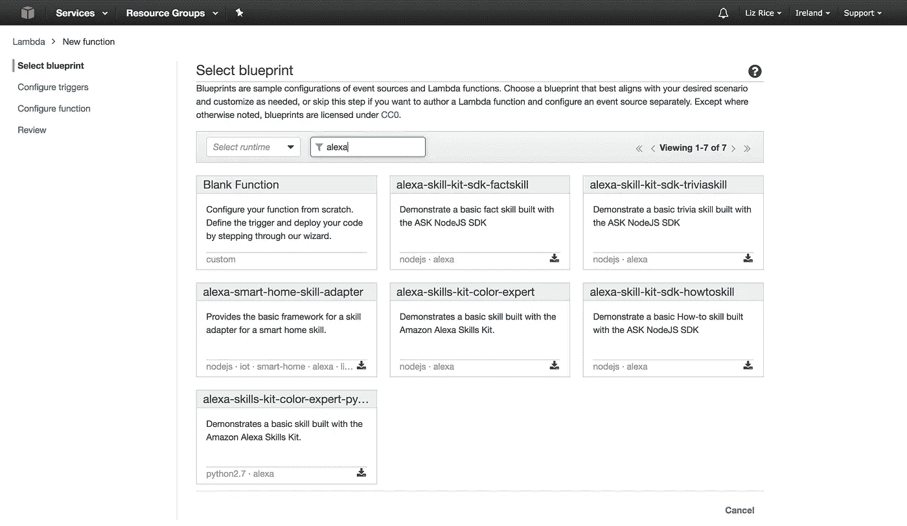

很多蓝图都是 JavaScript 的，但我更喜欢 Python，所以我的目光被吸引到了列表中的最后一个——Alexa-skills-kit-color-expert-Python。

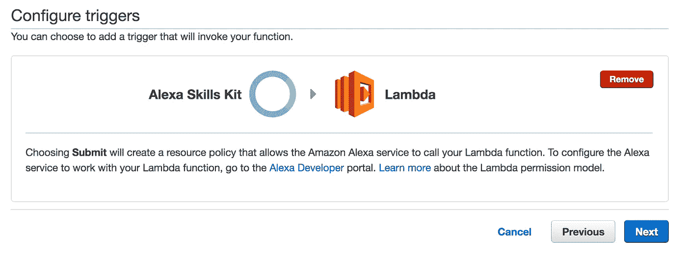

这个 Lambda 函数自动设置为由 Alexa 技能工具包触发。

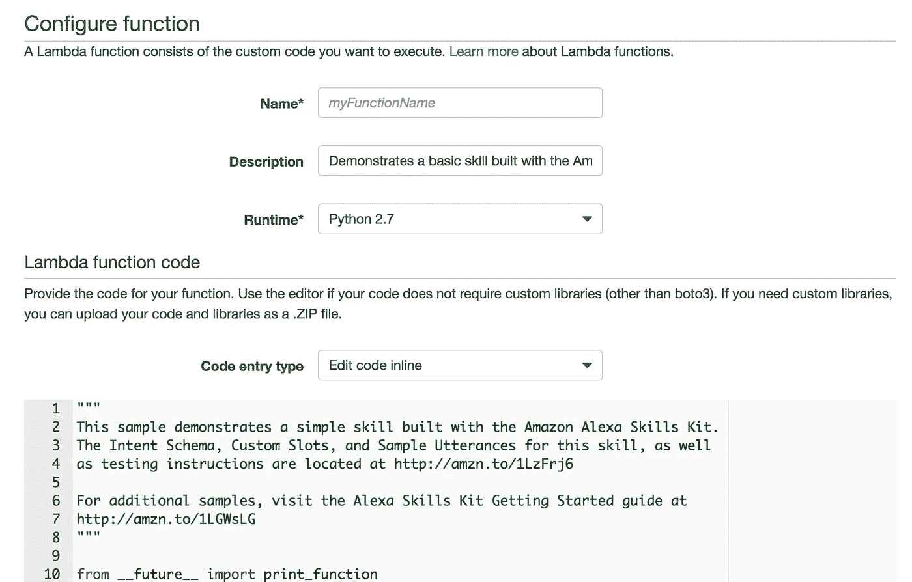

你可以选择在线编辑你的 Lambda 函数。示例代码被很好地注释了，所以很容易找到你的路。

当你开始与 Alexa 技能互动时，你就开始了一个“会话”,在这个会话中你可以进行对话式互动。但是我的超级简单的“谁在房子里”自定义技能不需要复杂的交互。我想要这个函数做的只是读出 15 个客人的名单。为了简单起见，我修改了“get_welcome_response()”函数，以便它直接结束会话。

```
def get_welcome_response():session_attributes = {}
 card_title = “Welcome”
 speech_output = “Jon, Anne, Anna, Dave, Alice, Oscar, Gemma, Ed, Emily, Lucy, Matthew, Charlotte, Alfred, Liz and Phil are here in the house”
 should_end_session = True
 return build_response(session_attributes, build_speechlet_response(
 card_title, speech_output, None, should_end_session))```
```

## Lambda 执行角色

您必须为您的 Lambda 函数设置一个执行角色，它规定了哪些权限是可用的。受[本教程](https://developer.amazon.com/blogs/post/TxDJWS16KUPVKO/new-alexa-skills-kit-template-build-a-trivia-skill-in-under-an-hour)的启发，你似乎需要一个“lambda_basic_execution”角色。我用默认策略创建了一个新的，并将其命名为 myAlexaRole。

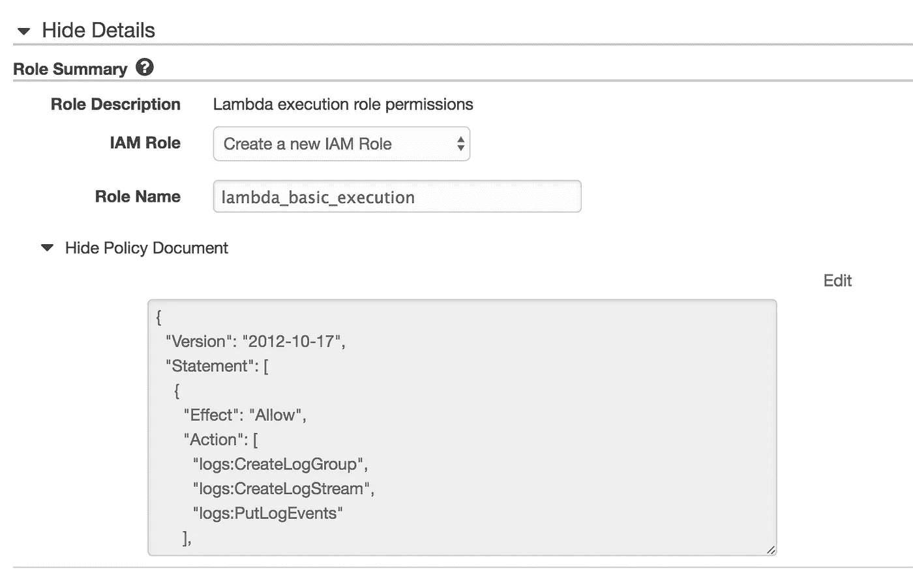

## 测试λ函数

您可以通过向控制台发送一个测试事件来测试您的功能。在输入测试事件列表中向下滚动足够远，你会找到 Alexa 事件。对我来说，用 Alexa Start Session 测试就足够了。

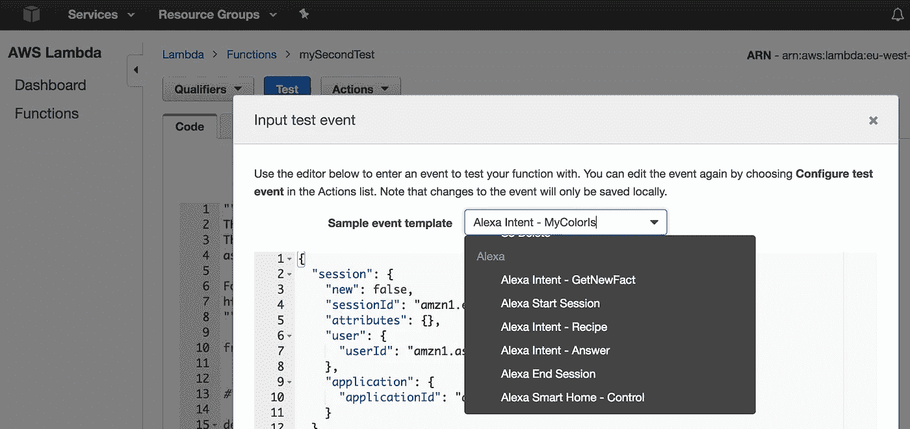

# Alexa 技能工具包

有点奇怪的是，你不在 AWS 控制台中编写你的 Alexa 技能，而是在[开发者门户](http://developer.amazon.com)中编写。这整个门户对我来说是全新的，我花了比应该做的更长的时间才意识到，在 AWS 控制台内搜索再多也无法找到 Alexa skills。

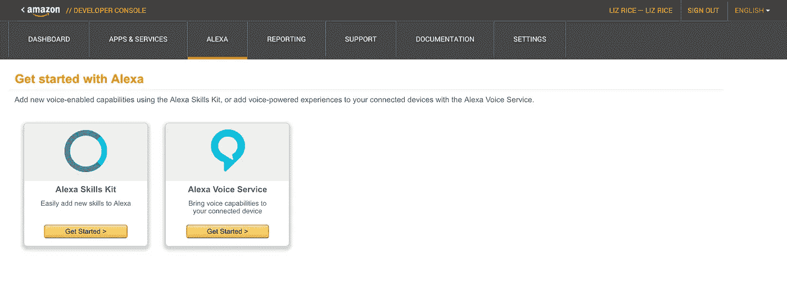

我们想要 Alexa 技能包。

## 技能语言

我还没有进行广泛的实验，但我相信你选择的语言需要与你的 Amazon Echo 使用的语言相匹配。所以对我来说，它需要是英国英语而不是美国英语。我和朋友们聊过，他们告诉我，他们浪费了几个小时才明白这是他们的技能不起作用的原因。

## 调用名称

我希望能够说“Alexa，谁在房子里？”让她一口气说出名单。这是我设置的调用名。

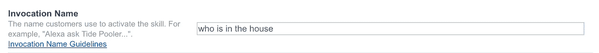

## 意图

我不确定我是否触发了任何意图，因为我一发出欢迎消息就结束了会话，但是我发现这个简单的意图配置允许事情工作。意向名称不能包含空格。

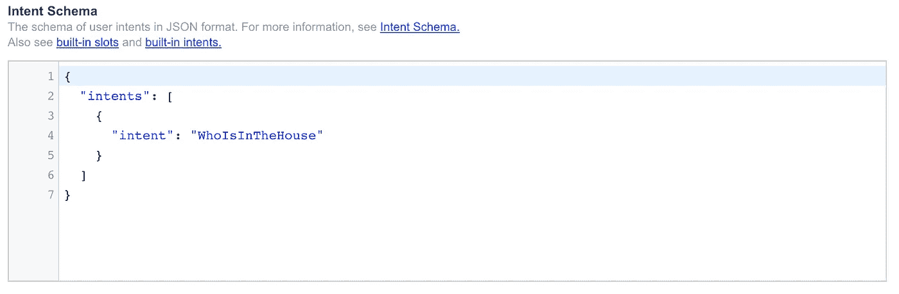

## 话语样本

我一点也不确定我这样做是否正确，因为当我在现场运行我的技能时，我的示例话语实际上并不工作，但至少以下内容是可以接受的。请注意，示例话语中的第一个单词必须与意图名称相匹配，否则会出现错误。

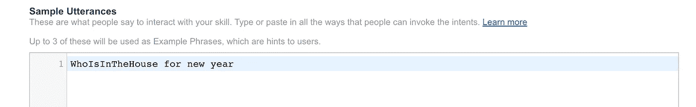

## 测试技能

您可以通过输入话语并查看返回的内容来测试本地技能。

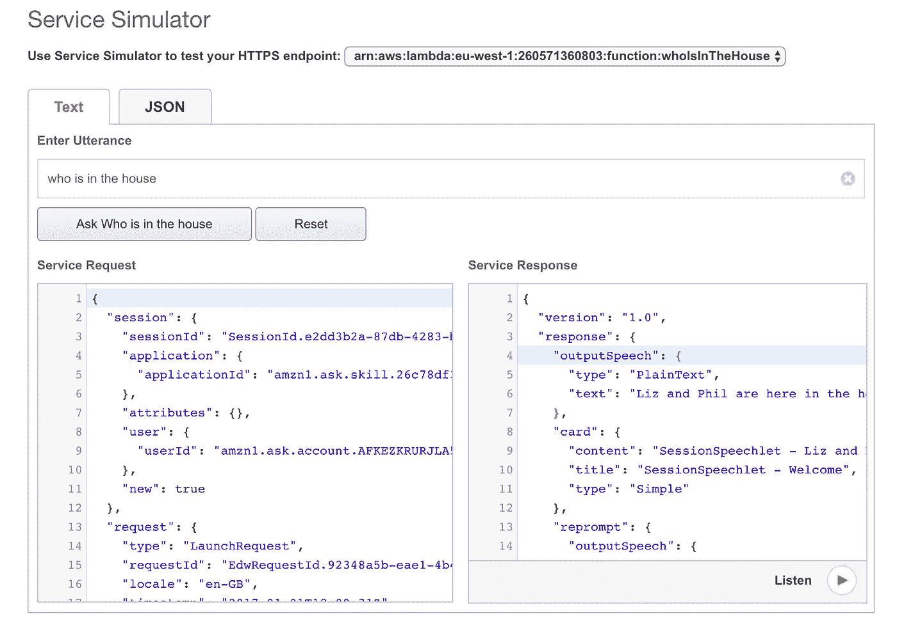

# 在亚马逊 Echo 上运行技能

我有一个 Lambda 功能，我有一个 Alexa 技能包可以触发它。现在我要做的就是在回声上试试。

## 失望

记得我在新年派对上吗？似乎没有方便的方法来与他人分享你未发表的技能。我们可以跳过一堆圈来重新配置乔恩的回声使用我的帐户，然后再重新配置回来。但是我们有更好的事情要做，比如玩[代号](https://en.wikipedia.org/wiki/Codenames_(board_game))和吃足够的食物来养活一支小军队。因此，令人失望的是，孩子们从来没有问 Alexa 谁在房子里。

## 失望第二部

新年！万岁！然后我们回到自己的亚马逊回声。我修改了我的 Lambda 函数，列出了一个非常简短的名字列表。我检查了我的技能是否可以测试…

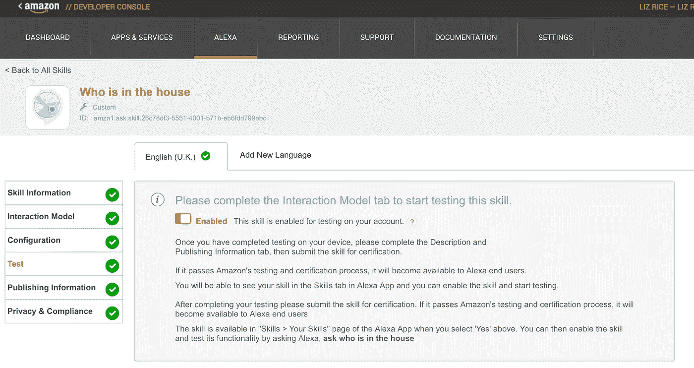

…然后说出了咒语，“阿列克谢，谁在房子里”。

没有。

她不知道我在说什么。

我看了看我的 Alexa 网页。就在那儿，在“你的技能”下面。

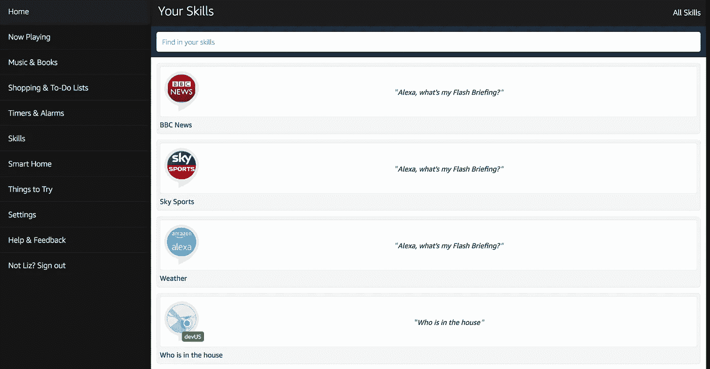

它在那里，它被启用了…为什么它不工作？

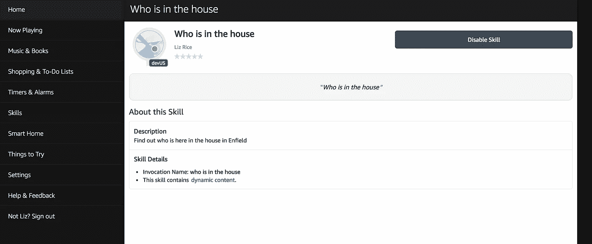

我想知道菲尔是否能看到我的技能，因为我们共享一个亚马逊家庭。他灵机一动，觉得也许 Alexa 用错了侧写。

Alexa 有个人资料？谁知道呢？

# Alexa 有个人资料

“要尝试的事情”下面的倒数第二项是“在配置文件之间切换”。是的，Alexa 用的是 Phil 的个人资料，而不是我的，并且看不到我的(正在开发中，未发表的)技能。

亚马逊，如果你正在阅读这篇文章，也许你可以说得更清楚一点，当你看到你在网络应用程序中的技能时，如果 Alexa 不使用你的个人资料，那绝对不会发生什么。

# 成功！！

# 下一步是什么？

我想我的下一步将是添加一些意图，这样你就可以告诉 Alexa 人们何时到达和离开。她需要把它存储在某个地方，所以我需要添加一些状态存储。然后我可能会创建一些更有用的东西！

如果你喜欢这篇文章，请点击推荐按钮，这样其他人可能会更容易找到它，并写出他们自己的 Alexa 技能。新年快乐！

**接下来——这里是** [**我的 Alexa 之旅的第二部分**](https://hackernoon.com/my-alexa-skill-with-storage-5adb1d097b88#.od5suf6rg) **，在这里我添加了数据库存储**

你真的喜欢这篇文章吗？我在考虑写一本关于为 Alexa 开发的书。你可以通过在此 *注册* [*来鼓励我这么做。谢谢大家！❤︎*](https://leanpub.com/adventureswithalexa)

[](http://bit.ly/HackernoonFB)[](https://goo.gl/k7XYbx)[](https://goo.gl/4ofytp)

> [黑客中午](http://bit.ly/Hackernoon)是黑客如何开始他们的下午。我们是 T21 家庭的一员。我们现在[接受投稿](http://bit.ly/hackernoonsubmission)并乐意[讨论广告&赞助](mailto:partners@amipublications.com)机会。
> 
> 如果你喜欢这个故事，我们推荐你阅读我们的[最新科技故事](http://bit.ly/hackernoonlatestt)和[趋势科技故事](https://hackernoon.com/trending)。直到下一次，不要把世界的现实想当然！

