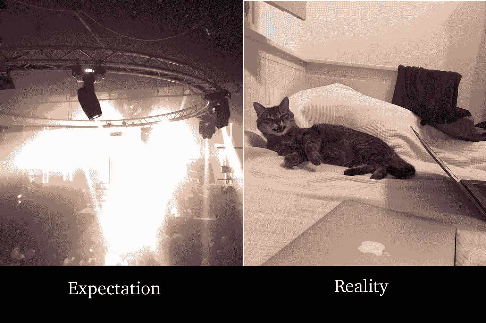
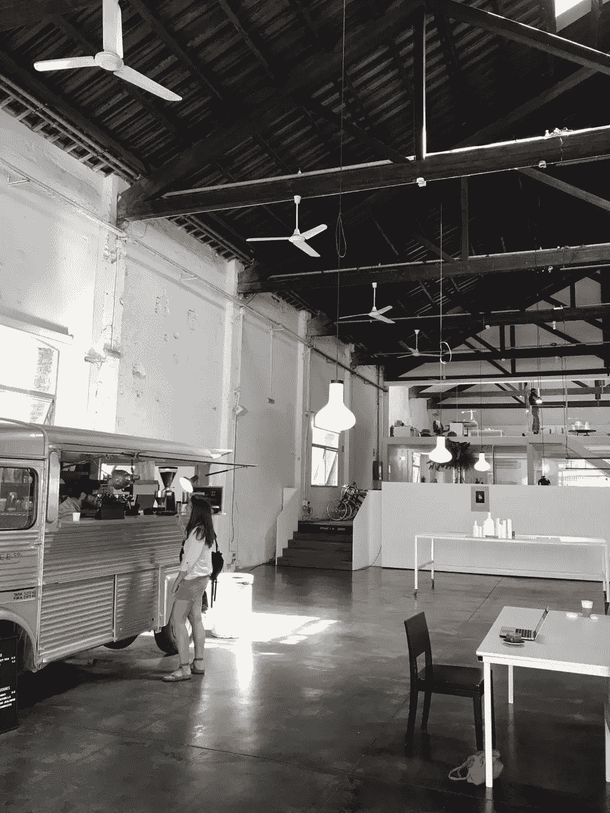
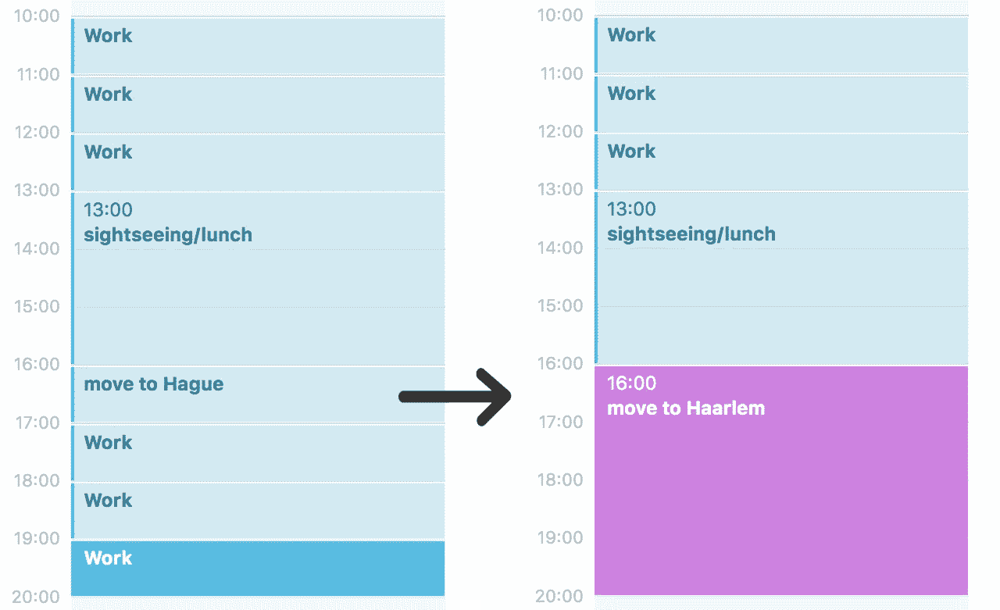
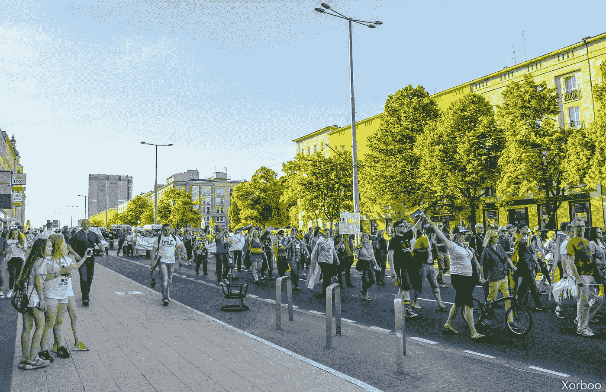

# 作为一名 iOS 开发人员，我第一次体验远程工作和游牧生活

> 原文：<https://medium.com/hackernoon/my-first-experience-on-remote-working-and-nomadic-lifestyle-as-a-ios-developer-8b3a0c1f3745>

几个月前，我开始独自旅行和远程工作。

我是一名 iOS 开发者，所以我的工作非常适合这个。我也有点(或不那么)热衷于旅游。现在我想和你分享我的经验。希望你能找到对自己有用或有启发的东西。

# **概述**

关于我第一次游牧经历的一些干巴巴的事实:

*   花了 1.5 个月。
*   我去过 5 个国家和 11 个城市。是波兰、西班牙、葡萄牙、荷兰、德国。
*   花 2500 欧。
*   我所有的东西包括笔记本电脑都在一个 7 公斤的包里。
*   48 个 Instagram 帖子，28 个在我的电报频道，12 个脸书新朋友。

# 这些问题

我必须意识到的一件事是游牧是一种不同的生活方式。我并不只是在不同的地方做同样的事情。不，现在我没有办公室，没有公寓，几乎没有财产，身边没有亲人。我还有另一套程序。我经常需要考虑我的签证、机票、公寓以及下一步去哪里。每次搬家，我都需要找一个新的同事、吃饭的地方、超市、健身的地方等等。几乎每天我都遇见新的人。这实际上不是一个问题，但是如果你想成为一个流浪者，你应该接受这个特征。

**快速旅行。**

我的一部分知道，缓慢的旅行与远程工作非常匹配。但另一部分人想四处看看。结果我在一个半月内访问了五个国家。这非常困难，因为我只有时间工作、计划和搬家。没有空闲时间放松、反思和意识到发生了什么。现在我想在一个地方呆不少于一个月。

*首先，我觉得经过四周的这种生活方式后，我累了。但是我没有注意自己的感受。我继续和我的朋友出去逛逛。我计划去柏林参加派对，柏林是科技之都。当我来到柏林，我意识到我的电池用完了。我只想躺在床上，什么也不做。我不想见人。我和 5 个邻居住在宿舍里。他们都很好，我们聊得很愉快，但是要见人太多了。我搬到公寓，又在床上躺了两天。我既没去过柏林，也没去过很酷的派对。所以对我来说，这真是一段令人厌倦的经历。现在两个星期过去了，但我还是有点累。*

**工作**

我工作中发生变化的主要是沟通。

当我在办公室的时候，我可以很容易地走两步，问我的同事。现在用谷歌搜索东西比问别人更容易。它节省了我的时间，因为也没有人问我愚蠢的小问题。

在办公室，我们与其他 iOS 开发者共进午餐。我们讨论了新技术和新问题。现在，我应该自己阅读所有这些信息，却没有人与我讨论。

另一方面，我现在每天都有新的办公室。

Daily new office

# **生活窍门**

以下几点对我有用。其中一些是我得到的建议，另一些是我自己的经验。

**不要害怕开始。**

第一个问题肯定在我的脑海里。我认为在我的公司不可能长期远程工作，因为没有人做过类似的事情。所以我首先找到了一个职位空缺，参加了面试，得到了一份工作，然后去找我的主管，问他我是否可以远程工作。我只听到“没问题。喜欢就试试”。

**日日程。**

当我在办公室工作时，我在那里呆了八个小时。但是当我开始旅行时，它就停止工作了。所以对我来说，现在最好的解决办法是每天做六个一小时的工作。我可以很容易地在一天之内或不同的日子之间移动它们。

我计划工作一天，逛逛阿姆斯特丹，然后搬到海牙。去海牙的火车需要 40 分钟，所以下面的时间表看起来很合理。但那天是暴风雨，从阿姆斯特丹到海牙的火车因为停电而停运。事情发生的时候我已经在路上了。因为这一团乱，我走错了路，最终我被困在了哈勒姆。所以转移花了比计划多得多的时间。我只是把工作时间挪到了接下来的两天，并不担心这个。

**策划**。

预订、寻找酒店或选择目的地要花很多时间。我发现最好在我的时间表中安排一些特定的时间来做这件事。最好在搬家前一个月做这件事。它通常节省我的时间和金钱，并给我更多的选择。我也感觉不那么紧张，因为我没有那么紧急的任务。

**移动互联网。**

当我呆在俄罗斯的时候，我没有意识到我是多么沉迷于移动互联网。我指的不仅仅是社交网络，还有地图和信使。所以拥有一张可以上网的 sim 卡对我来说非常重要。现在欧洲没有漫游，所以一张卡到处都可以用。

在欧洲的第一天，我去了格但斯克，我的一个朋友在那里接我。我们同意在中央车站见面。我来的时候，他不在那里。那时我还没有移动互联网。我在等他，但是没有用。最终，我设法找到了一些互联网。我的朋友告诉我，他不能按时见我，因为同性恋游行停止了城市的公共交通。

*还有一次在巴塞罗那，我打算在星巴克上班，我的时间安排非常精确。从家到目的地需要 10 分钟。但是在我去星巴克的路上，突然发生了一场示威。而移动互联网拯救了我那一次的会议。所以在任何意想不到的情况下，它真的很有用。*

**不要做游客。**

当我是一名游客时，我想看所有的东西。如果我错过了什么，我会很失望。现在我改变了看法。我甚至不去找很多关于我要去的地方的信息。我只是查看最好的住宿地点，阅读关于国家食物的信息，查找三大景点或事件。有时候我在寻找同事。这已经足够了，因为旅行对我来说更多的是关于人，而不是地方。

# 下一步是什么

我继续过着游牧生活，因为这让我快乐。我会尽量用“少即是多”的原则，不要对不同的地方那么贪心。我想在路上找一些好看的技术赛事。我有一张去日本的机票，打算在亚洲呆至少半年。它将如何发展？时间会证明一切。