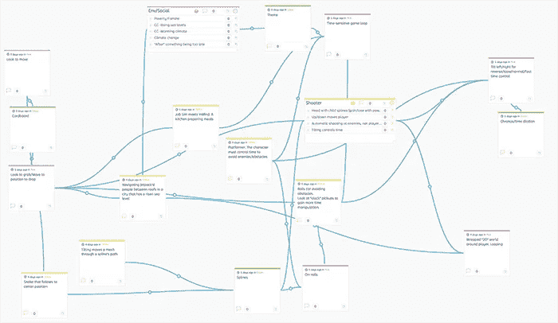

# 一个月，一场比赛

> 原文：<https://medium.com/hackernoon/my-first-game-jam-959dc60430db>

在过去的一年里，将我现有的软件工程技能转移到游戏开发领域是一次有益的经历。再加上最近在吸收与游戏设计相关的一切方面所做的努力，我对参加游戏大赛充满信心。有什么比参加仅几个街区之遥的温哥华建筑公司组织的 jam 更好的呢？

当然，我不会打赌我的技能有机会击败竞争对手，但至少我有一个工作的最后期限，3 月 22 日是[全球建筑大赛](https://itch.io/jam/global-archiact-jam)的最终提交日期。在这一次，我**将**建造一些超越粗略的不完整原型的东西……我对*这么多未完成的原型和不完整的游戏想法感到内疚。*

竞争分为[谷歌 Cardboard](https://vr.google.com/cardboard/) 和[三星 Gear VR](http://www.samsung.com/global/galaxy/gear-vr/) 两个类别。由于我没有装备，也没有任何一个[容易着火的兄弟](http://gizmodo.com/samsungs-galaxy-note-7-is-officially-banned-from-us-fli-1787833499)，我打算使用 [Unity](https://unity3d.com/) 游戏引擎提交一个纸板。

# 跟踪我的进度

我最终决定试用 Medium 来记录项目的进展，这似乎是一个合适的选择。宣布 GAJ 已经将近一周了。我希望根据这些初始条目变得多冗长来衡量我的帖子的频率。我确实觉得已经有很多进展要记录下来，供我自己日后回顾，也可能让其他人感兴趣。

# 主题

一旦我决定我已经准备好应对一个游戏，这个主题就是我头脑风暴的主要焦点。

主题，**太迟了吗？和任何人一起工作都很有趣。让这个想法在我的潜意识中孕育了一夜之后，我创造了一个新的[冲浪板](https://stormboard.com)，花了一个早上编织想法和它们之间的关系。**

Stormboard’s tangled web of themes and ideas

最初，我迷上了时间操纵。它方便地将有趣的游戏机制和主题联系在一起，但不幸的是，我没有让它达到我满意的程度。

另一套想法围绕着时间敏感的游戏。这个有问题。最后，每一个想法都感觉只不过是美化了的时间惩罚，这在无数游戏中司空见惯，并不比《超级马里奥兄弟》中的关卡倒计时更有主题意义。

头脑风暴剩下的流行主题集中在问题的环境观察上。我问，**现在解决气候变化问题是否为时已晚？**这是一个非常热门的问题，虽然是政治性的，但它会将我引向我的游戏主题，进而引出我的描述:

> **太迟了。人类对环境造成的破坏是不可逆转的。与其解决原因，不如改进你的喷气背包技能。毕竟，一旦大部分沿海屋顶被上升的海平面淹没，它将是未来城市天际线之间的主要交通工具。**

杂耍的有争议的主题与一个轻松的描述，我希望会成为一个有趣的手机游戏，这种描述将在项目的过程中完善。至少现在，这感觉更像是一个我可以支持的使命宣言。

就这样， [**Jetpack City**](https://play.google.com/store/apps/details?id=com.OldFort.JetpackCity) 诞生了。

 [## 下一篇文章:超越主题

### 设计核心游戏循环

medium.com](/@rhysp/beyond-the-theme-98525e01711f) 

> [黑客中午](http://bit.ly/Hackernoon)是黑客如何开始他们的下午。我们是阿妹家庭的一员。我们现在[接受投稿](http://bit.ly/hackernoonsubmission)并乐意[讨论广告&赞助](mailto:partners@amipublications.com)机会。
> 
> 如果你喜欢这个故事，我们推荐你阅读我们的[最新科技故事](http://bit.ly/hackernoonlatestt)和[趋势科技故事](https://hackernoon.com/trending)。直到下一次，不要把世界的现实想当然！

