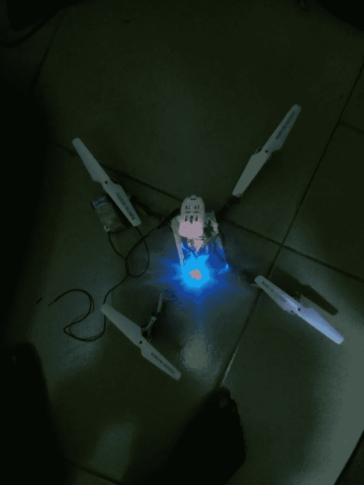
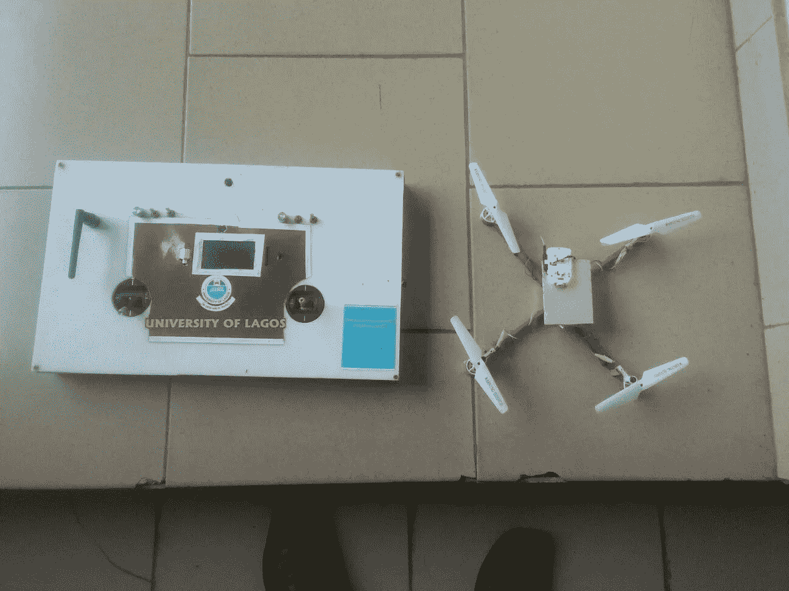

# 我的第一篇帖子:认识一下从零开始制造无人机的尼日利亚青年

> 原文：<https://medium.com/hackernoon/my-first-post-meet-the-nigerian-youth-who-built-a-drone-from-scratch-65144b06757a>

## 我知道你可能想知道，这是怎么回事，等等，我会告诉你…

这是我的杂志 [@GlitzPlusMag](http://www.facebook.com/glitzplusmag) 在本专栏中的一个重要故事，平凡的年轻人做着不平凡的事情，这是关于一个年轻的尼日利亚人，他正在为尼日利亚的科学和技术发展贡献他的研究。当一些年轻人忙于玩政治，一些人被用作恶棍和政治暴徒，以解决廉价的分数，被带到社交媒体上进行指责和诅咒，被用于操纵选举等，一名年轻的尼日利亚人选择将自己的名字印在成就者的史册上。

这个年轻的尼日利亚人不是别人，正是 Kwaku Williams，他制作了一架无人驾驶飞机，是的，一架无人驾驶飞机，作为他在阿卡卡拉各斯大学最后一年的项目。有趣的是，他可以说拥有双重国籍，因为父亲是奥约州奥格博莫索人，母亲是加纳人。

他向理查德·奥卢塞伊吐露了他的发明、事业和旅程。航空业是威廉姆斯从小就梦想的职业。但遗憾的是(用他自己的话说)，尼日利亚的大学都不提供。然而，最近成立的 Kwara 州立大学(KWASU)现在提供航空学。威廉姆斯说，他打算参加扎里亚航空学校，但受到经济上的阻碍。

The device in testing mode

尽管如此，他还是选择了电气/电子工程，并获得了 HND 和 BSc 学位。他在夸拉州奥法理工学院获得了 HND 学位，在尼日利亚首选大学拉各斯大学获得了理学士学位。William 的理学学士最后一年项目名为“比例数字无线电控制系统的设计和构造(用于遥控飞机和四轴直升机)”—提交给拉各斯大学电气/电子工程系。在这里，他试图建立一个设备，将推进与飞机和四轴直升机的通信。

The Quad copter with its controller

如果我们还记得，2013 年 12 月，尼日利亚联邦政府在总统古德勒克·乔纳森的领导下，发射了第一架本土制造的无人机，这被归功于尼日利亚海军。然而，威廉姆斯将是第一个从零开始制造无人机的独立尼日利亚人。据威廉姆斯说，这个项目是关于使用伺服电机远程控制模型飞机或四轴直升机的动态表面，并使用电机产生“推力”来产生升力。关于这个项目的一个重要属性，许多技术人员都会同意这一点，机身是用轻质木材设计的，因为它的高强度重量比。这种系统的应用正在席卷所有领域，例如电影工业，在电影工业中，它们被装配有摄像机、举重和娱乐目的等等。此外，该设计利用了脂肪电池的动力，不像燃油发动机版本提供了很多优势。

您可能想知道，“这款设备的重要性是什么，它如何改变一切”…就是它:

1.娱乐应用(飞行娱乐或游戏)，

2.拍摄电影或媒体报道(即，在人类无法到达的地方使用安装的摄像机的场景；可能在犯罪/暴力场景、大西洋、海滩或高山中)，

3.作为 CCTV 的更好替代物的安全措施(GPS 智能模块可以被并入以给予其指定的行进位置)，

4.举重(当装有高功率电池和马达时，作为跑腿设备)。
在附录中，该项目以其先进的形式(高稳定性和可靠性)向设计全尺寸飞机的远程驾驶迈进了一步，这是在马来西亚飞机失事后提出的。

然而，如果 Williams 没有经济上的限制，他会设计一个更大的模型，这将为尼日利亚政府和人民带来积极的科技权威。这种无人机的飞行能力为 10 公里，能够举起价值 20 公斤的物品。

当被问及这个项目和设备背后的动机和灵感时，威廉姆斯平静地回答说，他完成这个项目是为了将他的研究课程，即工程学与他所崇拜的研究领域航空学结合起来。这是在花了相当多的时间独立研究飞行原理和飞机设计之后出现的。

在回应进行这个项目时所面临的挑战时，Williams 发表声明说，他建造了相当多的原型，这些原型失败了，但无疑增加了他在设计方面的技术经验。在某一点上，他可以把最后一个 kobo 花在他身上，为这样的花哨项目购买组件。

威廉姆斯从 2007 年开始就梦想着让一具尸体上天，当时他正在攻读学位，但直到 2010 年，由于缺乏驾驶原型机的经验，他的第一架原型机坠毁，他才获得成功。

威廉姆斯是一位年轻聪明、雄心勃勃的科学家，他准备改变这个国家的技术研究。用他的话来说，“当我想在这个领域设计一个更大的项目时，我开始寻找资金来源，但不幸的是没有得到我所去过的地区的支持。”如果在这个国家，只有人才受到赏识，事情按他们应该的方式进行，你和我都知道威廉姆斯的天赋不会被掩盖。希望尼日利亚会变得更好，并承认像威廉姆斯这样的年轻人的独特性。

> [黑客中午](http://bit.ly/Hackernoon)是黑客如何开始他们的下午。我们是 [@AMI](http://bit.ly/atAMIatAMI) 家庭的一员。我们现在[接受投稿](http://bit.ly/hackernoonsubmission)，并乐意[讨论广告&赞助](mailto:partners@amipublications.com)机会。
> 
> 如果你喜欢这个故事，我们推荐你阅读我们的[最新科技故事](http://bit.ly/hackernoonlatestt)和[趋势科技故事](https://hackernoon.com/trending)。直到下一次，不要把世界的现实想当然！

