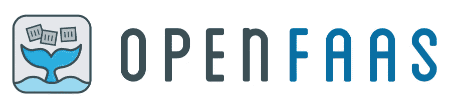
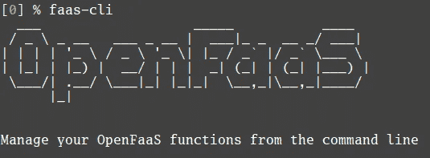

# 我对 OpenFaaS 的第一个拉式请求——一个主要的开源项目！

> 原文：<https://medium.com/hackernoon/my-first-pull-request-to-openfaas-a-major-open-source-project-d0c823790691>

作为一名 2017 年的软件工程师，我的日常工作依赖于大量的[开源](https://hackernoon.com/tagged/open-source)软件。 [GitLab](https://about.gitlab.com/) 、 [NPM](https://www.npmjs.com/) 、 [NodeJs](https://nodejs.org/en/) 、 [Visual Studio Code](https://code.visualstudio.com/) 、 [Docker](https://www.docker.com/) 等。有很多非常棒的工具和应用程序都是免费的！我们生活在一个多么美好的世界。

当然，所有这些应用程序都来自某个地方。有人利用自己的时间编写代码，然后放到互联网上供任何人使用。更好的是，代码是公开的，任何人都可以查看、修改，做你想做的事情。多么奇妙的概念！一切为了对代码的热爱！

如何回报这些为我们日常生活所依赖的东西付出时间和努力的好人？投稿！

没有比伸出援手、贡献你的时间和技能来帮助这些项目变得更好更能表达你感激之情的方式了！精彩的开源社区非常欢迎愿意提供帮助的新人。

这个月，10 月，是你尝试并回馈社区的最佳时机。数字海洋主办 [Hacktoberfest](https://hacktoberfest.digitalocean.com) ，“为期一个月的开源软件庆典”。这是指一堆项目给问题贴上标签，表明它们适合第一次参与的人。Digital Ocean 向在当月提出 4 次拉请求(请求将您的代码更改与原始项目合并)的任何人赠送一件 t 恤。

继续我的第一个合并拉取请求的故事！

一段时间以来，我一直在关注一个可以在工作中使用的项目。 [OpenFaaS](https://github.com/openfaas/faas) 。“充当 Docker 和 Kubernetes 的服务”。一个极好的概念！在您自己的基础设施上，以 Docker 容器的形式运行任何语言的无服务器自动扩展功能。

A serverless framework for Docker and Kubernetes

我发现了一个看起来我可以处理的未决问题，它被标记为[hacktoberfest](https://github.com/openfaas/faas/issues?q=is%3Aissue+is%3Aopen+label%3Ahacktoberfest)[# 235](https://github.com/openfaas/faas/issues/235)

我对这个问题发表了评论，提到我愿意处理它。这样维护者和其他潜在贡献者就知道这个问题正在进行中。然后，我阅读了投稿指南，因此我理解了对项目进行更改的规则和过程。这个项目要求每一个提交都要被签署。签署提交是一个保护开源项目的过程。你可以在 [OpenFaas 投稿指南](https://github.com/openfaas/faas/blob/master/CONTRIBUTING.md)中了解更多信息。

我加入了 Slack 频道，粉丝和贡献者在这个频道上合作。在那里，我公开询问是否有人可以帮我解决一些我遇到的问题。几个人很快加入进来，就如何解决我的问题提出了建议，并帮助我让下一次变得更容易。我最终被指向了一篇关于如何为开源项目建立工作流的优秀文章:[https://blog . Scott Lowe . org/2015/01/27/using-fork-branch-git-workflow/](https://blog.scottlowe.org/2015/01/27/using-fork-branch-git-workflow/)

读完这篇文章，并与 [OpenFaaS](https://hackernoon.com/tagged/openfaas) 团队进行了更多的讨论。我修改了我的代码，做了一些测试以确保它正常工作，并且没有破坏任何现有的测试！我不得不按照项目负责人亚历克斯·埃利斯的建议做了一个小小的更新。

我的拉取请求已被批准和合并！

由于我所做的一个改变，项目的持续集成现在可以自动将图像推送到 Docker Hub。这一改变真的点燃了一把火，我已经在为下一个贡献而努力了，因为我知道我得到了 OpenFaaS 团队的支持。

OpenFaas 项目中的每个人都是如此开放、友好和乐于助人。我真的很感激当我试图成为这个项目的一部分时得到的所有帮助。因为我已经做了更改，所以我是演示期间展示的贡献者幻灯片的一部分，并且我被邀请参加贡献者圆桌会议。激动人心！

现在，轮到你了:

*   点击了解更多关于 OpenFaaS [的信息](https://blog.alexellis.io/introducing-functions-as-a-service/)
*   想加入 Slack 频道？给 alex@openfaas.com 发邮件
*   查看是否有您可以解决的[未决问题](https://github.com/openfaas/faas/issues?q=is%3Aissue+is%3Aopen)。

如果你感到困惑或卡住了，寻求帮助。这里大家都是一个团队的！如果你找不到一个你能处理的公开问题，问问项目负责人你是否能帮忙。我敢肯定他们有一个需要注意的小事情的清单，他们会喜欢你的帮助。

所以，走出去，做出贡献，并获得一件免费的 t 恤！ [#Hacktoberfest](https://github.com/openfaas/faas/issues?q=is%3Aissue+is%3Aopen+label%3Ahacktoberfest)

Currently working on a P.O.C. to refactor a C# API into an OpenFaaS project