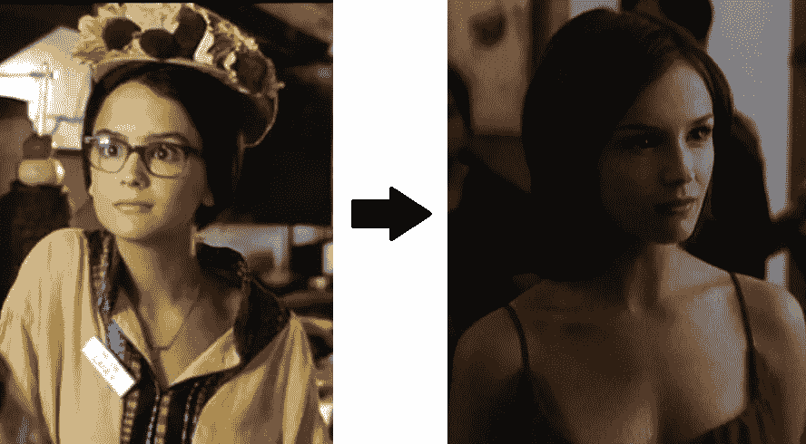

# 我的第一次(被邀请参加招标)

> 原文：<https://medium.com/hackernoon/my-first-time-being-invited-to-an-rfp-4b93a00bc818>

## 美好回忆

我们都记得我们的第一次…

那种兴奋！

表现焦虑！

成就感！

说实话，岁月侵蚀了记忆的清晰。有一段时间，我以为我已经记住了每一句美丽的台词。但是现在有一种朦胧感；记忆的边缘有点模糊。RFP 也是如此。作为一个供应商，没有什么比第一次更令人兴奋的了。

## 喂？你能看到我们在这里吗？

我们花了几年时间来打造一个产品，可能只花了九个月来销售它。这是一项艰苦的工作。我们很早就进入市场，但在我们之后加入在线视频竞争的公司资本更雄厚，更受媒体喜爱，并以一种我们似乎没有的方式“在雷达上”。这不是因为缺乏尝试。我们的团队会在活动中相互接触，但我们似乎永远被降级为观众，而我们竞争对手的管理层则在房间前面的舞台上用他们的思想领导力让我们周围的人眼花缭乱。甚至不是事后的想法，而是根本不是任何想法，这有一种无声的沮丧。

回到办公室(前几年碰巧是我的卧室)，我发邮件，打电话，琢磨黑魔法——任何能引起注意的东西。我们是高中电影里那个笨拙的女孩，我们需要的只是有人告诉我们摘下眼镜。然后就发生了。这是一家大报，我们自己的足球队队长，邀请我们去跳舞。“是的！是啊！一千次是！”我们想说，但我们知道我们必须保持冷静。“感谢您邀请我们参与您的在线视频平台招标，”我们写道。“我们将审查需求，如果它们与我们的能力相符，我们将做出回应。”就像电影里一样，我们在玩欲擒故纵的游戏。

对我们来说，受邀参加 RFP 是一个信号，表明我们已经到了，表明我们当时还很小的初创公司已经崭露头角。不请自来的竞争[业务](https://hackernoon.com/tagged/business)的邀请感觉像是对我们业务的认可。因此，我们兴致勃勃地参加了 RFP，仔细考虑每一个词，反复强调我们可以立即交付的内容，并忠实地承诺实现我们产品中尚未实现的任何所需功能。我们与一位董事会成员分享了 RFP，这位成员建议我们不要在这个过程中陷得太深，但他赞赏我们精心准备的答案。

## 舞会上的美女

他不是唯一一个认为我们做了很好的回应的人。买家邀请我们参加下一轮。谁会想到四分卫会有那样的舞步？当 DJ 旋转一些胖胖的苗条身材时，他带着我们在舞池里旋转。每个人都在看着我们。

“她是谁？”

“我以前从来没有注意过她。”

“她太酷了！”

这是如此惊人；我们在漂浮！

不幸的是，故事并没有以我们在各自大学里的异地恋结束。你看，我们没有成交。但是最终，我们得到了一些我们在任何后续的 RFP 中都没有得到的东西:透明度。我们了解到，他们的评估人员已经确定我们的功能集是最强大的，我们的定价是最具竞争力的。然而，我们被我们的规模打败了。买家选择了那家融资更多、知名度更高的公司。如果这意味着降低他们对视频与用户体验紧密程度的期望，那就这样吧。

## 后果

这些年来，我们参与了太多的 RFP，它们开始变得模糊不清。当你这样做了足够多的次数后，你真正记得的唯一一件事就是在早上醒来的时候有点讨厌自己。你向自己承诺永远不再这样做，但 RFP 的警笛声太难抗拒了。

想象一下，能够在不觉得需要洗澡的情况下完成 RFP 流程。这就是我们在 http://www.vendorful.com 建造的东西。[报名](http://info.vendorful.com/vendors-request-a-trial-of-vendorful-rfp-management-solution)，再次自我感觉良好！

*最初发表于*[*vendor—Buying Made Better*](http://www.vendorful.com/my-first-rfp-invite/)*。*

> [黑客中午](http://bit.ly/Hackernoon)是黑客如何开始他们的下午。我们是 AMI 家庭的一员。我们现在[接受投稿](http://bit.ly/hackernoonsubmission)并乐意[讨论广告&赞助](mailto:partners@amipublications.com)机会。
> 
> 如果你喜欢这个故事，我们推荐你阅读我们的[最新科技故事](http://bit.ly/hackernoonlatestt)和[趋势科技故事](https://hackernoon.com/trending)。直到下一次，不要把世界的现实想当然！

