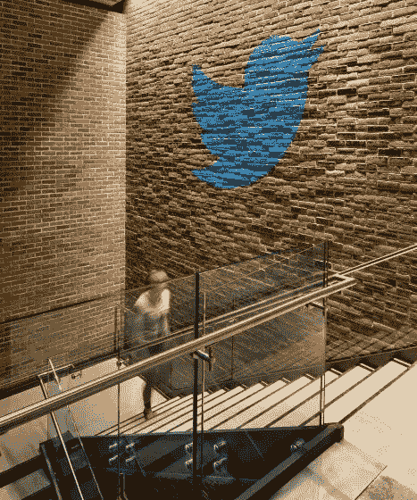
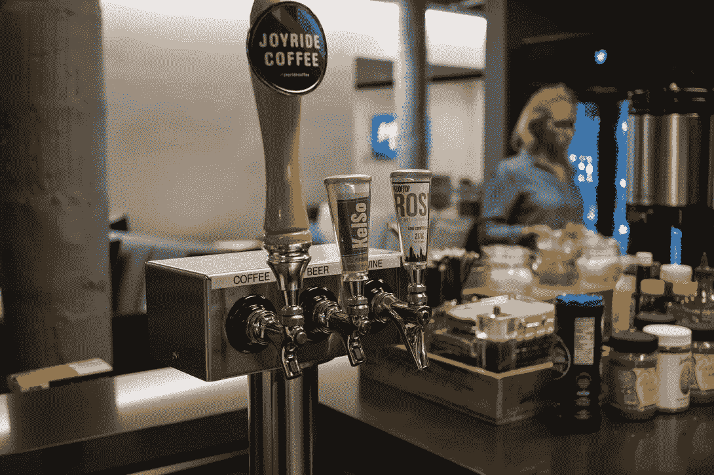
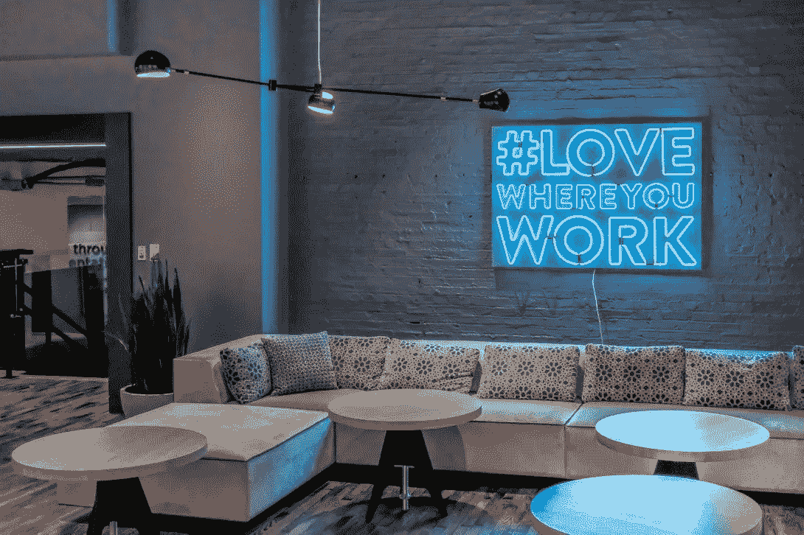
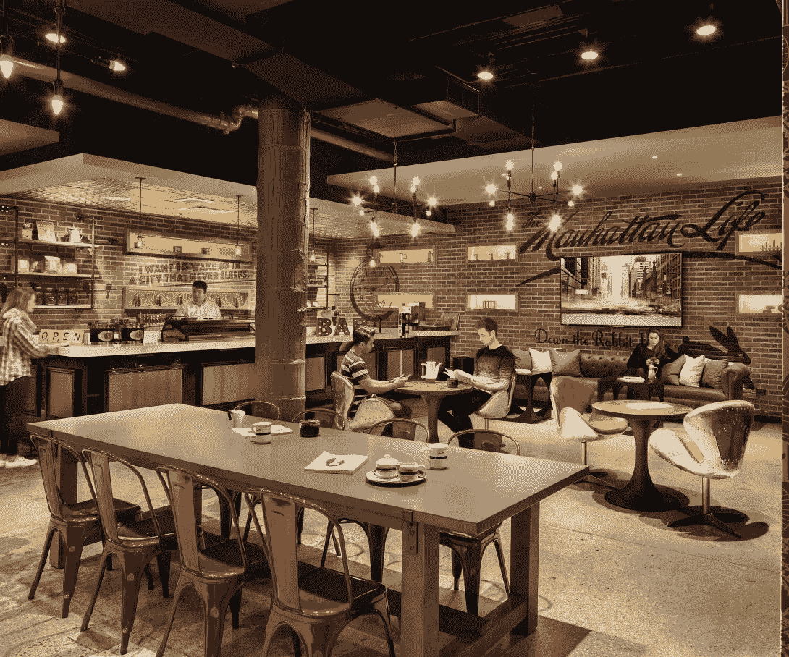

# 我在纽约推特上的头 10 天

> 原文：<https://medium.com/hackernoon/my-first-two-weeks-twitter-nyc-a9e418141453>

## TL；玛:太神奇了

*IMAGE COURTESY HLW INTERNATIONAL. PHOTO BY CHRIS COOPER*

今天标志着我在 Twitter 纽约办公室实习的第 10 天的结束，我的天啊，这是多么美好的 10 天啊。在兴奋、热烈的欢迎和繁忙的#FlightSchool 迎新活动中，这里有三件关于办公室的事情引人注目，让我在接下来的[夏天](https://hackernoon.com/tagged/summer)里感到难以置信的兴奋。

1.  **重视学生的职业发展不仅仅是一句招聘口号。**对我来说，[推特](https://hackernoon.com/tagged/twitter)确实关心实习生的职业发展。马上，每个实习生都配有一名导师和一名经理，他们将在整个夏天指导他/她，并成为所有问题的第一联系人。我的导师和经理(大声喊出来的李和艾什)给了我极大的帮助，并且在专业上对我进行了明显的投资，无论是在 Twitter 上还是在其他地方，这令人惊讶。他们对我的学术和职业兴趣感兴趣，并努力提供与他们一致的项目。此外，Twitter 还为员工和实习生提供数百门内部课程，在他们工作时的休息时间扩大他们的知识基础。它们从“Tableau Essentials”到“掌握工程师的技术面试”，任何员工都可以报名就他们熟悉的主题授课。在我的第一周，我参加了一个由 Cortex 团队领导的关于深度学习的很棒的课程，这让我了解了 Twitter 如何在其目标和时间轴产品中利用神经网络。我认为看到对员工发展和培训的坚定承诺是非常好的，并且肯定会在整个夏天参加更多的课程。此外，在过去的 10 天里，我们与全国各地的员工进行了一对一的聊天和介绍性会议，以解决我的所有问题。我被鼓励大胆发言，并且很早就被告知没有愚蠢的问题。我遇到的每一个人都慷慨地付出时间，并渴望帮助解释令人困惑的过程和概念。Twitter 这里有很好的学习氛围，我很高兴看到接下来的 10 周将会带来什么。
2.  办公室感觉不像办公室，工作感觉不像工作。从外面看，[西 17 街](https://www.google.com/maps/place/Twitter,+249+W+17th+St,+New+York,+NY+10011/@40.7415264,-73.9998855,16z/data=!4m2!3m1!1s0x89c25901dcc447ff:0xbcd1f2ec111eeab0)的办公室可能看起来不起眼，但一旦你步入大堂，门面很快就会消失。Twitter 的 12 层公司总部是一个装饰着艺术的华丽空间，开放的区域(任何地方都没有小隔间)，高大的窗户，裸露的砖，充满了直接来自西榆树目录的现代家具。除了大多数楼层都有库存充足的厨房，供应精酿啤酒、冰镇啤酒和散装桃红葡萄酒，还有一个地下室地下酒吧、一个自然光充足的宽敞自助餐厅，当然还有一个娱乐空间，里面有街机游戏和一张乒乓球桌。

PC: KENDREK LYONS (@KENDREK).

PC: KENDREK LYONS (@KENDREK).

Basement Speakeasy. PC: Chris Cooper.

A typical (free!) lunch at Twitter. PC: KENDREK LYONS (@KENDREK).

除了令人难以离开的舒适的办公室氛围之外，文化本身也很友好，很吸引人，我敢说，工作很有趣。例如，每周四下午 3:30 开始，一辆装有美味酒精混合物的饮料车被带到周围，作为对即将到来的周末的抢先庆祝(不幸的是，你必须 21 岁以上才能参加，也就是说不是我)。员工也可以加入一些围绕个人爱好的小组(我最喜欢的是“推特电影迷”、“足球”和“嘻哈”)。实习生也有组织外出的特权。我在这个夏天剩下的时间里的日程包括油漆球、[切尔西市场](http://www.chelseamarket.com/)美食之旅、业余阿波罗之夜[、扬基队比赛、](https://www.apollotheater.org/)[逃离房间](http://static.escapetheroomnyc.com/)、煎锅晚餐等等。有趣有趣有趣。

**3。对多样性的承诺是真实的。**众所周知，硅谷的许多大公司都在努力营造一种包容、多元的文化。从我目前的经验来看，Twitter 似乎很清楚这一事实，并积极努力成为一股变革的力量。在我的第一次入职培训中，我了解了 Twitter 员工资源小组(ERGs)。ERGs 是代表人数不足的 Twitter 员工和盟友的内部亲和团体。不同的群体包括[Twitter ala](https://twitter.com/twitteralas?lang=en)(拉丁美洲和拉丁美洲血统和盟友的雇员) [BlackBirds](https://twitter.com/Blackbirds) 、 [TwitterOpen](https://twitter.com/TwitterOpen) 、 [TwitterWomen](https://twitter.com/TwitterWomen) 、 [TwitterAsians](https://twitter.com/twitterasians?lang=en) 、 [Stripes](https://twitter.com/twitterstripes?lang=en) (针对退伍军人、服役人员和军人家属)，以及 [TwitterParents](https://twitter.com/twitterparents?lang=en) (针对有孩子的雇员)。除了进入这些支持组织之外，包括实习生在内的所有员工还需要接受“包容&无意识偏见”培训，作为支持多元化举措的一部分。就在今天，浴室标志更新为包括“自我认同的[wo]男性和性别多样性在这里受到欢迎”的标志。我很自豪能在这样一家进步的公司工作，我希望 Twitter 能成为其他科技公司效仿的榜样。

能在 Twitter 工作，我确实感到无比幸运，我强烈鼓励其他学生申请明年夏天的工作。这确实是一家令人敬畏的公司。另外，你上推特是有报酬的。你还想要什么？

你可以通过 Twitter @dtao114 联系我，或者发邮件到 Dtao114@berkeley.edu 找我。感谢阅读！

> [黑客中午](http://bit.ly/Hackernoon)是黑客如何开始他们的下午。我们是 T21 家庭的一员。我们现在[接受投稿](http://bit.ly/hackernoonsubmission)并乐意[讨论广告&赞助](mailto:partners@amipublications.com)机会。
> 
> 如果你喜欢这个故事，我们推荐你阅读我们的[最新科技故事](http://bit.ly/hackernoonlatestt)和[趋势科技故事](https://hackernoon.com/trending)。直到下一次，不要把世界的现实想当然！

