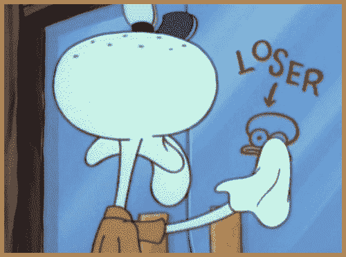

# 我作为开发人员的第一年

> 原文：<https://medium.com/hackernoon/my-first-year-as-a-developer-2376317be109>

一年前，我开始了我的新工作，成为一名后端 Python 开发人员。我放弃了一个职业，一个专业，我几乎放弃了我的硕士学位。当一切发生的时候，我想我不明白那个决定会在我的生活中造成多大的影响。现在，一年过去了，我想告诉你一点今年发生的事情。

Me writing this text

我记得(非常清楚)的第一件事是我在新工作的第一天是如何脱臼的。我是在我的正常环境之外完成的，有一个规则是“如果他有电话，你不应该打扰他”。怎样提问才不会打扰到别人？我记得我试图以我能想到的任何方式变得有用，我试图阅读拉式请求中的代码，并寻找研究事物的方法。

我记得当时很沮丧，很气馁。我建议帮助记录我们正在构建的平台(以任何方式提供帮助)，我花了 3 个月的时间基本上写了文档。给那些渴望学习的人一个小建议:让他们仅仅写 3 个月的文档是残忍的。我记得我当时认为自己是个失败者，我绝对应该退出。

我自我感觉不好，觉得自己没用。我想过要回我原来的工作。我想所有人都会说“我知道你不会成功的”。我想我的骄傲会变成垃圾，失败的感觉让我一直哭泣。

最后，我决定寻找机会。我走了这么远，我想我不能简单地退出。如果那个地方不好，我肯定会在一个新的地方再试一次。然后一个可怕的问题出现了:谁会雇佣只有几个月专业知识的我？

我清楚记得的一件事是，我对“上帝程序员”的职位空缺感到非常沮丧。描述中问了至少 4、5 个 devops 的编程语言和知识。第六和第七语言是不同的。WTF？不会吧。我要做什么？

我和很多人谈过。对于那些认识我的人，我请求帮助找到一个新的地方。我真的想要一份新工作，而且我有无限的学习意愿。了解我一点点的人可以把这些告诉那些根本不了解我的人。我尽我所能使用我的网络。我申请了几个职位，不得不把自己“推销”成一名好员工。

我总是说有两种方法来销售你的作品:“哦…我会坐在那里安装计算机，并在模拟器崩溃时修理它…”或者你可以重视自己，说“我是模拟器的技术负责人，我必须确保它在重要的车间工作，那里有几个人会依赖它的功能。如果我干得好，我在车间里就没什么事可做了。”我在这些断言中撒谎了吗？不。两者都是正确的。不同的是你告诉别人你做了什么的方式。这改变了他们对你的看法，也改变了你对自己的看法。所以，我鼓起所有的勇气和恐惧，开始接受采访，用我能想到的最好的方式推销我的专业知识。

第一次代码测试，我的代码不够快。我花了 3 天时间尝试，直到我接受了最深刻的失败。第二次面试很好，但是他们没有足够的钱给团队中的另一个人。第三，我没有比我更有经验的人了……就这样一直持续下去。

在 Caipyra 会议期间，塞尔吉奥打电话给我，告诉我他们需要什么样的人参与《T2 渴望》的制作。这正是我生活中需要的。我从来没有想过离开弗洛里亚诺波利斯(我生活的地方)。我周五来到里贝朗参加了我在会议上的一次演讲，周日晚上，我在我的电子邮件上收到了一份工作邀请，比我的正常时间提前了 1 个小时。会议结束后，我在那里呆了整整一周，当我回到弗洛里亚诺波利斯时，我已经有了一个新的日期，可以在这个名为里贝朗·普雷托的新城市开始我的新工作。

搬家的决定是我一生中做过的最困难的事情之一。不止是转行的决定。我将不得不住在我可爱的公寓里，和我在 Florianópolis 住了 9 年的朋友们住在一起，放弃一个被认为是完美的城市，一个我感觉很好很快乐的城市。我会为了一个梦想放弃这一切。一个疯狂的梦想，在 27 岁的时候，成为一名程序员。我到底在做什么？当我接受这份工作时，我几乎 3 天没吃东西。当我最终意识到我所做的事情时，我几乎因为太虚弱而晕倒。当我回到 Florianópolis 时，我哭了三个星期才收拾好行李离开。当然，这是一个更加困难的决定。

离开你的舒适区是个问题。一个大的。这就像有人把你从你母亲温暖的子宫里带走，然后给了你一巴掌，把你送到了这个世界。我不知道在连续哭了三个星期后我怎么还有脸。这不容易，也永远不会容易。如果是的话，每个人都会做他们害怕的事情。

来到一个陌生的城市，几乎没有朋友，有很多恐惧。我记得当我做第一个拉请求时，我说:“Uau！如果我每周做一件这样的事，我就足够开心了！”我得到一个“如果你每周只做一次，你不会坚持很久”。我是纯粹的恐惧。完全恐慌。我*显然*做不到。

我必须承认一件事:我来到里贝朗时就知道，如果一切都出错了，我会在一个月后回来，一切都会好的。我来的时候想，如果它不起作用，那也很好。我一直这么想，直到我确定一切正常。我来的时候准备再试一次，明白它又不起作用了。但事实并非如此。

我走在一个对初学者友好的环境里，有很多很好的人。每个人都很好，很有耐心，我上了很多课，了解我做错了什么。没人告诉 med“你太初级了，理解不了这个”。每次我说有不懂的地方，就有人给我上课。除非很难，如果我不知道怎么做，那就是他们给我的任务。

整个团队都非常确定我能成功，他们都很有耐心，这让我作为一名职业球员和一个人都得到了成长。我的代码开始变得越来越复杂，我的代码审查也变得更加严格。我开始相信我可以称自己为开发者。

I you are like me, and don’t think you are a developer, please do the best test possible [here](http://amiarealdev.com/#)

环境非常适合学习，后端进展顺利，并于 2 月(2017 年 2 月)开始与前端合作，包括 React、Javascript 等。面临新挑战的新领域。

我在[渴望食物服务](https://sourcewhatsgood.com/)团队和[里贝朗普雷托](https://www.facebook.com/grupyrp/?fref=ts)的蟒蛇群中学到的东西是荒谬的。我的学习曲线呈指数增长，现在我对自己的职业选择非常确定和平静。拥有一个信任你的人是最基本的，这让一切变得不同。然而，同样重要的是，你要相信自己。我在这里说的一切都是怀疑和软弱的时刻。然而，就像那些时刻一样，我不得不相信我能做到(有时依靠外部帮助)。今天我在这里，带着一年的专业知识…希望新的一年将带来更多的学习(和一点舒适区，因为没有人是铁做的！)

When you are a beginner but you feel good about yourself!

> [黑客中午](http://bit.ly/Hackernoon)是黑客如何开始他们的下午。我们是 [@AMI](http://bit.ly/atAMIatAMI) 家庭的一员。我们现在[接受投稿](http://bit.ly/hackernoonsubmission)，并乐意[讨论广告&赞助](mailto:partners@amipublications.com)机会。
> 
> 如果你喜欢这个故事，我们推荐你阅读我们的[最新科技故事](http://bit.ly/hackernoonlatestt)和[趋势科技故事](https://hackernoon.com/trending)。直到下一次，不要把世界的现实想当然！

