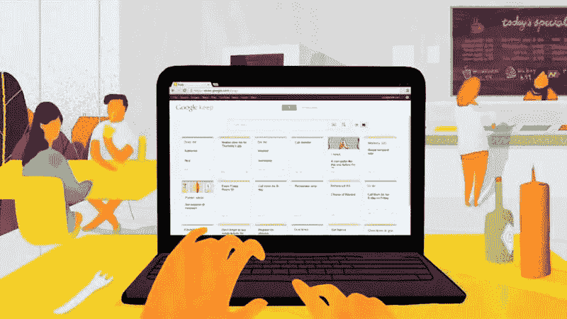
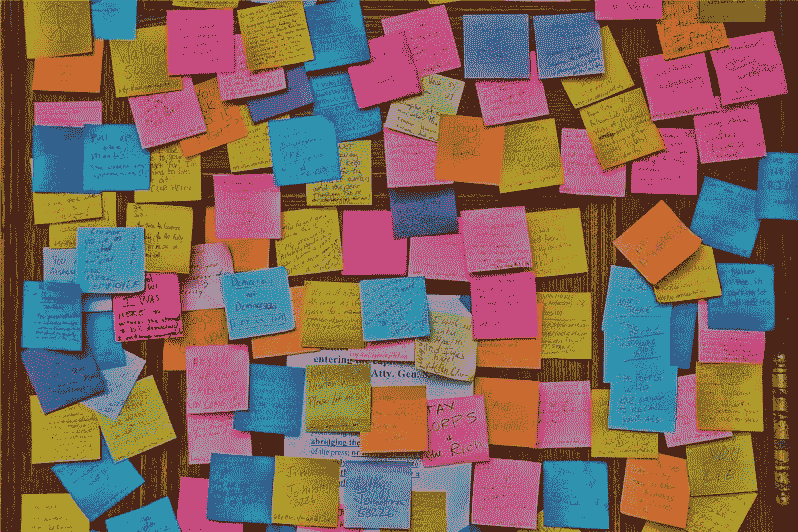
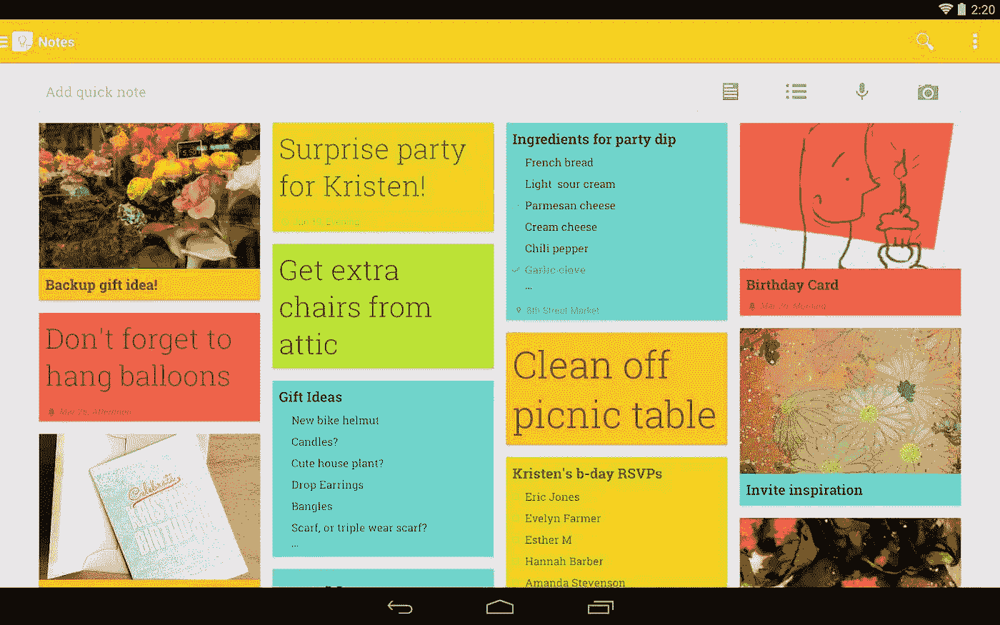

# 我的谷歌 Keep 2017 愿望清单

> 原文：<https://medium.com/hackernoon/my-google-keep-2017-wishlist-e841f3fe1ed2>

## 或者，我的计划试图变得更有条理，更少拖延

我不得不承认，我认为自己属于拖延症大师的行列。正如蒂姆·厄本在他精彩的 TED 演讲中解释的那样，这意味着如果我有两周时间来完成一项任务，我几乎肯定会等到最后 24 小时再去做。

You should watch it before moving on

结局总是好的吗？**没有**。

正因为如此，在过去的几年里，我试图用我的工程学头脑所允许的唯一方式来解决这个问题:写下许多清单和便利贴。

> 到处

去年夏天，我曾一度同时使用:

*   **两份**身体议程(一份每日+一份每周)
*   **一块**黑板
*   **Evernote** 用于长笔记
*   **列表和周期性任务的 Wunderlist**
*   **谷歌保存**购物清单和小纸条
*   **Google Drive &日历**用于草稿和事件等

如你所见，这不会持续太久。**曾经**。作为一名开发人员，在一个整体任务中使用所有这些工具让我感到困扰:我需要的只是写下我需要/拥有/想要做的“事情”以便让我的注意力集中在当前的任务上。基本上，一个**缓冲器**。

此外，记住使用所有这些不同的地方做不同的事情的精神压力是我的理性自我和写下东西的实际行为之间的第一个障碍。

我必须找到一些东西:

*   多平台(移动和桌面)
*   始终同步
*   能够“正确地”存储不同种类的列表、重复任务、事件和更多的普通笔记
*   简单易用

在*最少数量的工具*中，研究使用什么、如何使用以及使用哪个软件来满足需求列表并不容易(在开始四处查看的五分钟后，我放弃了只有一个)。

幸运的是，在这一年里，谷歌增强了日历应用，作为一个狂热的收件箱用户，我可以使用这两个应用处理提醒和重复任务。

> *迈出了一步*

但我确信我不能只依靠数字应用来欺骗我大脑中的猴子:我知道我必须有一个笔记本来记录工作时或在那些不能使用智能手机的场合(例如电池)。在这种情况下，凯文·罗斯的时事通讯[《华尔街日报》](/the-journal-by-kevin-rose/issue-11-a0b8a3abb12e#.5z74mfjgz)提供了我所需要的:记笔记的方法。*(顺便说一句，那份简讯很棒，你应该好好看看)*

This is the video he links, in case you don’t want to go over there to read it

但是我仍然需要一些技术上的东西来做清单和草稿:我并不总是带着我的笔记本，或者当我可以在我的一个屏幕上打开一个应用程序时，我只是不想去找它。所有这些都要记住上面的列表:简单是最重要的。

然后我决定...*(插入鼓声效果)*

…坚持使用谷歌。也就是说，使用 **Google Keep** 处理各种列表和笔记，使用 **Google Drive** 处理更长的草稿。

所以，基本上，我大幅减少了所需的不同账户的数量:我知道这听起来很傻，但能够依靠一个两步认证账户来完成所有这些不同的任务是一种压力缓解。

那么，这种方法会是完美的吗？**否**。

或者，给出一个更好的答案，还没有。我觉得 Evernote 还是一个做长笔记的好 app，Google Keep 也有很大的提升空间……这又回到了题目上。

I chose this image because it’s pretty similar to mine

以下是我非常非常希望保留在 Google Keep 中的三个特性:

1.  **条件格式** 我指的是添加标签时，可以自动将颜色添加到注释中。我知道这可能听起来很无聊，但它会提供这样一个更流畅的体验。
2.  **更多可视化选项**
    现在，你可以在同一个页面上看到你所有的笔记(就像上面的图片一样),或者进入左侧的抽屉菜单，查看特定标签的所有笔记。我真的很喜欢第三种选择:类似 Evernote 的“笔记本”视图，你可以看到一种文件夹，每个标签一个，里面有项目的数量。
3.  加密
    我把最好的留到了最后:一个巨大的缺失是可以给某些笔记添加密码。此外，我仍然不清楚这些笔记是如何储存的——试着问了一次，没有得到任何有意义的答案。

> 所以，我们到了。

我希望某个认识在谷歌团队工作的人的人至少有一个这样的想法——或者类似的想法；这样，2017 年对我的生产力来说会顺利得多。

与此同时，我真的很想和你们这些坚持到最后的人讨论一下:你们还会给这个列表增加什么功能？哪个应用程序我没有考虑过，会彻底改变我的生活？在评论里告诉我，或者给我发一条[推文](https://twitter.com/Kelset)。

*免责声明:本文所有图片均摘自互联网。如果你是其中一个的作者，并且不希望它出现在这里，请告诉我，我会删除它。*

> [黑客中午](http://bit.ly/Hackernoon)是黑客如何开始他们的下午。我们是 [@AMI](http://bit.ly/atAMIatAMI) 家庭的一员。我们现在[接受投稿](http://bit.ly/hackernoonsubmission)，并乐意[讨论广告&赞助](mailto:partners@amipublications.com)机会。
> 
> 如果你喜欢这个故事，我们推荐你阅读我们的[最新科技故事](http://bit.ly/hackernoonlatestt)和[趋势科技故事](https://hackernoon.com/trending)。直到下一次，不要把世界的现实想当然！

