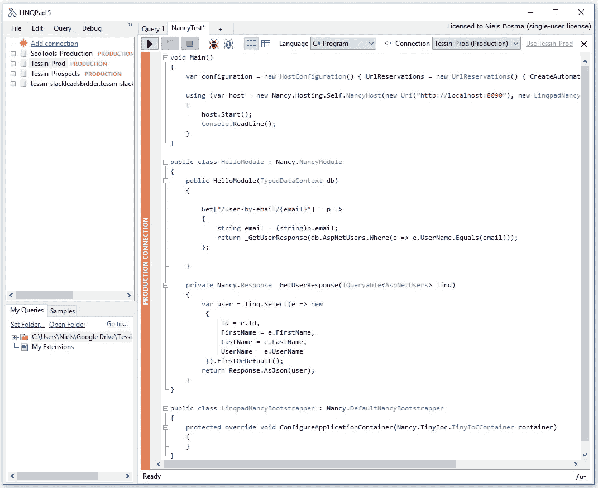
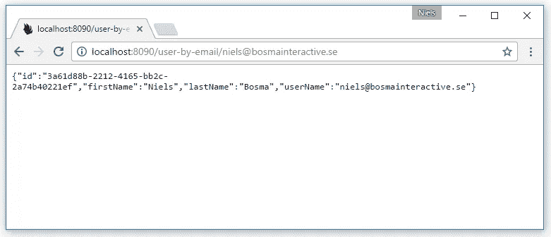
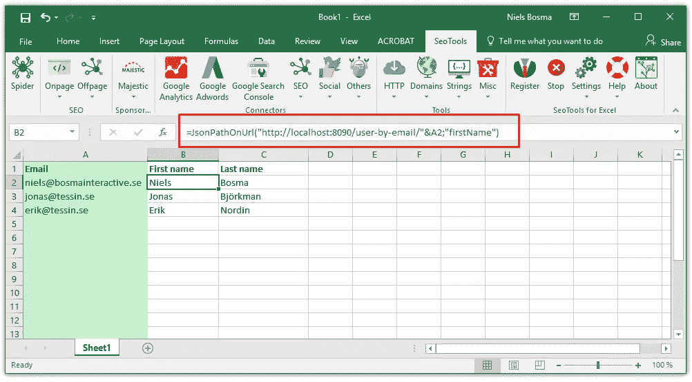

# 我的圣杯:用 LINQPad 连接 Excel

> 原文：<https://medium.com/hackernoon/my-holy-grail-connect-excel-with-linqpad-fa05889c80d0>

作为 [Tessin.se](https://tessin.se/) 的 growth hacker 和之前 [Offerta.se](https://offerta.se/) 的 CTO，我经常面临“用用户电子邮件获取这个 Excel 文件并从数据库中检索 X，Y & Z 列”(比如名称或订单总值)形式的任务。

我一直在寻找一种实用的解决方案，可以有效地做到这一点，而不必每次都编写自定义代码。经过几次迭代，我得出了以下结论:

我是一个超级粉丝。Net 便签本 [LINQPad](https://www.linqpad.net/) 。这个应用程序使得使用 C#和 linq 查询数据库变得非常简单。由于我更喜欢 C#而不是 VBA，这正是我想要用来解决问题的工具。

第一次尝试是在 LINQpad 中编写一个脚本，打开一个 XLS 文件，从一列中读取输入值(email ),然后在其他列中输出结果。但是这不是很灵活。

对我来说，最大的愿望是有一种方法可以在 Excel 中创建特定的公式，接受电子邮件等输入，并从数据库中返回指定的值。

为此，我在 LINQPad 脚本中使用 [Nancy Web Framework](http://nancyfx.org/) 创建了一个小型的自托管 JSON REST 服务:



运行此脚本时，会在您的计算机上本地启动一个小型 web 服务:



下一步是将这个 REST API 与 Excel 连接起来。为了做到这一点，我使用了一个我写的工具，叫做 [SeoTools for Excel](http://seotoolsforexcel.com/) 。这是一个 Excel 插件(不是免费的，但有 14 天的试用期)，它有一堆对增长黑客有用的特性。对于这个解决方案，我使用 [JsonPathOnUrl](http://seotoolsforexcel.com/jsonpathonurl/) 函数从我们编写的 REST 服务中获取 JSON 响应，并使用 [JSONPath](http://goessner.net/articles/JsonPath/) 查询语言获取一部分结构:

```
=JsonPathOnUrl("[http://localhost:8090/user-by-email/](http://localhost:8090/user-by-email/)"&A2;"firstName")
```



现在我们可以很容易地得到我们需要的所有值。SeoTools 负责缓存，这样同一个请求就不会被执行多次。Nancy REST 服务可以根据您需要从数据库中检索的任何信息轻松地进行修改。这需要一点设置，但是一旦你安装并运行它，它就像一个魔咒一样工作。如果您不想使用 SeoTools，找到 VBA 解决方案并不困难。

如果我有一个 SOAP 服务(LINQPad 4 有一个 SOAP 驱动程序)想用 Excel 查询，我也会使用这种技术。我不是一个 VBA 球迷，所以如果我有任何需要脚本(字符串操作等)。)然后我用 LINQPad 的 C#写这段代码就简单多了。

这绝对是我每天节省时间的十大生产力秘诀之一！请让我知道你的想法或你会如何解决这个问题。

# LINQPad 样板代码

您还需要将 Nuget 包`Nancy.Hosting.Self`添加到 LINQPad 脚本中，并包含它的名称空间。

[](http://bit.ly/HackernoonFB)[](https://goo.gl/k7XYbx)[](https://goo.gl/4ofytp)

> [黑客中午](http://bit.ly/Hackernoon)是黑客如何开始他们的下午。我们是 [@AMI](http://bit.ly/atAMIatAMI) 家庭的一员。我们现在[接受投稿](http://bit.ly/hackernoonsubmission)并乐意[讨论广告&赞助](mailto:partners@amipublications.com)机会。
> 
> 如果你喜欢这个故事，我们推荐你阅读我们的[最新科技故事](http://bit.ly/hackernoonlatestt)和[趋势科技故事](https://hackernoon.com/trending)。直到下一次，不要把世界的现实想当然！

