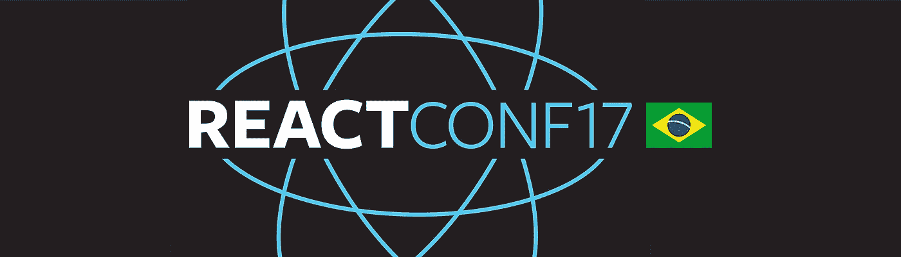

# 我对 React Conf BR 的印象

> 原文：<https://medium.com/hackernoon/my-impressions-about-react-conf-br-d52302d270b4>

> PT-BR 职位:[https://goo.gl/RvrTez](https://goo.gl/RvrTez)

上周六，我在圣保罗参加了 React Conf BR。我对这次活动感到非常兴奋，我已经计划这次旅行几个月了。这将是第一版，实际上，这将是我们第一次在拉丁美洲举办 React Conf，所以我相信我不是唯一一个对此感到兴奋的人。所以，我想分享一下我对每次演讲和会议本身的主要印象。

# 带有玩笑的魔法测试世界

会议由 [Fernando Daciuk](https://medium.com/u/56a528c3eb78?source=post_page-----d52302d270b4--------------------------------) 主持开幕，他谈到了 TDD 和 Jest。Daciuk 是一位经验丰富的开发人员，他的说教非常精彩。他不仅仅展示了我们习惯看到的关于 TDD 的东西，还谈到了测试对记录我们的代码和功能的重要性，他还使用 *Jest* 引导我们完成了一个小步骤测试案例。在这里你可以看到他的演讲幻灯片的链接:[https://goo.gl/joaJbf](https://goo.gl/joaJbf)

# 在 React 应用程序中转换遗留前端

这个演讲由 Kete Martins Rufino 和 Christiano Milfont 主持。他们给我们带来了一些他们用来迁移主干应用程序的方法。他们分享了他们在这个过程中遇到的困难以及他们是如何解决这些困难的。这个演讲非常有趣，因为它清楚地表明，我们不需要仅仅因为我们有一个传统的应用程序就依赖于一个特定的技术。有时候你找不到现成的解决方案，最终你会创建自己的解决方案，但是总有办法让项目不断发展。他们演示的幻灯片可以在这里找到:[goo.gl/6g3bFc](https://t.co/J6gId718yC)

We are here now at @ReactConfBR! Let’s esteem the brazilian conferences! May we have more events of this level.

# 让我们深入巴别塔:一切是如何工作的

Marcelo Camargo 是 [*【嘎嘎郎】*](https://github.com/haskellcamargo/quack) 的创造者，他对编译器和函数式编程有着全面的了解。他向我们介绍了 Babel 的内部结构以及 Babel 如何处理 JSX 解析。他还展示了我们如何使用 Babel 插件为编程语言创建定制功能。

**注意:**其中一张幻灯片包含恶作剧，所以，在浏览之前，你最好关掉**的声音**。演示幻灯片可以在这里找到:[https://goo.gl/7rvKTG](https://goo.gl/7rvKTG)

# 静态输入您的 GraphQL 应用程序

[James Baxley](https://medium.com/u/fd3d3dea3cd3?source=post_page-----d52302d270b4--------------------------------) ，来自 *Apollo* 和 *MeteorJS，*的核心开发人员之一，做了一个关于如何在 React 应用中为 GraphQL 查询添加类型检查的精彩演讲。他还写了一篇关于这个话题的文章，你可以在这里找到:[https://goo.gl/TN8Tn2](https://goo.gl/TN8Tn2)

他演讲幻灯片的链接:[https://goo.gl/6TouPh](https://goo.gl/6TouPh)

# 刮擦反应纤维

Raphael Amorim 是一名活跃的开源贡献者，也是 jQuery foundation 的成员。他谈到了 React 的新版本，以及渲染算法的重写如何影响浏览器的动画性能。他演讲的幻灯片链接可以在这里找到:[https://goo.gl/133WYP](https://goo.gl/133WYP)

这是上午所有的介绍。在他们之后，我们有一个鱼缸时间，一些人坐在舞台上的椅子上，向其他人提问。任何想问问题或回答问题的人都可以走到讲台前坐下。主要规则是:其中一把椅子应该总是空着，给其他人留出空间。

# MobX:原力的光明面

午饭后，第一个发言的是克拉拉·巴特西尼。她是一名前端开发人员和计算机工程专业的学生。她向我们介绍了 [*MobX*](https://github.com/mobxjs/mobx) ，一个可以替代 Redux 的状态管理器。以下是她的演示幻灯片的链接:[https://goo.gl/qEiZ9W](https://goo.gl/qEiZ9W)

# 展示 do milho React PWA-成功案例

在这次演讲中，若昂·贡萨尔维斯介绍了一个网络应用程序“Show do milhã”的成功案例。他向我们展示了他如何构建一个渐进式 web 应用程序，该应用程序也使用 React 和 Redux。他演讲幻灯片的链接:[https://goo.gl/jQckxZ](https://goo.gl/jQckxZ)

# 使用 React Native、GraphQL 和 Apollo 在 3 周内构建 Pipefy 移动应用程序

[Pipefy](https://medium.com/u/aceffb7c647a?source=post_page-----d52302d270b4--------------------------------)的全栈开发人员 Raphael Costa 讲述了他如何使用 React Native 和 GraphQL 与 Apollo stack 在短短三周内构建了一个完整的应用程序。演示幻灯片可以在这里找到:[https://goo.gl/9UZG1z](https://goo.gl/9UZG1z)

# GraphQL 和 Apollo 堆栈:将一切连接在一起

[Sashko Stubailo](https://medium.com/u/803918030a60?source=post_page-----d52302d270b4--------------------------------) 谈到阿波罗生态系统。如何将它所有的神奇工具结合起来，帮助我们以简单的方式构建复杂的应用程序。他也分享了一些关于阿波罗的未来和他们的目标。他演讲的幻灯片可以在这里找到:[https://goo.gl/87yUNG](https://goo.gl/87yUNG)

# 为什么 React 对业务有益

在这次演讲中，Taller 的首席技术官兼联合创始人塞巴斯蒂安·法拉利(Sebastian Ferrari)就为什么 React 对商业也有好处的观点发表了很好的意见。它的函数式编程前提如何帮助提高可预测性和减少应用程序中的错误，以及这些事情如何影响应用程序的生命周期、开发人员和用户。

PT-BR 中的演示幻灯片**:[http://bit.ly/2xuP8Pm](https://t.co/u5zwfZnThF)**

# **反应动作和动画的华丽应用**

**在他的演讲中， [Henrique Sosa](https://medium.com/u/8edd8e72759?source=post_page-----d52302d270b4--------------------------------) 展示了我们在 React 应用中处理动画的不同方法。然后，他向我们介绍了 [React Motion](https://github.com/chenglou/react-motion) ，并谈论了它的利弊。演示幻灯片的链接:【https://goo.gl/CNDthc **

# **同构 React + Redux App**

**React 支持服务器端渲染，但这并不意味着一切都开箱即用。Matheus Marsiglio 谈到了他在开发同构应用时面临的困难，比如保持服务器和浏览器之间的状态同步。然后，他展示了一些解决这些问题的方法。演示幻灯片链接:[https://goo.gl/U4FvcY](https://goo.gl/U4FvcY)**

# **React 关于泛函有什么**

**在这个令人惊叹的演示中， [Matheus Lima](https://medium.com/u/fb33cb80b669?source=post_page-----d52302d270b4--------------------------------) 谈到了函数式编程如何通过纯函数、不变性和组合来影响 React 的开发，以及我们如何使用更多这些概念来编写声明性代码并简化我们的组件逻辑。本次演示的幻灯片为 PT-BR 格式，可在此处找到:[https://goo.gl/qfFD4G](https://goo.gl/qfFD4G)**

# **从头开始反应性能**

**PagSeguro 的软件工程师 Keulelr Magalhaes 谈到了性能测量，并向我们展示了他如何进行一些基准测试，比较了 *React* 、 [*InfernoJS*](https://github.com/infernojs/inferno) 和 [*Preact*](https://github.com/developit/preact) *。***

**演示幻灯片的链接*:*[https://goo.gl/prj3b1](https://goo.gl/prj3b1)**

# **持续集成/持续部署**

**Geisy Domiciano 是 Polishop 的前端开发人员，也是一只狗的妈妈。在这个精彩的演示中，她谈到了持续集成和持续部署的重要性。我们如何在应用程序中植入这一点，以及我们可以使用哪些工具来实现这一点。**

**演示幻灯片可以在这里找到:【https://goo.gl/LPTA6X **

# **继电器现代**

**当天的最后一个演讲由[西贝利厄斯·塞拉菲尼](https://medium.com/u/fdf9efd749e0?source=post_page-----d52302d270b4--------------------------------)主讲，他是 Entria 的技术负责人，也是巴西 React 社区最活跃的成员之一。他谈到了 Relay modern，新的特性以及新旧版本之间的差异。演示幻灯片可以在这里找到:[https://goo.gl/1yh1YD](https://goo.gl/1yh1YD)**

**请注意，GraphQL 是会议期间的流行语。所有成功的案例都让我觉得有动力投入一些时间在上面。**

**差点忘了说了，每个人都赢了一个纸板 VR 眼镜套装，太酷了。**

**为了结束这一天，英语学校主办了一个免费饮料的晚会。**

**这个活动真的很棒，联系了很多人。祝贺所有演讲者分享他们的知识，特别是组织者展示了我们在巴西有一个令人敬畏的 React 社区。**