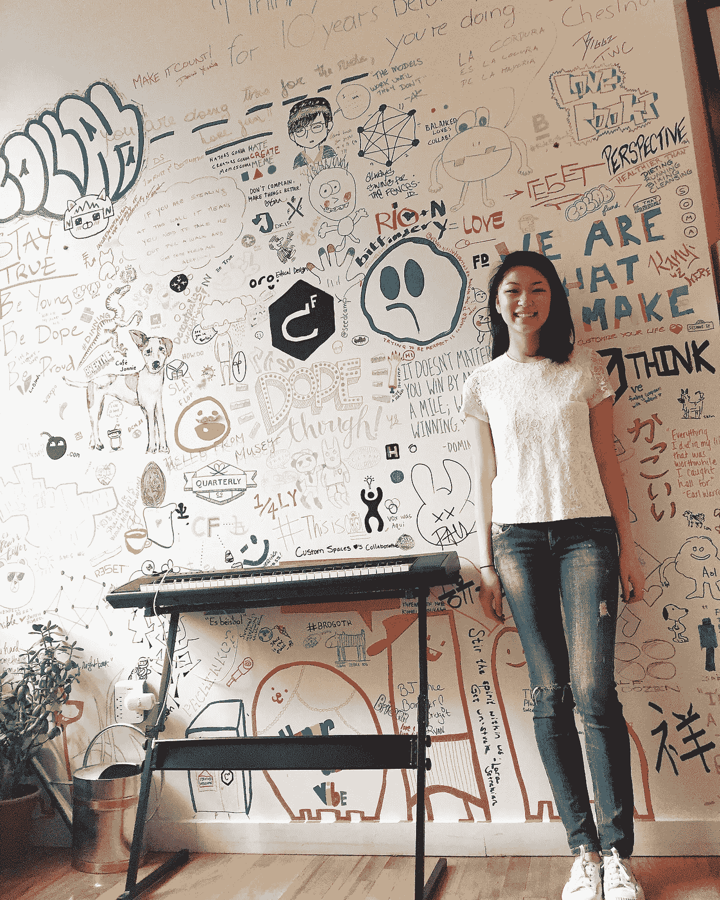
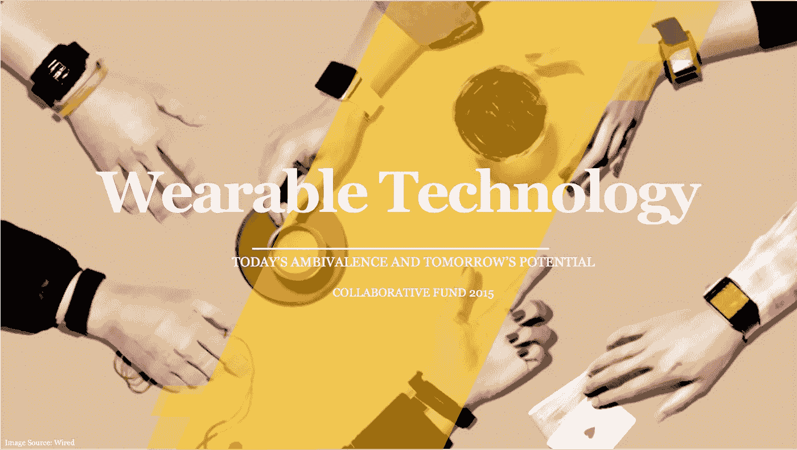

# 我在风险投资的实习经历

> 原文：<https://medium.com/hackernoon/my-internship-in-venture-capital-487081e8e7d3>

## 我叫 Courtney Chow，是加州大学伯克利分校工业工程和运筹学专业的四年级学生。我是 2015 年秋季[合作基金](http://www.collaborativefund.com)的实习生，我非常感谢我的经历。

Collaborative Fund HQ in New York City

我了解到[风险投资](https://hackernoon.com/tagged/venture-capital)节奏快，充满活力。这个行业让你有机会接触高影响力的工作，有机会接触热情有趣的人，有机会接触前沿的[技术](https://hackernoon.com/tagged/technology)和创新。这是通向未来的窗口。有一种普遍的不确定感和风险感，但也有实现这一未来的渴望和雄心。

合作基金为我进入这个风险投资的世界创造了一个入口。我有机会参加[会议](http://summit.eship.cornell.edu/2015/)，在[创新计划](https://www.youtube.com/watch?v=ei9oVwsdv38#t=18)主持的圆桌讨论会上与人们见面，并与[投资组合公司](https://whoop.com/)接触。我学到了交易流程、推介平台、按比例配股、估值、可转换票据、条款清单……还有很多。然而，我所受的教育超出了风险投资的条款和流程。我从在 Collaborative 工作的人身上学到了更深刻的东西。是的，我们讨论了投资策略、内部运营和行业政治，但我们也围绕社会公正、人生目标和诚信展开了强有力的对话。在 Collaborative，我获得了专业发展和个人成长。

# 总体而言，我有三个主要收获:

**如何评估创始人和公司:** Collaborative 教会了我，投资可以被用作积极推动世界前进的工具，让那些希望对社会产生持久影响的人获得力量。同时，这是风险投资，潜在的高回报也是极其重要的。成功是这两个概念的结合点。我学会了如何问正确的问题，分析市场潜力，评估创始人的能力，并认识到为什么不投资的原因。无论我是在风险投资中看到未来的职业生涯，还是作为一名企业家坐在桌子的另一边，我都获得了对风险资本家心态的极其宝贵的洞察力。

风险投资和创业领域需要更多有色人种和女性:如果大多数公司都是由一个同质群体——白人男性——创建或选择的，那么我们这个社会会有什么后果？这些商业模式有多少自然的、固有的偏见，它们将如何影响他们接触的数百万和/或数十亿人？而且，就像[凯瑟琳·芬尼](http://women2.com/2014/09/05/one-founder-championing-women-color-tech/?hvid=5aNgMu)说的，“这个行业正在失去下一个马克·扎克伯格，仅仅因为这个人不是白人和男性？”作为一名亚裔美国女性，我参加活动，会见企业家，与行业领袖交谈，亲眼目睹了风险投资和创业生态系统的同质性。关于协作，我真正尊重的一点是他们的意识，以及在自己的团队和投资组合公司中推动多样性。有令人难以置信的思想、创造力、创新和植根于多样性的故事。为什么排除这个？这些行业需要更多地招聘、接纳和指导多样化的人才。

[VC 人口统计展品](http://www.scribd.com/doc/283794890/VC-Diversity-Final-Exhibits)

[合作基金多元化编号](http://blog.kanyi.me/post/123376997348/our-diversity-numbers)

在一家快速发展的公司工作是什么样的感觉:成立近五年的 Collaborative Fund 是一家相对年轻的公司。公司在[团队成员](http://www.collaborativefund.com/blog/collaboratives-next-step/)、[基金规模](http://techcrunch.com/2015/11/10/collaborative-fund-raises-70-million-for-its-third-fund/)、[组合投资](http://techcrunch.com/2015/11/11/circleup-raises-30m-for-its-crowdfunding-platform-for-consumer-brands/)和[合伙企业](http://www.collaborativefund.com/blog/introducing-featuring/)方面一直在进化。看着他们提升公司的竞争力和能力，并理解成功做到这一点所需的领导能力，这是一次有趣而又鼓舞人心的学习经历。这种扩张体现在我的项目任务中，我帮助合作伙伴确定横向和纵向的增长。横向来看，我研究了亚洲的新兴经济体。我专注于印度尼西亚市场，从风险资本和技术的角度分析了经济、社会和政治参数。从纵向来看，他们给了我创造性的自由，让我探索一个与他们的使命一致并让我感兴趣的行业:可穿戴技术。

健身和科技的交集一直是我的激情点。足球受伤后的多次康复激发了这种好奇心。我撕裂了我的前交叉韧带，经历了五次膝盖手术，并记录了无数小时的物理治疗(罪魁祸首:足球)。我使用技术(以多种形式)来恢复身材和健康。所以，很自然地，我想到了健身技术，但是这个行业实在是太广了。为了缩小我的研究范围，我搜索了一个我认为处于临界状态的子行业，结果发现这就是可穿戴技术。我相信它现有的市场有着巨大的潜力，为快速增长做好了准备，并被高期望所定义。然而，现实情况是，它还没有能够实现这个“哇”的因素。这个转折点引起了我的兴趣，我热衷于发现为什么人们如此冷漠，并渴望了解更多关于可穿戴设备的未来潜力。这些发现最终形成了一份 35 多页的报告，阐述了可穿戴技术的现状和未来。

# 最终，我认为有三大趋势将可穿戴设备推向下一代和主流社会[报告如下]:

技术在进步，设计却停滞不前。可穿戴设备仍然相当笨重，而且不美观。对于早期用户和数字潮流引领者而言，它们更多地被视为一种独立的科技产品。让可穿戴技术成为我们生活中直观的一部分，比如(但不限于)T2 服装、[饰品](https://cuff.io/)、[智能药片](http://www.proteus.com/press-releases/u-s-fda-accepts-first-digital-medicine-new-drug-application-for-otsuka-and-proteus-digital-health/)、[智能创可贴](http://www.wired.co.uk/news/archive/2015-12/07/water-band-aid-hydrogel-electronic)等将成为吸引大量消费者的重要元素。将功能和形式与用户的个人需求和需求相结合将创造出更受欢迎的产品。

**对实时数据分析的改进:**消费者获得的信息量大，准确性和数据点不一致，而且没有真正的分析。这导致投资者在购买尚未形成鲜明价值主张的设备时犹豫不决。消费者想要的是关于如何改进和进步的实际建议和意见。发送回用户的数据应该是高度相关和个性化的，即比较使用、优化、趋势和变化原因。

**行业和技术合作:**目前，可穿戴技术主要集中在医疗保健行业，它融合了医疗、健身和健康领域。因此，我预计可穿戴设备将推动个性化医疗、数据辅助医疗和保险领域取得进展。然而，我惊讶地发现颠覆不仅限于医疗保健，也包括但不限于金融(见[万事达卡合作伙伴关系](http://newsroom.mastercard.com/press-releases/mastercard-launches-new-program-that-can-turn-any-consumer-gadget-accessory-or-wearable-into-a-payment-device/))、零售(全渠道消费者体验)和媒体(更个性化的相关内容和解决方案的策划)等行业。可穿戴技术正成为物联网网络的关键组成部分，并将更多地融入我们的生活，摆脱作为附加设备的麻烦。

可穿戴技术正处于令人兴奋的合作和变革之中。如果您正在这一领域创造、构建或建立产品，请告诉我们。我们很想谈谈！([magic@collaborativefund.com](mailto:magic@collaborativefund.com))|[www.collaborativefund.com](http://www.collaborativefund.com)

如果你想和我联系，请联系我。| [领英](https://www.linkedin.com/in/courtney-z-chow-36879655)

# [可穿戴技术:今天的矛盾和明天的潜力](https://drive.google.com/file/d/0B0FoxoOlJrmKQVhnbUtsMjduWGM/view?usp=sharing)

> [黑客中午](http://bit.ly/Hackernoon)是黑客如何开始他们的下午。我们是 [@AMI](http://bit.ly/atAMIatAMI) 家庭的一员。我们现在[接受投稿](http://bit.ly/hackernoonsubmission)并乐意[讨论广告&赞助](mailto:partners@amipublications.com)机会。
> 
> 如果你喜欢这个故事，我们推荐你阅读我们的[最新科技故事](http://bit.ly/hackernoonlatestt)和[趋势科技故事](https://hackernoon.com/trending)。直到下一次，不要把世界的现实想当然！

