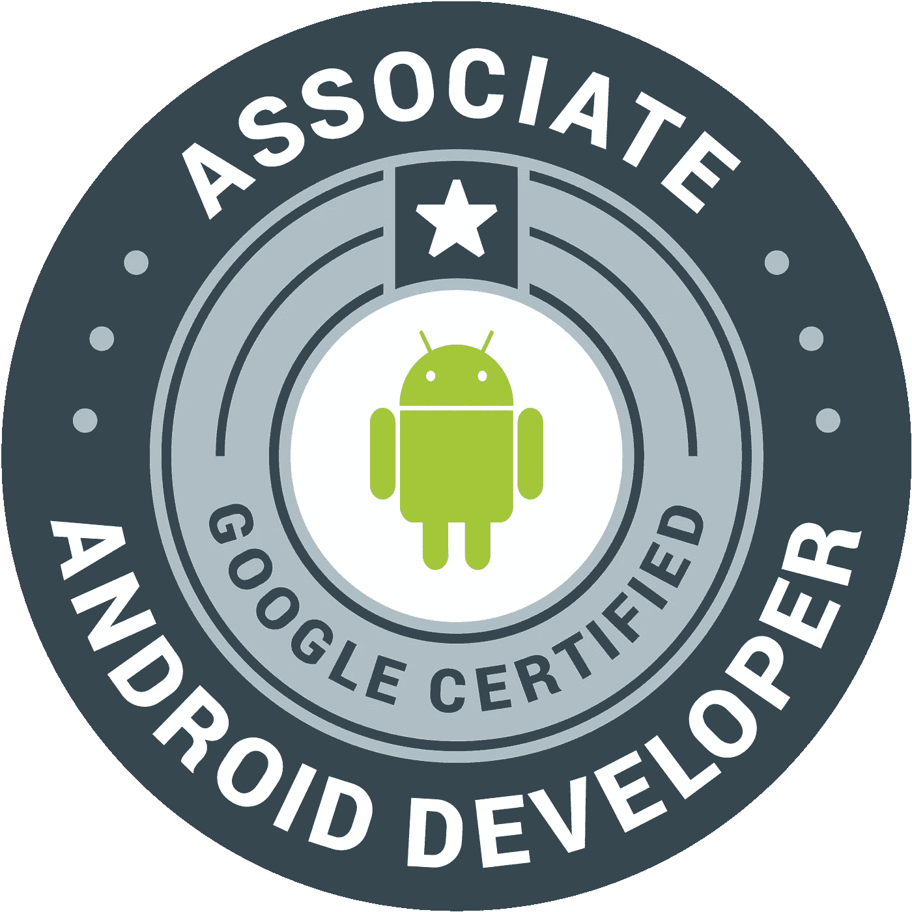

# 我从电子专业到助理 Android 开发人员的旅程

> 原文：<https://medium.com/hackernoon/my-journey-from-electronics-major-to-associate-android-developer-f45011ebaeaf>

上周我从[谷歌](https://hackernoon.com/tagged/google)拿到了我的认证。我成为了一名[助理安卓开发者](http://bcert.me/sbhnvehg)。我想分享一下我的这个小成就的经历。

# 背景

在分享我的经历之前，我应该先说说我的背景。我主修电气和电子工程。所以你可能会猜到，我的知识仅限于 C、C++和 SQL。但是我的兴趣是移动开发。于是我用 C#烧了自己的手，开始开发 Window Phone 8 的 app(感谢我们学院的微软学生中心)。然后我得到了我的第一份工作，成为了一名软件工程师，并学习了 Java。凭借我在 Java 方面的知识，我跳进了 [Android](https://hackernoon.com/tagged/android) 开发。好了，关于我，让我们来谈谈我是如何获得证书的。

# 考试

> 如果你知道目的地，你可以把帆调整到正确的方向。

您可以在认证页面上阅读考试内容和其他说明。我来分享一下我对考试的看法。

 [## 谷歌开发者认证|谷歌开发者

developers.google.com](https://developers.google.com/training/certification/associate-android-developer/) 

考试经过精心设计，涵盖了**考试内容**部分提到的所有概念。与你可能见过的其他认证考试不同，谷歌组织的考试不是要求你为特定需求编写完整的代码，而是完成现有的代码，以此来测试你的技能。所以要解决这个，你需要先了解现有的代码，这很重要。

不过不要害怕。安卓平台 API 和基础好的可以清考。这没有捷径可走。毕竟你必须擅长你的游戏。

# 旅程

Photo by [Tegan Mierle](https://unsplash.com/photos/ioyEITUD2G8?utm_source=unsplash&utm_medium=referral&utm_content=creditCopyText) on [Unsplash](https://unsplash.com/?utm_source=unsplash&utm_medium=referral&utm_content=creditCopyText)

嗯，我不得不承认，我在 Windows Phone 开发方面的知识帮助我快速开始学习 Android。像你们中的许多人一样，我从创建一个小应用程序开始，看看发生了什么。然后，我开始通过在 [StackOverflow](http://stackoverflow.com/) 中寻求帮助来填补缺失的拼图。很快，我就能开发一些功能性的应用了。我也做过自由职业项目(是的！虽然是小打小闹)。但后来我意识到，仅仅是找到丢失的部分，我能走多远？

## 站出来

如果我想认真对待这件事，我必须加快步伐。我开始寻找学习 Android 的最佳资源。就在那时，我偶然发现了 [Udacity](http://udacity.com) 。Udacity 有和谷歌合作制作的安卓课程！我还需要什么？

 [## 开发 Android 应用| Udacity

### 构建一个云连接的 Android 应用程序，并学习移动和 Android 的工具、原则和最佳实践…

in.udacity.com](https://in.udacity.com/course/new-android-fundamentals--ud851) 

所以我报名参加了这个课程。当时是课程的第一个版本。现在有了更好的版本和更多的资源。从我的经验来看，这门课程可以让任何程序员成为 Android 开发者。它教会了我所缺少的东西，Android 的基本概念。在这个课程之后，我能够通过很少在 stackoverflow 中寻求帮助来开始开发应用程序。对我来说这是个好兆头。

## 第一个应用

有了那门课学到的知识，我决定为自己(为自己)开发一个 app。我最喜欢的类别一直是生产力。所以我决定做一个我每天都会用的应用程序。个人任务经理。

> 除非我们为自己开发一个完整的应用程序，否则我们不能自称是移动开发者。

现在，我已经开始像移动开发者一样思考了。我开始筛选出我的应用程序需要的工具。经过大量的研究，我选择了[领域](https://realm.io)作为本地数据库，[解析](http://parseplatform.org)作为后端。它们都处于早期阶段，具有许多特性。Parse 当时是一个托管的 PaaS。有了这些工具，我开始每天晚上在我的应用上工作。

## 路障

一个晴朗的早晨，我醒来发现 Parse 的邮箱被关闭了。和你们很多人一样，我对选择它感到沮丧。幸运的是，我处于早期阶段。所以回到搜索引擎寻找更好的和永久的替代品。此外，我已经改变了主意，用内容提供者和加载器切换回 Sqlite。当时 Realm 是一个快速发展的库，并不是所有的功能都可用(我想它是在 0.3.x 版本中)。

作为解析的替代，我选择了 Google App Engine。Udacity 再次帮助我选择了谷歌云。

 [## 用 Java | Udacity 开发可扩展的应用

### 您将了解构建可以服务成千上万用户的应用程序的挑战，以及如何…

in.udacity.com](https://in.udacity.com/course/developing-scalable-apps-in-java--ud859) 

## 里程碑

Photo by [Alvin Mahmudov](https://unsplash.com/photos/DnJioJ8nhxI?utm_source=unsplash&utm_medium=referral&utm_content=creditCopyText) on [Unsplash](https://unsplash.com/?utm_source=unsplash&utm_medium=referral&utm_content=creditCopyText)

终于，app 做好了(对！我多次杀了我的 app，从零开始重新设计)。塔斯基设法进入了谷歌 Play 商店。

 [## tasky-Google Play 上的 Android 应用

### 一种优雅的方式来组织你的一天。使用 Tasky 提高您的工作效率。

play.google.com](https://play.google.com/store/apps/details?id=studios.codelight.codify) 

## 下一步是什么

当我几乎完成了我的应用程序的第一个版本时，Udacity 发布了另一个课程，作为我第一个课程的延续。

> 当你想要某样东西时，整个宇宙都会帮你实现它。
> 
> *——*保罗·柯艾略

 [## 高级 Android 应用开发| Udacity

### 通过应用库集成、材料设计、小部件等高级功能，使您的应用程序可投入生产

in.udacity.com](https://in.udacity.com/course/advanced-android-app-development--ud855) 

这是每个 Android 开发者都应该上的另一门课。这帮助我进一步提高了我的技能。这对我建立投资组合帮助很大。

 [## kalyandechiraju(Kalyan de chiraju)

### kalyandechiraju 有 44 个存储库。在 GitHub 上关注他们的代码。

github.com](https://github.com/kalyandechiraju) 

# 然后是认证考试

在 Google I/O 2016 中，公布了这个考试。这个项目的目标是开发人员和雇主之间的差距。

这一切都很好。但是我为什么要拿呢？

简单地说，我是一名全职 Java 开发人员。现在我想把我的职业生涯转变成一名全职的 Android 开发者。这次考试似乎有助于实现这一目标。

# 进攻日

最后，我付了考试费，我有 24 小时的时间来提交。考完试后，我意识到一件事。

> 如果你上了那两门 Udacity 的课程，你就可以放心地用一半的时间完成考试。

另一件要记住的事情是在购买考试时使用 Gmail 地址登录您的 Udacity 帐户。我在提交考试后面临许多问题时了解到这一点(由于这个问题，我无法访问我的考试仪表板)。在 Udacity 支持的帮助下，我正确地提交了我的身份证明。

## 离职谈话

这是考试的最后一步。这次采访的目的是核实你的身份。这是一个 5 分钟的[缩放](https://zoom.us/)视频电话，有一系列关于考试和 Android 基础的问题。

经过这么多的努力，我收到了一封电子邮件，里面有我的认证链接。[http://bcert.me/sbhnvehg](http://bcert.me/sbhnvehg)

希望这对你有所帮助。感谢阅读！