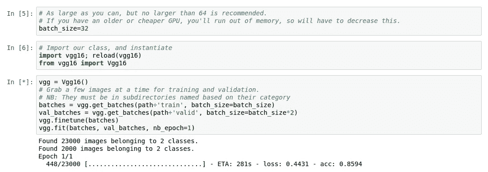
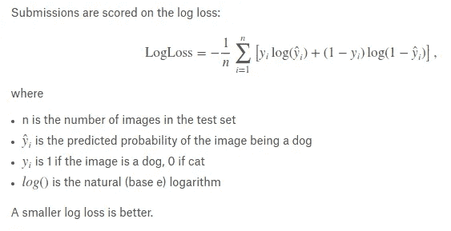

# 我的深度学习之旅

> 原文：<https://medium.com/hackernoon/my-journey-into-deep-learning-9104057a642f>

当我第一次读到[程序员实用深度学习](http://course.fast.ai/)时，我有点难以相信我能用 7 行代码训练一个神经网络。像大多数人一样，我有一个非常自然的反应。“搞什么鬼！？！那不可能！”



Vgg-16 learning about cats and dogs.

我在这里，第一堂课训练`VGG-16`已经进行了 10 分钟，这是一个卷积神经网络，对猫和狗的图像进行分类。这非常容易做到。事实上太容易了。


Okay, maybe we are getting too far ahead of ourselves.

在第一个时期有 98%的准确率，这是令人惊讶的准确。“亚伦，你是天生的。”是的，谢谢，但是我已经知道了。

我真的做了什么不寻常的事情吗？没有。在快速浏览了一下用于[程序员实用深度学习](http://course.fast.ai/)的剩余代码附带的`Vgg16`类后，很明显`vgg = Vgg16()`正在初始化一个类的实例，该类混淆了创建神经网络模型的不太好的部分。

下面是一个例子:

```
def create(self):
        model = self.model = Sequential()
        model.add(
            Lambda(vgg_preprocess, 
            input_shape=(3,224,224),    
            output_shape=(3,224,224))
        ) self.ConvBlock(2, 64)
        self.ConvBlock(2, 128)
        self.ConvBlock(3, 256)
        self.ConvBlock(3, 512)
        self.ConvBlock(3, 512) model.add(Flatten())
        self.FCBlock()
        self.FCBlock()
        model.add(Dense(1000, activation='softmax')) fname = 'vgg16.h5'
        model.load_weights(get_file(
            fname, 
            self.FILE_PATH+fname, 
            cache_subdir='models'
        ))
```

我不会假装我现在 100%知道这段代码的意思，但是根据我的理解，它正在初始化一个 [Keras 顺序模型](https://keras.io/models/sequential/)，然后定义该模型的输入、输出和隐藏层。它还将预训练的权重加载到模型中。

好吧，当谈到深度学习时，也许我对自己所谓的天赋撒谎了，但我确实用训练和验证数据微调并拟合了`vgg`模型。好吧，也许我也在撒谎…但这并不影响教我的电脑如何区分猫和狗的感觉有多棒！

出于好奇，我决定在来自 [Kaggle](https://www.kaggle.com/) 的[狗对猫 Redux](https://www.kaggle.com/c/dogs-vs-cats-redux-kernels-edition/leaderboard) 数据集上运行这段代码。不可否认，我的第一次投稿做得不太好。如果我早三个月参加这个比赛，我的分数会在 1314 名已经在排行榜上的人中排名 1100 左右。看到我的验证准确率是 98%，我决定调查一下。

在花了两个小时揪我的头发后，我发现了这个讨厌的小家伙:



Log loss on kaggle.

Kaggle 使用这个函数对提交的内容进行排名。事实证明，在 Kaggle 上竞争时，当一个模特对一张照片是一只猫如此自信，以至于给它打了 0 分，这是一件坏事。这最终打破了 Kaggle 上的 LogLoss 函数，导致了我糟糕的分数。

那么我该如何让它变得更好呢？为什么不直接把 0 和 1 的极值分别强制为 0.02 和 0.98？砰。就这样，我从 1100 英镑到 500 英镑，进入了排行榜的前 50%。

好吧，你抓到我了。所以，也许我不得不依靠杰里米(教这门课的人)来认识到我过于自信的模型才是问题所在。细节细节。

总的来说，训练我的第一个 CNN 真的很有趣。迫不及待地想开始第 2 课！

[](http://bit.ly/HackernoonFB)[](https://goo.gl/k7XYbx)[](https://goo.gl/4ofytp)

> [黑客中午](http://bit.ly/Hackernoon)是黑客如何开始他们的下午。我们是 [@AMI](http://bit.ly/atAMIatAMI) 家庭的一员。我们现在[接受投稿](http://bit.ly/hackernoonsubmission)，并乐意[讨论广告&赞助](mailto:partners@amipublications.com)机会。
> 
> 如果你喜欢这个故事，我们推荐你阅读我们的[最新科技故事](http://bit.ly/hackernoonlatestt)和[趋势科技故事](https://hackernoon.com/trending)。直到下一次，不要把世界的现实想当然！

