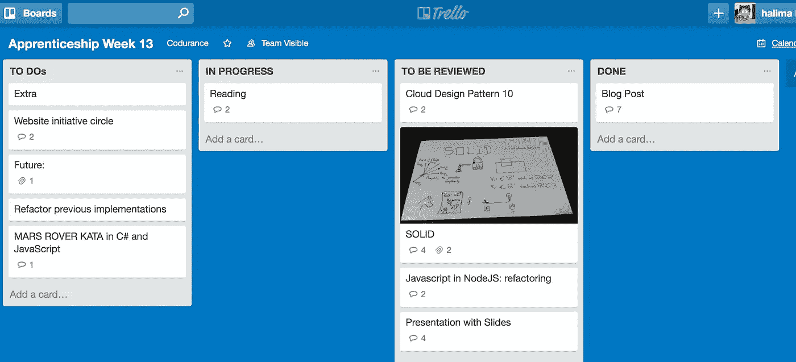

# 我的软件工艺之旅

> 原文：<https://medium.com/hackernoon/my-journey-towards-software-craftsmanship-3efdd53ac9fb>

我总是能够交付被要求的东西，并且我能够快速理解和挑选新项目，但是我将工作的代码库总是会成长为人们害怕接触的东西，从长远来看，使用它将变得困难和痛苦。这似乎是软件工作的正常方式，项目会延迟，开发人员会紧张和有压力，经理会生气，客户会提出错误。自然，我们会谈论在两三年内重写应用程序。这看起来很正常。但我觉得一定有别的办法。救火不是一项可持续的活动，如果这是软件开发的内容，我只需要再次转行。但首先我需要找到另一种方法。

# 为什么软件工艺

我参加 [LSCC 聚会](https://www.meetup.com/london-software-craftsmanship/)已经一年多了，去年四月左右，我决定申请[保险](https://codurance.com)的学徒职位:这是我决定学习编程后职业生涯中最明智的举措之一。去 LSCC 和其他开发人员交谈时，我意识到我并不是唯一一个觉得必须有另一种方法，而不是花几个小时调试一个应用程序，而且感觉不对劲的人。对代码库的状态没有信心，比如对它进行任何更改，将是恐惧和压力的同义词，这感觉不正常。我听说了《软件工匠》的书，也读了《实用程序员》的书，我意识到我的职业生涯中缺少了什么:专业精神。

# 应用过程

我的求职信，或者更确切地说，我的申请电子邮件是我写过的最有激情的信之一。我把所有的希望都寄托在那里，这是一个让我的职业生活变得更好、更有意义的机会。这是我寻找职业生涯和停止工作的方法。桑德罗带回了一封很好的电子邮件，里面有很多关于学徒的信息和编码练习的说明。我很欣赏薪水的透明度，这让讨论变得容易多了，也消除了关于钱的尴尬谈判。两个星期后，由于我在工作日几乎没有时间来处理它，我提交了我的代码参加面试，这是面试过程的一部分。

# 代码评审:我不会再写代码了！

不到一周之后，我收到了桑德罗和史蒂夫的代码审查。我从未进行过如此彻底的代码审查，事实上，我从未在面试过程中进行过代码审查。这感觉就像一个大耳光，我感觉很糟糕，因为我没有意识到我的知识差距有多大。我只是不得不去跑步来克服它。我比以往任何时候都更有活力，我回信感谢他们的时间，并说我愿意努力学习，努力成为一名伟大的程序员和软件工匠。我下定决心；不管有没有保险。

# 学徒期:我的导师太棒了

作为 Codurance 的一名学徒，你可以在愿意并愿意指导你的软件工匠中选择一名导师。在加入之前，我下班后在办公室附近的一家酒吧遇到了亚历克斯；我们只是一见如故。我知道他会鞭策我，他的期望值正是我所需要的。对于每个人来说，Codurance 的学徒期是不同的。这取决于学徒的经验和知识水平、与导师的关系以及需要提高的技能。

# 技能差距分析

我的第二个现实检查是和我的导师一起检查学徒标准，试图看看我的立场。

在 Codurance，我们有一个学徒毕业前必须满足的标准列表。它们包含三种主要技能:

*   咨询(促进、技术写作、调解……)；
*   编码(TDD 经典主义者和由外向内，坚实的原则，重构和代码气味，结对编程，…)和
*   工程(持续集成、数据建模、架构和宏观设计、安全)

根据[德莱弗斯技能习得模型](https://en.wikipedia.org/wiki/Dreyfus_model_of_skill_acquisition)，每项技能需要不同的掌握程度。就我而言，有很多工作要做。我和我的导师在学习策略上达成了一致；以测试驱动开发为主要目标。我们确实制定了每周的工作计划，并每周回顾我的进展。通常的工作量大致如下:每周用 C#编写 TDD katas，每隔一周用 javascript 编写；每周阅读大量不同书籍的章节，研究云设计模式，并在可能的情况下实现它；每两周一篇博文(我并不总是写这篇博文)；每两周在公司内部会议上做一次简短的谈话。

每周，在客户那里结束一天的工作后，Alex 都会来到 Codurance 办公室，花上大约 3 个小时或更多的时间和我坐在一起，回顾我的学习成果，问问题，回答问题，和我一起结对编程。在接下来的六个月里，每周他不仅会花一个晚上的时间陪我，还会检查我那一周要完成的练习的代码，检查我写下的阅读和学习幻灯片，找到激励我和帮助我成长的词语。我很高兴也很感激他给我的所有时间和我从他那里学到的所有技能。
我很感激在 Codurance，身边都是关心国家和他们行业的未来、他们的工艺水平和他们同龄人的技能的人。

# 我不是软件工匠，我是[帮工](https://en.wikipedia.org/wiki/Journeyman)

和有技能的人在一起是令人兴奋和具有挑战性的。我挣扎着说，我是一个软件工匠。当我想到这个词时，我会想到我的导师，我的同事，共同保险的创始人；其中一位是《软件工匠》的作者；我知道我还没有达到那个水平。这没关系。这是所有手工行业通常会发生的事情:一个人从学徒开始，通过“教育、监督经验和考试”向其他工匠学习。然后成为[熟练工](https://en.wikipedia.org/wiki/Journeyman)，“被认为有能力并被授权作为完全合格的员工在该领域工作”。然后经过多年的历练，得到其他工匠的认可和评价；“一个熟练工，作为一个合格的商人可以成为一个大师”。有太多的东西我还没有掌握。这没关系。我相信这只能通过多年的专业经验和深思熟虑的实践来实现。这没关系。这就是我们的工艺如此迷人、丰富和令人满意的原因。

> [黑客中午](http://bit.ly/Hackernoon)是黑客如何开始他们的下午。我们是阿妹家庭的一员。我们现在[接受投稿](http://bit.ly/hackernoonsubmission)并乐意[讨论广告&赞助](mailto:partners@amipublications.com)机会。
> 
> 如果你喜欢这个故事，我们推荐你阅读我们的[最新科技故事](http://bit.ly/hackernoonlatestt)和[趋势科技故事](https://hackernoon.com/trending)。直到下一次，不要把世界的现实想当然！

