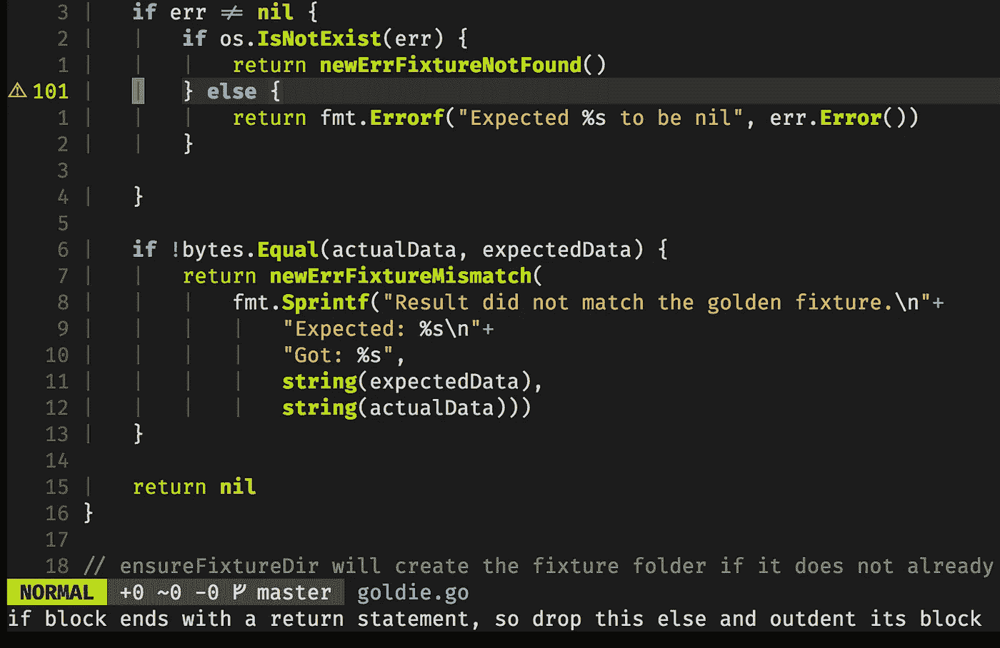
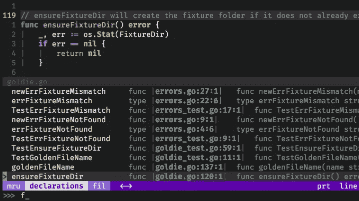
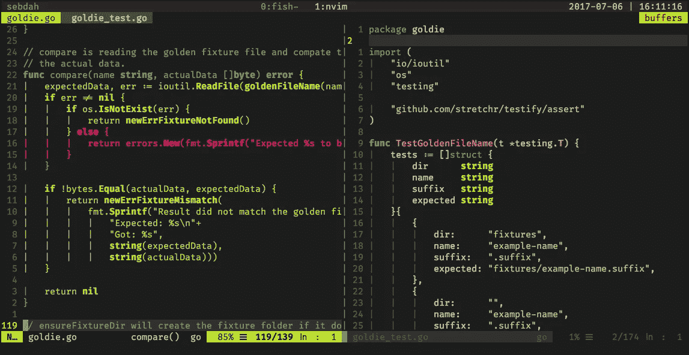
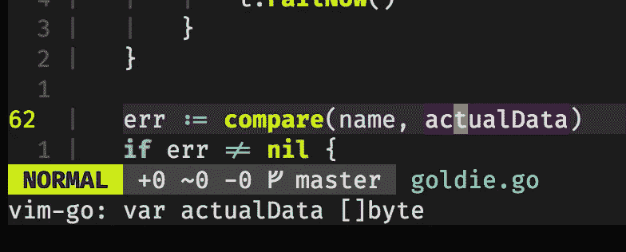
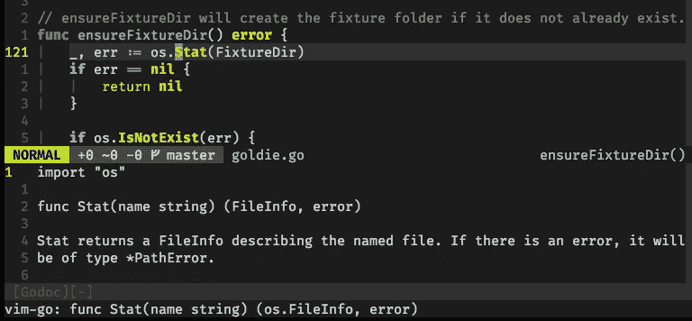
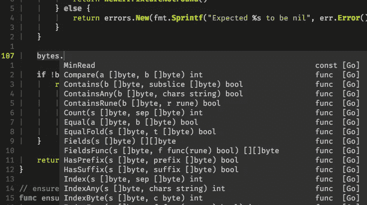
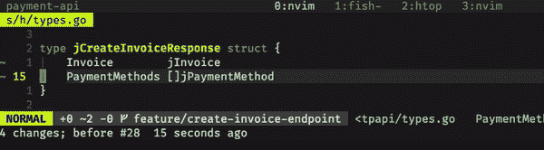
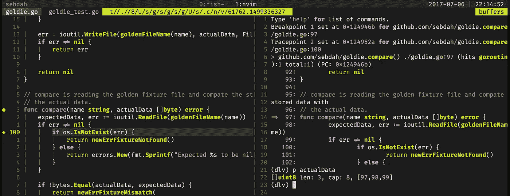

# 我的 neovim 设置

> 原文：<https://medium.com/hackernoon/my-neovim-setup-for-go-7f7b6e805876>

我经常收到关于如何配置我的 [neovim](https://neovim.io) 进行 Go 开发的问题。所以在这篇文章中，我打算描述这一点。为了简洁起见，我不会概括地介绍设置，而是特别介绍 Go 部分。

我的设置基于 [neovim](https://neovim.io) 。除了调试器和代码补全(可以在 vim 中解决——但我不在这里讨论),下面的大部分内容在 vim 上应该也能很好地工作。

我所有的点文件都在 GitHub 上。

# 基本 vim-go 设置配置

`[vim-go](https://github.com/fatih/vim-go)`是[](https://medium.com/u/b1ccd565df0a#extensions#ale#enabled = 1</span></pre><figure class=)

[](https://medium.com/u/b1ccd565df0a#extensions#ale#enabled = 1</span></pre><figure class=)

[Warning from ALE for an optimization that can be made in the code.](https://medium.com/u/b1ccd565df0a#extensions#ale#enabled = 1</span></pre><figure class=)

# [航行](https://medium.com/u/b1ccd565df0a#extensions#ale#enabled = 1</span></pre><figure class=)

[在导航方面，我没有定制太多。但是我想强调一些有用的东西:](https://medium.com/u/b1ccd565df0a#extensions#ale#enabled = 1</span></pre><figure class=)

*   [`]]`进入下一个功能或方法](https://medium.com/u/b1ccd565df0a#extensions#ale#enabled = 1</span></pre><figure class=)
*   [`[[`带你到上一个函数或方法](https://medium.com/u/b1ccd565df0a#extensions#ale#enabled = 1</span></pre><figure class=)

[以上两件东西都是随手拈来，开箱即用。但是它们仅限于您打开的文件中定义的函数或方法。就我个人而言，我尽量在每个文件中包含最少数量的函数，而不是包含很多文件。然后，我希望能够在包中的函数定义*之间进行搜索和轻松导航。*](https://medium.com/u/b1ccd565df0a#extensions#ale#enabled = 1</span></pre><figure class=)

[这可以通过使用`:GoDeclsDir`来实现。为此，你必须将](https://medium.com/u/b1ccd565df0a#extensions#ale#enabled = 1</span></pre><figure class=)`[ctrlp](https://github.com/ctrlpvim/ctrlp.vim)`和`vim-go`一起安装。



为此，我在`,gt`中添加了一个键映射:

```
au FileType go nmap <leader>gt :GoDeclsDir<cr>
```

# 运行测试

我正在编写大量的测试用例，因此在实现和测试之间来回切换要做很多工作。vim-go 提供了一个名为`:GoAlternate`的命令，如果您在实现中，它会切换到测试用例，反之亦然。这真的很方便，我经常使用它，所以我为它添加了一个键绑定:

```
au Filetype go nmap <leader>ga <Plug>(go-alternate-edit)
au Filetype go nmap <leader>gah <Plug>(go-alternate-split)
au Filetype go nmap <leader>gav <Plug>(go-alternate-vertical)
```

所以现在我只要做`,ga`切换到测试(`,`是我的 leader 键)或者`,gav` / `,gah`以垂直/水平分割打开。

我还将`:GoTest`命令映射到了`<F10>`。请注意，我添加了`-short`标志，以便只在我的编辑器中以短模式运行测试。这通常会绕过具有第三方依赖性(如数据库等)的测试。

```
au FileType go nmap <F10> :GoTest -short<cr>
```

最后，我经常使用的是代码覆盖报告，既用于我自己的开发，也用于代码审查，以识别哪些部分的代码没有被测试恰当地覆盖。我把它映射到`<F9>`，就在常规测试旁边。

```
au FileType go nmap <F9> :GoCoverageToggle -short<cr>
```

覆盖率报告的结果可能看起来像这样。



The implementation is on the left hand side and the tests on the right hand side

再次按下`<F9>`将去除绿色和红色。

# 使用类型和定义

## 在状态行显示类型信息

我一直在使用的一个巧妙的小方法是将光标移到一个变量上，看看它是什么类型。或者将它移动到一个函数调用中，查看它的输入参数和返回值。



actualData is a byte slice in this case

这确实是应该启用的基本卫生功能之一。启用以下功能:

```
let g:go_auto_type_info = 1
```

## 获取文档

我经常发现自己需要更多关于某些功能的细节。vim-go 中有一个开箱即用的内置支持。只需在类型或函数上按下`K`即可获得更多详细信息。



## 转到定义

去定义是我经常做的事情，所以我在`<F12>`上添加了一个映射。

```
au FileType go nmap <F12> <Plug>(go-def)
```

它把我带到我光标下的任何东西的定义。当我需要回来时，我按下`C-t`。

# 代码完成

我正在——就像一般的 neovim 社区一样——使用`[deoplete](https://github.com/Shougo/deoplete.nvim)`来满足我所有语言的补全需求。为了让它和 Go 一起运行，你还需要安装`[deoplete-go](https://github.com/zchee/deoplete-go)`。

要默认启用`deoplete`，请将其添加到您的配置中:

```
if has('nvim')
    " Enable deoplete on startup
    let g:deoplete#enable_at_startup = 1
endif
```

它实际上会是这样的:



此外，如果您也使用多个游标(`[terryma/vim-multiple-cursors](https://github.com/terryma/vim-multiple-cursors)`)，您会发现`deoplete`会崩溃很多次。要防止这种情况，请在多光标模式下禁用完成功能:

```
" Disable deoplete when in multi cursor mode
function! Multiple_cursors_before()
    let b:deoplete_disable_auto_complete = 1
endfunctionfunction! Multiple_cursors_after()
    let b:deoplete_disable_auto_complete = 0
endfunction
```

# 向结构添加 JSON 标记

对于那些工作在 JSON API 上的人来说，定义`struct`并手动输入所有 JSON 标签通常很麻烦。`vim-go`是来救援的！如果你有一个这样的`struct`:

```
type jCreateInvoiceResponse struct {
    Invoice        jInvoice
    PaymentMethods []jPaymentMethod
}
```

你会想把它转换成

```
type jCreateInvoiceResponse struct {
    Invoice        jInvoice            `json:"invoice"`
    PaymentMethods []jPaymentMethod    `json:"payment_methods"`
}
```

为此，运行`:GoAddTags`。我的 API 通常想要`snakecase`属性，但是它也支持`camelcase`。使用设置您的首选项

```
let g:go_addtags_transform = "snakecase"
```

以下是上述`struct`的功能:



# 片段驱动开发

很长一段时间，我在编码时不使用代码片段。很大程度上是因为我不明白它们有多大用处。但是在一天结束的时候，你会一遍又一遍地重复代码中的模式。对于这些模式来说，用片段来填充通用部分是非常有效的。

我正在使用`[neosnippet](https://github.com/Shougo/neosnippet.vim)`进行我的发展。这是最基本也是最重要的，编写自己的代码片段很容易。它的要点是，你写一个关键字，然后按下`C-k`，以“扩展”片段。可能有多个地方可以插入您的代码。再次点击`C-k`可以进入下一页。

要使`vim-go`的`neosnippet`有效，添加以下行:

```
let g:go_snippet_engine = "neosnippet"
```

您需要单独安装`neosnippet`和`vim-go`。您还应该确保安装`[neosnippet-snippets](https://github.com/Shougo/neosnippet-snippets)`，它为您提供了一长串语言的默认代码片段。

以下是我使用的几个最有力的片段:

*   `ts`扩展为`type | struct`
*   `ti`展开为`type | interface`
*   `[funcTest](https://github.com/sebdah/dotfiles/blob/master/config/nvim/snippets/go.snip#L22)`为基于表格的单元测试添加样板代码。这是我自己的自定义片段，不是`neosnippet-snippets`的一部分。你可以在我的[点文件](https://github.com/sebdah/dotfiles/blob/master/config/nvim/snippets/go.snip#L22)里找到。
*   `ife`扩展为`if err != nil { | }`类型图案

我真的建议你花些时间学习使用片段，这真的是一个省时的方法。

# 调试 Go 代码

我希望在以后的文章中涵盖更多关于如何调试 Go 应用程序的内容。但在这一集里，我们将只涉及如何穿着 neovim 在战场上取得成功。

首先，你需要在你的机器上安装`[delve](https://github.com/derekparker/delve/)`。详情请参考他们的[安装文件](https://github.com/derekparker/delve/tree/master/Documentation/installation)。

你需要的另一件事是我的包`[vim-delve](https://github.com/sebdah/vim-delve)`，它利用一些 neovim 特性来与`delve`集成。所以不幸的是，这个包不能在常规的 vim 上运行。

安装完依赖项后，现在可以开始调试 Go 代码了。可以用`:DlvToggleBreakpoint`添加断点。然后用`:DlvDebug`或`:DlvTest`启动调试器(如果调试非`main`包，使用`:DlvTest`)。

也支持跟踪点。可以使用`:DlvToggleTracepoint`在代码中切换它们。跟踪点不会停止你的执行，它只是打印一个记录，说明跟踪点被点击了。

`delve`的一个实例:



Code to the left with a breakpoint (●) and a tracepoint (◆). Delve output to the right.

# 结束了

关于 vim，我想写的还有很多。但是在某些时候，我可能会偏离本文的主题太多。

无论如何，我的`[dotfiles](https://github.com/sebdah/dotfiles)`(和我的`[init.vim](https://github.com/sebdah/dotfiles/blob/master/config/nvim/init.vim)`)保存了所有的细节，所以你可以一直在那里挖掘更多关于我的设置的细节。

**2017 年 9 月 7 日更新**:变更林挺部分，将`gometalinter`直接使用改为`ale`。