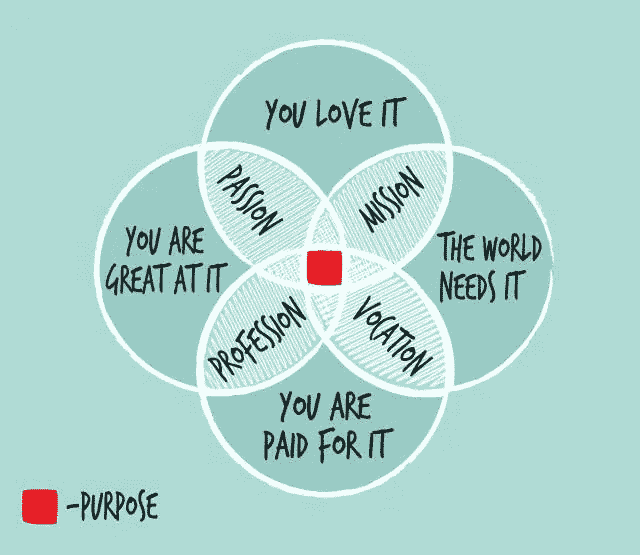
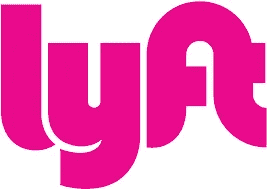
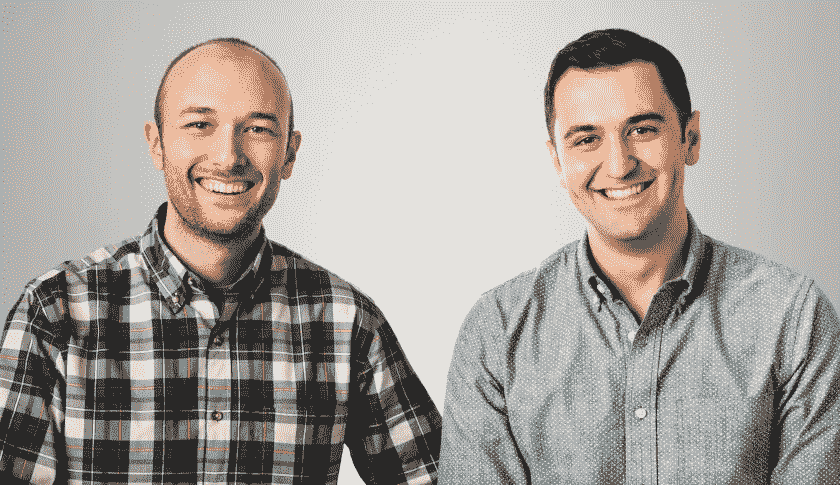
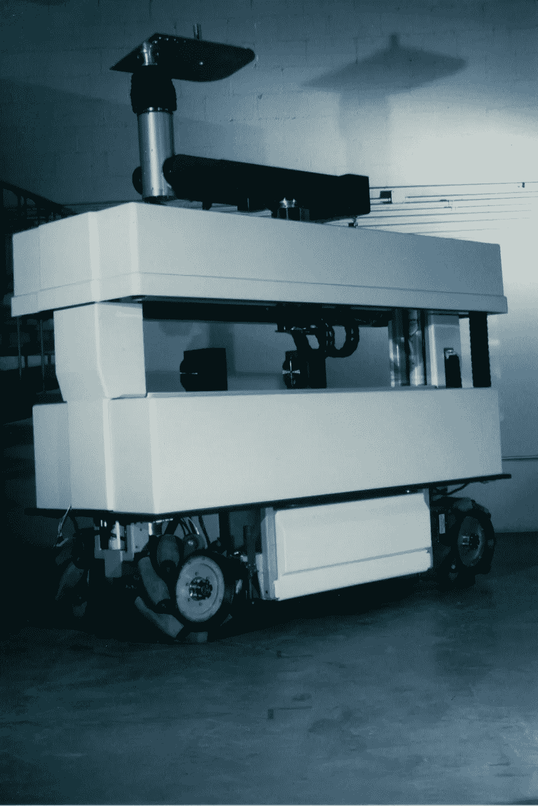
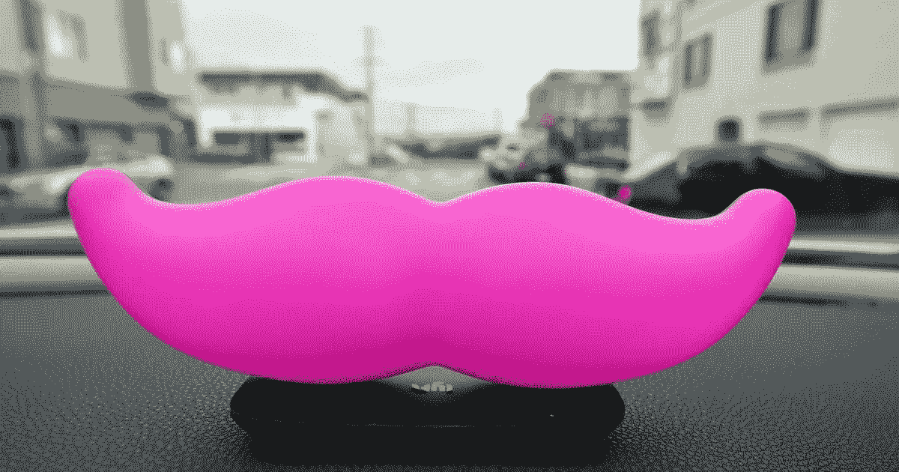

# 我的新旅程

> 原文：<https://medium.com/hackernoon/my-new-journey-663224c3c0c7>

*我很高兴分享我接下来要做的事情…首先是一些背景…*

什么让我们快乐？许多研究表明，当你有了一种[目的](http://www.chicagotribune.com/sns-health-life-purpose-happiness-story.html)，当你过着有意义的生活的时候(正如我在这篇[文章](/indian-thoughts/the-power-of-vulnerability-8ed5a6a5c8d6#.qj04aoaqq)中所讨论的)。在过去的一年里，我有了[的机会](https://hackernoon.com/tagged/opportunity)去认真思考目标和意义，因为我在 24 年的快速奔跑后第一次休息了…

在自我反省以及朋友和家人的帮助下，我找到了我的目标——用科技帮助城市化正确发展。

这源于我非常关心的一个问题——减少气候变化的威胁。政府、消费者和企业似乎并不是为了环保而环保——尽管人们普遍意识到了这一点。然而，当我们在全球范围内扩张和创建新城市时，他们正在花费一吨(5 万亿美元)(未来 10 年将有 25 亿人迁移——这与改变气候变化的时间表相同)。有了技术和现有的支出，我们可以重新思考交通、能源、医疗、食品、住房和基础设施，以正确的方式来做这件事。数据是实现这一点的新货币，当然，软件现在正在吞噬这个城市…

在过去的一年里，我围绕这一大趋势探索了许多投资和运营机会。我决定成为一名操作员是我的职业。我只是喜欢领导、激励、建设产品和团队，以及从市场获得实时反馈。

放眼望去，答案就在我面前——与亲爱的朋友 Lyft 的 Logan Green 和 John Zimmer 一起工作。我加入了他们的首席战略官。

我的任务是帮助才华横溢的高级团队寻找与 Lyft 相关的新商机，让世界变得更美好。

**为什么** **Lyft** ？

**目的**

交通是目前最令人兴奋的领域之一——它正在经历巨大的变化，对环境和我们的日常生活有着重大影响(这是第二大家庭支出)。Lyft 对交通和城市的未来有一个令人信服的[愿景](/@johnzimmer/the-third-transportation-revolution-27860f05fa91#.z4rdbam03)，我对此深信不疑。他们有团队、产品和资源来实现这一目标。

**人**

与我喜欢、热爱和尊重的人一起工作至关重要。作为早期投资者和董事会成员，我与约翰和洛根一起工作过，在 Lyft 早期，当我还是一名风投时，我花了很多时间深入团队。我看到他们在所有的起伏中表现得令人难以置信的好。他们优雅、热情、体贴地这样做，同时动作也很快。他们是我的[部落](/indian-thoughts/the-power-of-vulnerability-8ed5a6a5c8d6#.71ezntddv)。他们展现了我最好的一面，我从他们和他们的团队身上学到了很多。

**角色**

在 Lyft 的工作将让我创造性地思考，快速行动，并在我非常关心的领域展示我的风险投资和创业肌肉——这是我一直在寻找的难以捉摸的组合。自动驾驶汽车带来的破坏也让我回到了 90 年代初我在卡内基梅隆大学研究自动驾驶机器人的时候——整整一圈！

Here’s the autonomous robot — the ‘Tesselator’ — i worked on at CMU for NASA in the early 90s

**气势**

在我的职业生涯中，还没有见过像 Lyft 这样的市场或公司有这样的势头。对他们服务的需求是通过屋顶，他们执行得很好，有多个玩家的空间。事实上，我们在 GMV 的年度运营率刚刚超过$2B，现在在 200 个城市运营，未来还会有更大的增长。

我期待与 Lyft 一家共度一生！

> [黑客中午](http://bit.ly/Hackernoon)是黑客如何开始他们的下午。我们是 [@AMI](http://bit.ly/atAMIatAMI) 家庭的一员。我们现在[接受投稿](http://bit.ly/hackernoonsubmission)并乐意[讨论广告&赞助](mailto:partners@amipublications.com)机会。
> 
> 如果你喜欢这个故事，我们推荐你阅读我们的[最新科技故事](http://bit.ly/hackernoonlatestt)和[趋势科技故事](https://hackernoon.com/trending)。直到下一次，不要把世界的现实想当然！

