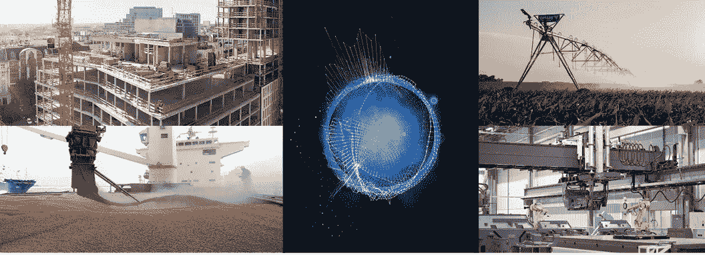

# 我的种子投资源代码

> 原文：<https://medium.com/hackernoon/my-seed-investing-source-code-9c8ba4e8c865>

以下是一个说明:当我把已经做了五年的夜间工作[变成全职工作](/@ianrountree/announcing-cantos-ventures-ffede6bf365a#.n9u1ezvdn)时，我正在用笔写 pixel，试图阐明我对早期投资的看法。我把这个框架称为我自己的，尽管事实上它是明智的前辈的建议、对了不起(和不那么了不起)的企业家的观察、行业文献(比博客更有历史)、个人经历——包括比我愿意承认的更多的失误——以及我自己的技术乐观主义的一点点综合。

这远远不是一个公式。它并不意味着是预测未来的绝对演算(我将把这留给[哈里·谢顿](https://en.wikipedia.org/wiki/Hari_Seldon)或[科技核心](http://hyperioncantos.wikia.com/wiki/TechnoCore))，而是一个镜头，通过它来标准化你作为早期技术投资者看到的数百个推介。与许多老牌风投让你相信的相反，挑选有前景的初创公司并不难；投资既要识别好的，也要避免坏的。虽然运营、金融和技术知识是精明的早期投资的重要组成部分，但它们的边际回报却在递减。*投资组合成功的最大贡献者(阅读“IRR”)是交易流的数量*质量，以及达到最佳状态的能力。VC 是一个接入游戏，接入游戏的座右铭是位置，位置，和喜欢。*

## *标准 1/2:得分(受托人级别的定罪要求 120 分中的 100 分)*

**一)创始人+创始团队(40 分)**

*   能力*背景:我寻找不可思议的创始人-市场契合度，熟悉行业的聪明创意者，他们密切了解一个垂直行业，但用新技术以一种新颖的方式接近它——例如[标准电子人](https://techcrunch.com/2015/02/09/yc-backs-standard-cyborg-a-startup-building-affordable-prosthetics/)[的杰夫·胡贝尔](http://www.standardcyborg.com)，他是一名截肢者，正在开发人体增强软件；或者 [Shipamax](http://www.shipamax.com) 的詹娜·布朗，她在一家商品商店工作时对干散货航运软件感到失望。对市场的异常熟悉是一个容易的早期防御驱动因素。
*   决心(勇气)*激情(信念):也就是说，他们真的*痴迷于解决手头的问题吗？为什么？什么会让他们放弃？企业家的动机(或缺乏动机)是一个主要的风险因素。当你关闭你的种子时，一切看起来都很好，但你知道，墨菲定律。*
*   诚实+人品(直觉，“背景调查”):也就是说，我能信任他们吗？在种子公司，企业家拥有完全的控制权——正如他们应该拥有的*，尽管那是另一个职位*。更不用说，文化源于领导力，尤其是 CEO(想到某个 Lyft 竞争对手)。我坚信，硅谷无视经验主义，在很大程度上神化了错误的企业家(就此而言，还有投资者)。
*   愿景*实用主义(以用户为中心):也就是说，他们能否在搭建现实桥梁的同时，激励其他人看到共同的愿景？看到长期往往比中期更容易。
*   销售能力*连通性:例如，他们能销售吗，谁会看他们的邮件？*注:我认为销售能力-成功曲线是非线性的。也就是说，过了某一点，更擅长销售是危险的，因为这可能会使期望与现实脱节。我见过许多短期出售给客户和投资者的蒸汽产品。你的产品应该会大卖。*
*   团队历史和凝聚力:他们如何相互了解，了解多久？联合创始人通过什么机制解决分歧，他们的进展如何？联合创始人之争是初创公司最大的风险因素之一。在他们的旅途中没有怨恨的空间，也没有自我的空间。
*   速度的能力。*衡量这一点的一个好方法是你每周提交多少代码。*
*   女性、少数民族和“残疾人”的加分。风险资本家系统性地低估了这些创始人的价值。

*备注:*

*   品牌和文化比大多数企业家意识到的更重要(对增长和防御能力而言)。然而，两者都在很大程度上延伸自首席执行官，并且有着难以置信的细微差别。我会根据你的电子书的主页来判断它。
*   我寻找那些讨厌筹集资金的首席执行官，因为他们喜欢建立赚钱的企业。融资应该是正毛利率的牵引作用，而不是相反。如果你花在融资上的时间比经营企业的时间还多，那你就有问题了。放弃那些拖拖拉拉的风投——他们不是在投资。

**二。)技术*防御能力/竞争格局(35 分)**

*分子:*

*   (15 分:)基础技术:如果你只是雇佣了一个自由开发者来为你构建一个 MVP，那么你的公司可能不适合我。如果你的问题不难解决，那么你会有很多至少和你一样聪明的竞争对手。
*   **只有两种方法可以长期防御:IP 和网络效应**。如果你没有这一点——而且没有人从一开始就有网络效应——那么一个领先的伟大团队会给你买一年，*也许*两年(当 Common Bond 紧随 SoFi 之后时，我亲眼看到了这一点)。如果存在我所说的“竞争渗透”(见下面的注释)，我只会赌“领先”。
*   **IP** :只有当你真的是“高科技”时才可以接受，但那时你的防御能力可能更多地来自世界级的团队，而不是专利本身。我一点也不关心业务流程专利(它们是可以规避的)，并以“给猫编码的 1000 种方法”来大幅贬低软件专利。
*   网络效应:十年前，当这个术语开始流行时，它指的是社交网络效应——也就是说，每个新用户都会让网络变得更有价值。这就是为什么风投如此喜欢市场:一旦网络足够大，就很难建立一个可行的竞争对手。你今天不会创办 Airbnb 的竞争对手，网络效应就是原因。但我更感兴趣的是一种新型的网络效应:ML/DL。随着数据的增多，机器学习模型无疑会有所改进。
*   **我认为，任何没有利用机器学习(或者相对于区块链而言是作为分布式应用程序构建的)的软件公司，在 5-10 年内都很有可能不存在。**
*   (13pts:)为什么是现在？解决方案很容易太迟或太早。什么样的技术、社会、监管或市场发展阻止了这家公司在三年前成立？*注:技术可以来得太晚，也可以来得太早……IMO、AR/VR 和无人机都有点太早(而且被过度炒作)，而移动(方式)太晚了。*
*   (3pts:)品牌(这通常被低估，尤其是。首次创业者)
*   (2pts:)他们有杀手顾问吗？我指的不是你在这个行业比你多工作几年的伙伴，我指的是那些可以拿起电话帮你找到前五个客户，或者指导你的工程师解决以前没有人解决过的技术问题的人。
*   (2pt:)库存现金*(注:现金对可抗辩性是非线性的；太多的现金滋生了挥霍和自满。)*

*分母:*

*   竞争对手数量(直接的和可能的；总有一个你还不知道的竞争对手——也许我见过他们的牌)
*   竞争对手的敏捷性
*   竞争对手的手头现金(超过“可以快速赶上”的阈值，根据解决方案在其产品路线图中的优先顺序进行折扣)
*   令人沮丧的是，有一些企业家和基金的大部分风险投资根本不会押注于*——例如马斯克、贝佐斯、红杉。*

*关于垂直行业的说明&竞争渗透(在即将发布的帖子中会有更多内容):*

*   *首先，* ***我不投资消费技术*** *。我不会假装知道消费者想要什么。虽然最大的科技公司主要是 B2C，但竞争更加激烈，防御更加困难，风险状况要求大型基金能够进行多次押注，并跟随赢家。这对 Cantos 这样的小基金不起作用。公司更容易预测。他们只想做两件事:增加收入和降低成本。风险投资是一个统计的游戏，我更喜欢我在 B2B 的胜算。*
*   *现在，这就是垂直市场真正重要的地方。我寻找的是那些动作大而慢的行业，以及普通千禧一代企业家尚未关注的领域(即，社交网络、广告技术、营销技术、CRM/销售技术、按需服务、电子商务、云基础设施、开发工具)。这可能意味着制造业(如*[*【big finite】*](http://www.Bigfinite.com)*[*标准电子人*](http://www.StandardCyborg.com) *)、建筑业(如* [*建筑连接*](http://www.BuildingConnected.com) *、* [*爱丽丝*](http://alicetechnologies.com/) *)、金融业(如*[*【Qwil】 物流(如*](http://www.qwil.co)[*shipa max*](http://www.shipamax)*[*easy post*](http://www.easypost.com)*)、农业(如* [*耕地*](http://www.arable.com) *、* [*农业数据*](http://www.agridata.ai) *)等 一般来说……***
*   ***是:金融/保险(仅限区块链解决方案；纯软件解决方案已经打出来了)、制造业(esp。+AI)、物流、农业(尽管对机器人技术很敏感)、建筑(尽管* [*、爱丽丝*](http://www.alicetechnologies.com) *可能是我在这里唯一的赌注)、政府/法律(借用 Manan Mehta 在 Unshackled 的一句话，“人类是中间件”)、合成生物学(非临床)、分散式网络的基础设施***
*   ***否:社交、按需、广告/营销/销售技术、电子商务、酒店技术、招聘技术(太多人)、AR/VR(太快了)、生物制药(需要一整套其他技能)、房地产(玩够了)***
*   ***因为我不/不可能对所有这些领域都了如指掌，所以请做好准备，让我找出一家 SME，然后回答更具体的问题。***

****三。)商业模式的清晰性，单位经济学(10 分)****

***分子:***

*   **商业模式简单(做一件事，把它做好)。我的一句口头禅是:*复杂是速度的敌人。向一个人群销售一种产品。了解你的固定成本和可变成本！模型的不确定性在 20-30%之间。***
*   **第一天收入或<6-month path to product-related revenue. I typically invest in companies with $5–30K monthly revenue, even at ‘pre-seed’ (pre-money valuation under $5M).**
*   **Gross-margins > 60%。虽然我不会附和他标志性的优越感，但我想起了唐·瓦伦丁的一句话:“我们需要男生(女生)有 70%的毛利润，因为他们滥用了太多的钱。你需要进入一个有巨大毛利的行业，因为管理层不是很有经验。你从 60%的最低利润作为理想开始，因为你知道管理层将花费 20%在营销上，20%在研究上。我们有一些 27 岁的小伙子，他们从来没有管理过任何东西。”**
*   **LTV/CAC > 300%。还需要考虑投资回收期——不能超过你的筹资能力！**
*   **注:它违反了这个原则，这是我对广告收入驱动的公司的根本问题。**
*   ***分母:***

**极度倾向于低消耗(种子前期低于 5 万美元/月，种子期为 10 万美元)。使用顾问进行早期销售，而不是全职员工，并且在产品适合市场之前不要签订租约！**

*   **在筹集到 500 万美元之前，首席执行官会认为自己现金匮乏。在此之前，请使用您拥有的货币:*股票！***
*   ***备注:***

***对企业的主要偏好——较低的风险(当然，较低的可能上升)、较低的流失率、较大的资金缺口***

*   **我不会投资任何我认为已经或可能很快商品化的东西——基于用户界面的产品、存储、公共可访问数据集上的算法、网络安全、按需服务(更好的说法是“劳动力套利”)或任何“流行”的东西。**
*   ***广告(基于眼球)收入对我的风险/回报来说是一个不可接受的答案***
*   ****四世。)退出机会/估值(10 分)****

***分子:***

**不同阶段的自然收购者。我相信期权，而不是 IPO 或破产。假设谷歌不会买你(虽然我确实认为他们的 acq。活动将会加快；他们还会用这些钱做什么？)**

*   **我想知道你的市场是否足够大，10%的份额意味着至少 1 亿美元的收入——1 亿美元大概是 SaaS IPO 的门槛**
*   **垂直行业有很高的 M&A 活动，现有企业有大量的现金储备，行业正面临或将很快面临创新带来的巨大变化**
*   ***分母:***

**寻找“套利”机会，即定价过低的交易。*注意:这些实际上是价格合理的交易，通常在湾区以外的地方发现，在那里我们已经习惯了价格上涨。***

*   **不看好种子期超过 1000 万美元的融资后估值，因为大多数收购发生在 5000 万美元以下**
*   **伯克利、麻省理工和其他工程类大学是被忽视的机会。斯坦福是一所很棒的学校，但是被过分强调了。*注:警惕科学家首席执行官，除非他们有天生的商业头脑。***
*   ***备注:***

***如果您的总目标市场(TAM) —这应该是真正的收入潜力，而不是 GMV！——低于 1 亿美元的 2B，与大多数风投，尤其是 1 亿美元以上的基金交谈是在浪费时间。风投们会押注什么样的结果，主要取决于他们的投资专业人士 AUM 数量。***

*   **最近几个月，收购活动有所放缓，但谷歌、苹果、脸书、甲骨文和其他公司(如伯克希尔哈撒韦公司 600 亿美元的战争基金)都坐拥巨额现金，需要投入使用。如果现任政府鼓励外国资金回流，这些现金储备将会增加。我相信谷歌脸书会成为科技界的伯克希尔哈撒韦。**
*   **我喜欢那些比 Benchmark 更有可能出现在$BRK 投资组合中的收购者，比如通用电气、通用汽车、Marmon、霍尼韦尔、万事达、Verisk、约翰迪尔**
*   ***训练纯种马，不要猎杀独角兽。对于 Cantos 这样的小基金来说，9 位数的退出是可以的，但我确实需要确信你能够筹集到首轮融资***
*   ***由于烧伤和估值较低，Seed 受熊市的影响较小。正如 NEA 联合创始人迪克·克拉姆里克曾经说过的，“好主意不会罢工。”2008-2009 年获得种子资金的公司包括 Airbnb、Twilio、Dropbox、Slack 和 Credit Karma。***
*   ****五、融资风险(5 分)****

**既然我会开小额支票，我的共同投资者就必须能够赢得胜利。我的 50-100，000 美元的支票只能买 1-2 个月的种子期启动资金…**

*   **…或者该公司必须乘风破浪/在一个市场中/由一位首席执行官经营，我相信高层风投很可能会提供资金。注意:我认识足够多的风险投资人，对这方面有相当好的理解；)**
*   **如果是后一种情况，我希望熟悉一个强大的 A 轮融资所需的指标，并相信首席执行官能够达到这些指标**
*   **我希望我正在参与的这轮投资能为这家初创公司购买至少 12 个月的跑道。在这个谨慎的市场中，18+更可取。**
*   **注意:在开支票之前，我总是会和一些友好的风投公司在较大的基金上测试公司。我在这里摊牌，但如果我把你介绍给另一位投资者，我就不是 100%无私的了。【大声说出我的一些常见的疑点…… [*荣耀的价格是多少？*](https://medium.com/u/93aa7d62f870#.vmof5stiy)

    Or, as one veteran VC put, “Ask yourself, [*What price glory?*](/@ianrountree/what-price-glory-22d3f9ffdae2#.vmof5stiy)”**