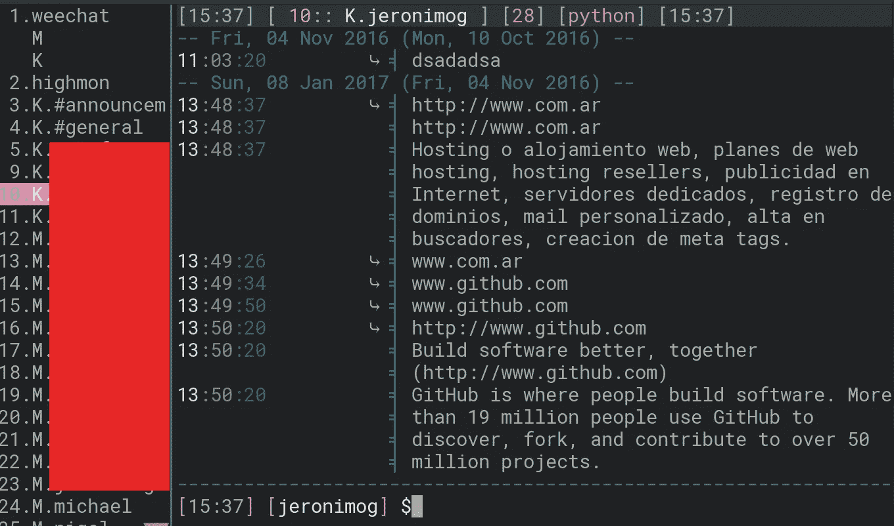
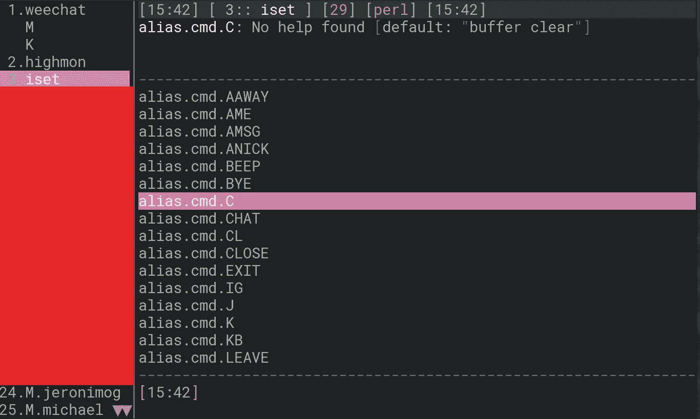
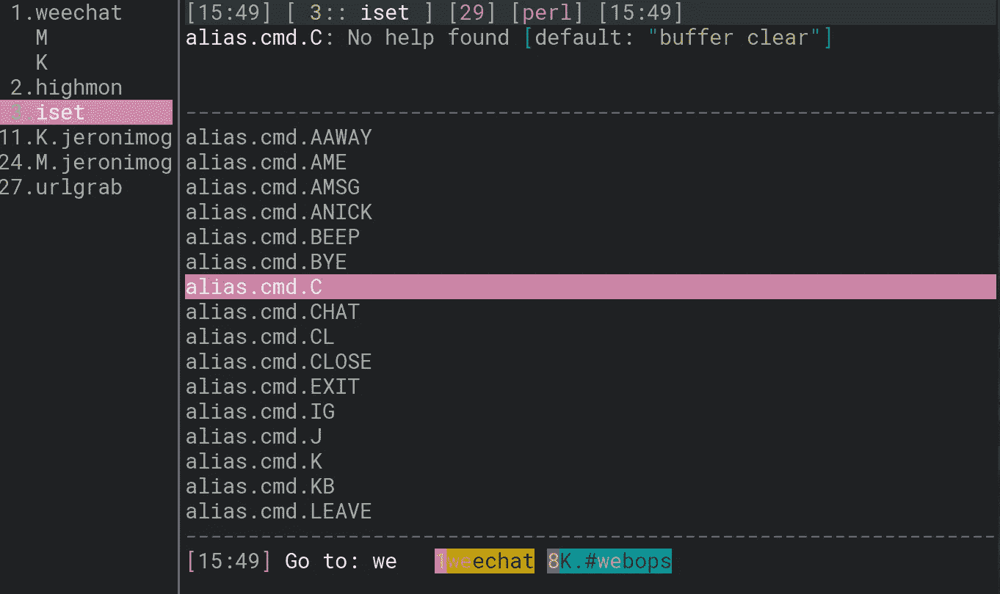
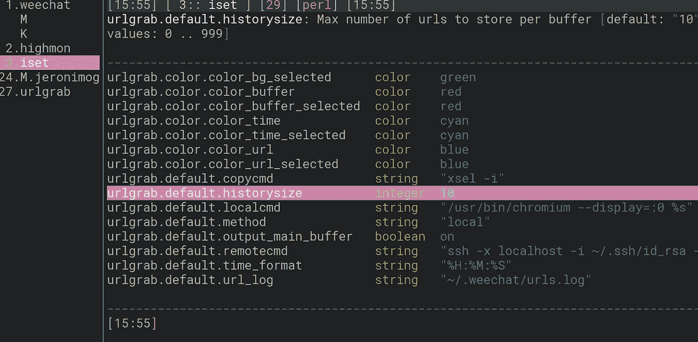
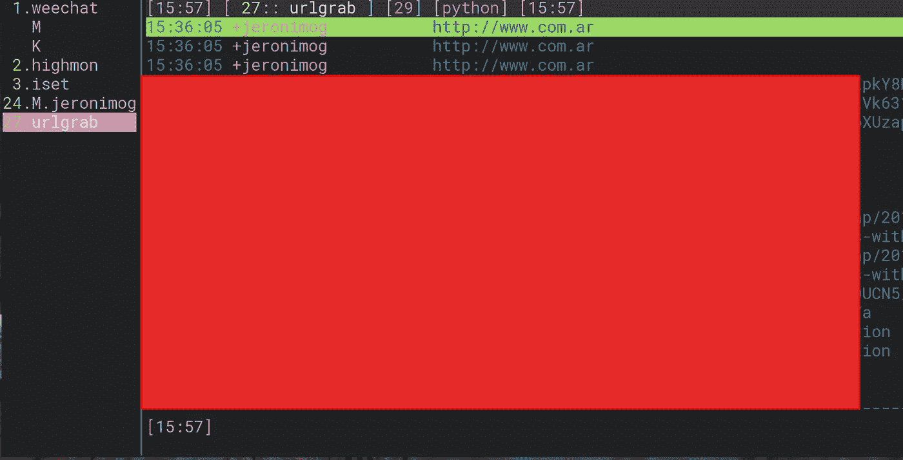

# 我的 WeeChat 插件

> 原文：<https://medium.com/hackernoon/my-weechat-plugins-9278fe4783c>

Weechat 是一个带有大量插件的“irc”客户端，它可以连接到比 irc 更多的东西(你可以使用 bitlbee 来代理)。

**缓冲器**:



因此，除了一些自定义颜色之外，您还可以看到 buffers.pl(这是左边的栏，非常有用)

要安装它，请使用:

```
/script install buffers.pl
```

**Iset**

另一个我想推荐的是 iset，它可以让你从 weechat 本身改变设置，它看起来像这样:



反对简单地安装:

```
/script install iset.pl
```

有很多不同的插件，但这应该是我最喜欢的，所以我和许多其他人都使用 slack 来交流:

**WeeSlack**

我的朋友 Ryan 写了这个插件来“连接”weechat 和 slack api:

[](https://github.com/rawdigits/wee-slack) [## 原始数字/微弱信号

### wee-slack-Slack.com 的 WeeChat 插件。同步阅读标记，提供打字通知，搜索等..

github.com](https://github.com/rawdigits/wee-slack) 

我不是超级有用，它没有让我失望过一次(正常的基于电子的 slack 聊天客户端使用了大约 1gb 的内存，现在没有了)

**Go.py**

如果你打开了很多缓冲区(缓冲区就像对话)，那么搜索缓冲区就有点烦人了，所以让我们搜索缓冲区并匹配它们的名称



所以我把它绑定到 meta-f，你可以输入缓冲区的部分名称，go.py 会把缓冲区和你输入的 regex 匹配起来

```
/script install go.py
```

这个是必须的。

**Urlgrab.py**

如果你在懈怠，很可能有人会给你发一个链接来检查，也许是一个公关或一些猫的视频，以避免伸出鼠标选择链接，就像一个老爷爷第一次尝试 win95 一样

```
/script install urlgrab.py
```

它将匹配缓冲区中的最新 url，并使用您最喜欢的命令打开它，在我的例子中:



您还可以通过键入/url 列出所有发送给您的 url:



因此，您可以绑定到/url **enter，以打开您选择的那个:)

**高门**:

Highmon 是一个特殊的缓冲区，其中存储了所有包含您昵称的消息，因此您可以轻松地查找它们。

```
/script install highmon.pl
```

今天就到这里，我想这些是我用得最多的，我通常有一些快捷方式，你可以用 iset 或者在 weechat.conf 上手工创建。

感谢阅读！

[](http://bit.ly/HackernoonFB)[](https://goo.gl/k7XYbx)[](https://goo.gl/4ofytp)

> [黑客中午](http://bit.ly/Hackernoon)是黑客如何开始他们的下午。我们是 AMI 家庭的一员。我们现在[接受投稿](http://bit.ly/hackernoonsubmission)并乐意[讨论广告&赞助](mailto:partners@amipublications.com)机会。
> 
> 如果你喜欢这个故事，我们推荐你阅读我们的[最新科技故事](http://bit.ly/hackernoonlatestt)和[趋势科技故事](https://hackernoon.com/trending)。直到下一次，不要把世界的现实想当然！

