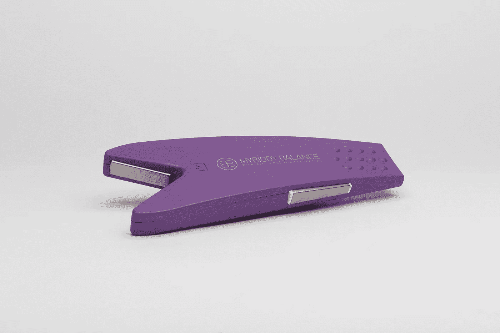
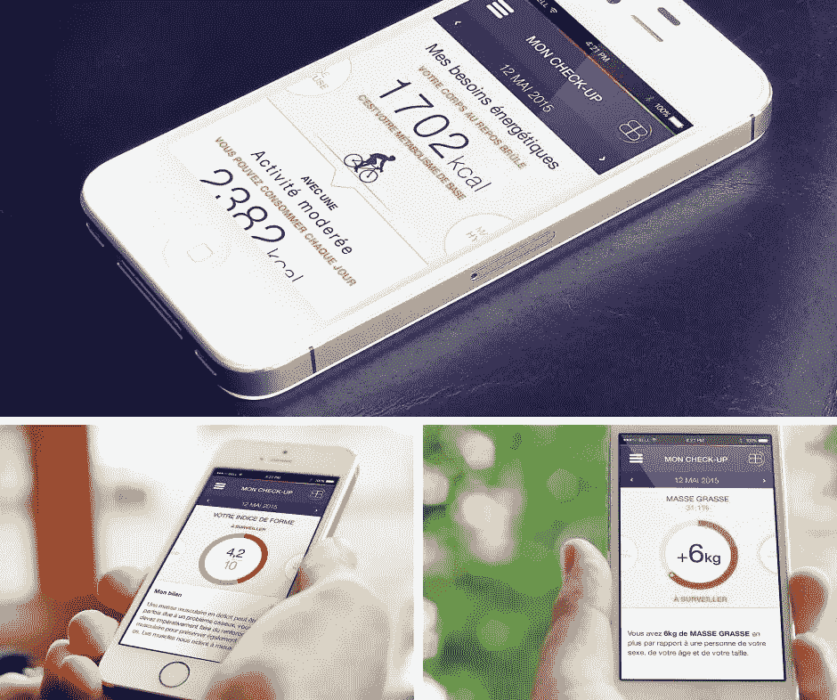

# MyBiody:你会减少你的医疗费用！

> 原文：<https://medium.com/hackernoon/mybiody-you-will-reduce-your-medical-expenses-204441a22e78>

去医生那里做身体检查很烦人:首先你要去那里，然后你要排一个小时的队，最后你还要付钱。在大多数情况下，你已经损失了 2 个小时的时间，因为你根本没有生病。因此，我们发现了一些非常有趣的东西:一个连接的工具，让你可以在任何时候，最重要的是，在家里，立即进行身体检查！

# 立即进行身体检查…

从家里？你说真的吗？是啊伙计。100%法国技术认证，让我向您介绍 [MyBiody](http://www.pickandpow.com/product/mybiody-balance/) ，一个允许“按需”立即进行身体检查和分析的连接工具。你的医生最好小心！#健康 2.0。

有了这个工具，你会得到一个个性化的分析，让你了解你的一些不平衡的根源，以及如何解决它们。的确， [MyBiody](http://www.pickandpow.com/product/mybiody-balance/) ，会给你提供一大堆流畅的数据，比如你的肌肉量，你的骨骼质量，你的每日热量需求，你的水合作用-水分保持，你的健康指数，你的体脂……是的，女士们，你的体脂。但别忘了，我们爱你本来的样子。

# 用直观的 app 连接！

这个在 [Apple Store](https://itunes.apple.com/fr/app/mybiody/id955891417?mt=8) 和 [Play store](https://play.google.com/store/apps/details?id=com.bbrc.mybiody) 上可用的应用将成为你的“身体仪表盘”，通过图表和简单可读的指示器来控制它。我们对物联网工具的期望不亚于此！

但这还不是全部！如果有什么不对劲(不用担心，这可能只是简单的肌肉萎缩)，你还可以收到警报，并设定一些目标，如最大限度地提高你的运动成绩或安全减肥。

另一个重要的特性(也许是最重要的)是可以分享你的报告。你可以与你的教练或医生分享你的身体仪表盘。因为在任何情况下，这个工具都不会完全取代你的医生。这是一个很好的身体检查，但如果事情不正常，最好打电话给索尔！(对于没看过有史以来最好的电视剧的人，我想说“最好给你的医生打电话”)。

最后，这个工具也被认为适合家庭使用。事实上，您可以使用安全仪表板创建任意数量的帐户。所以买一个 [MyBiody](http://www.pickandpow.com/product/mybiody-balance/) 就够了！

# 谁需要这个工具？

这个工具是专为有体重问题的人设计的，并且愿意管理他们。力量和荣誉。你能做到的。

此外，运动员也会喜欢这个产品，因为他们会意识到肌肉质量和水合作用，这是良好表现的两个重要因素。

最后， [MyBiody](http://www.pickandpow.com/product/mybiody-balance/) 将与关心自己健康的人相匹配……你不喜欢？YOLO 兄弟！

# 我在哪里可以找到这个产品？

你可以在 [Pick & Pow](http://www.pickandpow.com/product/mybiody-balance/) 上拥有 [MyBiody](http://www.pickandpow.com/product/mybiody-balance/) 和 25 个€，这是第一个突出年轻创业公司创新产品的众筹平台。您还可以通过采访发现 MyBiody 的联合创始人，并帮助他们提高知名度！

[http://magazine . pickandpow . com/mybiody-you-will-reduce-you-you-medical-expenses/](http://magazine.pickandpow.com/mybiody-you-will-reduce-your-medical-expenses/)

*最初发表于*[*magazine.pickandpow.com*](http://magazine.pickandpow.com/mybiody-you-will-reduce-your-medical-expenses/)*。*