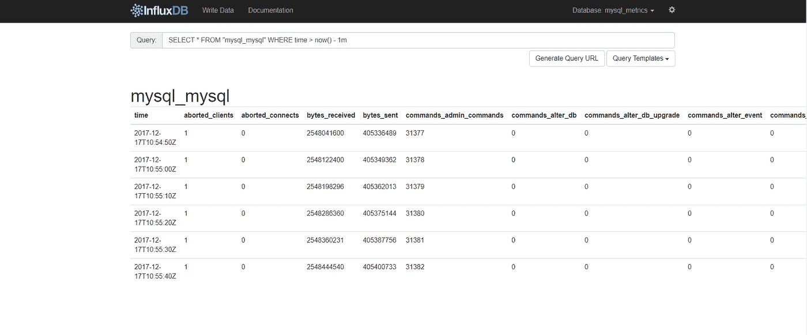
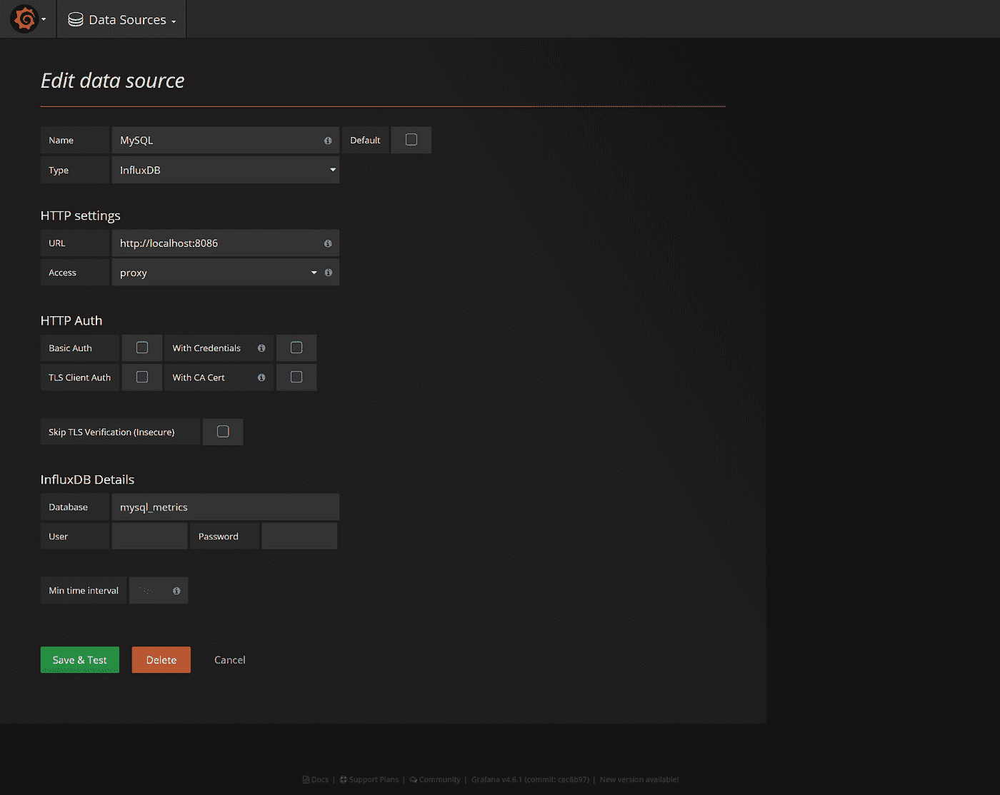

# 使用 Telegraf、InfluxDB & Grafana 监控 MySQL

> 原文：<https://medium.com/hackernoon/mysql-monitoring-with-telegraf-influxdb-grafana-4489e6df0220>

这篇文章将带你经历创建交互式、实时和动态仪表板的每一步，使用 **Telegraf** 、**InfluxDB**&**Grafana**来监控你的 **MySQL** 实例。

首先启用*/etc/tele graf/tele graf . conf*中的 **MySQL** 输入插件:

一旦 Telegraf 启动并运行，它将开始收集数据并将其写入 InfluxDB 数据库:

最后，将您的浏览器指向您的 **Grafana URL** ，然后以 *admin* 用户的身份登录。从菜单中选择**数据源**。然后，点击顶部栏中的“**添加新的**”。

填写 **InfluxDB** 数据源的配置详情:

您现在可以通过打开 dashboard 下拉菜单并单击“ **Import** ”来导入[*dashboard . JSON*](https://github.com/mlabouardy/grafana-dashboards/blob/master/mysql/dashboard.json)文件:

注:查看我的 [Github](https://github.com/mlabouardy/grafana-dashboards) 获得更多互动&漂亮 **Grafana** 仪表盘。