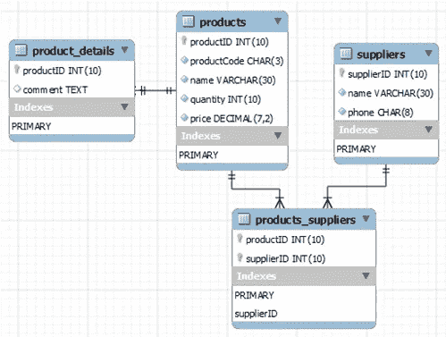

# [MySQL]注意:关系:1–1，1-n，n-n，nest

> 原文：<https://medium.com/hackernoon/mysql-tutorial-example-relation-foreign-key-database-funtion-join-table-query-one-namy-nest-41dd09648fbd>


pixabay.com

> 关系数据库的优势包括 ***连接表查询*** ，避免数据重复，避免记录不一致，更好的安全性，迎合未来需求(tech-ict.com)。

在过去的几年里，我通过***【MongoDB】***构建了几个电子商务或内容共享平台，并意识到对于复杂关系表(如用户、权限、产品或商店关系)的架构和快速移动的特性需求(它会导致记录/数据类型不一致)，它并不是一个理想的数据库。每隔几个月就会有新的需求出现，修改脏数据就像从我的屁股上拔牙一样。

# 内容

1.  一对一关系
2.  一对多关系
3.  n-n 关系
4.  筑巢

## 备注:

*在本例中有一个默认的产品和供应商表*

```
mysql> **SHOW DATABASES;** mysql> **USE yourdatabse;** mysql> **CREATE TABLE product_details (
          productID  INT UNSIGNED   NOT NULL,
                     -- same data type as the parent table
          comment    TEXT  NULL,
                     -- up to 64KB
          PRIMARY KEY (productID),
          FOREIGN KEY (productID) REFERENCES products (productID)
       );**
mysql> **CREATE TABLE IF NOT EXISTS products (
         productID    INT UNSIGNED  NOT NULL AUTO_INCREMENT,
         productCode  CHAR(3)       NOT NULL DEFAULT '',
         name         VARCHAR(30)   NOT NULL DEFAULT '',
         quantity     INT UNSIGNED  NOT NULL DEFAULT 0,
         price        DECIMAL(7,2)  NOT NULL DEFAULT 99999.99,
         supplierID   INT UNSIGNED  NOT NULL DEFAULT 0,
         PRIMARY KEY  (productID)
       );****...**mysql> **UPDATE products SET supplierID = 501;**
```



# 1)一对一关系

如果有另外一个表叫做***product _ details***，用一对一的关系链接到产品上，如图。


## 写入外键列

```
mysql> INSERT INTO product_details VALUES (1001, ‘good one’);
```

## 按外键列查询关系

```
mysql> SELECT products.productID,price,product_details.comment
       FROM products 
          ***JOIN product_details ON products.productID = product_details.productID***
       WHERE price < 5;
```

# 2)一对多关系

假设每个产品有一个供应商，每个供应商供应一个或多个产品， ***供应商-产品是 1-n 关系模型*** 的基础。要实现 1-n 关系，技术上与 1–1 关系相同，只需确保不超过行与同一产品相关。

## 创建外键列

将`products`子表的`supplierID`列的 ***外键*** 添加到`suppliers`父表:

1.  在产品表中添加 INT 类型的 ***supplierID*** 列
2.  设置所有 ***supplierID*** 的现有记录
3.  设置 ***supplierID*** 为外键列，由相关 ***产品*** 表到父 ***供应商表*** mysql > **ALTER 表产品
    添加列 supplierID INT UNSIGNED NOT NULL**

```
mysql> **UPDATE products SET supplierID = 501;**mysql> **ALTER TABLE products
       ADD FOREIGN KEY (supplierID) REFERENCES suppliers (supplierID);**
```

## 写入外键列

这和写一个 INT 列是一样的

```
mysql> **INSERT INTO products VALUES (1001, 'PEN', 'Pen Red', 5000, 1.23, 503);** Query OK, 1 row affected (0.00 sec)
```

## 按外键列查询关系

```
mysql> SELECT products.name, price, suppliers.name 
       FROM products 
          ***JOIN suppliers ON products.supplierID =  suppliers.supplierID***
       WHERE price < 5;
```

# 3)n-n 关系

假设一个产品有很多供应商；一个供应商以所谓的多对多关系供应许多产品。**对于多对多的关系，它需要第三表，称为连接表。**

## 创建连接表**产品 _ 供应商**

```
mysql> **CREATE TABLE products_suppliers (
         productID   INT UNSIGNED  NOT NULL,
         supplierID  INT UNSIGNED  NOT NULL,
                     -- Same data types as the parent tables
         PRIMARY KEY (productID, supplierID),
                     -- uniqueness
         FOREIGN KEY (productID)  REFERENCES products  (productID),
         FOREIGN KEY (supplierID) REFERENCES suppliers (supplierID)
       );**
```

## 插入关系

```
mysql> **INSERT INTO products_suppliers VALUES (1001, 501), (1001, 503), (1002, 501), (1003, 501), (1004, 502);**
```

## 查询 3 相关表

使用`SELECT`和`JOIN`从 3 个表中查询数据，例如:

```
mysql> SELECT products.name AS `Product Name`, price, suppliers.name AS `Supplier Name`
       FROM products_suppliers 
          JOIN products  ON products_suppliers.productID = products.productID
          JOIN suppliers ON products_suppliers.supplierID = suppliers.supplierID
       WHERE price < 5 AND products.name = "Pen Red1" AND suppliers.name = "QQ Corp";
```

# 摘要

如果您使用多对多关系，您必须引入一个*连接*表(或连接表),它保存两个参与表的外键，这进一步增加了连接操作的成本。

# 你可能也喜欢

*   [MySQL 手册](/curiousian/mysql-handbook-tutorial-example-for-beginner-setup-admin-query-curd-relation-583b05106c1f#.v7tni8uoj)
*   [【MySQL】注意:在 Node.js 中快速设置和运行](https://hackernoon.com/nodejs-mysql-install-setup-tutorial-example-connection-insert-query-fd5c5032d3b0#.hpp65qg28)
*   [【MySQL】注意:创建管理员用户](https://hackernoon.com/mysql-note-create-admin-user-5e77b43ecc8e#.uncmszepg)
*   [【MySQL】注:数据库凝乳](https://hackernoon.com/mysql-note-database-curd-b62a21404678#.jm4eqcmgu)
*   [【MySQL】注:排凝乳](/hacker-daily/mysql-tutorial-query-limit-offset-condition-row-foreign-key-join-select-d3835b28e1a#.dob477vn4)
*   [【MySQL】注:关系:1–1，1-n，n-n，嵌套](https://hackernoon.com/mysql-tutorial-example-relation-foreign-key-database-funtion-join-table-query-one-namy-nest-41dd09648fbd)

*非常感谢*[*NTU*](https://www.ntu.edu.sg/home/ehchua/programming/sql/MySQL_Beginner.html)*的社区，他们贡献了这么好的教程和有价值的例子。*

# 参考:

[https://www . NTU . edu . SG/home/ehchua/programming/SQL/MySQL _ beginner . html](https://www.ntu.edu.sg/home/ehchua/programming/sql/MySQL_Beginner.html)

[](http://bit.ly/HackernoonFB)[](https://goo.gl/k7XYbx)[](https://goo.gl/4ofytp)

> [黑客中午](http://bit.ly/Hackernoon)是黑客如何开始他们的下午。我们是这个家庭的一员。我们现在[接受投稿](http://bit.ly/hackernoonsubmission)并乐意[讨论广告&赞助](mailto:partners@amipublications.com)机会。
> 
> 如果你喜欢这个故事，我们推荐你阅读我们的[最新科技故事](http://bit.ly/hackernoonlatestt)和[趋势科技故事](https://hackernoon.com/trending)。直到下一次，不要把世界的现实想当然！

