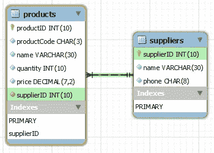

# [MySQL]注意:行凝乳

> 原文：<https://medium.com/hackernoon/mysql-tutorial-query-limit-offset-condition-row-foreign-key-join-select-d3835b28e1a>


pixabay.com

> 现代应用程序意味着:90%的 CRUD、用户界面和报告，以及 10%的十几种语言的复杂代码评估。

全世界有 23.1 亿社交媒体用户，我们都爱倾听和分享，我们爱平台。事实上，平台中 90%的操作都与数据库/缓存 CRUD 有关，本故事收集了 12 个最常用的 MySQL 行操作，以帮助理解和找到我们需要的关于行的所有内容。

# 内容

1.  创建行
2.  按条件查询
3.  按订单查询
4.  李米的查询，偏移量
5.  别名，as
6.  聚合函数
7.  *分组依据
8.  更新行
9.  删除行
10.  警报列(添加新列)
11.  *外键
12.  *带连接的选择

## 在数据库内部操作表之前有一个默认的数据库

```
mysql> **SHOW DATABASES;** mysql> **USE yourdatabse;** mysql> **CREATE TABLE IF NOT EXISTS products (
         productID    INT UNSIGNED  NOT NULL AUTO_INCREMENT,
         productCode  CHAR(3)       NOT NULL DEFAULT '',
         name         VARCHAR(30)   NOT NULL DEFAULT '',
         quantity     INT UNSIGNED  NOT NULL DEFAULT 0,
         price        DECIMAL(7,2)  NOT NULL DEFAULT 99999.99,
         quantity     INT UNSIGNED  NOT NULL DEFAULT 0,
         PRIMARY KEY  (productID)
       );**
```

# 1-创建行

用 ***插入一行全列值***

```
mysql> **INSERT INTO products VALUES (1001, 'PEN', 'Pen Red', 5000, 1.23);** Query OK, 1 row affected (0.00 sec)
```

向 auto_increment 列插入 NULL 导致 ***max_value + 1***

```
mysql> **INSERT INTO products VALUES (NULL, 'PEN', 'Pen Red', 5000, 1.23);** Query OK, 1 row affected (0.00 sec)
```

仅在**缺少值**或**的选定列上插入一行值**

```
mysql> **INSERT INTO products (productCode, name, quantity, price) VALUES ('PEC', 'Pencil 2B', 10000, 0.48),;** Query OK, 1 row affected (0.00 sec)
```

# 2-按条件查询

显示

```
*List all the rows of the* ***specified columns*** mysql> **SELECT * FROM products;***List all the rows of the* ***specified columns*** mysql> **SELECT** productID, name **FROM products**
```

## 比较运算符— =，<，>

```
mysql>  SELECT * FROM products **WHERE price >1;**mysql>  SELECT * FROM products **WHERE productCode = 'PEN'**;
```

## 逻辑运算符——与、或、非、异或

```
mysql>  SELECT * FROM products **WHERE productCode = 'PEN' AND price >1;**
```

## 包含运算符—IN，NOT IN

```
mysql>  SELECT * FROM products **WHERE name IN ('Pen Red', 'Pen Black')**;
```

## 运算符之间——之间，而不是之间

```
mysql>  SELECT * FROM products **WHERE name IN ('Pen Red', 'Pen Black')**;
```

## 为空，不为空

```
mysql>  **SELECT * FROM products WHERE productCode IS NULL**;
```

# 3-按订单查询

按升序(ASC)(默认)或降序(DESC)排序。

```
mysql> **SELECT * FROM products WHERE price >1 ORDER BY price DESC**;mysql> **SELECT * FROM products WHERE price >1 ORDER BY price DESC, quantity**;
```

# 4-按限制、偏移查询

```
mysql> SELECT * FROM products **LIMIT 2,1**;
//limit =2
//skip =1
```

# 5-别名，as

```
mysql> SELECT **productID AS ID**, **price AS `Unit Price`**mysql> SELECT * FROM products **ORDER BY ID**;
```

# 6—聚合函数

计数，最大值，最小值，AVG，总和，标准差，GROUP_CONCAT，

```
mysql> SELECT COUNT(*) AS `Count` FROM products**;** 

+-------+
| Count |
+-------+
|     5 |
+-------+
```

# 7—*分组依据

GROUP BY 是一个非常酷工具，可以生成有组织的结果，并从纠缠的列中整理出数据。
分组通过本身没有意义。它与 GROUP BY 聚合函数(如 COUNT()、AVG()、SUM())一起用于生成组摘要。

## 第一个例子

```
mysql> SELECT **name, ANY_VALUE(price)** FROM products **GROUP BY name**; 
```

## 多列

```
mysql> SELECT productCode, MAX(price) AS `Highest Price`, MIN(price) AS `Lowest Price`
       FROM products
       GROUP BY productCode;

+-------------+---------------+--------------+
| productCode | Highest Price | Lowest Price |
+-------------+---------------+--------------+
| PEC         |          0.49 |         0.48 |
| PEN         |          1.25 |         1.23 |
+-------------+---------------+--------------+
```

## 使用 CAST(...如同...)函数来格式化浮点数

```
mysql> SELECT productCode, MAX(price), MIN(price),
              CAST(AVG(price) AS DECIMAL(7,2)) AS `Average`,
              CAST(STD(price) AS DECIMAL(7,2)) AS `Std Dev`,
              SUM(quantity)
       FROM products
       GROUP BY productCode;
```

# 8-更新行

## 更新所有行

```
mysql> **UPDATE products SET price = price * 1.1;**
```

## 按条件更新

```
mysql> **UPDATE products SET quantity = quantity - 100 WHERE name = 'Pen Red';**
```

## 更新多列

```
mysql> **UPDATE products SET quantity = quantity + 50, price = 1.23 WHERE name = 'Pen Red';**
```

# 9-删除行

## 删除所有行

```
mysql> **DELETE FROM products;**
```

## 按条件删除

```
mysql> **DELETE FROM products WHERE name = 'Pen Red';**
```

# 10 —警报列(添加新列)

```
mysql> **ALTER TABLE products
       ADD COLUMN supplierID INT UNSIGNED NOT NULL;**
```

# 11-创建外键列

将`products`子表的`supplierID`列的 ***外键*** 添加到`suppliers`父表:

1.  在产品表中添加 INT 类型的 ***supplierID*** 列
2.  设置所有 ***supplierID*** 的现有记录
3.  设置 ***【供应商 id】***为外键列，由相关 ***产品*** 表到父 ***供应商表***

```
mysql> **ALTER TABLE products
       ADD COLUMN supplierID INT UNSIGNED NOT NULL;**mysql> **UPDATE products SET supplierID = 501;**mysql> **ALTER TABLE products
       ADD FOREIGN KEY (supplierID) REFERENCES suppliers (supplierID);**
```

# 12—*带连接的选择

神奇的 ***JOIN(外键)*** 是我最喜欢的 MySQL 部分。由于我已经使用 MongoDB 很长时间了，它的关系查询有问题。曾经有一段时间，我们有一个大型重构项目，其中包括模式重构，最大的痛苦之一是将 1-1 关系转换为 1-n 或 n-n 关系，这非常耗时。

我喜欢**外键**和**选择，**使 n-n 关系成为自切片面包以来最好的东西。combo***JION-table 1-table 2-result***仅通过一个 SQL 查询就实现了多个复杂的命中。


JOIN is ***1 click with 30 HIT***

SQL 联接用于组合两个或多个表中的行。MySQL 中默认的 ***连接*** 是 ***内部连接*** ，只要两个表中的列匹配，那么给定的关键字就会选择两个表中的所有行。

1.  在 MySQL 中，默认连接是内部连接
2.  设置所有 ***supplierID*** 的现有记录
3.  设置 ***supplierID*** 为外键列，由相关 ***产品*** 表到父 ***供应商*** 表

```
mysql> SELECT products.name, price, suppliers.name 
       FROM products 
          ***JOIN suppliers ON products.supplierID =  suppliers.supplierID***
       WHERE price < 5;
```



# 你可能也喜欢

*   [MySQL 手册](/curiousian/mysql-handbook-tutorial-example-for-beginner-setup-admin-query-curd-relation-583b05106c1f#.v7tni8uoj)
*   [【MySQL】注意:在 Node.js 中快速设置和运行](https://hackernoon.com/nodejs-mysql-install-setup-tutorial-example-connection-insert-query-fd5c5032d3b0#.hpp65qg28)
*   [【MySQL】注意:创建管理员用户](https://hackernoon.com/mysql-note-create-admin-user-5e77b43ecc8e#.uncmszepg)
*   [【MySQL】注:数据库凝乳](https://hackernoon.com/mysql-note-database-curd-b62a21404678#.jm4eqcmgu)
*   [【MySQL】注:排凝乳](/hacker-daily/mysql-tutorial-query-limit-offset-condition-row-foreign-key-join-select-d3835b28e1a#.dob477vn4)
*   [【MySQL】注:关系:1–1，1-n，n-n，嵌套](https://hackernoon.com/mysql-tutorial-example-relation-foreign-key-database-funtion-join-table-query-one-namy-nest-41dd09648fbd)

*非常感谢*[*【NTU】*](https://www.ntu.edu.sg/home/ehchua/programming/sql/MySQL_Beginner.html)*的社区，他们贡献了这么好的教程和有价值的例子，在这个故事中用作教程。*

# 参考:

[https://www.cyberciti.biz/faq/mysql-list-databases/](https://www.cyberciti.biz/faq/mysql-list-databases/)

[https://www . NTU . edu . SG/home/ehchua/programming/SQL/MySQL _ beginner . html](https://www.ntu.edu.sg/home/ehchua/programming/sql/MySQL_Beginner.html)

[](http://bit.ly/HackernoonFB)[](https://goo.gl/k7XYbx)[](https://goo.gl/4ofytp)

> [黑客中午](http://bit.ly/Hackernoon)是黑客如何开始他们的下午。我们是 [@AMI](http://bit.ly/atAMIatAMI) 家庭的一员。我们现在[接受投稿](http://bit.ly/hackernoonsubmission)并乐意[讨论广告&赞助](mailto:partners@amipublications.com)机会。
> 
> 如果你喜欢这个故事，我们推荐你阅读我们的[最新科技故事](http://bit.ly/hackernoonlatestt)和[趋势科技故事](https://hackernoon.com/trending)。直到下一次，不要把世界的现实想当然！

