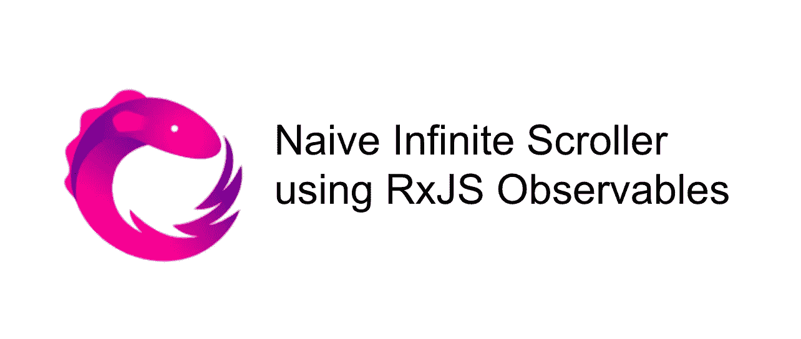
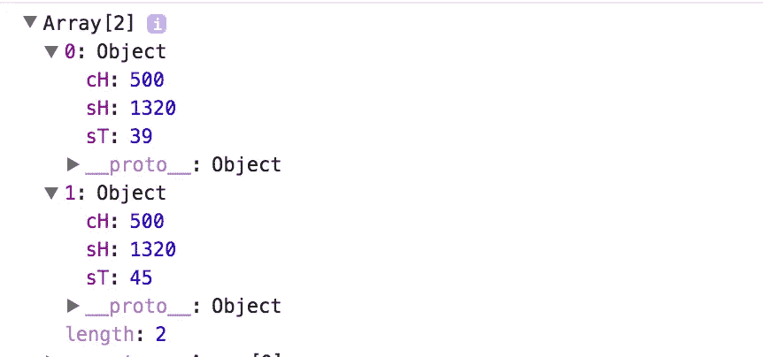
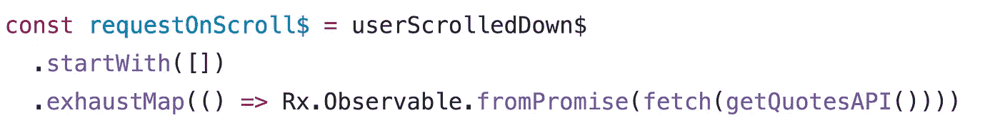
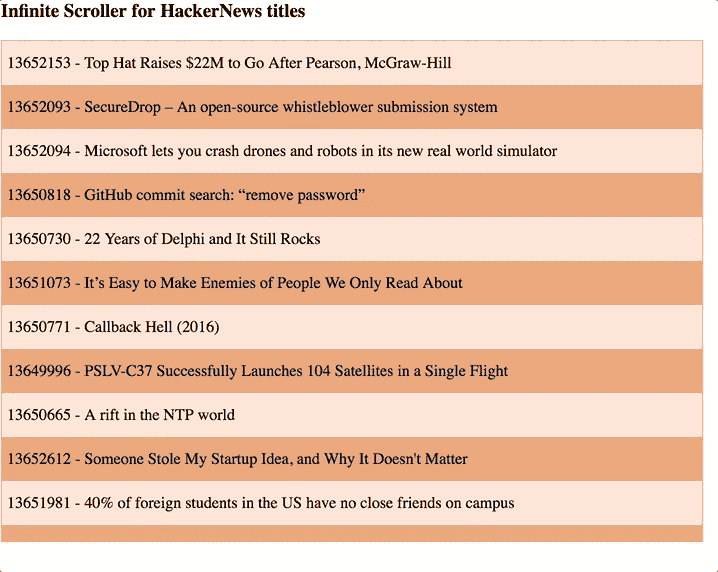

# 使用 RxJS 可观测量的反应式编程中的简单无限滚动

> 原文：<https://medium.com/hackernoon/naive-infinite-scroll-in-reactive-programming-using-rxjs-observables-4a605d3146e8>

用 RxJS 实现无限滚动的简单实验

关于 Angular 实现的博文:[带有 RxJS 可观察值的简单无限滚动条指令](/@Sureshkumar_Ash/angular-2-simple-infinite-scroller-directive-with-rxjs-observables-a989b12d4fb1)

**什么是反应式编程？** 简单来说就是用异步数据流编程。Andre Staltz 发表了一篇很棒的文章，介绍了你一直错过的反应式编程，并附有一个 egghead.io 视频。

[你错过的反应式编程入门](https://gist.github.com/staltz/868e7e9bc2a7b8c1f754)

[https://egghead . io/courses/introduction-to-reactive-programming](https://egghead.io/courses/introduction-to-reactive-programming)

**RxJS 是什么？**

RxJS 或 Reactive Extensions 是微软开放技术公司用 Javascript 开发的库，用于*转换、组合*和*查询*数据流。[https://github.com/Reactive-Extensions/RxJS](https://github.com/Reactive-Extensions/RxJS)

本·莱什有一个关于这个[与 RxJS 5](https://www.youtube.com/watch?v=1vR9lQLfqjo&t=959s) 反应式思维的精彩演讲

下面是 Netanel Basal 对可观测量和一些运算符的一些不错的介绍

1.  [发动机罩下的可见物](https://netbasal.com/javascript-observables-under-the-hood-2423f760584#.ptzobjg31)。
2.  [RxJS——你必须知道的六个操作者](https://netbasal.com/rxjs-six-operators-that-you-must-know-5ed3b6e238a0#.oqgxqivb2)

我们将会建造什么？

我们将使用 observables 构建一个简单的无限滚动器。每当用户将给定的容器滚动到 70%时，我们将触发 api 调用从服务器获取更多数据。对于这个实现，我们将使用 [HackerNews 非官方 api](https://github.com/cheeaun/node-hnapi) 来获取最新消息。

下面是我们将在 RxJS 中使用的运算符

1.  `[map](http://reactivex.io/rxjs/class/es6/Observable.js~Observable.html#instance-method-map)`:类似于数组中的映射，映射到传入的数据流上。
2.  `[filter](http://reactivex.io/rxjs/class/es6/Observable.js~Observable.html#instance-method-filter)`:类似于数组中的 filter，过滤传入的数据流。
3.  `[pairwise](http://reactivex.io/rxjs/class/es6/Observable.js~Observable.html#instance-method-pairwise)`:返回当前发出数据的数组，也返回以前发出的数据。
4.  `[startWith](http://reactivex.io/rxjs/class/es6/Observable.js~Observable.html#instance-method-startWith)`:在从源可观察对象发出值之前，返回一个可观察对象发出提供的值
5.  `[exhaustMap](http://reactivex.io/rxjs/class/es6/Observable.js~Observable.html#instance-method-exhaustMap)`:等待发出值，直到传入的内部可观察对象完成

链接到 jsbin.com 的输出:[https://output.jsbin.com/punibux](https://output.jsbin.com/punibux)

**#Phase1** —设置基本的 html 和样式

导入 RxJS 库，我们将使用`infinite-scroller`作为滚动容器，并向其中添加新闻。

**#Phase2** —为数据处理、渲染和计算设置助手功能

前三个功能很简单，

1.  `getQuotesAPI` —返回带有当前页码的 api url 作为查询参数
2.  `processData` —处理从使用[获取 api](https://developer.mozilla.org/en/docs/Web/API/Fetch_API) 执行的 API 返回的数据，并增加当前页面。
3.  `renderNews` —获取每个新闻条目并呈现给视图。

接下来的两个函数用于滚动计算

4.`isUserScrollingDown` —确定用户是否向下滚动。

5.`isScrollExpectedPercent` —确定用户是否已滚动到传入百分比以获取更多数据。

**#Phase3** —设置可观察流

为了捕获容器中的滚动事件，我们需要从滚动事件中创建一个可观察对象。这可以通过使用`Rx.Observable.fromEvent` - [单据](http://reactivex.io/rxjs/class/es6/Observable.js~Observable.html#static-method-fromEvent)来实现。当引用一个可观察的流时，将`$`附加到变量是一个惯例。

**#Phase4** —处理滚动事件和调用 api 的流逻辑

我们将接受由`scrollEvent$`和`map`发出的滚动事件，只接受我们的无限滚动逻辑所需的值。我们只需要来自滚动元素的三个属性— `[scrollHeight](https://developer.mozilla.org/en-US/docs/Web/API/Element/scrollHeight)`、`[scrollTop](https://developer.mozilla.org/en-US/docs/Web/API/Element/scrollTop)`和`[clientHeight](https://developer.mozilla.org/en-US/docs/Web/API/Element/clientHeight)`。

我们将映射的数据传递给`pairwise`操作符，它将当前和以前的值放在一个数组中，如下所示。

现在我们可以将这一对位置传递给`filter`它们根据我们的条件进行过滤

1.  用户是否向下滚动
2.  用户滚动是否达到了容器的 70%

`requestOnScroll$` —当`userScrollDown$`通过过滤条件时调用。我们从一个空数组的初始值开始。

我们将使用`[Rx.Observable.fromPromise](http://reactivex.io/rxjs/class/es6/Observable.js~Observable.html#static-method-fromPromise)`从承诺中创建一个可观察值。`fetch`进行 http 调用并返回一个承诺。`exhaustMap`将等待获取完成，等待内部可观察对象从 API 发出数据。

可观察的东西是懒惰的——意味着它们不做任何事情，直到你订阅它们。我们将订阅`requestOnScroll$`并将`processData`传递给 subscribe 方法。当`exhaustMap`从 api 发出数据时，它将被传递给`processData`，T3 将调用`renderNews`呈现到视图上。

下面是无限卷轴的 gif 图片，请看右边的滚动条。

> 在我的下一篇文章中，我将尝试通过创建一个无限滚动指令在 Angular 2 中实现它。

更新:这里是我关于简单无限滚动条指令的链接