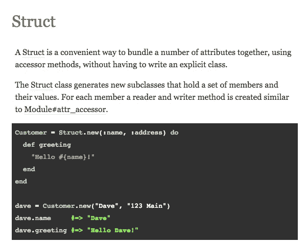

# NamedStruct —改进 Ruby 的结构

> 原文：<https://medium.com/hackernoon/namedstruct-improving-rubys-struct-51c8b2470365>

这篇文章描述了我认为 Ruby 内置的 [Struct](https://ruby-doc.org/core-2.4.2/Struct.html) 类中的一个主要缺陷，并提出了一个解决方法。

Documentation for Ruby’s built-in Struct class

[这篇博文](http://blog.steveklabnik.com/posts/2012-09-01-random-ruby-tricks--struct-new)很好地解释了对值对象使用 Struct 的好处。

下面是我对 Struct 的抱怨:虽然 Struct 中的字段是命名的(不像数组，或者 [Python 的 tuple](http://thomas-cokelaer.info/tutorials/python/tuples.html) )，但是在实例化 Struct 对象时，不允许使用命名/关键字参数。

这违背了命名字段的初衷！拥有命名字段的好处是它们赋予数据意义。`Birthday.new(day: 5, month: 7)`无疑比`Birthday.new(5, 7)`更清晰。

为了解决这个问题，我在所有使用`Struct`的项目中添加了下面的类:

如果你不想重复，这也可以作为宝石使用。