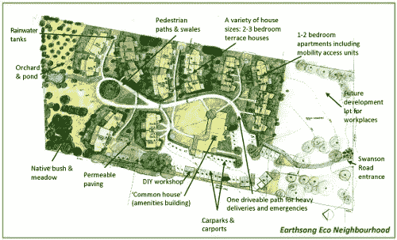
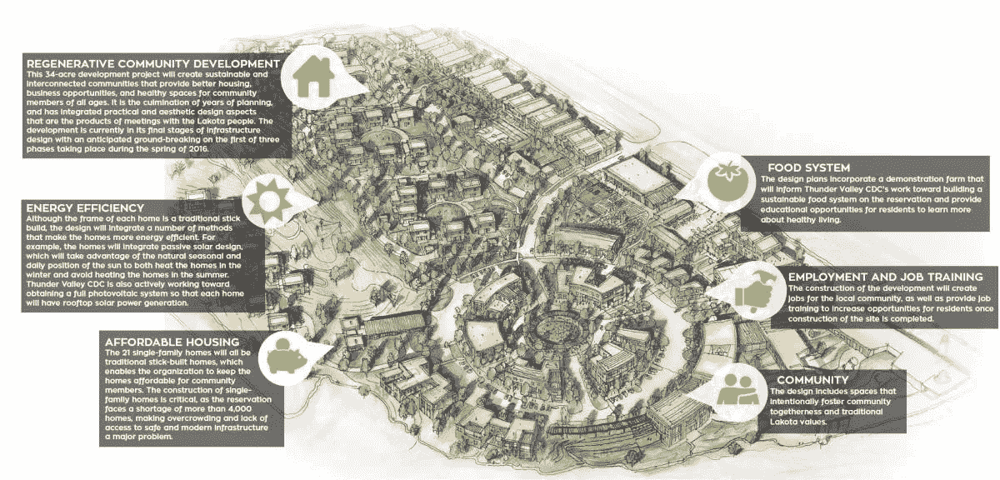

# 自然的整体系统优化通知社区设计

> 原文：<https://medium.com/hackernoon/natures-whole-system-optimization-informs-community-design-546d484050bd>

我们的所有行动都会影响我们生活、工作和学习的社区的可持续性、复原力和健康。我们与社区建立的关系以及我们对未来的集体愿景将决定社区是否可持续发展，是否能够再生。在社区层面，我们都可以为再生文化的出现做出贡献。我们共同创建的互动嵌套网络塑造了我们社区的现在和未来，以及它对当地生态系统的参与。【这是节选自 Triarchy 出版社 2016 年出版的[设计再生文化](http://www.triarchypress.net/designing-regenerative-cultures.html)中的一个分章节。]

可持续社区设计是关于意识到这些嵌套的关系和过程网络，然后以支持社区及其所有参与者健康的方式优化它们。目的是协同整合社区的社会、生态、经济和文化(世界观/叙事)层面，创造一种能够长期再生的协作和团结文化。在这方面取得成功的社区是繁荣、健康和鼓舞人心的地方，为其居民提供卓越的生活质量，同时对当地和区域环境产生积极影响。

Example ([Source](https://sites.google.com/site/agenda21now/7-central-themes/the-management-of-human-settlements)) — this image is not in the book

更好地理解生态群落(生态系统)可以帮助我们适应并优化与其他生命共生的人类群落。生态系统倾向于以支持多样性、健康、复原力和整个生态系统再生能力的方式优化整个系统，而不是最大限度地增加单个物种的数量和短期成功。对个人或社区来说，最成功和最长期的策略是模仿自然界整体系统优化的基本合作模式，并模仿其过程和关系。所有参与者的长期成功和活力取决于整个系统的健康。

**我们如何在学习生态系统中的组织和协作模式的基础上创造人类住区？**

Declan Kennedy 教授和 Margrit Kennedy 教授将他们的大部分职业和社区生活致力于探索可持续的社区设计和可持续的区域经济交流机制。两人都在学术界担任柏林城市规划的教授，同时在德国汉诺威附近的 Steyerberg 他们帮助创建的“Lebensgarten”生态村内试验可持续社区设计。

1996 年，他们发起的一个 EU-资助的项目调查了欧洲社区规划的许多最佳实践和最佳过程范例。该项目促成了他们的[书](http://www.kennedy-bibliothek.info/cx-content/uploads/bibliothek/DesigningEcologicalSettlements.pdf) *设计生态住区*(肯尼迪&肯尼迪，1997)，在书中他们提出了一个重新设计社区的生态知情标准。以下是他们邀请我们提出的一些问题:

**我们如何设计生态和可持续的住区？**

**我们如何在社区中庆祝和培育人类和自然的多样性？**

**我们如何围绕人与人之间的人际互动和协作来关注我们的社区，以便居民可以彼此建立个人联系？**

**我们如何创建一个短距离的居住区，并以步行规模整合重要的社区功能？**

**我们如何尽可能少地利用人类基础设施的空间，创造高密度的生活空间，将自然融入社区结构？**

**我们如何鼓励社区参与并激励所有社区成员共同创造负责任参与的协作优势？**

**我们如何利用当地和区域的可再生能源资源和节能设计来创建节能住区？**

**我们如何创建一个对气候负责、无排放的社区？**

我们怎样才能创造一个安静美丽的居住区？

**我们如何利用综合设计来珍惜水资源，并帮助当地流域再生？**

我们如何在地方和区域范围内创造有效的循环资源利用模式，使我们的居住区基本上没有废物？

我们如何为健康的社区设计健康的建筑？

我们如何整合本地物种和多产植物(园艺、森林花园等)的生存空间？)到我们的解决方案中？

**我们如何在社区中培养生态和社会素养，并建立有效的创造性冲突调解和解决流程？**

**我们如何共同创造一个所有居民共享的人类价值的指导性社区叙事？**

这些问题促使我们将我们的社区设计成自然。“将所有这些方面[……]联系在一起的是，他们力求[……]*整体的最优化*，而不是单个部分的最大化，从而获得住房乃至生活本身的新品质”(肯尼迪&肯尼迪，1997 年，第 211 页)。这种整体优化是生命如何创造有利于生命的条件的重要一课。

基于这种系统生态学观点的可持续社区和人类住区设计将有助于创造能够再生、适应和改造的社区。整体的优化超越了当代人的眼前利益，为后代创造了富足。

现有社区的变革性创新意味着将这些问题激发的设计元素改造成现有的文化模式和基础设施。从上面强加它们几乎是不可能的(也是不可取的)。政策必须鼓励并使公民能够参与社区结构的重新设计。一种*的地方感*和*的社区感*通过参与这些集体的想象过程得到滋养。

“活在问题中”是一个社区过程。上面的问题邀请我们与周围的人和我们居住的地方进行对话和交流。他们邀请第一步在社区层面参与和有意识的共同创造。通过共同探索我们的社区如何成为再生文化的典范，我们给彼此一个共同学习的机会。

这种集体的学习之旅本身就为一个能够做出明智决策和再生的社区创造了道路。社区为再生文化的出现创造了条件。我们如何将*设计成*自然和社区，优雅地适应这个独特的地方和文化？不同的再生文化可以从这个问题中演化出来。

【这是摘自 Triarchy 出版社 2016 年出版的《设计再生文化》中的一个分章节。]

—

如果你喜欢这个帖子，**请鼓掌**记住，如果你非常喜欢，你可以鼓掌**多达 50 次**；-)!

**丹尼尔·克里斯蒂安·瓦尔**——在面临多重危机的情况下催化变革性创新，为可再生整体系统设计、可再生领导力以及可再生发展和生物区域再生教育提供建议。

国际知名书籍[设计再生文化](https://www.triarchypress.net/drc.html?source=post_page---------------------------)的作者

 [## 丹尼尔·克里斯蒂安·沃尔正在创造支持再生文化和区域再生的内容…

### 亲爱的潜在支持者，自从《设计再生文化》在 2016 年初出版以来，我一直在分享它…

www.patreon.com](https://www.patreon.com/DanielChristianWahl?fan_landing=true) 

Thunder Valley Regenerative Community on Lakota reservation ([source](http://thundervalley.org/assets/components/phpthumbof/cache/main-regenerative-community-development.7516dc780d176cfb9b4a4ebd7f4048a1.png)), is an example of the kind of settlement described by the Kennedys.