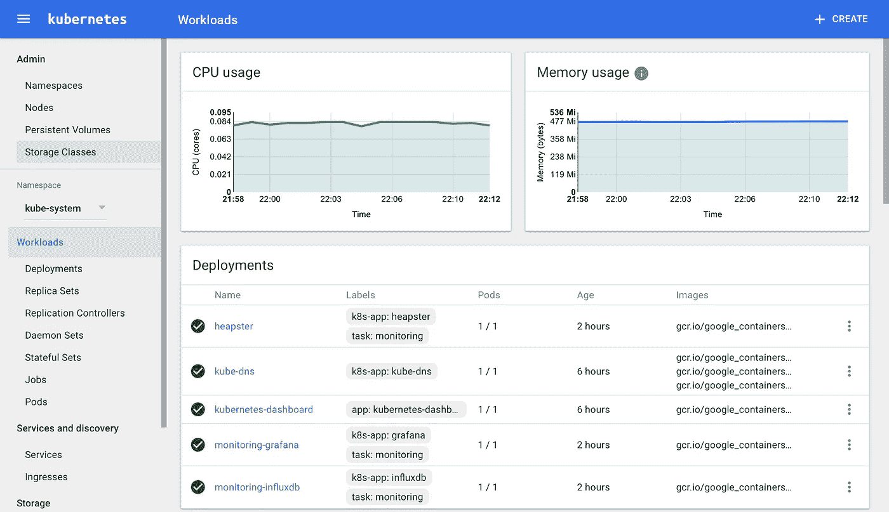

# 使用 Kubernetes 导航

> 原文：<https://medium.com/hackernoon/navigating-with-kubernetes-bb718065d0e4>

## 与您自己的 [Kubernetes](https://kubernetes.io) 集群以及 [Heapster](https://github.com/kubernetes/heapster) 一起航行的地图。还有，Kubernetes 很牛逼！

或者如谷歌所说:

> [Kubernetes](https://kubernetes.io) 是一个用于自动化部署、扩展和管理容器化应用的开源系统。

如果你将 ubernetes 作为云提供商的一部分来使用，它是最棒的，比如谷歌(Google)、[亚马逊(Amazon)](https://kubernetes.io/docs/getting-started-guides/aws/)、[微软(Microsoft)](https://github.com/Azure/acs-engine/blob/master/docs/kubernetes.md)或 [OpenShift](https://github.com/openshift/origin) 。另一方面，如果你更有优势，想要建立一个你自己的服务器集群，事情会变得更复杂。

这并不是因为 Kubernetes 不给力，它仍然很给力，然而文档有时并不是最清晰的，或者最完整的，而且有些东西并不明显，最后但并非最不重要的是，最新的 Kube 版本大约一天前刚刚发布[，这意味着破坏。](http://blog.kubernetes.io/2017/03/kubernetes-1.6-multi-user-multi-workloads-at-scale.html)

我们不会因为新的功能而偏离轨道，这些功能也很棒(5k 节点，weeeee)，我们会让一切正常运行。我们在做的时候也会很开心，而且会一直开心下去(直到下一个版本发布为止)。

我们将使用一个伟大的、全新的 alpha 实用程序， [kubeadm](https://kubernetes.io/docs/admin/kubeadm/) ，并遵循一个[非常好的快速启动](https://kubernetes.io/docs/getting-started-guides/kubeadm/)，我们将跳过无聊的部分，我们将花一些时间做其他事情。

我们跟随的快速入门是为 Ubuntu 16.04+，CentOS 7 或 HypriotOS v1.0.1+设计的，我可以告诉你它也适用于 Debian Jessie。我们将遍历 Debian 分支包，其他的都差不多。所以，让我们湿了脚(做每一件事，因为`root`我们毕竟很开心，或`sudo`)，也在`screen`或`tmux`运行这个。

一切都从码头工人开始，就像往常一样…

关注我们真正关心的事情(k8s)

一切就绪，让我们初始化我们的集群，我们将使用`[flannel](https://github.com/coreos/flannel/blob/master/Documentation/kube-flannel.yml)`作为我们选择的[网络插件](https://kubernetes.io/docs/admin/addons/)(不要问，或点击链接:)，因此你需要`--pod-network-cidr`选项，否则发拉。

```
kubeadm init --pod-network-cidr=10.244.0.0/16
```

您应该会看到类似这样的内容

就这样，你会看到一个无穷无尽的屏幕。

**这个问题已经在 1.6.1 中解决了(据称是*:*)，所以在集群初始化之后，请随意跳到下面的法兰绒配置……**

```
[apiclient] Waiting for at least one node to register and become ready
```

这不太好，因为在 alpha `kubeadm`后有一个扭结。在网络准备就绪之前，节点不会被视为就绪。在以前的版本中，你可以在之后设置网络(或者你知道`kubeadm`会结束…)。

当`apiclient`还在攻击你的时候，切换到另一个`screen|tmux`窗口。我们现在只关心配置文件，我们已经得到了，下面的行是好的行

我们非常喜欢他们。在您切换到运行的窗口中:

```
**cp** /etc/kubernetes/admin.conf $HOME/
**chown** $(id -u):$(id -g) $HOME/admin.conf
**export** KUBECONFIG=$HOME/admin.conf
```

这将允许您与您的集群进行交互，并建立没有人谈论的网络，如果您记得我们将使用`flannel`(您确实还不需要关心)。与 Kube 以前版本的显著变化是，您需要设置`roles`和`role bindings`，`flannel`伙计们支持我们:)。CoreOS 也是牛逼的介意你:)。

```
**git clone** [https://github.com/coreos/flannel.git](https://github.com/coreos/flannel.git)
**kubectl apply** -f flannel/Documentation/kube-flannel-rbac.yml
**kubectl apply** -f flannel/Documentation/kube-flannel.yml
```

完成这些后，您可以返回到集群初始化的窗口，您应该会看到集群已经初始化(每个人都要啤酒……)。

请注意类似于以下内容的行:

```
**kubeadm join** --token <token> <master-ip>:<master-port>
```

忽略其他一切，你已经做到了(除非这次一切都不同了)。

为了好运，再做一次`**export** KUBECONFIG=$HOME/admin.conf`，让我们看看我们做得怎么样，`**watch kubectl** get pods --all-namespaces`应该会给你这样的东西:

```
Every 2.0s: kubectl get pods -n kube-system                                                                                                                  Wed Mar 29 21:13:57 2017NAME                             READY     STATUS    RESTARTS   AGE
etcd-sd-85956                     1/1       Running   0          2m
kube-apiserver-sd-85956           1/1       Running   0          2m
kube-controller-manager-sd-85956  1/1       Running   0          2m
kube-dns-3913472980-3v7hb         3/3       Running   0          2m
kube-flannel-ds-2hptj             2/2       Running   0          2m      
kube-proxy-jx2n7                  1/1       Running   0          2m
kube-proxy-tlplt                  1/1       Running   0          2m
kube-scheduler-sd-85956           1/1       Running   0          2m
```

您拥有自己的 Kubernetes(几乎)集群，毕竟我们需要多个节点才能称之为集群。我们将这个新节点称为 **node2** ，这意味着前一个节点变成了 **node1** 。

```
In case you'll stop at one node run:**kubectl** taint nodes --all node-role.kubernetes.io/master-That way, pods will actually schedule on a master node.
```

现在可能是打开防火墙的好时机。因为我们在 Debian 上，我使用`ufw`，在*节点 1* 上运行`ufw allow from <node2-ip> to any`，在*节点 2* 上运行`ufw allow from <node1> to any`，这对于很多节点来说可能会很麻烦，但是我们没有很多 ATM。

这应该让你乐观和畅通无阻，以及准备好继续进行，现在在`slave`机器上。

```
**kubeadm join** --token <token> <master-ip>:<master-port>
```

与 *node1* 指示我们运行的完全相同的行，太棒了，如果没有意外发生，你应该能够在 *node1* 上运行`kubectl get nodes`并看到两个节点(快乐、聚会和蛋糕)。

现在你对自己感觉很好，让我们把一些松散的结束，首先，没有一些好的图形用户界面，一切都是悲伤的。

为了得到一个漂亮的图形用户界面，我们将建立一个仪表板，在这里新版本将试图再次咬我们，但我们会迅速逃避。Kube 版本使用`[RBAC](https://kubernetes.io/docs/admin/authorization/rbac/)`作为 auth 的默认形式，这意味着你不能随意访问东西。我们已经在上面的`role/rolebinding`被动攻击性评论中提到过。

```
kubectl apply -f https://raw.githubusercontent.com/kubernetes/dashboard/master/src/deploy/recommended/kubernetes-dashboard.yaml
```

上面一行为我们设置了一个我们实际上无法访问的仪表板，我们还需要配置一个角色并玩一些大的火球。在您选择的文本编辑器(vim)中，在*节点 1:* 上创建`admin-role.yml`

比带着真正舵手的信念跑`**kubectl apply** -f admin-role.yml`(沐浴在光辉胜利的永恒光芒中)。

现在，我们的仪表板实际上可以访问它需要的值，以便变得非常有用。

现在为了让你真正地访问它，你需要本地的 kubectl。

在你完成之后，你还需要在*节点 1* 上从`/etc/kubernetes`中抓取`admin.conf`，并且在你的本地机器上运行`**kubectl** --kubeconfig ./admin.conf proxy`作为最后一击。

代理应该监听`127.0.0.1:8001`。满怀信心地将你的浏览器指向`[http://127.0.0.1:8001/ui](http://127.0.0.1:8001/ui,)`。

我真的希望你得到一个功能正常的 [Kubernetes 仪表盘](http://127.0.0.1:8001/ui)，否则如果你有点讨厌我我会理解的。

如果你还有精力，还有最后一步，那就是 [Heapster](https://github.com/kubernetes/heapster) ，或者监控你拥有的这个令人敬畏的集群。与你已经做的相比，这很容易。在*节点 1 上*

```
**git clone** [https://github.com/kubernetes/heapster.git](https://github.com/kubernetes/heapster.git)
kubectl create -f heapster/deploy/kube-config/influxdb/
```

为了让它真正地、真正地工作，你需要`influxdb`服务的 ip(如下图),赋予它运行的能力。


Service menu on the left side holds this very useful info

```
**curl** -X POST -G "<influxdb-cluster-ip>:8086/query" --data-urlencode 'db=k8s' --data-urlencode 'q=CREATE RETENTION POLICY "default" ON "k8s" DURATION INF REPLICATION 1 DEFAULT'
```

这修复了一些可能已经被修复的错误。当您所拥有的看起来像这样时，您就知道您已经完成了，可能需要几分钟才能看到漂亮的图表(现在您还有 [Grafana](https://grafana.com) ，您应该在这里完成后去找到它)。



Total victory

你现在有了一个功能齐全的 Kubernetes 集群，它并没有做太多的事情，这很困难。你可以部署一些公共映像，找点乐子。我没有使用仪表板部署任何东西(一些 JS 错误，完全不是我的错)，但是`yml`更有表现力。

Take redis for example, and no don’t use sentinel, it makes little sense

这就对了，你被赋予了巨大的权力来制造一些噪音，通过一些努力，也有可能为 supersecretprivatestuff 建立私有容器注册，但是现在不是时候:)

祝贺你一路过关斩将，请随时提问和/或诅咒我，期待着它。

此外，为了访问集群中的内容，您需要路由到它，因为这相当长，我不会深入讨论，如果有人感兴趣，请给我发邮件，我会帮忙的…

哦，我为所有的不清楚和困惑道歉，我的 [k8s](https://kubernetes.io/docs/whatisk8s/) -fu 有点生锈了，[这些天我大部分时间都在生锈](https://github.com/durch/google-bigtable-postgres-fdw):)

[](http://bit.ly/HackernoonFB)[](https://goo.gl/k7XYbx)[](https://goo.gl/4ofytp)

> [黑客中午](http://bit.ly/Hackernoon)是黑客如何开始他们的下午。我们是 [@AMI](http://bit.ly/atAMIatAMI) 家庭的一员。我们现在[接受投稿](http://bit.ly/hackernoonsubmission)，并乐意[讨论广告&赞助](mailto:partners@amipublications.com)机会。
> 
> 如果你喜欢这个故事，我们推荐你阅读我们的[最新科技故事](http://bit.ly/hackernoonlatestt)和[趋势科技故事](https://hackernoon.com/trending)。直到下一次，不要把世界的现实想当然！

