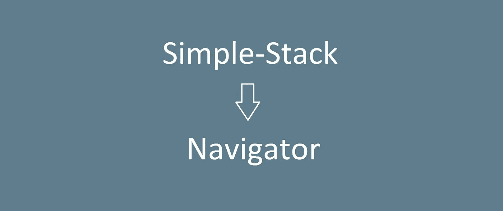

# Navigator:简单的 backstack 集成，用于定制基于视图组的 Android 应用程序

> 原文：<https://medium.com/hackernoon/navigator-simple-backstack-integration-for-making-custom-viewgroup-based-android-apps-64a2d4724019>

我在一个名为 [simple-stack](https://github.com/Zhuinden/simple-stack) 的库上进行了大量工作，特别是为了方便使用自定义视图组作为 [Android](https://hackernoon.com/tagged/android) 应用程序的构建模块。

然而,`BackstackDelegate`被证明有点难处理——委派许多生命周期回调只是为了让它工作。使用保留的片段，这要容易得多。进入`Navigator`，新增一个[**简单-堆栈 1.5.0**](https://github.com/Zhuinden/simple-stack) 。

# 航海家

`[**Navigator**](https://github.com/Zhuinden/simple-stack/blob/master/simple-stack/src/main/java/com/zhuinden/simplestack/navigator/Navigator.java)`在内部使用`simple-stack`的`BackstackManager`，就像`BackstackDelegate`一样——同时也提供一些合理的默认值。

以前，您必须像这样设置`simple-stack`(从 API 1 和更高版本中获益):

simple-stack setup: lifecycle event callbacks and state changer implementation

**Navigator** 选择使用 *Conductor* (MinSDK 16+)和 *Flow* (MinSDK 14+)使用的“保留片段作为生命周期监听器”方法，同时还提供了一个`DefaultStateChanger`默认实现，将安装减少到:

Navigator setup

我想说这减轻了图书馆用户的压力，对吗？:)

保留片段从活动中获取回调，而不是依赖手动回调和持久化视图状态。只要活动存在，保留的片段就会存在，我们甚至可以抛弃`onRetainCustomNonConfigurationInstance()`！

如果你好奇的话，这个片段基本上是这样做的:

The BackstackHost (retained fragment as lifecycle listener)

这些都是库用户不再需要编写的技术代码。呜！

# 默认状态改变器

但是 Min SDK 11 带来了`ObjectAnimator`，因此允许默认动画——因此使得创建默认状态改变器和默认动画器变得合理。

如果用户选择使用`DefaultStateChanger`，那么他们的状态键必须实现一个名为`StateKey`的接口。这指定了以自定义视图组为根的布局，以及处理动画的视图更改处理程序。

如你所见，我们的`StateKey`指定了一个`SegueViewChangeHandler`，它将处理左右和左右动画(取决于方向)。

但是提供一个渐变或者过渡也很容易:

View change handlers

最后，创建一个更复杂版本的`DefaultStateChanger`看起来像这样:

Navigator configuration with DefaultStateChanger

此后，您可以随时使用您的自定义视图组。

Backstack operators

# 结论

希望您喜欢在[***Navigator***](https://github.com/Zhuinden/simple-stack)中看到的内容，(查看`mvp`示例，甚至可能是`nestedstack`示例)，为了简单起见，考虑删除 intents 和片段事务。:)

如果没有，前几天我看到了一个库:[***Cicerone***](https://github.com/terrakok/Cicerone)，它充当导航操作符的“命令缓冲区”——这正是 simple-stack 的`detachStateChanger()`和`reattachStateChanger()`方法在内部实现的——但由于它只是命令缓冲区/处理器，它可以集成到任何现有的 [backstack](https://hackernoon.com/tagged/backstack) 解决方案中——例如，活动和片段。如果自定义视图组真的不合你的胃口，那就值得一试。

在我看来，视图组更容易预测，所以我坚持使用它们。无需手动销毁和重新创建它们，只需将它们放入具有不同 ID 的容器中；相比之下，[片段可以从](https://github.com/Zhuinden/simple-stack/blob/master/simple-stack-flow-masterdetail-fragments/src/main/java/com/example/stackmasterdetailfrag/MasterDetailFragmentStateChanger.java#L105-L115)中学到一些东西。

> [黑客中午](http://bit.ly/Hackernoon)是黑客如何开始他们的下午。我们是 [@AMI](http://bit.ly/atAMIatAMI) 家庭的一员。我们现在[接受投稿](http://bit.ly/hackernoonsubmission)，并乐意[讨论广告&赞助](mailto:partners@amipublications.com)机会。
> 
> 如果你喜欢这个故事，我们推荐你阅读我们的[最新科技故事](http://bit.ly/hackernoonlatestt)和[趋势科技故事](https://hackernoon.com/trending)。直到下一次，不要把世界的现实想当然！

